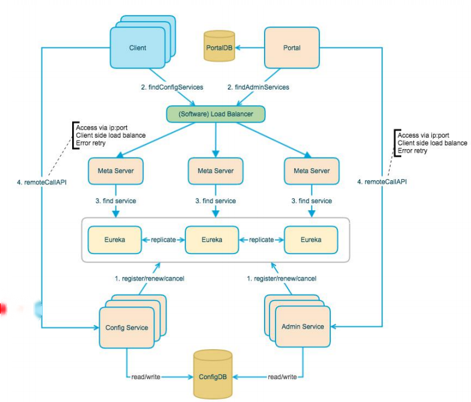
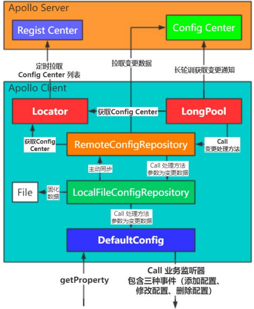

### 配置中心

>  分布式系统中集中化管理线上应用程序配置项的管理中心。

在传统架构中，项目配置一般在本地配置，这种方式不支持热部署，需要重启才能生效；并且在微服务架构中，业务模块多、配置复杂、文件分散导致不易维护。

#### 引入配置中心好处

* 效率提升
* 维护成本降低
* 安全性提升

#### 配置项管理

* 配置项编辑：提供前端界面对配置项进行编辑。
* 版本管理：支持修改项的历史版本回退。
* 热发布：修改的配置项不需要重启服务就能生效。
* 灰度发布：修改的配置项只对某些节点生效。
* 环境隔离：开发环境、测试环境、生产环境隔离。
* 提供API接口

#### 权限控制

* 读权限
* 写权限

#### Apollo 整体架构

* Config Service：提供配置的读取、推送等功能。
* Admin Service：提供配置的修改、发布等功能(前端调用接口)。
* Portal：管理界面。
* Eureka：注册中心。
* MetaServer：Eurka代理。

Eurka、MetaServer 集成在Config Service中。

1. Config Service 注册到Eurka。
2. 客户端通过负载均衡访问Eurka代理。
3. 访问注册中心，获取配置中心的访问地址。
4. 客户端远程调用配置中心接口，拉取配置。

#### Apollo客户端工作原理

**实时获取配置**

>  客户端与服务端使用长轮询方式保持一条连接，服务端此连接实现向客户端的通知推送

**长轮询**

* 服务端挂起请求的方式达到长连接的效果。
* 实现消息实时推送。
* 弥补Pull/Push方式的不足。

**Apollo长轮询逻辑**

* 客户端发起一个http请求到Config Service。
* Config Service不会立即返回结果，而是把请求挂起。
* 如果在60秒内没有客户端关心的配置发布，向客户端返回304.
* 如果有该客户端的配置发布，组装变更通知放入http返回数据中。

**Apollo配置信息读取**

* Apollo通过长轮询拉取到了变更通知，客户端会发起一个Http请求到Config Service。
* Config Service需要提供配置读取的接口，为客户端提供配置信息。

**客户端模块结构**

* Locator：定时从注册中心拉取Config Center的集群节点信息。
* LongPool：长轮询拉取配置变更通知。
* RemoteConfigRepositor：来取变更数据
* LocalFileConfigRepository：固化数据。
* DefaultConfig：getProperty根据key获取value；监听配置变更来动态修改项目配置。

