### DNS

> DNS :Domain Name System 域名系统，因特网上作为域名和ip地址相互映射的系统，能够使用户方便的访问网站(IP可读性差，会变动)。

#### 域名访问方案

* Host文件

  * Host文件特点
    * key:value
    * 终端本地保存
    * 访问速度快，不像dns系统需要层层解析
  * Host文件缺点
    * 变更生效慢。
    * host文件越来越大。
    * 没规定命令规则，主机名会冲突。
    * 维护映射关系代价高
  * 应用场景
    * 测试环境

  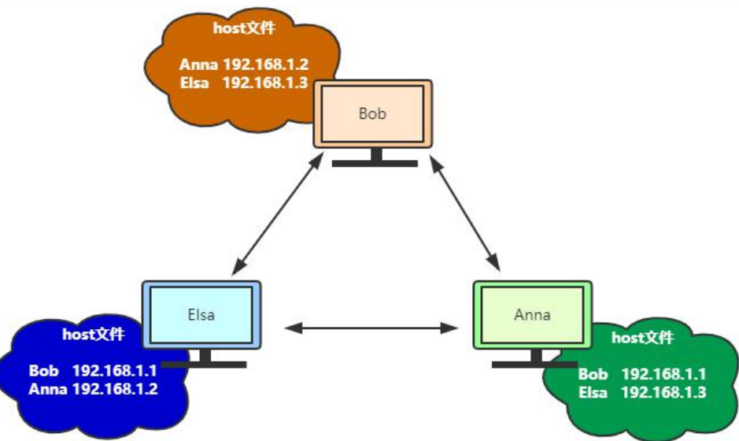

* DNS域名解析系统

  * 域名结构

    * 根
    * 顶级域
    * 二级域
    * 三级域
    * 四级域

    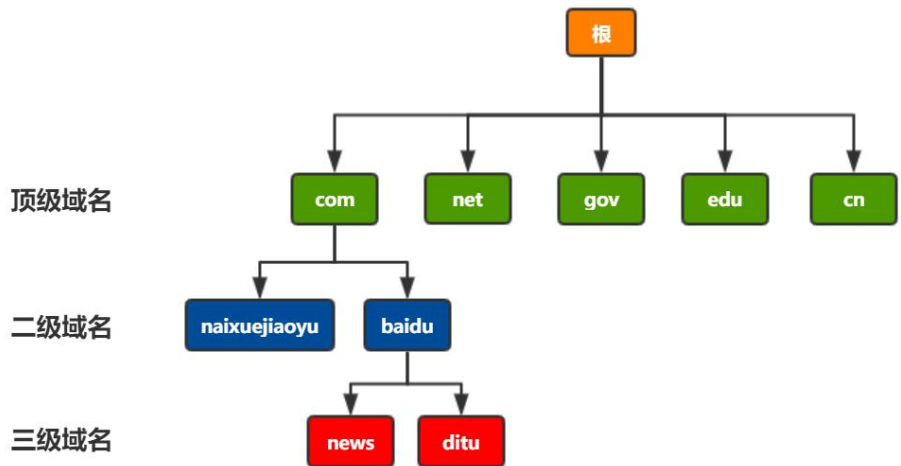

  * dns服务器

    * 根服务器
    * 顶级域名服务器
    * 权威域名服务器

    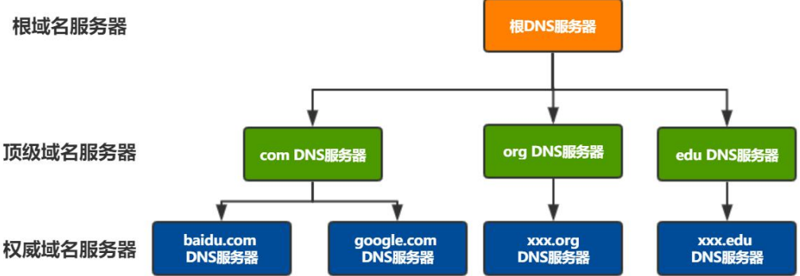

#### dns解析过程

* 优先使用缓存

  * 缓存时间可长期，比如30天。
  * 缓存时间可短，比如10分钟。
  * 根据time to live 字段灵活控制

* Local DNS 服务器

  * dns迭代查询

    * local dns 向根发起请求。
    * local dns 向顶级域名dns发起请求
    * local dns 向二级域名发起请求

    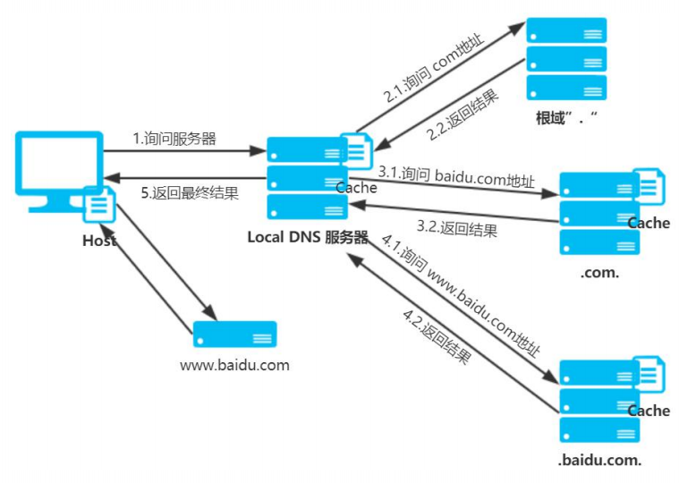

  * dns递归查询

    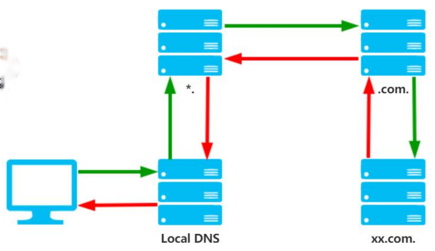

#### dns解析路径查询

* dig www.58.com +trace
* 查询从根域名到指定域名可能经过的所有域名服务器。

如下图，首先从114.114.114.114返回13个根域名服务器；接着挑选其中一个根域名服务器查询顶级域名服务器，如192.33.4.12返回13个顶级域名服务器；然后挑选顶级域名服务器查询出权威服务器，如192.43.172.30返回58权威服务器；最后通过权威返回域名解析ip。

dns数据库中每一个条目称作为一个资源记录(ResourceRecord,RR)，说白了就是一条解析记录。

* owner：拥有资源记录的dns域名
* ttl：指明其他dns服务器在期满放弃该记录信息之前对其缓存多长时间
* class：in(Internet类)
* type：资源记录类型
  * A：ipv4主机地址
  * AAAA：IPv6主机地址
  * NS：权威名称服务器
  * CNAME：别名

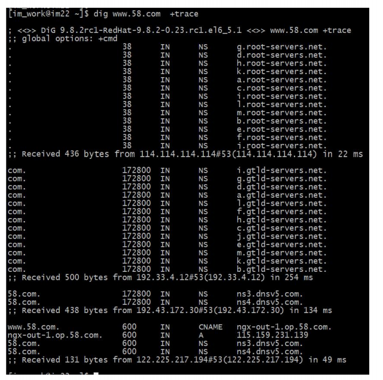

#### DNS协议

> udp协议

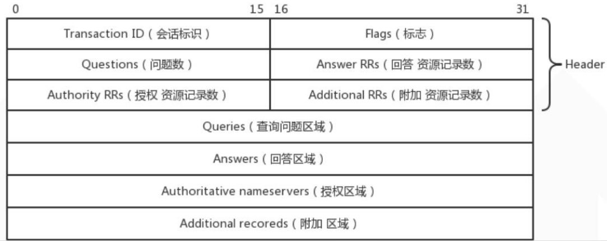

#### dns协议头

* Transaction ID：请求与相应配对。

* Flags：

  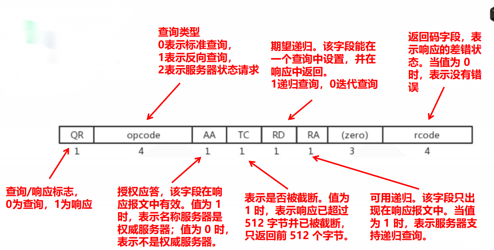

* 请求数据

  * Questions

* 应答数据

  * Answer RRS
  * Authority RRS
  * Additional RRS

#### dns协议正文

* 请求数据
  
  * Queries：查询参数，如下例子查询naixuejiaoyu.com的ip地址，12表示naixuejiaoyu的长度，3是com的长度，点号不计数长度。
  
    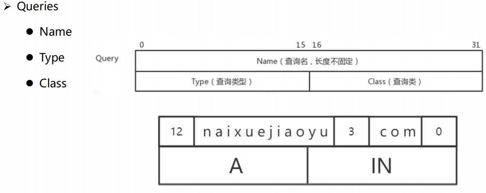
* 应答数据
  * Answers：响应数据，返回顶级服务器或者权威服务器或IP地址。

    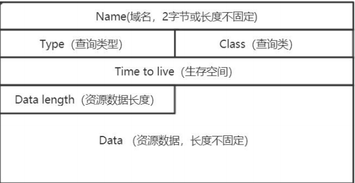

    Data数据格式，如下返回顶级域名服务器数据：

    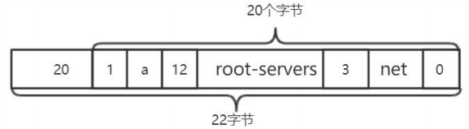

    因为顶级域名的格式都是一样的，所有部分返回的数据格式是：

    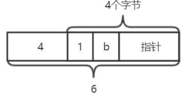

  * Authoritative nameservers

  * Additional recordreds：如上例子，返回的都是顶级域名，但是没有ip地址，其实ip地址存储在Additional内：

    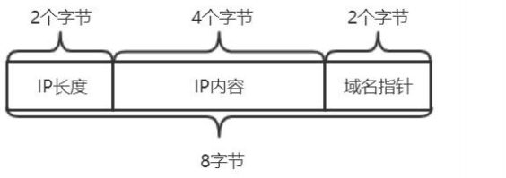

#### DNS劫持

> 通过攻击域名解析服务器(DNS)，获取域名解析控制权，解析服务器的方法，把目标网站域名解析到错误的地址。

**DNS劫持的原因**

域名服务器负责解析域名请求，但是服务器没有机制保证域名映射是否准确，所有如果域名服务器被黑客攻击恶意修改或者流氓的域名服务器更改一些域名的解析结果导致将网站解析到错误的地址。

DNS劫持的环节往往都在运营商Local DNS处：

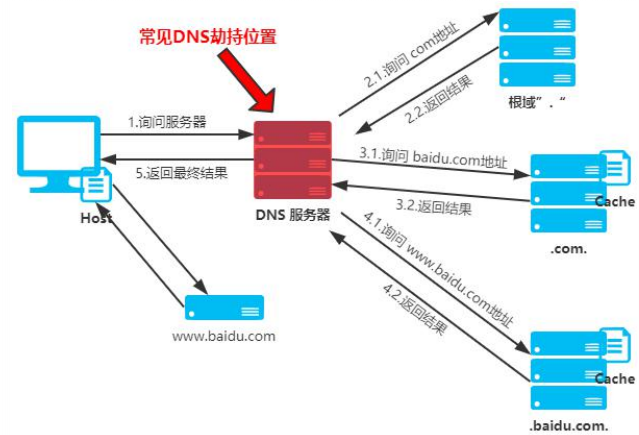

#### DNS 污染

> 劫持域名解析请求，返回伪造结果

**污染原因**

* UDP无连接协议，导致篡改结果可行性。
* 监听53端口数据，发现匹配请求立刻返回伪造结果。

**DNS污染过程**

* 用户发出dns请求后，等待应答。
* 如果此时有一个看起来正确的应答包(拥有和DNS请求一样的序列号)，客户端信以为真，并且抛弃稍晚到达的应答包。这个DNS欺骗的关键在于伪造一个特定序列号的应答包。

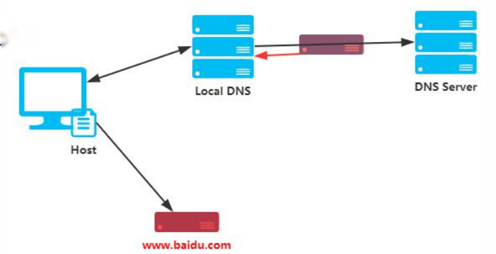

#### 避免DNS劫持优化

* 客户端IP直连，客户端作负载均衡。
* 使用HttpDNS。

111

