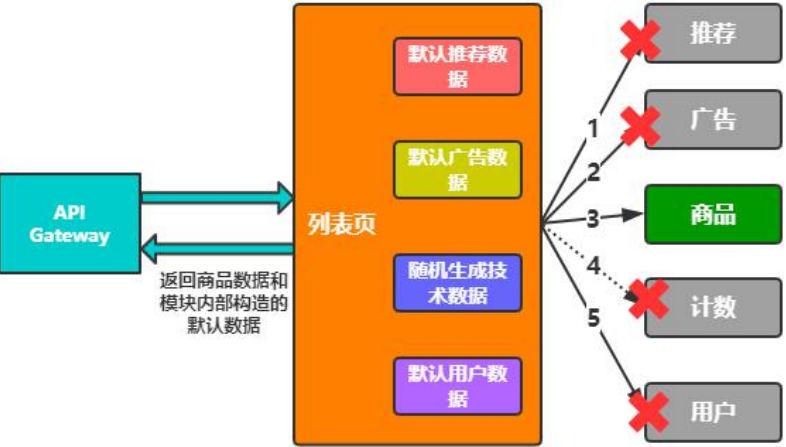

### 服务容错

#### 服务容错意义

* 单个节点故障，可能被无限向上放大。如下图ServiceA出现故障，间接拖累它的上层服务不可用。

  

* 瞬间流量激增，系统抗不住。如下图client1流量瞬间增大10倍，导致ServerA服务不可用，影响其他租户不可用。

  

#### 解决方案

* 资源隔离：主要对线程资源的隔离。

  * 服务端按请求分队列隔离。如下图队列按照等级分为high、middle、low，当low队列调用出现故障时，不影响其他队列的使用。

    

  * 调用方工作线程隔离。如下图当ProviderB出现故障时，只会影响线程组B，不会影响其他服务的调用。

    

  * 信号量：限制调用的并发数量。如下图为每个服务配置调用量，当线程调用服务时，减少一个信号量，调用完后归还信号量。

    

  如下图hystrix的线程调用模型：

  

  信号量与线程池的对比：

  

  

#### 服务熔断

临时关闭对某些功能的调用，各别业务不可用，系统整体可用，如双十一关闭退款入口。

**服务熔断涉及点**

* 可熔断服务：哪些服务可以临时关闭。如下图商品列表页功能，计数关闭掉不影响整体服务，但是商品功能不能关闭。
* 熔断触发
  * 主动熔断
  * 被动熔断
* 恢复时机：什么时候恢复熔断，不能一会儿熔断一会儿恢复。

#### 服务降级

有损提供服务，服务柔性可用。如推荐搜索返回兜底数据，浏览计数返回假数据。

**服务降级涉及点**

* 可降级服务
* 降级方法
* 降级触发
  * 主动降级
  * 调用超时/异常
* 恢复时机

#### 服务熔断降级设计实践

服务熔断降级的目标都是从可用性和可靠性出发，为了防止系统崩溃。在用户侧只是感受到部分功能暂时不可用。

**断路器设计**

断路器是服务熔断开关，当对下游服务调用异常量达到设定阈值后，打开断路器，触发熔断。

**断路器技术要点**

* 断路器控制实现：断路器打开、关闭逻辑实现。
* 阈值与统计数据：统计调用失败次数来控制断路器的打开、关闭。

**断路器状态流转设计**

* close：断路器关闭状态。
* open：断路器打开状态。
* half_open：断路器在open状态超过关闭窗口期，就会进入半开状态。在半开状态下，会试探请求被熔断的服务，如果请求成功，就关闭断路器，否则重新进入open状态。

**阈值与统计数据**

* 数据类型：百分比值。
* 颗粒度
  * 集群/节点：统计集群/节点某个时间断内的成功、失败次数。
  * 服务/方法：统计某个方法某个时间断内的成功、失败次数。
* 数据结构
* 统计单元

**合理打开断路器**

* 减少误判：统计一段时间内的调用数据。如下设计，每个bucket存储了一段时间内的调用信息(starts统计开始时间)，如果只是统计一个bucket容易误判，增加统计时间段才更加公平。

  

* 失效数据：时效性。统计数据有时效性，太旧的历史数据不能作为是否打开断路器的指标。使用滑动窗口来选择最新的数据。

  

  **滑动窗口实现**

  * 数据结构：数组/链表。

    

  * 添加bucket。

    

    

  * 断路器实现

    

    判断是否将断路器从断开状态变成半开状态。首先判断断路器打开时间是否已经超过了窗口关闭时间，如果超过了，就尝试设置状态为半开状态。

    

  

  滑动窗口控制器：

  

  保存请求的成功、失败次数：

  

  获取当前的bucket，判断bucket是否在有效期，是通过bucket的创建时间+bucket的间隔>当前时间。如果当前的bucket已经失效则新创建一个。

  

  每次新创建bucket后尝试打开断路器，不是每次请求进来都判断是否需要打开断路器。

  

