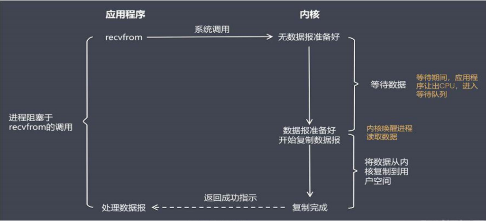
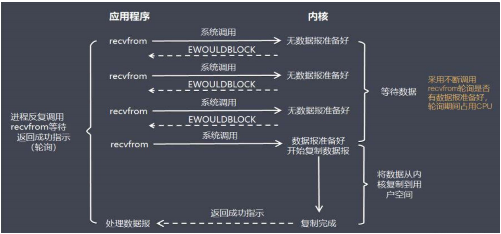
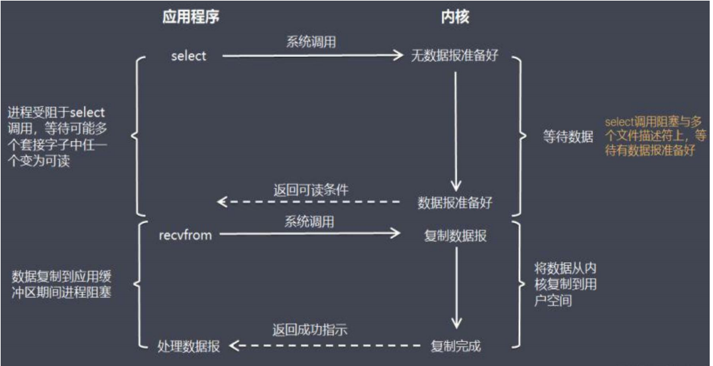
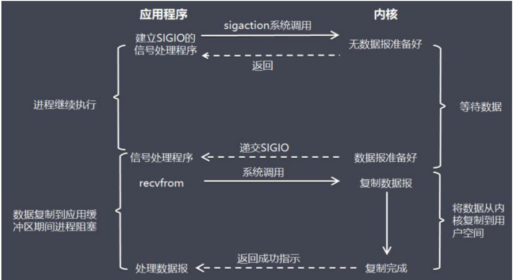
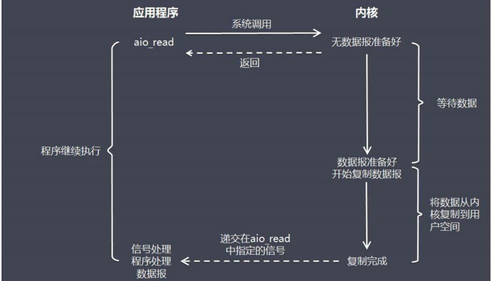
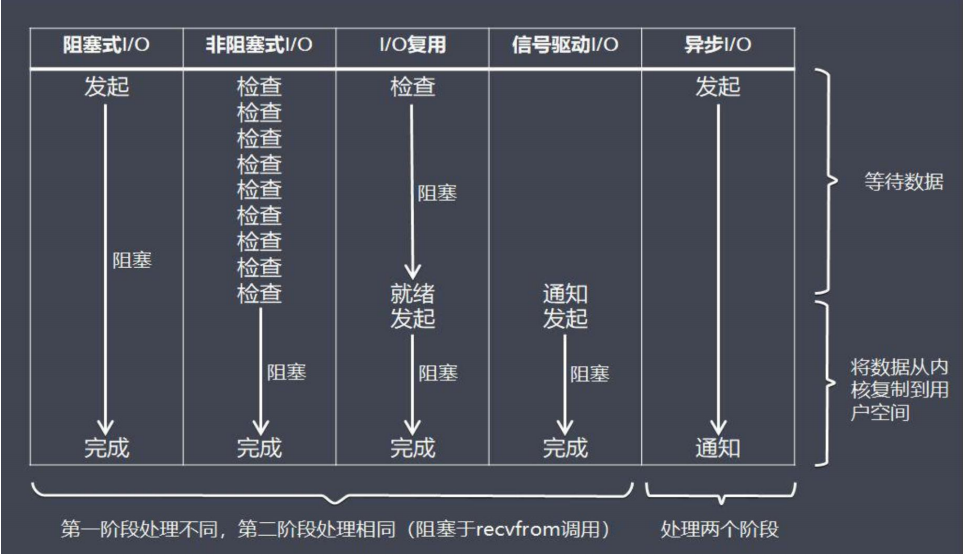

## IO模型

### 阻塞|非阻塞

* 阻塞： 是指调用方一直等待而且别的事情什么都不做。
* 非阻塞：是指调用方先去忙别的事情。

### 同步|异步

* 同步：是指被调用方得到最终结果后才返回给调用方。
* 异步：指被调用方先返回应答，然后再计算调用结果，计算完最终结果后再通知并返回给调用方。

### 网络I/O模型

#### 阻塞式I/O模型

内核准备数据期间，进程一直处于阻塞状态，直到数据准备好之后，才唤醒进程，将数据从内核复制到用户空间。

#### 非阻塞I/O模型

不断的轮询检查数据是否准备好了，如果数据没有准备好，直接返回。这种方式不会阻塞线程，但是会占用CPU。

#### I/O复用模式

select调用阻塞于多个文件描述符上，等待有数据报准备好。多路复用相较于非阻塞调用，整个环境只有当套接字变为可读，才会去获取数据。

#### 信号驱动I/O模型

select 多路复用需要遍历监听的文件符，当打开的文件符变多后，性能会下降。信号驱动模型，通过信号来通过调用方数据已经准备好了，避免select轮询文件符。

#### 异步I/O模型

#### 五种IO比较

