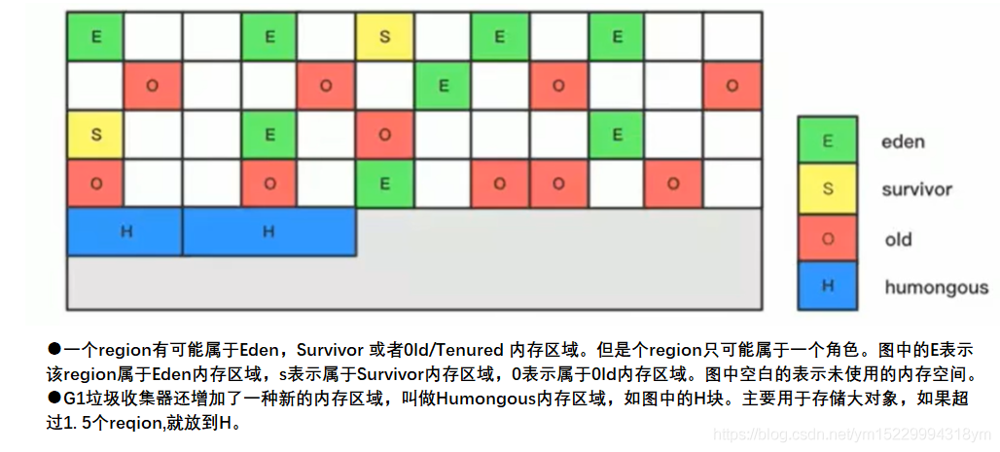
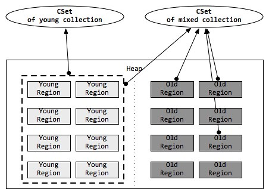

### G1垃圾回收器

#### Heap Region

本质上来说，G1垃圾回收器依然是一个分代垃圾回收器，还保留有新生代和老年代的概念，但新生代和老年代不再是物理隔离的了。



对于堆中的大对象，默认直接会被分配到老年代，但是如果它是一个短期存在的大对象，就会对垃圾收集器造成负面影响。为了解决这个问题，G1划分了一个Humongous区，它用来专门存放大对象。如果一个H区装不下一个大对象，那么G1会寻找连续的H区来存储。为了能找到连续的H区，有时候不得不启动Full GC。G1的大多数行为都把H区作为老年代的一部分来看待。

**Region内存分配**

每一个分配的Region，都可以分成两个部分，已分配的和未被分配的。
 G1回收器采用和CMS一样的TLAB的手段为每一个线程分配一个Buffer，线程分配内存就在这个Buffer内分配。但是当线程耗尽了自己的Buffer之后，需要申请新的Buffer。这个时候依然会带来并发的问题。G1回收器采用的是CAS（Compate And Swap）操作。

```
TLAB （Thread Local Allocation Buffer，线程本地分配缓冲区）是 Java 中内存分配的一个概念，它是在 Java 堆中划分出来的针对每个线程的内存区域，专门在该区域为该线程创建的对象分配内存。它的主要目的是在多线程并发环境下需要进行内存分配的时候，减少线程之间对于内存分配区域的竞争，加速内存分配的速度
```

#### Remember Set

RS(Remember Set)是一种抽象概念，用于记录从非收集部分指向收集部分的指针的集合。
  在传统的分代垃圾回收算法里面，RS(Remember  Set)被用来记录分代之间的指针。在G1回收器里面，RS被用来记录从其他Region指向一个Region的指针情况。因此，一个Region就会有一个RS。这种记录可以带来一个极大的好处：在回收一个Region的时候不需要执行全堆扫描，只需要检查它的RS就可以找到外部引用，而这些引用就是initial mark的根之一。

当虚拟机发现程序对Reference类型的数据进行写操作时，会产生一个Write Barrier暂时中断写操作，检查Reference引用的对象是否处于不同的Region中，如果是，便通过CardTable把相关引用信息记录到被引用对象所属的Region的Remembered Set中。

#### Collect Set



Collect  Set(CSet)是指，在Evacuation阶段，由G1垃圾回收器选择的待回收的Region集合。G1垃圾回收器的软实时的特性就是通过CSet的选择来实现的。对应于算法的两种模式fully-young generational mode和partially-young mode，CSet的选择可以分成两种：

1. 在fully-young generational mode(年轻代)下：顾名思义，该模式下CSet将只包含young的Region。G1将调整young的Region的数量来匹配软实时的目标；
2. 在partially-young mode(混合模式)下：该模式会选择所有的young region，并且选择一部分的old region。old region的选择将依据在Marking cycle phase中对存活对象的计数。G1选择存活对象最少的Region进行回收

### 垃圾回收详解

#### 过程1 年轻代gc

- JVM启动时，G1 先准备好Eden区，程序在运行过程中不断创建对象到Eden区，当Eden空间耗尽时，G1会启动一次年轻代垃圾回收过程。
- 年轻代垃圾回收只会回收Eden区（主动）和Survivor区（被动）。
- YGC时，首先G1停止应用程序的执行（Stop一The一World），G1创建回收集（Collection Set），回收集是指需要被回收的内存分段的集合，年轻代回收过程的回收集包含年轻代Eden区和Survivor区所有的内存分段。
- 复制算法（S、E-->空闲区相当于To区）（S-->寻找新的空闲区作为老年代）

然后开始如下回收过程：

- 第一阶段，扫描根
  - 根是：指static变量指向的对象（类生命周期，方法区引用的对象），正在执行的方法调用链条上的局部变量等（方法生命周期，虚拟机栈引用的对象）。根引用连同RSet记录的外部引用作为扫描存活对象的入口。
- **第二阶段，更新RSet**

​     处理dirty card queue（ 见备注）中的card，更新RSet。 此阶段完成后，RSet可 以准确的反映老年代对所在的内存分段中对象的引用（指的新生代）。

- - dirty card queue: 对于应用程序的引用赋值语句object.field=object，JVM会在之前和之后执行特殊的操作以在dirty card queue中入队一个保存了对象引用信息的card。
  - 在年轻代回收的时候， G1会对Dirty Card Queue中所有的card进行处理，以更新RSet，保证RSet实时准确的反映引用关系。
  - 那为什么不在引用赋值语句处直接更新RSet呢？这是为了性能的需要，RSet的处理需要线程同步，开销会很大，使用队列性能会好很多。

- **第三阶段，处理RSet**。
   识别被老年代对象指向的Eden中的对象，这些被指向的Eden中的对象被认为是存活的对象。
- **第四阶段，复制对象**。
   此阶段，对象树被遍历，Eden区  内存段中存活的对象会被复制到Survivor区中空的内存分段，Survivor区内存段中存活的对象如果年龄未达阈值，年龄会加1，达到阀值会被会被复制到01d区中空的内存分段。如果Survivor空间不够，Eden空间的 部分数据会直接晋升到老年代空间。
- **第五阶段，处理引用**。
   处理Soft，Weak， Phantom， Final， JNI Weak等引用。最终Eden空间的数据为空，GC停止工作，而目标内存中的对象都是连续存储的，没有碎片，所以复制过程可以达到内存整理的效果，减少碎片

#### 过程2 年轻代+并发标记过程

- 初始标记阶段：标记从根节点直接可达的对象。这个阶段是STW的，并且会触发一.次年轻代GC。
- 根区域扫描（Root Region Scanning） ： G1 GC扫描Survivor区直接可达的老年代区域对象，并标记被引用的对象。这一过程必须在young GC之前完成。
- 并发标记（Concurrent Marking）： 在整个堆中进行并发标记（和应用程序并发执行），此过程可能被young  GC中断。在并发标记阶段，若发现区域对象中的所有对象都是垃圾，那这个区域会被立即回收。同时，并发标记过程中，会计算每个区域的对象活性（区域中存活对象的比例）。
- 再次标记（Remark）： 由于应用程序持续进行，需要修正上一次的标记结果。是STW的。G1中采用了比CMS更快的初始快照算法：snapshot一at一the一beginning （SATB）。
- 独占清理（cleanup，STW）：计算各个区域的存活对象和GC回收比例，并进行排序，识别可以混合回收的区域。为下阶段做铺垫。是STW的。
  - ➢这个阶段并不会实际上去做垃圾的收集
- 并发清理阶段：识别并清理完全空闲的区域。

#### 过程3混合回收

当越来越多的对象晋升到老年代Oldregion时，为了避免堆内存被耗尽，虚拟机会触发一个混合的垃圾收集器，即Mixed GC，  该算法并不是一个OldGC，除了回收整个Young Region，还会回收一部分的0ldRegion。这里需要注意：是一部分老年代，  而不是全部老年代。可以选择哪些OldRegion进行收集，从而可以对垃圾回收的耗时时间进行控制。也要注意的是Mixed GC并不是Full  GC。

- 并发标记结束以后，老年代中百分百为垃圾的内存分段被回收了，部分为垃圾的内存分段被计算了出来。默认情况下，这些老年代的内存分段会分8次（可以通过一XX： G1MixedGCCountTarget设置）被回收。
- 混合回收的回收集（Collection Set） 包括八分之一的老年代内存分段，Eden区内存分段，Survivor区内存分段。混合回收的算法和年轻代回收的算法完全一样，只是回收集多了老年代的内存分段。具体过程请参考上面的年轻代回收过程。
- 由于老年代中的内存分段默认分8次回收，G1会优先回收垃圾多的内存分段。垃圾占内存分段比例越高的，越会被先回收。并且有一个阈值会决定内存分段是否被回收，一xX：  G1MixedGCLiveThresholdPercent，默认为65%，意思是垃圾占内存分段比例要达到65%才会被回收。如果垃圾占比太低，意味着存活的对象占比高，在复制的时候会花费更多的时间。
- 混合回收并不一定要进行8次。有一个阈值一Xx：  G1HeapWastePercent，默认值为10%，意思是允许整个堆内存中有10%的空间被浪费，意味着如果发现可以回收的垃圾占堆内存的比例低于10%，则不再进行混合回收。因为GC会花费很多的时间但是回收到的内存却很少。

#### 过程4 Full GC

G1的初衷就是要避免Full GC的出现。但是如果上述方式不能正常工作，G1会停止应用程序的执行（Stop一 The一World），使用单线程的内存回收算法进行垃圾回收，性能会非常差，应用程序停顿时间会很长。
要避免Full GC的发生，一旦发生需要进行调整。什么时候会发生Full GC呢？比如堆内存太小，当G1在复制存活对象的时候没有空的内存分段可用，则会回退到full gc， 这种情况可以通过增大内存解决。
导致G1Full GC的原因可能有两个：

- 1.Evacuation的时候没有足够的to一 space来存放晋升的对象；
- 2.并发处理过程完成之前空间耗尽。

**补充：**

从Oracle官方透露出来的信息可获知，回收阶段（Evacuation）其实.本也有想过设计成与用户程序一起并发执行，但这件事情做起来比较复杂，考虑到G1只是回收一部分Region，  停顿时间是用户可控制的，所以并不迫切去实现，而选择把这个特性放到了G1之后出现的低延迟垃圾收集器（即ZGC）中。另外，还考虑到G1不是仅仅面向低延迟，停顿用户线程能够最大幅度提高垃圾收集效率，为了保证吞吐量所以才选择了完全暂停用户线程的实现方案。