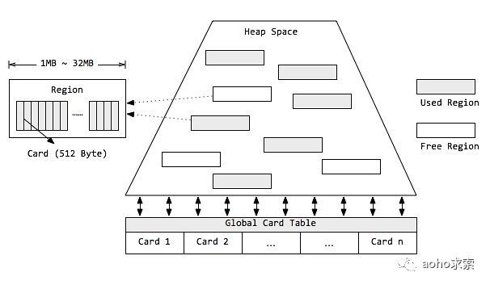
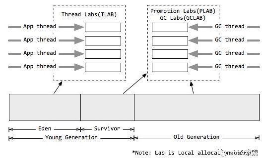
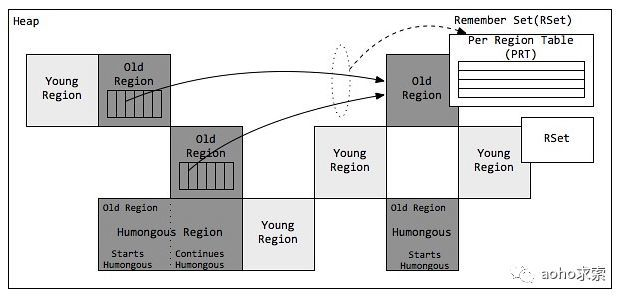
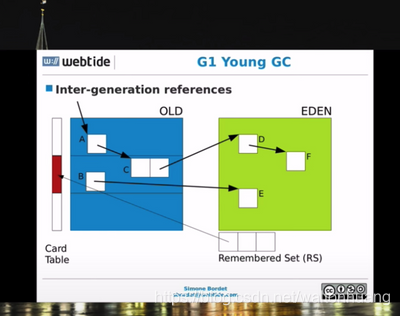
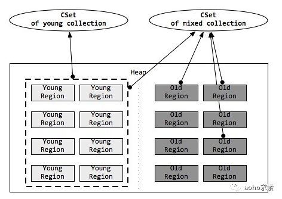
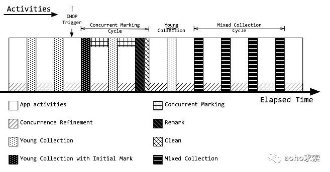
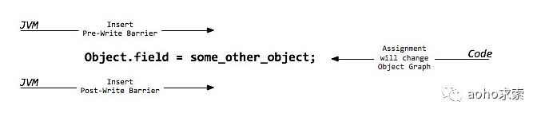

### JVM G1垃圾收集器

G1垃圾收集器也是以关注延迟为目标、服务器端应用的垃圾收集器，被HotSpot团队寄予取代CMS的使命，也是一个非常具有调优潜力的垃圾收集器。虽然G1也有类似CMS的收集动作：初始标记、并发标记、重新标记、清除、转移回收，并且也以一个串行收集器做担保机制，但单纯地以类似前三种的过程描述显得并不是很妥当。事实上，G1收集与以上三组收集器有很大不同：

1. G1的设计原则是"首先收集尽可能多的垃圾(Garbage First)"。因此，G1并不会等内存耗尽(串行、并行)或者快耗尽(CMS)的时候开始垃圾收集，而是在内部采用了启发式算法，在老年代找出具有高收集收益的分区进行收集。同时G1可以根据用户设置的暂停时间目标自动调整年轻代和总堆大小，暂停目标越短年轻代空间越小、总空间就越大；
2. G1采用内存分区(Region)的思路，将内存划分为一个个相等大小的内存分区，回收时则以分区为单位进行回收，存活的对象复制到另一个空闲分区中。由于都是以相等大小的分区为单位进行操作，因此G1天然就是一种压缩方案(局部压缩)；
3. G1虽然也是分代收集器，但整个内存分区不存在物理上的年轻代与老年代的区别，也不需要完全独立的survivor(to space)堆做复制准备。G1只有逻辑上的分代概念，或者说每个分区都可能随G1的运行在不同代之间前后切换；
4. G1的收集都是STW的，但年轻代和老年代的收集界限比较模糊，采用了混合(mixed)收集的方式。即每次收集既可能只收集年轻代分区(年轻代收集)，也可能在收集年轻代的同时，包含部分老年代分区(混合收集)，这样即使堆内存很大时，也可以限制收集范围，从而降低停顿。

## **G1的内存模型**



#### **分区**

分区 Region

G1采用了分区(Region)的思路，将整个堆空间分成若干个大小相等的内存区域，每次分配对象空间将逐段地使用内存。因此，在堆的使用上，G1并不要求对象的存储一定是物理上连续的，只要逻辑上连续即可；每个分区也不会确定地为某个代服务，可以按需在年轻代和老年代之间切换。启动时可以通过参数-XX:G1HeapRegionSize=n可指定分区大小(1MB~32MB，且必须是2的幂)，默认将整堆划分为2048个分区。

#### **卡片**

卡片 Card

在每个分区内部又被分成了若干个大小为512 Byte卡片(Card)，标识堆内存最小可用粒度所有分区的卡片将会记录在全局卡片表(Global Card Table)中，分配的对象会占用物理上连续的若干个卡片，当查找对分区内对象的引用时便可通过记录卡片来查找该引用对象(见RSet)。每次对内存的回收，都是对指定分区的卡片进行处理。

#### **堆**

堆 Heap

G1同样可以通过-Xms/-Xmx来指定堆空间大小。当发生年轻代收集或混合收集时，通过计算GC与应用的耗费时间比，自动调整堆空间大小。如果GC频率太高，则通过增加堆尺寸，来减少GC频率，相应地GC占用的时间也随之降低；目标参数-XX:GCTimeRatio即为GC与应用的耗费时间比，G1默认为9，而CMS默认为99，因为CMS的设计原则是耗费在GC上的时间尽可能的少。另外，当空间不足，如对象空间分配或转移失败时，G1会首先尝试增加堆空间，如果扩容失败，则发起担保的Full GC。Full GC后，堆尺寸计算结果也会调整堆空间。

### **分代模型**

#### **分代**



分代 Generation

分代垃圾收集可以将关注点集中在最近被分配的对象上，而无需整堆扫描，避免长命对象的拷贝，同时独立收集有助于降低响应时间。虽然分区使得内存分配不再要求紧凑的内存空间，但G1依然使用了分代的思想。与其他垃圾收集器类似，G1将内存在逻辑上划分为年轻代和老年代，其中年轻代又划分为Eden空间和Survivor空间。但年轻代空间并不是固定不变的，当现有年轻代分区占满时，JVM会分配新的空闲分区加入到年轻代空间。

整个年轻代内存会在初始空间-XX:G1NewSizePercent(默认整堆5%)与最大空间-XX:G1MaxNewSizePercent(默认60%)之间动态变化，且由参数目标暂停时间-XX:MaxGCPauseMillis(默认200ms)、需要扩缩容的大小以及分区的已记忆集合(RSet)计算得到。当然，G1依然可以设置固定的年轻代大小(参数-XX:NewRatio、-Xmn)，但同时暂停目标将失去意义。

#### **本地分配缓冲**

本地分配缓冲 Local allocation buffer (Lab)

值得注意的是，由于分区的思想，每个线程均可以"认领"某个分区用于线程本地的内存分配，而不需要顾及分区是否连续。因此，每个应用线程和GC线程都会独立的使用分区，进而减少同步时间，提升GC效率，这个分区称为本地分配缓冲区(Lab)。

其中，应用线程可以独占一个本地缓冲区(TLAB)来创建的对象，而大部分都会落入Eden区域(巨型对象或分配失败除外)，因此TLAB的分区属于Eden空间；而每次垃圾收集时，每个GC线程同样可以独占一个本地缓冲区(GCLAB)用来转移对象，每次回收会将对象复制到Suvivor空间或老年代空间；对于从Eden/Survivor空间晋升(Promotion)到Survivor/老年代空间的对象，同样有GC独占的本地缓冲区进行操作，该部分称为晋升本地缓冲区(PLAB)。

#### **分区模型**

G1对内存的使用以分区(Region)为单位，而对对象的分配则以卡片(Card)为单位。



#### **巨型对象**

巨型对象 Humongous Region

一个大小达到甚至超过分区大小一半的对象称为巨型对象(Humongous Object)。当线程为巨型分配空间时，不能简单在TLAB进行分配，因为巨型对象的移动成本很高，而且有可能一个分区不能容纳巨型对象。因此，巨型对象会直接在老年代分配，所占用的连续空间称为巨型分区(Humongous Region)。G1内部做了一个优化，一旦发现没有引用指向巨型对象，则可直接在年轻代收集周期中被回收。

巨型对象会独占一个、或多个连续分区，其中第一个分区被标记为开始巨型(StartsHumongous)，相邻连续分区被标记为连续巨型(ContinuesHumongous)。由于无法享受Lab带来的优化，并且确定一片连续的内存空间需要扫描整堆，因此确定巨型对象开始位置的成本非常高，如果可以，应用程序应避免生成巨型对象。

#### **已记忆集合**

已记忆集合 Remember Set (RSet)

在串行和并行收集器中，GC通过整堆扫描，来确定对象是否处于可达路径中。然而G1为了避免STW式的整堆扫描，在每个分区记录了一个已记忆集合(RSet)，内部类似一个反向指针，记录引用分区内对象的卡片索引。当要回收该分区时，通过扫描分区的RSet，来确定引用本分区内的对象是否存活，进而确定本分区内的对象存活情况。

事实上，并非所有的引用都需要记录在RSet中，如果一个分区确定需要扫描，那么无需RSet也可以无遗漏的得到引用关系。那么引用源自本分区的对象，当然不用落入RSet中；同时，G1  GC每次都会对年轻代进行整体收集，因此引用源自年轻代的对象，也不需要在RSet中记录。最后只有老年代的分区可能会有RSet记录，这些分区称为拥有RSet分区(an RSet’s owning region)。

#### **Per Region Table**

Per Region Table (PRT)

RSet在内部使用Per Region Table(PRT)记录分区的引用情况。由于RSet的记录要占用分区的空间，如果一个分区非常"受欢迎"，那么RSet占用的空间会上升，从而降低分区的可用空间。G1应对这个问题采用了改变RSet的密度的方式，在PRT中将会以三种模式记录引用：

稀少：直接记录引用对象的卡片索引 细粒度：记录引用对象的分区索引 粗粒度：只记录引用情况，每个分区对应一个比特位 由上可知，粗粒度的PRT只是记录了引用数量，需要通过整堆扫描才能找出所有引用，因此扫描速度也是最慢的。



```
在CMS中，也有RSet的概念，在老年代中有一块区域用来记录指向新生代的引用。这是一种point-out，在进行Young GC时，扫描根时，仅仅需要扫描这一块区域，而不需要扫描整个老年代。

但在G1中，并没有使用point-out，这是由于一个分区太小，分区数量太多，如果是用point-out的话，会造成大量的扫描浪费，有些根本不需要GC的分区引用也扫描了。于是G1中使用point-in来解决。point-in的意思是哪些分区引用了当前分区中的对象。这样，仅仅将这些对象当做根来扫描就避免了无效的扫描。由于新生代有多个，那么我们需要在新生代之间记录引用吗？这是不必要的，原因在于每次GC时，所有新生代都会被扫描，所以只需要记录老年代到新生代之间的引用即可。

需要注意的是，如果引用的对象很多，赋值器需要对每个引用做处理，赋值器开销会很大，为了解决赋值器开销这个问题，在G1 中又引入了另外一个概念，卡表（Card Table）。一个Card Table将一个分区在逻辑上划分为固定大小的连续区域，每个区域称之为卡。卡通常较小，介于128到512字节之间。Card Table通常为字节数组，由Card的索引（即数组下标）来标识每个分区的空间地址。默认情况下，每个卡都未被引用。当一个地址空间被引用时，这个地址空间对应的数组索引的值被标记为”0″，即标记为脏被引用，此外RSet也将这个数组下标记录下来。一般情况下，这个RSet其实是一个Hash Table，Key是别的Region的起始地址，Value是一个集合，里面的元素是Card Table的Index。
```

收集集合 (CSet)



收集集合(CSet)代表每次GC暂停时回收的一系列目标分区。在任意一次收集暂停中，CSet所有分区都会被释放，内部存活的对象都会被转移到分配的空闲分区中。因此无论是年轻代收集，还是混合收集，工作的机制都是一致的。年轻代收集CSet只容纳年轻代分区，而混合收集会通过启发式算法，在老年代候选回收分区中，筛选出回收收益最高的分区添加到CSet中。

CSet根据两种不同的回收类型分为两种不同CSet。
1.CSet of Young Collection
2.CSet of Mix Collection
CSet of Young Collection 只专注回收 Young Region 跟 Survivor Region ，而CSet of Mix Collection 模式下的CSet 则会通过RSet计算Region中对象的活跃度，活跃度阈值-XX:G1MixedGCLiveThresholdPercent(默认85%)，只有活跃度高于这个阈值的才会准入CSet，混合模式下CSet还可以通过XX:G1OldCSetRegionThresholdPercent(默认10%)设置，CSet跟整个堆的比例的数量上限。

由上述可知，G1的收集都是根据CSet进行操作的，年轻代收集与混合收集没有明显的不同，最大的区别在于两种收集的触发条件。

### **年轻代收集集合**

年轻代收集集合 CSet of Young Collection

应用线程不断活动后，年轻代空间会被逐渐填满。当JVM分配对象到Eden区域失败(Eden区已满)时，便会触发一次STW式的年轻代收集。在年轻代收集中，Eden分区存活的对象将被拷贝到Survivor分区；原有Survivor分区存活的对象，将根据任期阈值(tenuring threshold)分别晋升到PLAB中，新的survivor分区和老年代分区。而原有的年轻代分区将被整体回收掉。

同时，年轻代收集还负责维护对象的年龄(存活次数)，辅助判断老化(tenuring)对象晋升的时候是到Survivor分区还是到老年代分区。年轻代收集首先先将晋升对象尺寸总和、对象年龄信息维护到年龄表中，再根据年龄表、Survivor尺寸、Survivor填充容量-XX:TargetSurvivorRatio(默认50%)、最大任期阈值-XX:MaxTenuringThreshold(默认15)，计算出一个恰当的任期阈值，凡是超过任期阈值的对象都会被晋升到老年代。

#### **混合收集集合**

混合收集集合 CSet of Mixed Collection

年轻代收集不断活动后，老年代的空间也会被逐渐填充。当老年代占用空间超过整堆比IHOP阈值-XX:InitiatingHeapOccupancyPercent(默认45%)时，G1就会启动一次混合垃圾收集周期。为了满足暂停目标，G1可能不能一口气将所有的候选分区收集掉，因此G1可能会产生连续多次的混合收集与应用线程交替执行，每次STW的混合收集与年轻代收集过程相类似。

为了确定包含到年轻代收集集合CSet的老年代分区，JVM通过参数混合周期的最大总次数-XX:G1MixedGCCountTarget(默认8)、堆废物百分比-XX:G1HeapWastePercent(默认5%)。通过候选老年代分区总数与混合周期最大总次数，确定每次包含到CSet的最小分区数量；根据堆废物百分比，当收集达到参数时，不再启动新的混合收集。而每次添加到CSet的分区，则通过计算得到的GC效率进行安排。

## **第四章 G1的活动周期**

### **G1垃圾收集活动汇总**



### **RSet的维护**

由于不能整堆扫描，又需要计算分区确切的活跃度，因此，G1需要一个增量式的完全标记并发算法，通过维护RSet，得到准确的分区引用信息。在G1中，RSet的维护主要来源两个方面：写栅栏(Write Barrier)和并发优化线程(Concurrence Refinement Threads)

#### **栅栏**



#### **栅栏 Barrier**

我们首先介绍一下栅栏(Barrier)的概念。栅栏是指在原生代码片段中，当某些语句被执行时，栅栏代码也会被执行。而G1主要在赋值语句中，使用写前栅栏(Pre-Write Barrrier)和写后栅栏(Post-Write Barrrier)。事实上，写栅栏的指令序列开销非常昂贵，应用吞吐量也会根据栅栏复杂度而降低。

#### **写前栅栏 Pre-Write Barrrier**

即将执行一段赋值语句时，等式左侧对象将修改引用到另一个对象，那么等式左侧对象原先引用的对象所在分区将因此丧失一个引用，那么JVM就需要在赋值语句生效之前，记录丧失引用的对象。JVM并不会立即维护RSet，而是通过批量处理，在将来RSet更新(见SATB)。

#### **写后栅栏 Post-Write Barrrier**

当执行一段赋值语句后，等式右侧对象获取了左侧对象的引用，那么等式右侧对象所在分区的RSet也应该得到更新。同样为了降低开销，写后栅栏发生后，RSet也不会立即更新，同样只是记录此次更新日志，在将来批量处理(见Concurrence Refinement Threads)。

### **起始快照算法**

起始快照算法 Snapshot at the beginning (SATB)

SATB会创建一个对象图，相当于堆的逻辑快照，从而确保并发标记阶段所有的垃圾对象都能通过快照被鉴别出来。当赋值语句发生时，应用将会改变了它的对象图，那么JVM需要记录被覆盖的对象。因此写前栅栏会在引用变更前，将值记录在SATB日志或缓冲区中。每个线程都会独占一个SATB缓冲区，初始有256条记录空间。当空间用尽时，线程会分配新的SATB缓冲区继续使用，而原有的缓冲去则加入全局列表中(全局缓存)。最终在并发标记阶段，并发标记线程(Concurrent Marking Threads)在标记的同时，还会定期检查和处理全局缓冲区列表的记录，然后根据标记位图分片的标记位，扫描引用字段来更新RSet。此过程又称为并发标记/SATB写前栅栏。

### **并发优化线程**

并发优化线程 Concurrence Refinement Threads

这个线程主要用来处理代间引用之间的关系用的。当赋值语句发生后，G1通过Writer Barrier技术，跟G1自己的筛选算法，筛选出此次索引赋值是否是跨区（Region）之间的引用。如果是跨区索引赋值，在线程的内存缓冲区写一条log，一旦日志缓冲区写满，就重新起一块缓冲重新写，而原有的缓冲区则进入全局缓冲区。Concurrence Refinement Thread 扫描全局缓冲区的日志，根据日志更新各个区（Region）的RSet。这块逻辑跟后面讲到的SATB技术十分相似，但又不同SATB技术主要更新的是存活对象的位图。

并发优化线程(Concurrence Refinement Threads)，只专注扫描日志缓冲区记录的卡片来维护更新RSet，线程最大数目可通过-XX:G1ConcRefinementThreads(默认等于-XX:ParellelGCThreads)设置。并发优化线程永远是活跃的，一旦发现全局列表有记录存在，就开始并发处理。如果记录增长很快或者来不及处理，那么通过阈值-X:G1ConcRefinementGreenZone/-XX:G1ConcRefinementYellowZone/-XX:G1ConcRefinementRedZone，G1会用分层的方式调度，使更多的线程处理全局列表。如果并发优化线程也不能跟上缓冲区数量，则Mutator线程(Java应用线程)会挂起应用并被加进来帮助处理，直到全部处理完。因此，必须避免此类场景出现。

### **并发标记周期**

并发标记周期 Concurrent Marking Cycle

并发标记周期是G1中非常重要的阶段，这个阶段将会为混合收集周期识别垃圾最多的老年代分区。整个周期完成根标记、识别所有(可能)存活对象，并计算每个分区的活跃度，从而确定GC效率等级。

当达到IHOP阈值-XX:InitiatingHeapOccupancyPercent(老年代占整堆比，默认45%)时，便会触发并发标记周期。整个并发标记周期将由初始标记(Initial Mark)、根分区扫描(Root Region Scanning)、并发标记(Concurrent Marking)、重新标记(Remark)、清除(Cleanup)几个阶段组成。其中，初始标记(随年轻代收集一起活动)、重新标记、清除是STW的，而并发标记如果来不及标记存活对象，则可能在并发标记过程中，G1又触发了几次年轻代收集。

### **并发标记线程**

并发标记线程 Concurrent Marking Threads


要标记存活的对象，每个分区都需要创建位图(Bitmap)信息来存储标记数据，来确定标记周期内被分配的对象。G1采用了两个位图Previous Bitmap、Next Bitmap，来存储标记数据，Previous位图存储上次的标记数据，Next位图在标记周期内不断变化更新，同时Previous位图的标记数据也越来越过时，当标记周期结束后Next位图便替换Previous位图，成为上次标记的位图。同时，每个分区通过顶部开始标记(TAMS)，来记录已标记过的内存范围。同样的，G1使用了两个顶部开始标记Previous TAMS(PTAMS)、Next TAMS(NTAMS)，记录已标记的范围。

在并发标记阶段，G1会根据参数-XX:ConcGCThreads(默认GC线程数的1/4，即-XX:ParallelGCThreads/4)，分配并发标记线程(Concurrent Marking Threads)，进行标记活动。每个并发线程一次只扫描一个分区，并通过"手指"指针的方式优化获取分区。并发标记线程是爆发式的，在给定的时间段拼命干活，然后休息一段时间，再拼命干活。

每个并发标记周期，在初始标记STW的最后，G1会分配一个空的Next位图和一个指向分区顶部(Top)的NTAMS标记。Previous位图记录的上次标记数据，上次的标记位置，即PTAMS，在PTAMS与分区底部(Bottom)的范围内，所有的存活对象都已被标记。那么，在PTAMS与Top之间的对象都将是隐式存活(Implicitly Live)对象。在并发标记阶段，Next位图吸收了Previous位图的标记数据，同时每个分区都会有新的对象分配，则Top与NTAMS分离，前往更高的地址空间。在并发标记的一次标记中，并发标记线程将找出NTAMS与PTAMS之间的所有存活对象，将标记数据存储在Next位图中。同时，在NTAMS与Top之间的对象即成为已标记对象。如此不断地更新Next位图信息，并在清除阶段与Previous位图交换角色。

#### **初始标记**

初始标记 Initial Mark

初始标记(Initial Mark)负责标记所有能被直接可达的根对象(原生栈对象、全局对象、JNI对象)，根是对象图的起点，因此初始标记需要将Mutator线程(Java应用线程)暂停掉，也就是需要一个STW的时间段。事实上，当达到IHOP阈值时，G1并不会立即发起并发标记周期，而是等待下一次年轻代收集，利用年轻代收集的STW时间段，完成初始标记，这种方式称为借道(Piggybacking)。在初始标记暂停中，分区的NTAMS都被设置到分区顶部Top，初始标记是并发执行，直到所有的分区处理完。

#### **根分区扫描**

根分区扫描 Root Region Scanning

在初始标记暂停结束后，年轻代收集也完成的对象复制到Survivor的工作，应用线程开始活跃起来。此时为了保证标记算法的正确性，所有新复制到Survivor分区的对象，都需要被扫描并标记成根，这个过程称为根分区扫描(Root Region Scanning)，同时扫描的Suvivor分区也被称为根分区(Root Region)。根分区扫描必须在下一次年轻代垃圾收集启动前完成(并发标记的过程中，可能会被若干次年轻代垃圾收集打断)，因为每次GC会产生新的存活对象集合。

#### **并发标记**

并发标记 Concurrent Marking

和应用线程并发执行，并发标记线程在并发标记阶段启动，由参数-XX:ConcGCThreads(默认GC线程数的1/4，即-XX:ParallelGCThreads/4)控制启动数量，每个线程每次只扫描一个分区，从而标记出存活对象图。在这一阶段会处理Previous/Next标记位图，扫描标记对象的引用字段。同时，并发标记线程还会定期检查和处理STAB全局缓冲区列表的记录，更新对象引用信息。参数-XX:+ClassUnloadingWithConcurrentMark会开启一个优化，如果一个类不可达(不是对象不可达)，则在重新标记阶段，这个类就会被直接卸载。所有的标记任务必须在堆满前就完成扫描，如果并发标记耗时很长，那么有可能在并发标记过程中，又经历了几次年轻代收集。如果堆满前没有完成标记任务，则会触发担保机制，经历一次长时间的串行Full GC。

#### **存活数据计算**

存活数据计算 Live Data Accounting

存活数据计算(Live Data Accounting)是标记操作的附加产物，只要一个对象被标记，同时会被计算字节数，并计入分区空间。只有NTAMS以下的对象会被标记和计算，在标记周期的最后，Next位图将被清空，等待下次标记周期。

#### **重新标记**

重新标记 Remark

重新标记(Remark)是最后一个标记阶段。在该阶段中，G1需要一个暂停的时间，去处理剩下的SATB日志缓冲区和所有更新，找出所有未被访问的存活对象，同时安全完成存活数据计算。这个阶段也是并行执行的，通过参数-XX:ParallelGCThread可设置GC暂停时可用的GC线程数。同时，引用处理也是重新标记阶段的一部分，所有重度使用引用对象(弱引用、软引用、虚引用、最终引用)的应用都会在引用处理上产生开销。

#### **清除**

清除 Cleanup

紧挨着重新标记阶段的清除(Clean)阶段也是STW的。Previous/Next标记位图、以及PTAMS/NTAMS，都会在清除阶段交换角色。清除阶段主要执行以下操作：

RSet梳理，启发式算法会根据活跃度和RSet尺寸对分区定义不同等级，同时RSet数理也有助于发现无用的引用。参数-XX:+PrintAdaptiveSizePolicy可以开启打印启发式算法决策细节； 整理堆分区，为混合收集周期识别回收收益高(基于释放空间和暂停目标)的老年代分区集合； 识别所有空闲分区，即发现无存活对象的分区。该分区可在清除阶段直接回收，无需等待下次收集周期。


### YoungGC 的工作流程

YGC 的工作流程很简单：APP线程跑，然后就进行青年代Region的回收，把需要回收的YoungRegion，放入YoungCSet中，在YGC阶段就进行对年轻代CSet中的Region进行回收。因为大部分都是垃圾，且用了复制回收算法，基本只需要较短时间的STW就能完全回收了。

### MixGC 的工作流程

当老年代垃圾达到一个阀值的时候，就会触发MixGC，就像第一幅图IPOH所标识的那样。阈值-XX:InitiatingHeapOccupancyPercent(默认45%)时，G1就会启动一次混合垃圾收集周期。在经过第一次YGC的同时，进行Init Mark，然后再后面几次YGC的整个过程中进行进行ConcurrentMark，并把需要收集的Region放入CSet当中。然后进行一次STW的时候，ReMark（重新标记，主要是扫描堆栈上新的对象的索引），并且进行Clean（主要的任务是直接清理没有用的大对象Region，也叫做HumongousRegion），然后就开始分步清理CSet中的Region，根据ReSet中计算出垃圾比率较高的Region开始清理。这一系列循环收集的过程称为混合收集周期(Mixed Collection Cycle)。

### **转移失败的担保机制 Full GC**

转移失败(Evacuation Failure)是指当G1无法在堆空间中申请新的分区时，G1便会触发担保机制，执行一次STW式的、单线程的Full GC。Full GC会对整堆做标记清除和压缩，最后将只包含纯粹的存活对象。参数-XX:G1ReservePercent(默认10%)可以保留空间，来应对晋升模式下的异常情况，最大占用整堆50%，更大也无意义。

G1在以下场景中会触发Full GC，同时会在日志中记录to-space-exhausted以及Evacuation Failure：

从年轻代分区拷贝存活对象时，无法找到可用的空闲分区 从老年代分区转移存活对象时，无法找到可用的空闲分区 分配巨型对象时在老年代无法找到足够的连续分区 由于G1的应用场合往往堆内存都比较大，所以Full GC的收集代价非常昂贵，应该避免Full GC的发生。


https://cloud.tencent.com/developer/article/1459638?from=article.detail.1643007