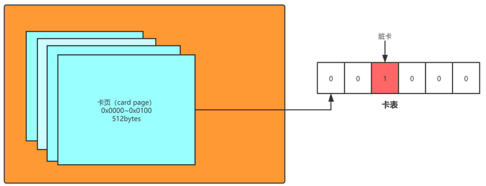

### JVM 卡表

在hotspot虚拟机中，卡表是一个字节数组，数组的每一项对应着内存中的某一块连续地址的区域，如果该区域中有引用指向了待回收区域的对象，卡表数组对应的元素将被置为1，没有则置为0；下图为卡表的一个实现，某块内存的地址向右移动9位(相当于除以512)定位到一个卡表元素，也就是说，内存中每512字节的连续区域会被定位到同一片卡表区域，如果卡表对应元素为1则代表该512个字节所在区域中有指向的指针

```c
CARD_TABLE [this address >> 9] = 0; 
```



## 写屏障(Write Barrier)

我们每次对引用进行改变时，我们在程序中并没有手动去维护卡表的信息，那么卡表信息的维护到底是如何进行的呢，这就依赖于我们的写屏障功能。

写屏障可以理解为对于我们引用类型字段复制的AOP操作。在赋前的部分的写屏障叫作写前屏障（Pre-Write Barrier），在赋值后的部分的写屏障叫作写后屏障（PostWrite Barrier）。

```c
void oop_field_store(oop* field, oop new_value) {
// 引用字段赋值奥做
*field = new_value;
// 写后屏障，在这里完成卡表状态更新
post_write_barrier(field, new_value);
}

```


