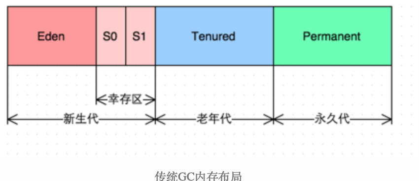
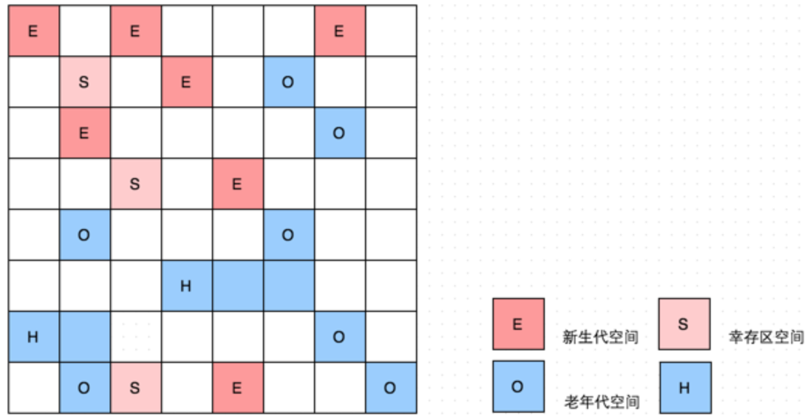
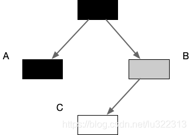
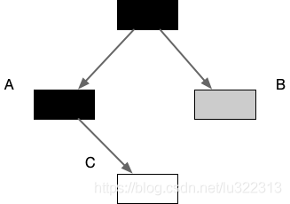
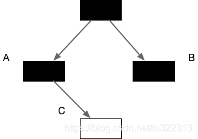
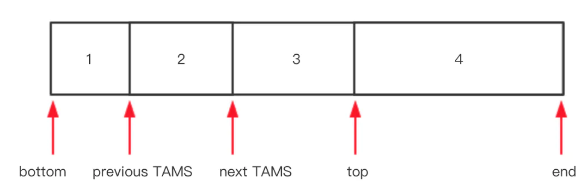
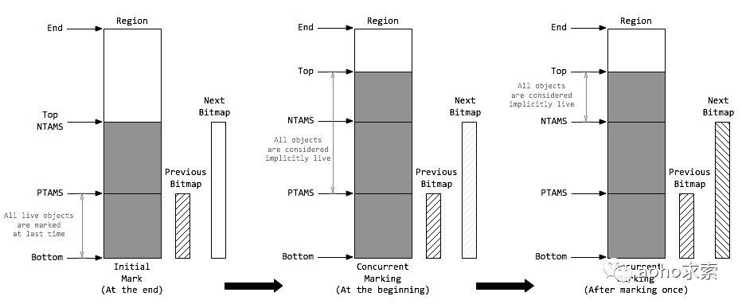
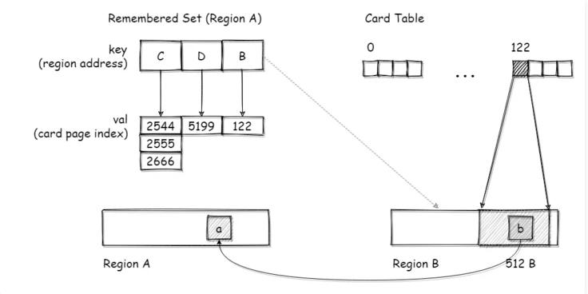

# Java Hotspot G1 GC的一些关键技术

## 前言

G1 GC，全称Garbage-First Garbage  Collector，通过-XX:+UseG1GC参数来启用，作为体验版随着JDK 6u14版本面世，在JDK  7u4版本发行时被正式推出，相信熟悉JVM的同学们都不会对它感到陌生。在JDK 9中，G1被提议设置为默认垃圾收集器（JEP  248）。

从官网的描述中，我们知道G1是一种服务器端的垃圾收集器，应用在多处理器和大容量内存环境中，在实现高吞吐量的同时，尽可能的满足垃圾收集暂停时间的要求。它是专门针对以下应用场景设计的: 

*  像CMS收集器一样，能与应用程序线程并发执行。 
* 整理空闲空间更快。 
* 需要GC停顿时间更好预测。 
*  不希望牺牲大量的吞吐性能。 
* 不需要更大的Java Heap。

G1收集器的设计目标是取代CMS收集器，它同CMS相比，在以下方面表现的更出色： 

* G1是一个有整理内存过程的垃圾收集器，不会产生很多内存碎片。 
* G1的Stop The World(STW)更可控，G1在停顿时间上添加了预测机制，用户可以指定期望停顿时间。

## G1中几个重要概念

在G1的实现过程中，引入了一些新的概念，对于实现高吞吐、没有内存碎片、收集时间可控等功能起到了关键作用。下面我们就一起看一下G1中的这几个重要概念。

### Region

传统的GC收集器将连续的内存空间划分为新生代、老年代和永久代（JDK 8去除了永久代，引入了元空间Metaspace），这种划分的特点是各代的存储地址（逻辑地址，下同）是连续的。如下图所示：



而G1的各代存储地址是不连续的，每一代都使用了n个不连续的大小相同的Region，每个Region占有一块连续的虚拟内存地址。如下图所示：



在上图中，我们注意到还有一些Region标明了H，它代表Humongous，这表示这些Region存储的是巨大对象（humongous  object，H-obj），即大小大于等于region一半的对象。H-obj有如下几个特征： 

* H-obj直接分配到了old gen，防止了反复拷贝移动。 
* H-obj在global concurrent marking阶段的cleanup 和 full GC阶段回收。 
* 在分配H-obj之前先检查是否超过 initiating heap occupancy percent和the marking  threshold, 如果超过的话，就启动global concurrent marking，为的是提早回收，防止 evacuation  failures 和 full GC。

为了减少连续H-objs分配对GC的影响，需要把大对象变为普通的对象，建议增大Region size。

一个Region的大小可以通过参数-XX:G1HeapRegionSize设定，取值范围从1M到32M，且是2的指数。如果不设定，那么G1会根据Heap大小自动决定。

### SATB

全称是Snapshot-At-The-Beginning，由字面理解，是GC开始时活着的对象的一个快照。它是通过Root Tracing得到的，作用是维持并发GC的正确性。 那么它是怎么维持并发GC的正确性的呢？根据三色标记算法，我们知道对象存在三种状态： 

*  白：对象没有被标记到，标记阶段结束后，会被当做垃圾回收掉。
* 灰：对象被标记了，但是它的field还没有被标记或标记完。 
* 黑：对象被标记了，且它的所有field也被标记完了。

由于并发阶段的存在，Mutator(应用程序)和Garbage Collector线程同时对对象进行修改，就会出现白对象漏标的情况，这种情况发生的前提是： 

* Mutator赋予一个黑对象该白对象的引用。 
* Mutator删除了所有从灰对象到该白对象的直接或者间接引用。

例如:
 当垃圾收集器扫描到下面情况时



这时候应用程序执行了以下操作:

- A.c = C
- B.c = null



这时候垃圾收集器再标记扫描的时候就会变成下图这样



很显然,此时C是白色的,被认为是垃圾需要清理掉,显然这是不合理的。

Region包含了5个指针，分别是bottom、previous TAMS、next TAMS、top和end。



其中previous TAMS、next TAMS是前后两次发生并发标记时的位置，全称`top-at-mark-start`，
 1、假设第n轮并发标记开始，将该Region当前的top指针赋值给next TAMS，在并发标记标记期间，分配的对象都在[next TAMS, top]之间，SATB能够确保这部分的对象都会被标记，默认都是存活的
 2、当并发标记结束时，将next TAMS所在的地址赋值给previous TAMS，SATB给 [bottom, previous TAMS] 之间的对象创建一个快照Bitmap，所有垃圾对象能通过快照被识别出来
 3、第n+1轮并发标记开始，过程和第n轮一样

**SATB保证了在并发标记过程中新分配对象不会漏标**

在并发标记阶段，如果该白对象是new出来的，并没有被灰对象持有，那么在TAMS以上的对象是新分配的。对于在GC时已经存在的白对象，如果它是活着的，它必然会被另一个对象引用，即上面例子中的C被B引用。如果灰对象到白对象的直接引用或者间接引用被替换了，或者删除了，白对象就会被漏标，从而导致被回收掉，这是非常严重的错误，这个对象的引用被替换时，可以通过write barrier 将旧引用记录下来。

SATB也是有副作用的，如果被替换的白对象就是要被收集的垃圾，这次的标记会让它躲过GC，这就是float garbage。因为SATB的做法精度比较低，所以造成的float garbage也会比较多。



#### RSet

全称是Remembered  Set，是辅助GC过程的一种结构，典型的空间换时间工具，和Card Table有些类似。还有一种数据结构也是辅助GC的：Collection  Set（CSet），它记录了GC要收集的Region集合，集合里的Region可以是任意年代的。在GC的时候，对于old->young和old->old的跨代对象引用，只要扫描对应的CSet中的RSet即可。 逻辑上说每个Region都有一个RSet，RSet记录了其他Region中的对象引用本Region中对象的关系，属于points-into结构（谁引用了我的对象）。而Card Table则是一种points-out（我引用了谁的对象）的结构，每个Card  覆盖一定范围的Heap（一般为512Bytes）。G1的RSet是在Card  Table的基础上实现的：每个Region会记录下别的Region有指向自己的指针，并标记这些指针分别在哪些Card的范围内。  这个RSet其实是一个Hash Table，Key是别的Region的起始地址，Value是一个集合，里面的元素是Card  Table的Index。



维系RSet中的引用关系靠post-write barrier和Concurrent refinement threads来维护，操作伪代码如下

```c++
void oop_field_store(oop* field, oop new_value) {
  pre_write_barrier(field);             // pre-write barrier: for maintaining SATB invariant
  *field = new_value;                   // the actual store
  post_write_barrier(field, new_value); // post-write barrier: for tracking cross-region reference
}
```

post-write  barrier记录了跨Region的引用更新，更新日志缓冲区则记录了那些包含更新引用的Cards。一旦缓冲区满了，Post-write  barrier就停止服务了，会由Concurrent refinement threads处理这些缓冲区日志。 RSet究竟是怎么辅助GC的呢？在做YGC的时候，只需要选定young generation  region的RSet作为根集，这些RSet记录了old->young的跨代引用，避免了扫描整个old generation。  而mixed gc的时候，old  generation中记录了old->old的RSet，young->old的引用由扫描全部young generation  region得到，这样也不用扫描全部old generation region。所以RSet的引入大大减少了GC的工作量。

### Pause Prediction Model

G1  GC是一个响应时间优先的GC算法，它与CMS最大的不同是，用户可以设定整个GC过程的期望停顿时间，参数-XX:MaxGCPauseMillis指定一个G1收集过程目标停顿时间，默认值200ms，不过它不是硬性条件，只是期望值。那么G1怎么满足用户的期望呢？就需要这个停顿预测模型了。G1根据这个模型统计计算出来的历史数据来预测本次收集需要选择的Region数量，从而尽量满足用户设定的目标停顿时间。 停顿预测模型是以衰减标准偏差为理论基础实现的：

## GC过程

讲完了一些基本概念，下面我们就来看看G1的GC过程是怎样的。

### G1 GC模式

G1提供了两种GC模式，Young GC和Mixed GC，两种都是完全Stop The World的。

* Young GC：选定所有年轻代里的Region。通过控制年轻代的region个数，即年轻代内存大小，来控制young GC的时间开销。
*  Mixed GC：选定所有年轻代里的Region，外加根据global concurrent marking统计得出收集收益高的若干老年代Region。在用户指定的开销目标范围内尽可能选择收益高的老年代Region。

由上面的描述可知，Mixed GC不是full GC，它只能回收部分老年代的Region，如果mixed  GC实在无法跟上程序分配内存的速度，导致老年代填满无法继续进行Mixed GC，就会使用serial old GC（full  GC）来收集整个GC heap。所以我们可以知道，G1是不提供full GC的。

上文中，多次提到了global  concurrent marking，它的执行过程类似CMS，但是不同的是，在G1 GC中，它主要是为Mixed  GC提供标记服务的，并不是一次GC过程的一个必须环节。global concurrent marking的执行过程分为四个步骤： 

* 初始标记（initial mark，STW）。它标记了从GC Root开始直接可达的对象。 
* 并发标记（Concurrent Marking）。这个阶段从GC  Root开始对heap中的对象标记，标记线程与应用程序线程并行执行，并且收集各个Region的存活对象信息。 
* 最终标记（Remark，STW）。标记那些在并发标记阶段发生变化的对象，将被回收。 
* 清除垃圾（Cleanup）。清除空Region（没有存活对象的），加入到free list。

第一阶段initial mark是共用了Young GC的暂停，这是因为他们可以复用root scan操作，所以可以说global  concurrent marking是伴随Young  GC而发生的。第四阶段Cleanup只是回收了没有存活对象的Region，所以它并不需要STW。

Young  GC发生的时机大家都知道，那什么时候发生Mixed GC呢？其实是由一些参数控制着的，另外也控制着哪些老年代Region会被选入CSet。

* G1HeapWastePercent：在global concurrent marking结束之后，我们可以知道old gen  regions中有多少空间要被回收，在每次YGC之后和再次发生Mixed  GC之前，会检查垃圾占比是否达到此参数，只有达到了，下次才会发生Mixed GC。
* G1MixedGCLiveThresholdPercent：old generation  region中的存活对象的占比，只有在此参数之下，才会被选入CSet
* G1MixedGCCountTarget：一次global concurrent marking之后，最多执行Mixed GC的次数。
*  G1OldCSetRegionThresholdPercent：一次Mixed GC中能被选入CSet的最多old generation  region数量。

除了以上的参数，G1 GC相关的其他主要的参数有：

| 参数                               | 含义                                                         |
| ---------------------------------- | ------------------------------------------------------------ |
| -XX:G1HeapRegionSize=n             | 设置Region大小，并非最终值                                   |
| -XX:MaxGCPauseMillis               | 设置G1收集过程目标时间，默认值200ms，不是硬性条件            |
| -XX:G1NewSizePercent               | 新生代最小值，默认值5%                                       |
| -XX:G1MaxNewSizePercent            | 新生代最大值，默认值60%                                      |
| -XX:ParallelGCThreads              | STW期间，并行GC线程数                                        |
| -XX:ConcGCThreads=n                | 并发标记阶段，并行执行的线程数                               |
| -XX:InitiatingHeapOccupancyPercent | 设置触发标记周期的 Java 堆占用率阈值。默认值是45%。这里的java堆占比指的是non_young_capacity_bytes，包括old+humongous |

https://www.jianshu.com/p/9e70097807ba

https://blog.csdn.net/lu322313/article/details/104763933