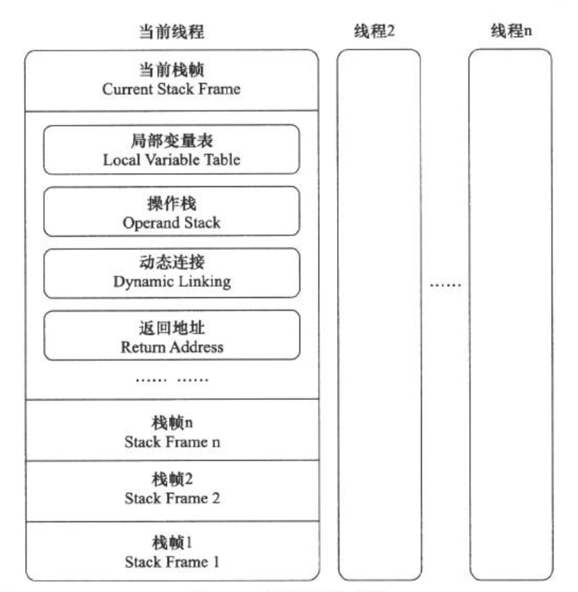

### Java 内存区域

数据存储区域，对于这一块区域的划分，各个虚拟机有各自的划分方式，不过它们都必须遵从JAVA虚拟机的基本规范去实现。


#### 程序计数器

程序计数器存储着下一条指令的地址，处理器通过它来选取下一条要执行的字节码指令。如果执行的是native方法，则这个计数器为空。

Java虚拟机的多线程运行是通过轮流切换线程并分配处理器执行的时间来实现的，为了保证当线程挂起并唤醒后，可以在它原来正确的位置继续执行，因此它是**线程私有**的。程序计数器是唯一一个不会出现OutOfMemoryError的内存区域，它的生命周期随着线程的创建而创建，随着线程的结束而死亡。

#### Java虚拟机栈

虚拟机栈是一个类似倒立的数组数据结构的空间，越往上它内部元素的地址越大。通过使用栈指针的上下移动可以申请和释放栈空间，即栈指针向下移动，则分配新的栈空间，若向上移动，则释放那些空间。



与程序计数器一样，Java虚拟机栈也是线程私有的，并且生命周期与线程相同。每个方法执行的同时会创建一个栈帧，用于存放局部变量表，操作数栈、动态链接、方法出口等信息。在编译期，栈帧中需要多大的局部变量表，多深的操作数栈都已经完全确定了，并且写入到方法表的Code属性之中。因此一个栈帧需要分配多少内存，不会受到程序运行期变量数据的影响。

Java虚拟机规范定义了两种与栈空间相关的异常：StackoverFlowError和OutofMemoryError，如果在计算过程中，请求的栈深度大于可用的栈深度，则程序会抛出StackoverFlowError异。如果Java栈可以动态扩展，但是没有足够的内存空间来支持，则会抛出OutofMemoryError异常。

我们可以使用-Xss来设置虚拟机栈的大小(每条线程可以申请的栈大小)，栈的大小直接决定了函数调用的最大可达深度：

```java
//-Xss 1m，设置栈的大小来测试，程序会抛出StackoverFlowError异常。
public class StackDemo {
	
	private int count = 0;
	
	public void recursion(){
		count ++;
		recursion();
	}
	
	public void testStack(){
		try{
		recursion();
		}catch(Exception e){
			System.out.println("deep of stack is "+count);//打印栈益处的深度
		}
	}
	
	public static void main(String[] args){
		StackDemo stackDemo = new StackDemo();
		stackDemo.testStack();
		
	}

}
```

#### 本地方法栈

本地方法栈(Native Method Stack)与虚拟机栈非常相似，它们之间的区别是虚拟机栈为虚拟机执行Java方法服务，而本地方法栈则为虚拟机使用到的Native方法服务。

在HotSpot虚拟机中，本地方法栈和虚拟机栈合二为一。与虚拟栈一样，本地方法栈区域也会出现 StackOverFlowError 和 OutOfMemoryError 两种异常。

#### 堆

Java虚拟机所管理的内存中最大的一块，Java堆是所有线程共享的一块内存区域，在虚拟机启动时创建。此内存区域的唯一目的就是存放对象实例，几乎所有的对象实例以及数组都在这里分配内存。

Java堆是垃圾收集器管理的主要区域，因此也被称为GC堆。从垃圾回收的角度，由于现在收集器基本都是采用分代垃圾收集算法，所以Java堆还可以细分为：新生代和老年代。再细致一点：Eden空间、From Survivor、To Survivor空间。


在JDK1.8中移除整个永久代(1.8之前，方法区的实现方式是永久代)，取而代之的是一个叫做元空间（Metaspace)的区域,(永久代使用的是jvm的堆空间，而元空间使用的是物理内存，直接受到本机的物理内存的限制)

#### 方法区

和Java堆一样，方法区是一块所有线程共享的内存区域，它用于保存系统的类信息，比如类的字段、方法、常量池。方法区的大小决定了系统可以保存多少个类，如果系统定义了太多的类，导致方法区溢出，虚拟机同样会抛出内存溢出错误。

在JDK1.6、JDK1.7中，方法区可以理解为永久区，可以使用参数-XX:PermSize和-XX:MaxPermSize指定，默认情况下，-XX:MaxPermSize为64MB。

如果系统使用了一些动态代理，那么有可能会在运行时生成大量的类，如果这样，就需要设置一个合理的永久区大小，确保不发生永久区内存溢出。相对而言，垃圾收集行为在这个区域是比较少出现的，但并非数据进入方法区后就永久存在了。

在JDK1.8中，永久区已经被彻底移除了，取而代之的是元数据区，元数据区大小可以使用参数-XX:MaxMetaspaceSize指定，这是一块堆外的直接内存，与永久区不同，如果不指定大小，默认情况下，虚拟机会耗尽所有的可用系统的内存。**元数据存储类的元信息，将运行时常量池并入堆中**

**运行时常量池**

运行时常量池是方法区的一部分(jdk1.8之前)。Class文件中除了有类、字段、方法、接口等描述信息外，还有常量池信息，用于存放编译期生成的各种字面量和符号引用，这部分内容将在类加载后进入方法区的运行时常量池存放。

既然运行时常量池是方法区的一部分，自然受到方法区内存的限制，当常量池无法申请到内存时，会抛出OutOfMemoryError异常。

Jdk1.7之后版本的JVM将运行时常量从方法区移除了，**在Java堆中开辟了一块区域来存放运行时常量池**。


#### 直接内存

直接内存并不是虚拟机运行时数据的一部分，直接内存直接向系统申请内存区间。通常访问直接内存的速度会优于Java 堆。因此出于性能考虑，读写频繁的场合可能会考虑使用直接内存。

直接内存在Java堆外，因此它的大小不会直接受限于Xmx指定的最大堆大小，但是系统内存是有限的，Java堆和直接内存的总和依然受限于操作系统能给出的最大内存。

JDK1.4中新加入的NIO类引入了一种基于通道与缓存区的i/o方式，它可以直接使用Native函数库直接分配堆外内存，然后通过一个存储在Java堆中的DirectByteBuffer对象作为这块内存的引用进行操作，避免了在Java堆和Native堆之间来回复制数据。