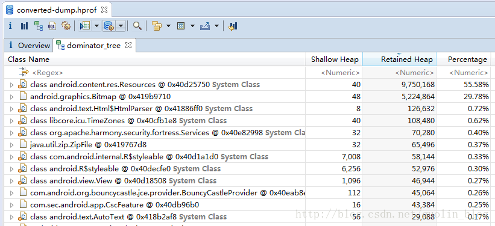
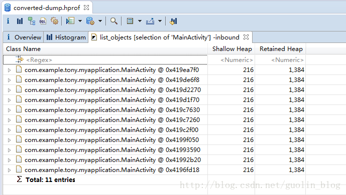

## Memory Analyzer（MAT） 使用

我们就可以来尝试使用MAT工具去分析内存泄漏的原因了，这里需要提醒大家的是，MAT并不会准确地告诉我们哪里发生了内存泄漏，而是会提供一大堆的数据和线索，我们需要自己去分析这些数据来去判断到底是不是真的发生了内存泄漏。那么现在运行MAT工具，然后选择打开转换过后的converted-dump.hprof文件，如下图所示：

MAT中提供了非常多的功能，这里我们只要学习几个最常用的就可以了。上图最中央的那个饼状图展示了最大的几个对象所占内存的比例，这张图中提供的内容并不多，我们可以忽略它。在这个饼状图的下方就有几个非常有用的工具了，我们来学习一下。

Histogram可以列出内存中每个对象的名字、数量以及大小。

Dominator Tree会将所有内存中的对象按大小进行排序，并且我们可以分析对象之间的引用结构。

一般最常用的就是以上两个功能了，那么我们先从Dominator Tree开始学起。
现在点击Dominator Tree，结果如下图所示：

这张图包含的信息非常多，我来带着大家一起解析一下。首先Retained Heap表示这个对象以及它所持有的其它引用（包括直接和间接）所占的总内存，因此从上图中看，前两行的Retained Heap是最大的，我们分析内存泄漏时，内存最大的对象也是最应该去怀疑的。

另外大家应该可以注意到，在每一行的最左边都有一个文件型的图标，这些图标有的左下角带有一个红色的点，有的则没有。带有红点的对象就表示是可以被GC Roots访问到的，根据上面的讲解，可以被GC Root访问到的对象都是无法被回收的。那么这就说明所有带红色的对象都是泄漏的对象吗？当然不是，因为有些对象系统需要一直使用，本来就不应该被回收。我们可以注意到，上图当中所有带红点的对象最右边都有写一个System Class，说明这是一个由系统管理的对象，并不是由我们自己创建并导致内存泄漏的对象。

那么上图中就无法看出内存泄漏的原因了吗？确实，内存泄漏本来就不是这么容易找出的，我们还需要进一步进行分析。上图当中，除了带有System Class的行之外，最大的就是第二行的Bitmap对象了，虽然Bitmap对象现在不能被GC Roots访问到，但不代表着Bitmap所持有的其它引用也不会被GC Roots访问到。现在我们可以对着第二行点击右键 -> Path to GC Roots -> exclude weak references，为什么选择exclude weak references呢？因为弱引用是不会阻止对象被垃圾回收器回收的，所以我们这里直接把它排除掉，结果如下图所示：

可以看到，Bitmap对象经过层层引用之后，到了MainActivity$LeakClass这个对象，然后在图标的左下角有个红色的图标，就说明在这里可以被GC Roots访问到了，并且这是由我们自己创建的Thread，并不是System Class了，那么由于MainActivity$LeakClass能被GC Roots访问到导致不能被回收，导致它所持有的其它引用也无法被回收了，包括MainActivity，也包括MainActivity中所包含的图片。

通过这种方式，我们就成功地将内存泄漏的原因找出来了。这是Dominator Tree中比较常用的一种分析方式，即搜索大内存对象通向GC Roots的路径，因为内存占用越高的对象越值得怀疑。

接下来我们再来学习一下Histogram的用法，回到Overview界面，点击Histogram，结果如下图所示：

这里是把当前应用程序中所有的对象的名字、数量和大小全部都列出来了，需要注意的是，这里的对象都是只有Shallow Heap而没有Retained Heap的，那么Shallow Heap又是什么意思呢？就是当前对象自己所占内存的大小，不包含引用关系的，比如说上图当中，byte[]对象的Shallow Heap最高，说明我们应用程序中用了很多byte[]类型的数据，比如说图片。可以通过右键 -> List objects -> with incoming references来查看具体是谁在使用这些byte[]。

那么通过Histogram又怎么去分析内存泄漏的原因呢？当然其实也可以用和Dominator Tree中比较相似的方式，即分析大内存的对象，比如上图中byte[]对象内存占用很高，我们通过分析byte[]，最终也是能找到内存泄漏所在的，但是这里我准备使用另外一种更适合Histogram的方式。大家可以看到，Histogram中是可以显示对象的数量的，那么比如说我们现在怀疑MainActivity中有可能存在内存泄漏，就可以在第一行的正则表达式框中搜索“MainActivity”，如下所示：

可以看到，这里将包含“MainActivity”字样的所有对象全部列出了出来，其中第一行就是MainActivity的实例。但是大家有没有注意到，当前内存中是有11个MainActivity的实例的，这太不正常了，通过情况下一个Activity应该只有一个实例才对。其实这些对象就是由于我们刚才不断地横竖屏切换所产生的，因为横竖屏切换一次，Activity就会经历一个重新创建的过程，但是由于LeakClass的存在，之前的Activity又无法被系统回收，那么就出现这种一个Activity存在多个实例的情况了。
接下来对着MainActivity右键 -> List objects -> with incoming references查看具体MainActivity实例，如下图所示：

如果想要查看内存泄漏的具体原因，可以对着任意一个MainActivity的实例右键 -> Path to GC Roots -> exclude weak references，结果如下图所示：

可以看到，我们再次找到了内存泄漏的原因，是因为MainActivity$LeakClass对象所导致的。

好了，这大概就是MAT工具最常用的一些用法了，当然这里还要提醒大家一句，工具是死的，人是活的，MAT也没有办法保证一定可以将内存泄漏的原因找出来，还是需要我们对程序的代码有足够多的了解，知道有哪些对象是存活的，以及它们存活的原因，然后再结合MAT给出的数据来进行具体的分析，这样才有可能把一些隐藏得很深的问题原因给找出来。
————————————————
版权声明：本文为CSDN博主「guolin」的原创文章，遵循CC 4.0 BY-SA版权协议，转载请附上原文出处链接及本声明。
原文链接：https://blog.csdn.net/guolin_blog/article/details/42238633