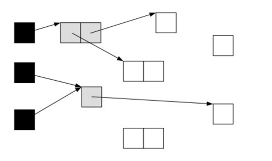
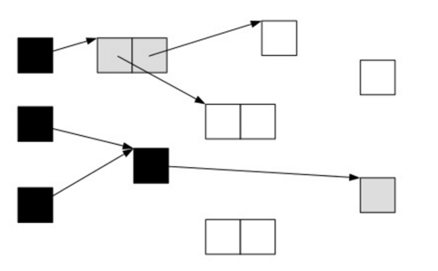
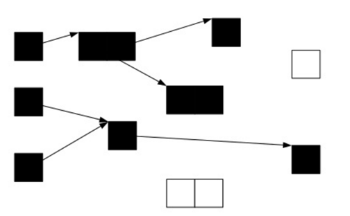
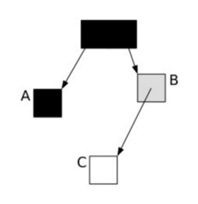
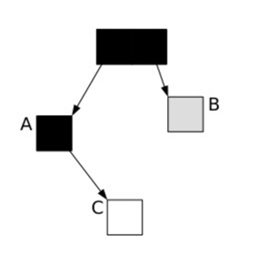
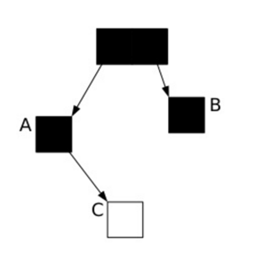

### 三色标记算法

提到并发标记，我们不得不了解并发标记的三色标记算法。它是描述追踪式回收器的一种有用的方法，利用它可以推演回收器的正确性。 首先，我们将对象分成三种类型的。

- 黑色:根对象，或者该对象与它的子对象都被扫描
- 灰色:对象本身被扫描,但还没扫描完该对象中的子对象
- 白色:未被扫描对象，扫描完成所有对象之后，最终为白色的为不可达对象，即垃圾对象

当GC开始扫描对象时，按照如下图步骤进行对象的扫描：

根对象被置为黑色，子对象被置为灰色。

继续由灰色遍历,将已扫描了子对象的对象置为黑色。

遍历了所有可达的对象后，所有可达的对象都变成了黑色。不可达的对象即为白色，需要被清理。

这看起来很美好，但是如果在标记过程中，应用程序也在运行，那么对象的指针就有可能改变。这样的话，我们就会遇到一个问题：对象丢失问题

我们看下面一种情况，当垃圾收集器扫描到下面情况时：

这时候应用程序执行了以下操作：

A.c=C

B.c=null

这样，对象的状态图变成如下情形：

这时候垃圾收集器再标记扫描的时候就会下图成这样:

很显然，此时C是白色，被认为是垃圾需要清理掉，显然这是不合理的。那么我们如何保证应用程序在运行的时候，GC标记的对象不丢失呢？有如下2中可行的方式：

1. 在插入的时候记录对象
2. 在删除的时候记录对象

刚好这对应CMS和G1的2种不同实现方式：

在CMS采用的是增量更新（Incremental update），只要在写屏障（write barrier）里发现要有一个白对象的引用被赋值到一个黑对象 的字段里，那就把这个白对象变成灰色的。即插入的时候记录下来。

在G1中，使用的是STAB（snapshot-at-the-beginning）的方式，删除的时候记录所有的对象，它有3个步骤：

1，在开始标记的时候生成一个快照图标记存活对象

2，在并发标记的时候所有被改变的对象入队（在write barrier里把所有旧的引用所指向的对象都变成非白的）

3，可能存在游离的垃圾，将在下次被收集

这样，G1到现在可以知道哪些老的分区可回收垃圾最多。 当全局并发标记完成后，在某个时刻，就开始了Mix GC。这些垃圾回收被称作“混合式”是因为他们不仅仅进行正常的新生代垃圾收集，同时也回收部分后台扫描线程标记的分区。

