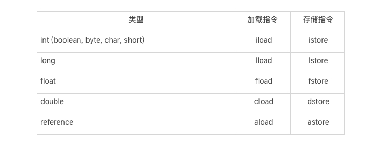
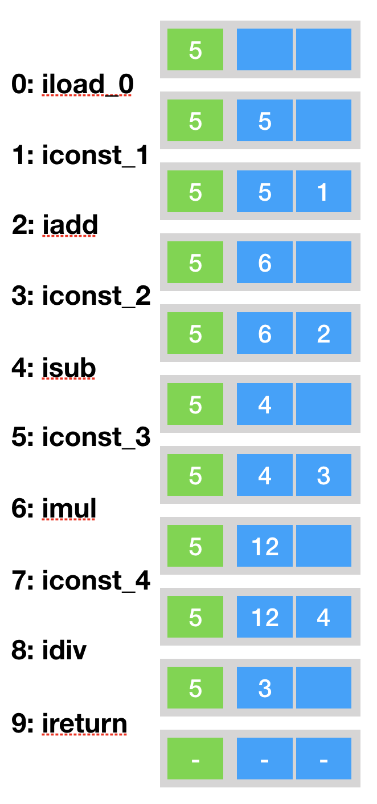

### 局部变量表

局部变量表存放了编译器可知的基本类型数据（boolean、byte、char、int、float、long、double）其中byte、short、char在存储前被转换成int，boolean被转换成int（0表示false，非0表示true），对象引用，returnAddress类型（它是为字节码jsr、jsr_w和ret服务的，很早是用来实现异常处理的）

在局部变量表中64位的double、long占用2个局部变量空间（Slot），其余数据类型占用1个。局部变量的内存空间在编译期就确定了，在运行期不会改变它的大小。局部变量表只在当前函数中有效，当函数调用结束后，随着函数帧栈的销毁，局部变量表也会随之销毁。帧栈中的局部变量的槽位是可以重用的，如果一个局部变量过了其作用域，那么在其作用域之后声明的新的局部变量就很有可能复用过期局部变量的槽位，从而达到节省资源的目的。

下面是一个例子，局部变量表中相当于一个数组，它里面存放this指针(仅非静态方法)、所传入的参数以及字节码中的局部变量：

```java
public void foo(long l,float f){
        {
            int i = 0;
        }
        
        {
            String s = "hello world";
        }
    }
```

上面这段代码为例，由于它不是一个静态方法，因此局部变量数组的第0个单元存放者this指针；第一个参数long类型，存储在数组的1和2两个单元中；第二个参数则是float类型，存储在数组的第3个单元中。方法体中有两个代码块，分别定义了两个局部变量i和s，由于这两个局部变量的生命周期没有重合之处，Java编译器可以将它们编排至同一个单元中，也就是说局部变量数组的第4个单元将为i或者s。


**通常存储在局部变量表的值需要加载到操作数栈中方能进行计算**，得到结果后再存储到局部变量数组中。这些加载、存储指令是区分类型的，如：int类型的加载指令为iload，存储指令为istore。加载局部变量数组时，需要指定所加载单元的下标，比如：aload0指加载第0个单元所存储的引用。



在Java字节码中唯一能够直接作用于局部变量表的指令是iinc M N(M 是非负整数，N为整数)。该指令是将局部变量数组中的第M个单元中的int值增加N,常用于for循环中自增量的更新。

```java
public void foo(){
	for (int i = 100; i>= 0;i--){
    }
}

public void foo();
    descriptor: ()V
    flags: ACC_PUBLIC
    Code:
      stack=1, locals=2, args_size=1
         0: bipush        100//直接操作操作数栈，设置值100
         2: istore_1//将100存放到局部变量数组下标为1的地方
         3: iload_1//再加载局部变量数组下标为1的元素
         4: iflt          13//如果小于，跳到字节码偏移13，即返回结果
         7: iinc          1, -1//否则直接作用于局部变量表，将值减一
        10: goto          3//跳到字节码偏移3
        13: return
```

再来看一个例子

```java
 public static int bar(int i){
 	return ((i+1)-2)*3/4;
 }

public static int bar(int);
    descriptor: (I)I
    flags: ACC_PUBLIC, ACC_STATIC
    Code:
      stack=2, locals=1, args_size=1
         0: iload_0//将局部变量表第0个元素加载到操作数栈顶
         1: iconst_1//将1加载到操作数栈顶
         2: iadd//相加
         3: iconst_2//将2加载到操作数栈顶
         4: isub//相减
         5: iconst_3//将3加载到操作数栈顶
         6: imul//相乘
         7: iconst_4//将4加载到操作数栈顶
         8: idiv//相除
         9: ireturn
```

字节码中的stack=2，locals=1代表该方法需要的操作数栈空间为2，局部变量数组空间为1。因为bar方法是一个静态方法，所以局部变量表中的第一个存的不是this指针。如下，以bar(5)为例：



局部变量表中的变量也是重要的垃圾回收根节点，只要被局部变量表中直接或者间接引用的对象都是不会被回收的，如下示例：

```java
//配置:XX:+PrintGC可以打印gc信息
public void localGC1(){
		
	byte[] a = new byte[6*1024*1024];
	System.gc();//进行GC时，当前方法还没有退出
	System.out.println("gc");
}
//运行结果：
//[GC (System.gc())  6809K->6552K(125952K), 0.0089809 secs]
```

在localGC1中申请空间后，立即进行垃圾回收，很明显，由于byte数组被变量a引用，因此无法回收这块空间。

```java
public void localGC2(){
	byte[] a = new byte[6*1024*1024];
	a = null;
	System.gc();
	System.out.println("gc");
}
//运行结果：
//[GC (System.gc())  6809K->392K(125952K), 0.0010687 secs]
```

在localGC2方法中，在垃圾回收前，先将变量a设置为null，使得数组失去强引用，故垃圾回收可以顺利回收这块空间。

```java
public void localGC3(){
	{
		byte[] a = new byte[6*1024*1024];
	}
	System.gc();
	System.out.println("gc");
}
// 运行结果：[GC (System.gc())  6809K->6552K(125952K), 0.0053748 secs]
```

对于localGC3，在进行垃圾回收前，先使用局部变量a失效，虽然变量a已经离开了作用域，但是变量a依然存在于局部变量表中，并且也指向这块byte数组，故byte数组依然无法被回收。

```java
public void localGC4(){
	{
		byte[] a = new byte[6*1024*1024];
	}
	int c = 10;
	System.gc();
	System.out.println("gc");
}
//执行结果：[GC (System.gc())  6809K->392K(125952K), 0.0009798 secs]
```

对于localGC4，在垃圾回收前，不仅使变量a失效，更是声明了变量c，使变量c复用变量 a的字，由于变量a此时被销毁，故垃圾回收器可以顺利回收byte数组。

