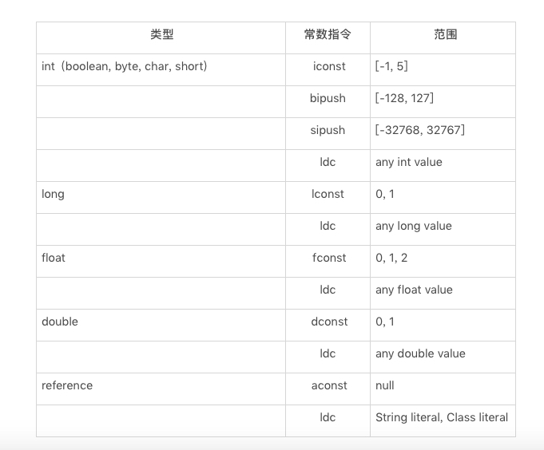

### 操作数栈

操作数栈在解释执行过程中，每当为Java方法分配栈帧时，Java虚拟机往往需要开辟一块额外的空间作为操作数栈，**来存放计算的操作数以及返回结果**。它是一个后进先出（LIFO）栈，而它的长度也是在编译时期就写入了class文件当中，是固定的。如下foo 方法：执行每一条指令之前，Java虚拟机要求该指令的操作数压入操作数栈中，在执行指令时，Java虚拟机会将该指令所需的操作数弹出，并且将指令的结果重新压入栈中。

```java
public void foo(){
	Object o = new Object();
}
public void foo();
    descriptor: ()V
    flags: ACC_PUBLIC
    Code:
      stack=2, locals=2, args_size=1
         0: new           #2              // class java/lang/Object
         3: dup
         4: invokespecial #1              // Method java/lang/Object."<init>":()V
         7: astore_1
         8: return
```


以加法指令iadd为例，假设在执行该指令前，栈顶的两个元素分别是int值1和int 值2，那么iadd指令将弹出这两个int，并将求得的和int值3压入栈中。


Java字节码中有好几条指令是直接作用在操作数栈上的，最常见的便是dup：复制栈顶元素，以及pop：舍弃栈顶元素。

dup指令常用于复制new指令生成的未经过初始化的引用。当执行new指令时，Java虚拟机将指向一块已分配的、未初始化的内存的引用压入到操作数栈中。

当new指令产生一个还没有进行初始化的引用后，接着调用dup指令复制new指令的结果，然后将这个引用作为调用者去调用其构造方法，也就是上面的invokespecial指令，当调用返回后，操作数栈上仍有原本由new指令生成的引用。

pop指令则常用于舍弃调用指令返回的结果，如下：

```java
 public void foo(){
       bar();
    }

    public static boolean bar(){
        return false;
    }

public void foo();
    descriptor: ()V
    flags: ACC_PUBLIC
    Code:
      stack=1, locals=1, args_size=1
         0: invokestatic  #2                  // Method bar:()Z
         3: pop
         4: return
```

如上我们在foo方法中调用了静态方法bar()，但是却不用其返回值，对应invokestatic指令，该指令仍旧会把返回值压入到foo方法的操作数栈中，因此Java虚拟机需要额外的执行pop指令，将返回值舍弃。

在Java字节码中，有一部分指令可以直接将常量加载到操作数栈上，以int型为例，Java虚拟机既可以通过iconst指令加载-1至5之间的int值，也可以通过bipush、sipush加载一个字节、两个字节所能代表的int值。

Java虚拟机还可以通过Idc加载常量池中的常量，如：Idc#18将加载常量池中的第18项。

这些常量包括int型、long型、float型、double型、String型以及Class型的常量，如下：



正常情况下，操作数栈的压入弹出都是一条条指令完成的，唯一的例外情况就是在抛出异常时，Java虚拟机会清除操作数栈上的所有内容，而后将异常实例压入到操作数栈上。

Java虚拟机栈会抛出两种异常：StackOverFlowError和OutOfMemoryError

* 若Java虚拟机栈的内存大小不允许动态扩展，那么当线程请求栈的深度超过当前Java虚拟机栈的最大深度的时候，就会抛出StackOverFlowError。
* 若Java虚拟机栈的内存大小允许动态扩展，且当线程请求栈时内存用完了，无法再动态扩展了，此时抛出OutOfMemoryError异常。