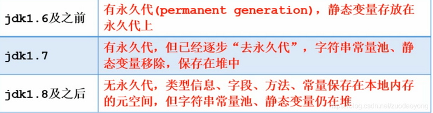
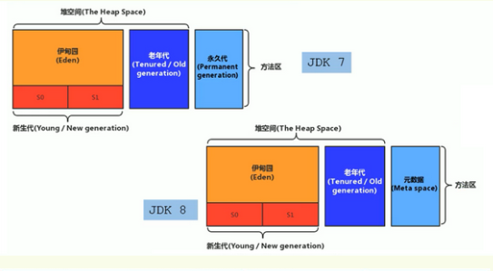

### 方法区

#### 1、方法区概述

Hotspot虚拟机，方法区有个别称non-heap（非堆），方法区可以看作是一块独立于堆的内存空间

（1）方法区与java堆一样，是各个线程共享的内存区域

（2）方法区在jvm启动的时候被创建，并且它的实际的物理内存空间中和java堆区一样都是可以不连续的

（3）方法区的大小，跟堆空间一样，可以选择固定大小或者扩展

（4）方法区的大小决定了系统可以保存多少个类，如果系统定义了太多的类，导致方法区溢出，虚拟机同样会抛出内存溢出错误

java8以前（java.lang.OutOfMemoryError:PermGen space）或者java8以后（java.lang.OutOfMemoryError:Metaspace）

（5）关闭jvm就会释放这个区域的内存

#### 2、方法区内部结构

方法区存储信息主要：类型信息，域（Field）信息，方法（Method）信息，常量，静态变量，即时编译器编译后的代码缓存

**1、类型信息**

对每个加载的类型（类class、接口、枚举、注解），jvm必须在方法区存储以下类型信息

（1）类型的完整有效名称（全名=报名.类名）

（2）类型直接父类的完整有效名（接口和java.lang.Object，没有父类）

（3）类型的修饰符（public，abstract，final的某个子集）

（4）类型直接接口的一个有序列表

**2、域（Field）信息**

（1）保存类型的所有域的相关信息以及域的声明顺序

（2）域的相关信息：域名称，域类型，域修饰符（public，private，protected，static，final，volatile，transient）

**3、方法（Method）信息**

jvm保存所有方法的以下信息，同域信息一样的包括声明顺序

（1）方法名称

（2）方法返回参数（或者void）

（3）方法参数的数量和类型（按顺序）

（4）方法的修饰符（public，private，protected，static，final，synchronized，native，abstract）

（5）方法的字节码，操作数栈、局部变量表及大小（abstract和native除外）

（6）异常表（abstract和native除外），每个异常处理的开始位置，结束位置，代码处理在程序计数器中的偏移地址、被捕获的异常类的常量池索引

**4、常量池**

一个有效的字节码文件除了包含类的版本信息，字段，方法以及接口等描述信息外，还包含一项信息那就是常量池，包含各种字面量（数量值，字符串值）和对类型（类），域和方法的符号引用。

常量池，可以看作是一个表，虚拟机指令根据这张常量表找到要执行的类名，方法名，参数类型，字面量等类型

（1）方法区，内部包含了运行时常量池

（2）字节码文件，内部包含了常量池

**运行时常量池**

（1）运行时常量池是方法区的一部分，常量池表是class文件的一部分，用于存放编译期生成的各种字面量与符号引用，这部分内容将在类加载存放到方法区的运行时常量池中。

（2）运行时常量池创建时机：在加载类和接口到虚拟机后，就会创建对应的运行时常量池

（3）jvm为每一个已加载的类型（类或者接口）都维护一个常量池，池中的数据项和数组项类似，使用索引访问

（4）运行时常量池中包含多种不同的常量，包括编译期就已经明确的数值字面量，也包括到运行期解析后才能获得的方法或者字段引用。此时不再是常量池中的符号地址了，这里换成真实地址

（5）运行时常量池类似于传统编程语言的符号表，但是它所包含的数据比符号表更加丰富

（6）当创建类或者接口的运行时常量池，如果构造运行时常量池所需的内存空间超过了方法区所能提供的最大值，则jvm会抛出OutOfMemoryError异常。

（7）运行时常量池具备动态性，比如使用String类的intern方法加入运行时常量池中

#### 方法区演进过程（Hotspot）

Hotspot 方法区的演进过程

1. 在 JDK7 及以前，习惯上把方法区，称为永久代。JDK8开始，使用元空间取代了永久代。JDK 1.8后，元空间存放在堆外内存中
2. 我们可以将方法区类比为Java中的接口，将永久代或元空间类比为Java中具体的实现类
3. 本质上，方法区和永久代并不等价。仅是对Hotspot而言的可以看作等价。《Java虚拟机规范》对如何实现方法区，不做统一要求。例如：BEAJRockit / IBM J9 中不存在永久代的概念。
4. 现在来看，当年使用永久代，不是好的idea。导致Java程序更容易OOm（超过-XX:MaxPermsize上限）
5. 而到了JDK8，终于完全废弃了永久代的概念，改用与JRockit、J9一样在本地内存中实现的元空间（Metaspace）来代替
6. 元空间的本质和永久代类似，都是对JVM规范中方法区的实现。不过元空间与永久代最大的区别在于：元空间不在虚拟机设置的内存中，而是使用本地内存
7. 永久代、元空间二者并不只是名字变了，内部结构也调整了
8. 根据《Java虚拟机规范》的规定，如果方法区无法满足新的内存分配需求时，将抛出OOM异常

