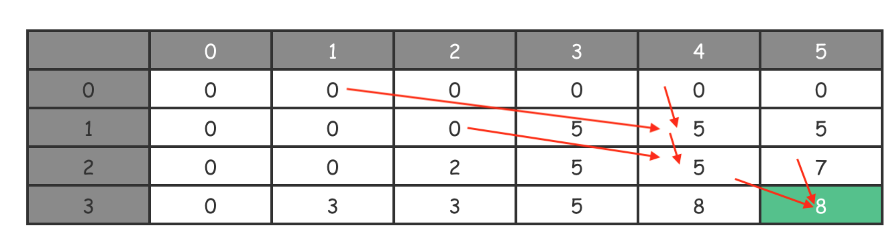
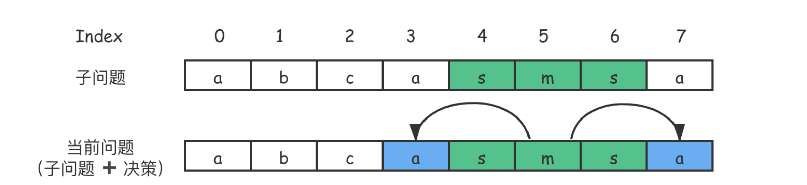
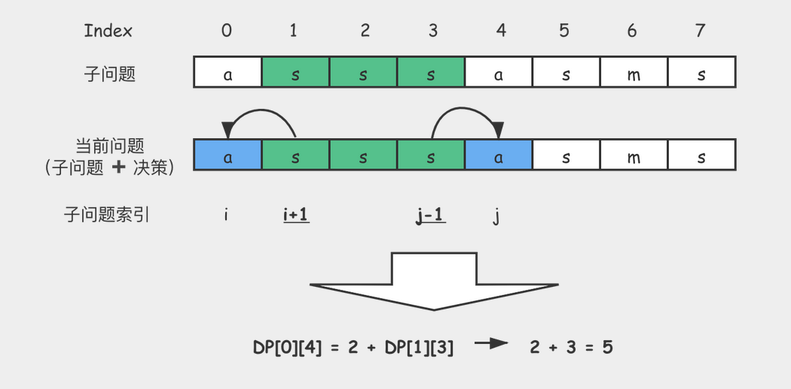
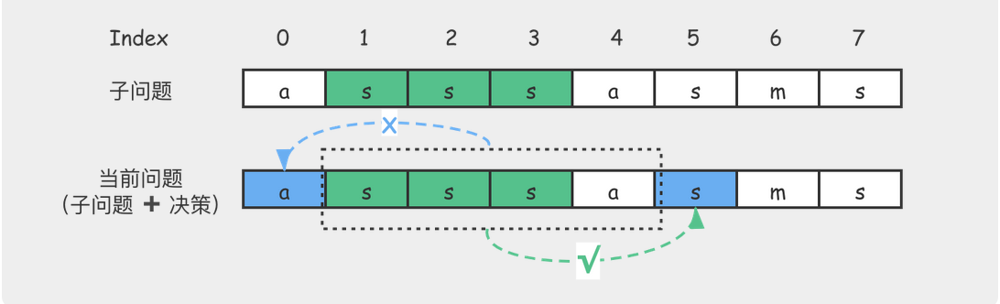
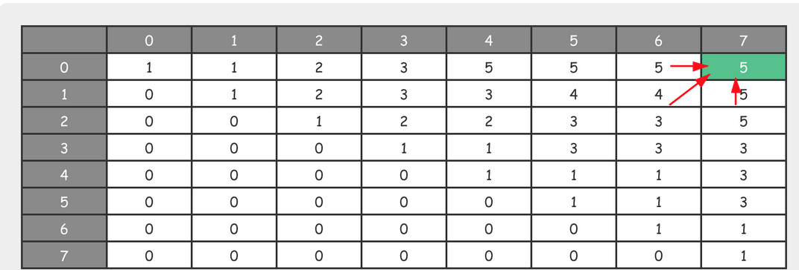
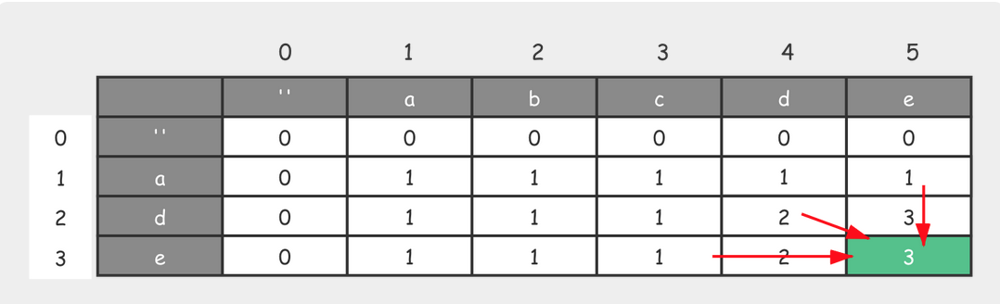
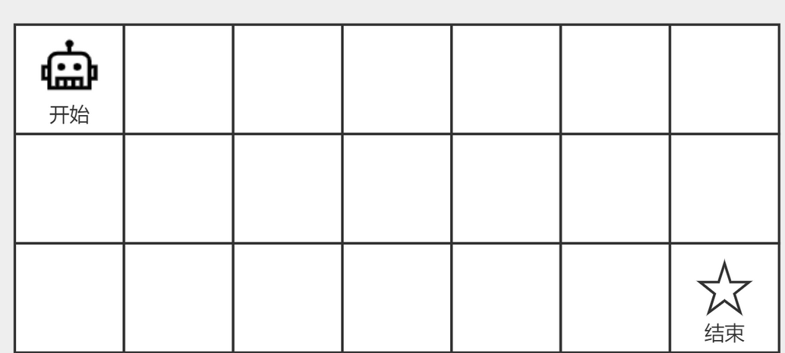
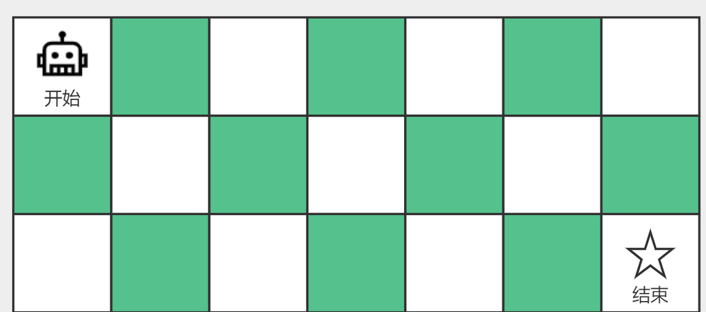

# 动态规划经典例子

## 硬币找零

问题：给定 n 种不同面值的硬币，分别记为 c[0], c[1], c[2], … c[n]，同时还有一个总金额 k，编写一个函数计算出最少需要几枚硬币凑出这个金额 k？每种硬币的个数不限，且如果没有任何一种硬币组合能组成总金额时，返回 -1。

```

示例 1：

输入：c[0]=1, c[1]=2, c[2]=5, k=12
输出：3 
解释：12 = 5 + 5 + 2
```

```java

int getMinCounts(int k, int[] values) {
   int[] memo = new int[k + 1]; // 创建备忘录
   memo[0] = 0; // 初始化状态
   for (int i = 1; i < k + 1; i++) { memo[i] = k + 1; }
   
   for (int i = 1; i < k + 1; i++) {
       for (int coin : values) {
           if (i - coin < 0) { continue; }
           memo[i] = Math.min(memo[i], memo[i - coin] + 1); // 作出决策
       }
   }

   return memo[k] == k + 1 ? -1 : memo[k];
}

int getMinCountsDPSolAdvance() {
   int[] values = { 3, 5 }; // 硬币面值
   int total = 22; // 总值

   return getMinCounts(total, values); // 输出答案
}
```

## 背包问题

题：给你一个可放总重量为 W 的背包和 N 个物品，对每个物品，有重量 w 和价值 v 两个属性，那么第 i 个物品的重量为 w[i]，价值为 v[i]。现在让你用这个背包装物品，问最多能装的价值是多少？

```
示例：输入：W = 5, N = 3 w = [3, 2, 1], v = [5, 2, 3]输出：8解释：选择 i=0 和 i=2 这两件物品装进背包。它们的总重量 4 小于 W，同时可以获得最大价值 8。
```

```java

int dp(int[] w, int[] v, int N, int W) {
    // 创建备忘录
    int[][] dp = new int[N+1][W+1];
  
    // 初始化状态
    for (int i = 0; i < N + 1; i++) { dp[i][0] = 0; }
    for (int j = 0; j < W + 1; j++) { dp[0][j] = 0; }
  
    for (int tn = 1; tn < N + 1; tn++) { // 遍历每一件物品
    for (int rw = 1; rw < W + 1; rw++) { // 背包容量有多大就还要计算多少次
        if (rw < w[tn]) {
          // 当背包容量小于第tn件物品重量时，只能放入前tn-1件
          dp[tn][rw] = dp[tn-1][rw];
        } else {
                // 当背包容量还大于第tn件物品重量时，进一步作出决策
          dp[tn][rw] = Math.max(dp[tn-1][rw], dp[tn-1][rw-w[tn]] + v[tn]);
        }
      }
    }
  
  return dp[N][W];
}

int solveDP() {
  int N = 3, W = 5; // 物品的总数，背包能容纳的总重量
  int[] w = {0, 3, 2, 1}; // 物品的重量
  int[] v = {0, 5, 2, 3}; // 物品的价值
  
  return dp(w, v, N, W); // 输出答案
}
```



## 完全背包问题

问题：给你一个可放总重量为 W 的背包和 N 个物品，对每个物品，有重量 w 和价值 v 两个属性，那么第 i 个物品的重量为 w[i]，价值为 v[i]。现在让你用这个背包装物品，每种物品都可以选择任意多个，问这个背包最多能装的价值是多少？

```

示例：

输入：W = 5, N = 3
     w = [3, 2, 1], v = [5, 2, 3]
输出：15
解释：当 i = 2 时，选取 5 次，总价值为 5 * 3 = 15。
```

```java

int bag(int[] w, int[] v, int N, int W) {
  // 创建备忘录
  int[][] dp = new int[N+1][W+1];
  
  // 初始化状态
  for (int i = 0; i < N + 1; i++) { dp[i][0] = 0; }
  for (int j = 0; j < W + 1; j++) { dp[0][j] = 0; }

  // 遍历每一件物品
  for (int tn = 1; tn < N + 1; tn++) { 
    // 背包容量有多大就还要计算多少次
    for (int rw = 1; rw < W + 1; rw++) { 
      dp[tn][rw] = dp[tn-1][rw];
      // 根据rw尝试放入多次物品，从中找出最大值，作为当前子问题的最优解
      for (int k = 0; k <= rw / w[tn]; k++) {
        dp[tn][rw] = Math.max(dp[tn][rw], dp[tn-1][rw-k*w[tn]] + k*v[tn]);
      }
    }
  }
  return dp[N][W];
}

int solveBag() {
  int N = 3, W = 5; // 物品的总数，背包能容纳的总重量
  int[] w = {0, 3, 2, 1}; // 物品的重量
  int[] v = {0, 5, 2, 3}; // 物品的价值
  
  return bag(w, v, N, W); // 输出答案
}
```

## 回文子串个数

问题：给定一个字符串，你的任务是计算这个字符串中有多少个回文子串。具有不同开始位置或结束位置的子串，即使是由相同的字符组成，也会被视作不同的子串。

```

示例2：

输入："aaa"
输出：6
解释：共有六个回文子串，分别为 "a", "a", "a", "aa", "aa", "aaa"。注意题设，具有不同开始位置或结束位置的子串，即使是由相同的字符组成，也会被视作不同的子串，因此像 "aa" 和 "aa" 就是两个不同的回文子串。
```

```java

int countSubstrings(String s) {
    int n = s.length();
    if (0 == n) return 0;

    int ans = 0;
    boolean[][] dp = new boolean[n][n];

    for (int i = 0; i < n; i++) {
        dp[i][i] = true;
        ans++;
    }

  /**
  当子问题局限于单字符时，它一定是回文（如 “a”），因此子问题的答案是 True；当子问题是由相同的两个字符构成的，它一定是回文（如 “aa”），因此子问题的答案是 True；当子问题是由左右两个相同字符外加一个任意字符，共三个字符构成时，它一定是回文（如 “aba”），因此子问题的答案是 True
  */
    for (int j = 1; j < n; j++) {
        for (int i = 0; i < j; i++) {
            dp[i][j] = (s.charAt(i) == s.charAt(j)) && (j-i <3 || dp[i+1][j-1]);
            if (dp[i][j]) { ans++; }
        }
    }

    return ans;
}
```

动态规划的当前问题是根据它的子问题 ➕ 当前决策推导出来的。从数组的角度上看，无非就是：一个范围较小的回文子数组 ➕ 额外元素后，再看它是不是回文子数组。



## 最大子数组之和

问题：给定一个整数数组 nums ，找到一个具有最大和的连续子数组（子数组最少包含一个元素），返回其最大和。

```

示例：

输入：[-2, 1, -3, 4, -1, 3, -5, 1, 2]
输出：6
解释：连续子数组 [4,-1, 3] 的和最大为 6。
```

```java

int maxSubArray(int[] nums) {
    int n = nums.length; if (0 == n) return 0;
    int[] dp = new int[n];
    for (int i = 0; i < n; i++) dp[i] = Integer.MIN_VALUE; // 初始化状态
    
    dp[0] = nums[0];

    int res = dp[0];
    for (int i = 1; i < n; i++) {
        dp[i] = Math.max(nums[i], dp[i-1] + nums[i]);
        res = Math.max(res, dp[i]);
    }

    return res;
}
```

## 最长回文子序列

问题：给定一个字符串 s ，找到其中最长的回文子序列，并返回该序列的长度。可以假设 s 的最大长度为 1000。

```

示例1：

输入："asssasms"
输出：5
解释：一个可能的最长回文子序列为 "sssss"，另一种可能的答案是 "asssa"。
```





```java

int getLongestPalindromeSubseq(String s) {
    int n = s.length(); if (0 == n) return 0;

    int[][] dp = new int[n][n]; 
    for (int[] row : dp) { Arrays.fill(row, 0); }
    for (int i = 0; i < n; i++) dp[i][i] = 1; // 初始化状态

    for (int i = n-1; i >= 0; i--) {
        for (int j = i+1; j < n; j++) {
            if (s.charAt(i)==s.charAt(j)) {
                dp[i][j] = 2 + dp[i+1][j-1];
            } else {
                dp[i][j] = Math.max(dp[i+1][j], dp[i][j-1]); // 作出进一步决策
            }
        }
    }

    return dp[0][n-1]; // 输出答案
}
```



## 最长公共子序列

```

示例1：

输入：text1 = "abcde", text2 = "ade" 
输出：3  
解释：最长公共子序列是 "ade"，它的长度为 3。

```



```java

int getLongestCommonSubsequence(String text1, String text2) {
    int m = text1.length(), n = text2.length();
    int[][] dp = new int[m + 1][n + 1];
    for (int[] row: dp) { Arrays.fill(row, 0); }

    for (int j = 1; j <= n; j++) {
        for (int i = 1; i <= m; i++) {
            if (text2.charAt(j - 1) == text1.charAt(i - 1)) {
                dp[i][j] = dp[i - 1][j - 1] + 1;
            } else {
                dp[i][j] = Math.max(dp[i - 1][j], dp[i][j - 1]);
            }
        }
    }

    return dp[m][n];
}
```

## 简单的路径规划

问题：一个机器人位于一个 m * n 网格的左上角 （起始点在下图中标记为“开始” ），机器人每次只能向下或者向右移动一步，现在机器人试图达到网格的右下角（在下图中标记为“结束”）。问总共有多少条不同的路径？



```java

int getPathCount(int m, int n) {
    int[][] dp = new int[m][n];

    // 初始化状态
    for (int i = 0; i < m; i ++) { dp[i][0] = 1; } 
    for (int j = 0; j < n; j ++) { dp[0][j] = 1; }

    for (int i = 1; i < m; i ++) { // 状态转移过程
        for (int j = 1; j < n; j ++) {
            dp[i][j] = dp[i - 1][j] + dp[i][j - 1];
        }
    }

    return dp[m - 1][n - 1]; // 输出答案
}
```

## 带障碍的路径规划

问题：一个机器人位于一个 m * n 网格的左上角 （起始点在下图中标记为“开始” ）。机器人每次只能向下或者向右移动一步，现在机器人试图达到网格的右下角（在下图中标记为“结束”）。考虑网格中有障碍物，那么从左上角到右下角将会有多少条不同的路径？




```

示例：

输入：
[ 
  [0, 0, 0], 
  [0, 1, 0], 
  [0, 0, 0] 
]
输出: 2
解释：3 * 3 网格的正中间有一个障碍物。
从左上角到右下角一共有 2 条不同的路径：
1. 向右 -> 向右 -> 向下 -> 向下
2. 向下 -> 向下 -> 向右 -> 向右
```

```java

int getPathCountWithBlocks(int[][] v) {
    int m = v.length;
    int n = v[0].length;

    int[][] dp = new int[m][n];

    // 初始化状态
    for (int i = 0; i < m; i ++) { dp[i][0] = v[i][0] == 1 ? 0 : 1; }
    for (int j = 0; j < n; j ++) { dp[0][j] = v[0][j] == 1 ? 0 : 1; }

    for (int i = 1; i < m; i ++) { // 状态转移过程
        for (int j = 1; j < n; j ++) {
            if (v[i][j] == 1) {
                dp[i][j] = 0;
            } else {
                dp[i][j] = dp[i - 1][j] + dp[i][j - 1];
            }
        }
    }

    return dp[m - 1][n - 1]; // 输出答案
}
```

## 跳跃游戏

题目：给出一个非负整数数组 A，你最初定位在数组的第一个位置。数组中的每个元素代表你在那个位置可以跳跃的最大长度。判断你是否能到达数组的最后一个位置。

```

示例1：

输入：A = [2, 3, 1, 1, 6]
输出： True
解释: 我们可以先跳 1 步，从位置 0 到达位置 1, 然后再从位置 1 跳 3 步到达最后一个位置。
```

```

public boolean canJump(int[] nums) {
    int n = nums.length;
    if (n <= 1) { return true; }

    boolean[] dp = new boolean[n];
    // 初始化状态
    for (int i = 0; i < n; i++) { dp[i] = false; }
    dp[0] = true;

    for (int i = 1; i < n; i++) {
        for (int j = 0; j < i; j++) { // j < i
            if (dp[j] && j + nums[j] >= i) {
                dp[i] = true;
                break;
            }
        }
    }

    return dp[n - 1]; // 输出答案
}
```

## 最长连续递增序列

问题：给定一个未经排序的整数数组 nums，找到最长且连续的的递增序列，并返回该序列的长度。

```

示例1：

输入: nums = [6, 6, 6, 6, 6]
输出: 1
解释: 最长连续递增序列是 [6], 长度为 1。


示例2：

输入: nums = [1, 3, 5, 0, 7]
输出: 3
解释: 最长连续递增序列是 [1, 3, 5], 长度为 3。你会发现 [1, 3, 5, 7] 也是升序的子序列, 但它不是连续的。因为 5 和 7 在原数组中被 0 隔开。因此，这不是原问题的答案。
```

```java

public int findLengthOfLCIS(int[] nums) {
  int n = nums.length;  if (n == 0)  { return 0;  }
  
  int[] dp = new int[n]; 
  Arrays.fill(dp, 1); // 初始化状态

  int res = 1; // 记录答案的变量
  for (int i = 1; i < n; i++) {
    if (nums[i] > nums[i-1]) { // 决策
      dp[i] = dp[i-1] + 1;
      res = Math.max(res, dp[i]);
    }
  }

  return res; // 输出答案
}
```

## 长上升子序列的长度

问题：给定一个无序的整数数组 nums，找到其中最长上升子序列的长度（Longest Increasing Subsequence，LIS）。附加条件是：

1. 可能会有多种最长上升子序列的组合，你只需要输出对应的长度即可
2. 你算法的时间复杂度应该为 O(n2) 。

```

示例：

输入: nums = [10, 9, 1, 5, 2, 6, 66, 18]
输出: 4 
解释: 其中一个最长的上升子序列是 [1, 2, 6, 66]，它的长度是 4。
```

```java

public int getLengthOfLIS(int[] nums) {
  int n = nums.length; if (0 == n) { return 0; }
  
  int[] dp = new int[n];
  Arrays.fill(dp, 1); // 初始化状态

  int res = 1; // 记录答案的变量
  for (int j = 0; j < n; j++) { // 决策
    for (int i = 0; i < j; i++) {
      if (nums[i] < nums[j]) {
        dp[j] = Math.max(dp[j], dp[i] + 1);
        res = Math.max(dp[j], res);
      }
    }
  }

  return res; // 输出答案
}
```

## 不重叠的子数组之和

问题：给定一个整数数组 nums 和一个整数 k，找出 k 个不重叠子数组使得它们的和最大。每个子数组的数字在数组中的位置应该是连续的。返回最大的和。

```

示例1：

输入: nums = [1, 2, 3, 4]，k = 1
输出: 10
解释: 1 + 2 + 3 + 4 = 10


示例2：

输入: nums = [-1, 4, -2, 3, -2, 3]，k = 2
输出: 8
解释: 4 + (3 + -2 + 3) = 8
```


```java

public int maxSubArray(int[] nums, int k) {
    int n = nums.length;
    
    int[][] m = new int[n+1][k+1];
    int[][] dp = new int[n+1][k+1];

    for (int i = 0; i <= n; i ++) { // 初始化状态
        for (int j = 0; j <= k; j ++) {
             m[i][j] = 0;
             dp[i][j] = 0;
        }
    }
    
    for (int i = 1; i <= n; i++) { // 决策过程
        for (int j = Math.min(i,  k); j > 0; j--){
            if(i == j){
                m[i][j] = m[i-1][j-1] + nums[i-1];
                dp[i][j] = dp[i-1][j-1] + nums[i-1];
            } else{
                m[i][j] = Math.max(m[i-1][j], dp[i-1][j-1]) + nums[i-1];
                dp[i][j] = Math.max(dp[i-1][j], m[i][j]);
            }
        }
    }
    
    return dp[n][k]; // 输出答案
}
```

## 最大子数组之积

问题：给定一个整数数组 nums（由正整数和负整数组成），请你找出数组中乘积最大的子数组（该子数组中至少包含一个数字），并返回该子数组所对应的乘积。

```

示例1：

输入: nums = [2, 8, -2, 4]
输出: 16
解释: 子数组 [2, 8] 有最大乘积 16。
```

```java

public int getMaxProduct(int[] nums) {
  int n = nums.length; if (0 == n) { return 0; }
  
  int[] dp_max = new int[n]; Arrays.fill(dp_max, 0);
  int[] dp_min = new int[n]; Arrays.fill(dp_min, 0);
  
  dp_max[0] = nums[0]; // 初始化状态
  dp_min[0] = nums[0];

  int res = nums[0];
  for (int i = 1; i < n; i++) { // 决策过程
    if (nums[i] < 0) {
      int temp = dp_max[i-1];
      dp_max[i-1] = dp_min[i-1];
      dp_min[i-1] = temp;
    }

    dp_max[i] = Math.max(nums[i], dp_max[i-1] * nums[i]);
    dp_min[i] = Math.min(nums[i], dp_min[i-1] * nums[i]);
    res = Math.max(res, dp_max[i]);
  }

  return res; // 输出答案
}
```


https://blog.csdn.net/interesting_code/article/details/104425727

