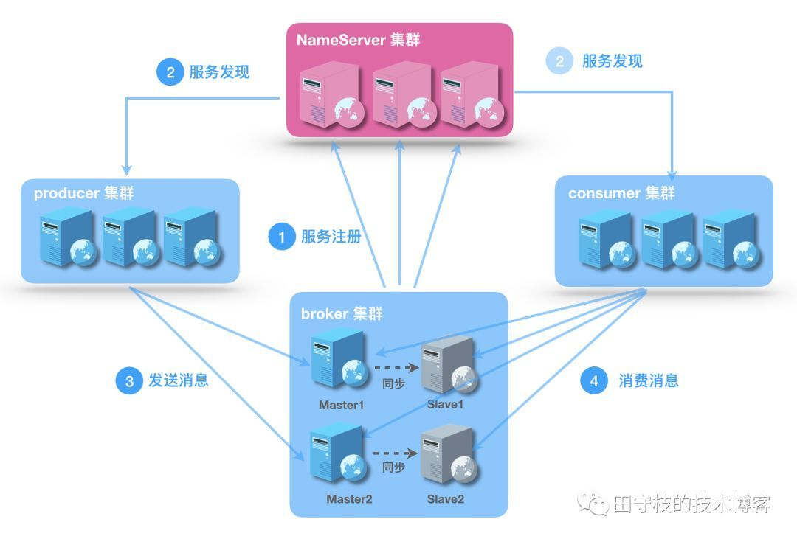
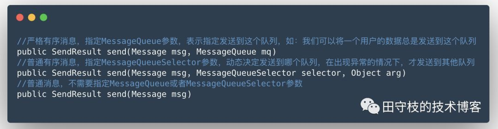
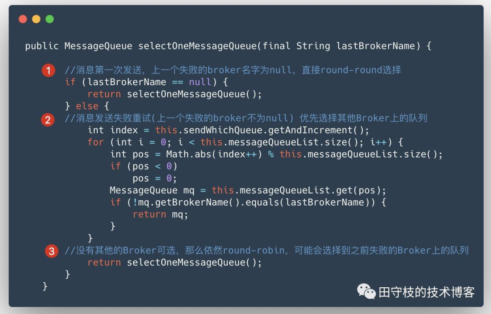
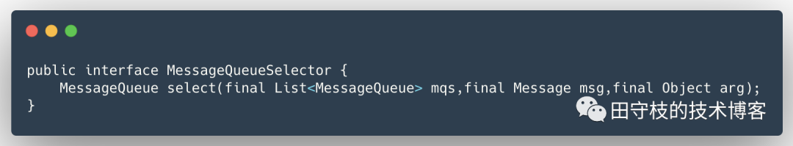

# RocketMQ NameServer深入剖析

**1 NameServer的作用**

Name Server 是专为 RocketMQ 设计的轻量级名称服务，具有简单、可集群横吐扩展、无状态，节点之间互不通信等特点。整个Rocketmq集群的工作原理如下图所示：



可以看到，Broker集群、Producer集群、Consumer集群都需要与NameServer集群进行通信：

**Broker集群**

Broker用于接收生产者发送消息，或者消费者消费消息的请求。一个Broker集群由多组Master/Slave组成，Master可写可读，Slave只可以读，Master将写入的数据同步给Slave。每个Broker节点，在启动时，都会遍历NameServer列表，与每个NameServer建立长连接，注册自己的信息，之后定时上报。

**Producer集群**

消息的生产者，通过NameServer集群获得Topic的路由信息，包括Topic下面有哪些Queue，这些Queue分布在哪些Broker上等。Producer只会将消息发送到Master节点上，因此只需要与Master节点建立连接。

**Consumer集群**

消息的消费者，通过NameServer集群获得Topic的路由信息，连接到对应的Broker上消费消息。注意，由于Master和Slave都可以读取消息，因此Consumer会与Master和Slave都建立连接。

**2 为什么选择自己开发NameServer**

目前可以作为服务发现组件有很多，如etcd、consul，zookeeper等：

那么为什么rocketmq选择自己开发一个NameServer，而不是使用这些开源组件呢？特别的，Zookeeper其提供了Master选举、分布式锁、数据的发布和订阅等诸多功能RocketMQ设计之初时参考的另一款消息中间件Kafka就使用了Zookeeper。

事实上，在RocketMQ的早期版本，即MetaQ 1.x和MetaQ 2.x阶段，也是依赖Zookeeper的。但MetaQ 3.x（即RocketMQ）却去掉了ZooKeeper依赖，转而采用自己的NameServer。

而RocketMQ的架构设计决定了只需要一个轻量级的元数据服务器就足够了，只需要保持最终一致，而不需要Zookeeper这样的强一致性解决方案，不需要再依赖另一个中间件，从而减少整体维护成本。

敏锐的同学肯定已经意识到了，根据CAP理论RocketMQ在名称服务这个模块的设计上选择了AP，而不是CP：

- 一致性(Consistency)：Name Server 集群中的多个实例，彼此之间是不通信的，这意味着某一时刻，不同实例上维护的元数据可能是不同的，客户端获取到的数据也可能是不一致的。
- 可用性(Availability)：只要不是所有NameServer节点都挂掉，且某个节点可以在指定之间内响应客户端即可。
- 分区容错(Partiton Tolerance)：对于分布式架构，网络条件不可控，出现网络分区是不可避免的，只要保证部分NameServer节点网络可达，就可以获取到数据。具体看公司如何实施，例如：为了实现跨机房的容灾，可以将NameServer部署的不同的机房，某个机房出现网络故障，其他机房依然可用，当然Broker集群/Producer集群/Consumer集群也要跨机房部署。

事实上，除了RocketMQ开发了自己的NameServer，最近 Kafka 社区也在 Wiki 空间上提交了一项新的改进提案“KIP-500: Replace ZooKeeper with a Self-Managed Metadata Quorum”，其目的是为了消除 Kafka 对 ZooKeeper 的依赖，该提案建议用自管理的元数据仲裁机制替换原来的 ZooKeeper 组件。感兴趣的读者可以自行查阅相关资料。

**3 NameServer如何保证数据的最终一致**

​        NameServer作为一个名称服务，需要提供服务注册、服务剔除、服务发现这些基本功能，但是NameServer节点之间并不通信，在某个时刻各个节点数据可能不一致的情况下，如何保证客户端可以最终拿到正确的数据。下面分别从路由注册、路由剔除，路由发现三个角度进行介绍。

3.1 路由注册

对于Zookeeper、Etcd这样强一致性组件，数据只要写到主节点，内部会通过状态机将数据复制到其他节点，Zookeeper使用的是Zab协议，etcd使用的是raft协议。

但是NameServer节点之间是互不通信的，无法进行数据复制。RocketMQ采取的策略是，在Broker节点在启动的时候，轮训NameServer列表，与每个NameServer节点建立长连接，发起注册请求。NameServer内部会维护一个Broker表，用来动态存储Broker的信息。

同时，Broker节点为了证明自己是存活的，会将最新的信息上报给NameServer，然后每隔30秒向NameServer发送心跳包，心跳包中包含 BrokerId、Broker地址、Broker名称、Broker所属集群名称等等，然后NameServer接收到心跳包后，会更新时间戳，记录这个Broker的最新存活时间。

NameServer在处理心跳包的时候，存在多个Broker同时操作一张Broker表，为了防止并发修改Broker表导致不安全，路由注册操作引入了ReadWriteLock读写锁，这个设计亮点允许多个消息生产者并发读，保证了消息发送时的高并发，但是同一时刻NameServer只能处理一个Broker心跳包，多个心跳包串行处理。这也是读写锁的经典使用场景，即读多写少。

**3.2 路由剔除**

正常情况下，如果Broker关闭，则会与NameServer断开长连接，Netty的通道关闭监听器会监听到连接断开事件，然后会将这个Broker信息剔除掉。

异常情况下，NameServer中有一个定时任务，每隔10秒扫描一下Broker表，如果某个Broker的心跳包最新时间戳距离当前时间超多120秒，也会判定Broker失效并将其移除。

特别的，对于一些日常[运维](https://cloud.tencent.com/solution/operation?from=10680)工作，例如：Broker升级，RocketMQ提供了一种优雅剔除路由信息的方式。如在升级一个节Master点之前，可以先通过命令行工具禁止这个Broker的写权限，生产者发送到这个Broker的请求，都会收到一个NO_PERMISSION响应，之后会自动重试其他的Broker。当观察到这个broker没有流量后，再将这个broker移除。

**3.3 路由发现**

路由发现是客户端的行为，这里的客户端主要说的是生产者和消费者。具体来说：

- 对于生产者，可以发送消息到多个Topic，因此一般是在发送第一条消息时，才会根据Topic获取从NameServer获取路由信息。
- 对于消费者，订阅的Topic一般是固定的，所在在启动时就会拉取。

那么生产者/消费者在工作的过程中，如果路由信息发生了变化怎么处理呢？如：Broker集群新增了节点，节点宕机或者Queue的数量发生了变化。细心的读者注意到，前面讲解NameServer在路由注册或者路由剔除过程中，并不会主动推送会客户端的，这意味着，需要由客户端拉取主题的最新路由信息。

事实上，RocketMQ客户端提供了定时拉取Topic最新路由信息的机制，这里我们直接结合源码来讲解。 

DefaultMQProducer和DefaultMQConsumer有一个pollNameServerInterval配置项，用于定时从NameServer并获取最新的路由表，默认是30秒，它们底层都依赖一个MQClientInstance类。

MQClientInstance类中有一个updateTopicRouteInfoFromNameServer方法，用于根据指定的拉取时间间隔，周期性的的从NameServer拉取路由信息。 在拉取时，会把当前启动的Producer和Consumer需要使用到的Topic列表放到一个集合中，逐个从NameServer进行更新。以下源码截图展示了这个过程：

```java
public void updateTopicRouteInfoFromNameServer() {
  			//需要更新路由信息的topic列表
        Set<String> topicList = new HashSet<String>();
				//添加消费者使用到的topic到集合中
        // Consumer
        {
            Iterator<Entry<String, MQConsumerInner>> it = this.consumerTable.entrySet().iterator();
            while (it.hasNext()) {
                Entry<String, MQConsumerInner> entry = it.next();
                MQConsumerInner impl = entry.getValue();
                if (impl != null) {
                    Set<SubscriptionData> subList = impl.subscriptions();
                    if (subList != null) {
                        for (SubscriptionData subData : subList) {
                            topicList.add(subData.getTopic());
                        }
                    }
                }
            }
        }
				
  			//添加生产者使用到的topic到集合中
        // Producer
        {
            Iterator<Entry<String, MQProducerInner>> it = this.producerTable.entrySet().iterator();
            while (it.hasNext()) {
                Entry<String, MQProducerInner> entry = it.next();
                MQProducerInner impl = entry.getValue();
                if (impl != null) {
                    Set<String> lst = impl.getPublishTopicList();
                    topicList.addAll(lst);
                }
            }
        }
				//逐一从NameServer更新每个Topic的路由信息
        for (String topic : topicList) {
            this.updateTopicRouteInfoFromNameServer(topic);
        }
    }
```

然而定时拉取，还不能解决所有的问题。因为客户端默认是每隔30秒会定时请求NameServer并获取最新的路由表，意味着客户端获取路由信息总是会有30秒的延时。这就带来一个严重的问题，客户端无法实时感知Broker服务器的宕机。如果生产者和消费者在这30秒内，依然会向这个宕机的broker发送或消费消息呢？

这个问题，可以通过客户端重试机制来解决。

**4 生产者重试机制**

在讲解生产者重试机制之前，我们必须先对三种消息类型：**普通消息**、**普通有序消息**、**严格有序消息**进行介绍。因为RocketMQ客户端的生产者重试机制，只会普通消息有作用。对于普通有序消息、严格有序消息是没有作用。目前网上绝大部分文章对此并没有进行区分，导致参考了这些文章的同学误以为自己的消息发送失败会自动进行重试，然而事实上可能根本没有进行重试。

三种消息的类型介绍如下：

- 普通消息：消息是无序的，任意发送发送哪一个队列都可以。
- 普通有序消息：同一类消息(例如某个用户的消息)总是发送到同一个队列，在异常情况下，也可以发送到其他队列。
- 严格有序消息：消息必须被发送到同一个队列，即使在异常情况下，也不允许发送到其他队列。6+

对于这三种类型的消息，RocketMQ对应的提供了对应的方法来分别消息，例如同步发送(异步/批量/oneway也是类似)：



**需要注意的是：**这些方法重载形式，本意是为了支持以上三种不同的消息类型。但是你不按套路出牌，例如：对于一个用户的多条消息，在调用第一种send方法形式时，依然在对于同一个用户每次发送消息时，选择了不同的队列(MessageQueue)，那么也没有人能阻止。我只能说，你忽略了RocketMQ团队设计这三个方法的意图。

**4.1 普通消息的重试**

对于普通消息，消息发送默认采用round-robin机制来选择发送到哪一个队列，如果发送失败，默认重试2次。由于之前发送失败的Queue必然位于某个Broker上，在重试过程中，这个失败的Broker上的Queue都不会选择，这里主要是考虑，既然发送到这个Broker上某个Queue失败了，那么发送到这个Broker上的Queue失败的可能性依然很大,所以选择其他Broker。

但是一定会这样吗？例如Broker集群只是由一组Master/Slave组成，发送消息只会选择Master，如果这个Master失败了，没有其他Master可选，此时已然会选择这个Master上的其他Queue。

在实际生产环境中，通常Broker集群至少由2组Master/Slave组成，甚至更多，例如我司就是3主3从。这样就可以很好的利用RocketMQ对于普通消息发送的重试机制，每次重试到不同的Broker上。

从源码层面来看，对于普通消息，RocketMQ选择队列默认是通过MQFaultStrategy#selectOneMessageQueue来选择一个的队列，在未开启延迟容错的情况下，内部会调用TopicPublishInfo#selectOneMessageQueue方法，这个方法源码体了前面说的重试逻辑：



事情到这里并没有结束，这段代码只是单次发送消息失败重试选择队列的逻辑。实际情况可能是，在Broker宕机期间，可能会发送多条消息，那么每次都可能会选择到失败的Broker上的Queue，然后再重试，尽管重试可能会成功，但是每次发送消息的耗时会增加。因此，MQFaultStrategy实际上还提供了以下两个功能:

- 失败隔离：即发送消息到某个broker失败之后，将其进行隔离，优先从其他正常的broker中进行选择
- 延迟隔离：优先发送消息到延迟比较小的broker

​       对于无序消息，通过这种异常重试机制，就可以保证消息发送的高可用了。同时由于不需要NameServer通知众多不固定的生产者，也降低了NameServer实现的复杂性。

**既然重试机制有这么明显的好处，那么对于普通有序消息，和严格有序消息，rocketmq为什么默认不进行重试呢？**

答案很简单，这些消息只能发送某个特定的Broker上的某个特定的Queue中，如果发送失败，重试失败的可能依然很大，所以默认不进行重试。如果需要重试，需要业务方自己来做。

4.2 普通有序消息失败情况下的短暂无序

首先说明，对于普通有序消息，RocketMQ是不会进行重试的。如果需要重试，那么业务RD同学需要自己编写重试代码，例如通过一个for循环，最多重试几次。

这里主要说明：对于普通有序消息，在异常情况下，如何经历短暂无序之后再恢复有序。从MessageQueueSelector源码来寻找答案：



可以看到，这个接口到的select方法接收一个List<MessageQueue>类型参数，也就是当前Topic下的队列集合。这个接口由业务RD实现，生产者客户端在发送消息之前会回调这个接口。

**正常情况下的有序**

业务RD在实现这个接口时，为了保证消息的有序。可以采取一些策略，例如：发送的是一个用户的消息，先计算pos=user_id%mqs.size()，之后mqs.get(pos)获得对应的队列。因此在正常情况下，一个用户的消息总是有序的。

**异常情况下的短暂无序**

在异常情况下，例如一个Broker宕机，路由信息刷新后，这个Broker上队列就会从List集合中移除。此时按照相同的方式选择队列，就会选择到其他队列上，造成了无序。但是这个无序是很短暂的，因为之后同一个用户的信息，都会发送到同一个新的队列上。

如果宕机的broker恢复了，那么再次经历一下短暂无序，之后又变得有序了。

**4.3 严格有序消息重试的问题**

对于严格有序消息，由于直接指定了一个MessageQueue。如果这个MessageQueue所在的Broker宕机了，那么之后的重试必然都失败，只有无限重试，直到成功。因此，非必要的情况下，是不建议使用严格有序消息的。

5 客户端NameServer选择策略

前面讲解了客户端在获取路由信息时，每次都会尝试先从缓存的路由表中查找Topic路由信息，如果找不到，那么就去NameServer更新尝试。下面介绍一下客户端NameServer节点的选择策略。

RocketMQ会将用户设置的NameServer列表会设置到NettyRemotingClient类的namesrvAddrList字段中，NettyRemotingClient是RocketMQ对Netty进行了封装，如下：

```java
private final AtomicReference<List<String>> namesrvAddrList = new AtomicReference<List<String>>();
```

具体选择哪个NameServer，也是使用round-robin的策略。需要注意的是，尽管使用round-robin策略，但是在选择了一个NameServer节点之后，后面总是会优先选择这个NameServer，除非与这个NameServer节点通信出现异常的情况下，才会选择其他节点。

为什么客户端不与所有NameServer节点建立连接呢，而是只选择其中一个？笔者考虑，通常NameServer节点是固定的几个，但是客户端的数量可能是成百上千，为了减少每个NameServer节点的压力，所以每个客户端节点只随机与其中一个NameServer节点建立连接。

为了尽可能保证NameServer集群每个节点的[负载均衡](https://cloud.tencent.com/product/clb?from=10680)，在round-robin策略选择时，每个客户端的初始随机位置都不同，如下：

```java
private final AtomicInteger namesrvIndex = new AtomicInteger(initValueIndex());
```

其中initValueIndex()就是计算一个随机值，之后每次选择NameServer时，namesrvIndex+1之后，对namesrvAddrList取模，计算在数据下标的位置，尝试创建连接，一旦创建成功，会将当前选择的NameServer地址记录到namesrvAddrChoosed字段中：

```java
private final AtomicReference<String> namesrvAddrChoosed = new AtomicReference<String>();
```

如果某个NameServer节点创建连接失败是，会自动重试其他节点。具体可参见：getAndCreateNameserverChannel

最后留一个笔者没有想明白的问题，选择NameServer的初始随机位置是  initValueIndex()方法，这个方法的实现如下：

```java
private static int initValueIndex() {    Random r = new Random();    return Math.abs(r.nextInt() % 999) % 999;}
```


