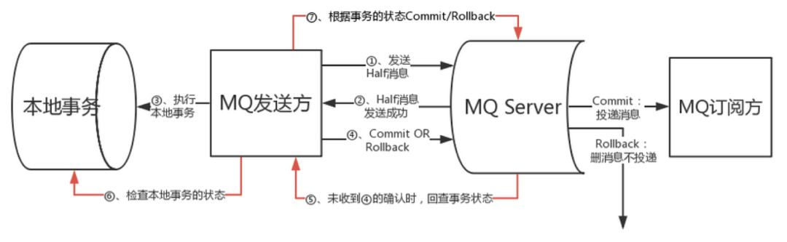
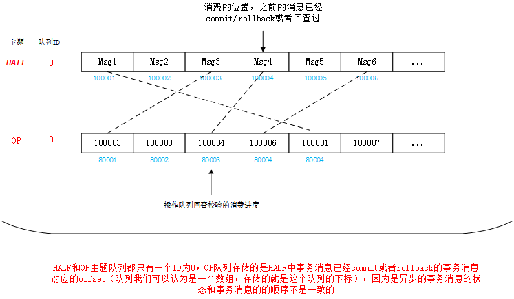

### RocketMQ事务

在微服务架构中，随着服务的逐步拆分，数据库私有已经成为共识，这也导致所面临的分布式事务问题成为微服务落地过程中一个非常难以逾越的障碍，但是目前尚没有一个完整通用的解决方案。为了保证分布式事务一致性目前业内成熟的解决方案有两段式提交协议（2PC）、三段式提交协议（3PC）、阿里提出的TCC等；RocketMQ采用2PC(两段式协议)+补偿机制（事务回查）。RocketMQ在4.3.0版本中开始支持事务。

# 1、概述

RocketMQ 事务消息设计则主要是为了解决 Producer 端的消息发送与本地事务执行的原子性问题，RocketMQ 的设计中 broker 与  producer 端的双向通信能力，使得 broker 天生可以作为一个事务协调者存在；而 RocketMQ  本身提供的存储机制，则为事务消息提供了持久化能力；RocketMQ  的高可用机制以及可靠消息设计，则为事务消息在系统在发生异常时，依然能够保证事务的最终一致性达成。

# 2、代码实现

## 2.1、producer

```java
public class TransactionProducer {
    public static void main(String[] args) throws MQClientException, InterruptedException {
      	//事务监听器
        TransactionListener transactionListener = new TransactionListenerImpl();
      //生产者
        TransactionMQProducer producer = new TransactionMQProducer("please_rename_unique_group_name");
      //线程池
        ExecutorService executorService = new ThreadPoolExecutor(2, 5, 100, TimeUnit.SECONDS, new                                                                  ArrayBlockingQueue<Runnable>(2000), new ThreadFactory() {
            @Override
            public Thread newThread(Runnable r) {
                Thread thread = new Thread(r);
                thread.setName("client-transaction-msg-check-thread");
                return thread;
            }
        });
        producer.setNamesrvAddr("10.10.15.246:9876;10.10.15.247:9876");
        producer.setExecutorService(executorService);
 //设置监听器用来回查本地事物状态       producer.setTransactionListener(transactionListener);
      //初始化监听器
        producer.start();

        String[] tags = new String[] {"TagA", "TagB", "TagC", "TagD", "TagE"};
        for (int i = 0; i < 10; i++) {
            try {
                Message msg =
                    new Message("TranTest", tags[i % tags.length], "KEY" + i,
                        ("Hello RocketMQ " + i).getBytes(RemotingHelper.DEFAULT_CHARSET));
              //发送消息
                SendResult sendResult = producer.sendMessageInTransaction(msg, null);
                System.out.printf("%s%n", sendResult);

                Thread.sleep(10);
            } catch (MQClientException | UnsupportedEncodingException e) {
                e.printStackTrace();
            }
        }

        for (int i = 0; i < 100000; i++) {
            Thread.sleep(1000);
        }
        producer.shutdown();
    }
}
```

```java
public class TransactionListenerImpl implements TransactionListener {
    private AtomicInteger transactionIndex = new AtomicInteger(0);

    private ConcurrentHashMap<String, Integer> localTrans = new ConcurrentHashMap<>();
		//执行本地业务，设置本地事务状态
    public LocalTransactionState executeLocalTransaction(Message msg, Object arg) {
        int value = transactionIndex.getAndIncrement();
        int status = value % 3;
        localTrans.put(msg.getTransactionId(), status);
        return LocalTransactionState.UNKNOW;
    }
		//回查事务
    public LocalTransactionState checkLocalTransaction(MessageExt msg) {
        Integer status = localTrans.get(msg.getTransactionId());
        if (null != status) {
            switch (status) {
                case 0:
                    return LocalTransactionState.UNKNOW;
                case 1:
                    return LocalTransactionState.COMMIT_MESSAGE;
                case 2:
                    return LocalTransactionState.ROLLBACK_MESSAGE;
            }
        }
        return LocalTransactionState.COMMIT_MESSAGE;
    }
}
```

## 2.2、consumer

```java
public class TransactionConsumer {
	public static void main(String[] args){
		try {
			DefaultMQPushConsumer consumer = new DefaultMQPushConsumer();
			consumer.setConsumerGroup("consumer_test_clustering");
			consumer.setNamesrvAddr("10.10.15.246:9876;10.10.15.247:9876");
			consumer.subscribe("TranTest", "*");
			consumer.registerMessageListener(new MessageListenerConcurrently(){
				@Override
				public ConsumeConcurrentlyStatus consumeMessage(List<MessageExt> paramList,
						ConsumeConcurrentlyContext paramConsumeConcurrentlyContext) {
					try {
					    for(MessageExt msg : paramList){
					    	String msgbody = new String(msg.getBody(), "utf-8");
					    	System.out.println("Consumer===  MessageBody: "+ msgbody);//输出消息内容
					    }
					} catch (Exception e) {
					    e.printStackTrace();
					    return ConsumeConcurrentlyStatus.RECONSUME_LATER; //稍后再试
					}
					return ConsumeConcurrentlyStatus.CONSUME_SUCCESS; //消费成功
				}
			});
			consumer.start();
			System.out.println("Consumer===启动成功!");
		} catch (Exception e) {
			// TODO Auto-generated catch block
			e.printStackTrace();
		}
	}
}
```

# 3、内部机制

事务消息作为一种异步确保型事务，  将两个事务分支通过 MQ 进行异步解耦，RocketMQ 事务消息的设计流程同样借鉴了两阶段提交理论，整体交互流程如下图所示：



1. 事务发起方首先发送 prepare 消息到 MQ。
2. 在发送 prepare 消息成功后执行本地事务。
3. 根据本地事务执行结果返回 commit 或者是 rollback。
4. 如果消息是 rollback，MQ 将删除该 prepare 消息不进行下发，如果是 commit 消息，MQ 将会把这个消息发送给 consumer 端。
5. 如果执行本地事务过程中，执行端挂掉，或者超时，MQ 将会不停的询问其同组的其他 producer 来获取状态。
6. Consumer 端的消费成功机制有 MQ 保证。

# 4、源码分析

## 4.1、事务消息发送

#### 1、TransactionMQProducer事务消息生产者

首先分析下**TransactionMQProducer**和普通的生产者的区别

```java
public class TransactionMQProducer extends DefaultMQProducer {
    private int checkThreadPoolMinSize = 1;//核心线程池大小
    private int checkThreadPoolMaxSize = 1;//最大线程数
    private int checkRequestHoldMax = 2000;//线程等待队列
	//事务状态回查异步执行线程池
    private ExecutorService executorService;
	//事务监听器，实现本地事务状态执行结果、本地事务状态回查
    private TransactionListener transactionListener;

    public TransactionMQProducer() {
    }

    public TransactionMQProducer(final String producerGroup) {
        this(null, producerGroup, null);
    }

    public TransactionMQProducer(final String namespace, final String producerGroup, RPCHook rpcHook) {
        super(namespace, producerGroup, rpcHook);
    }

    @Override
    public void start() throws MQClientException {
        //启动时，比普通消息多了个初始化事务环境的方法
        this.defaultMQProducerImpl.initTransactionEnv();
        super.start();
    }

    @Override
    public void shutdown() {
        super.shutdown();
        //关闭时，同样需要关闭事务环境
        this.defaultMQProducerImpl.destroyTransactionEnv();
    }

    @Overrideu
    public TransactionSendResult sendMessageInTransaction(final Message msg,
        final Object arg) throws MQClientException {
        //发送事务消息必须要实现事务监听接口额用于查询本地事务状态和事务回查
        if (null == this.transactionListener) {
            throw new MQClientException("TransactionListener is null", null);
        }
        return this.defaultMQProducerImpl.sendMessageInTransaction(msg, null, arg);
    }
}
```

##### 1.1、ExecutorService事务回查线程池

事务状态回查异步执行线程池,没有初始化线程池的方法，我们发现启动的时候有个初始化事务环境的方法，initTransactionEnv()

```java
public void initTransactionEnv() {
    TransactionMQProducer producer = (TransactionMQProducer) this.defaultMQProducer;
	if (producer.getExecutorService() != null) {
		this.checkExecutor = producer.getExecutorService();
	} else {
		this.checkRequestQueue = new LinkedBlockingQueue<Runnable>(producer.getCheckRequestHoldMax());
		this.checkExecutor = new ThreadPoolExecutor(
			producer.getCheckThreadPoolMinSize(),
			producer.getCheckThreadPoolMaxSize(),
			1000 * 60,
			TimeUnit.MILLISECONDS,
			this.checkRequestQueue);
	}
}
```

可以自己设置线程池的一些参数，不设置则默认设置线程池的线程数是“**1**”，线程最大空闲时间60秒，线程等待队列2000。

##### 1.2、TransactionListener事务监听器

```java
public interface TransactionListener {

    LocalTransactionState executeLocalTransaction(final Message msg, final Object arg);

    LocalTransactionState checkLocalTransaction(final MessageExt msg);
}
```

**executeLocalTransaction**:执行本地事务，我们自己的业务逻辑代码

**checkLocalTransaction**：事务消息状态回查

#### 2、事务消息发送

```Java
public TransactionSendResult sendMessageInTransaction(final Message msg,
                                                          final LocalTransactionExecuter localTransactionExecuter, final Object arg)
        throws MQClientException {
        TransactionListener transactionListener = getCheckListener();
        if (null == localTransactionExecuter && null == transactionListener) {
            throw new MQClientException("tranExecutor is null", null);
        }
        Validators.checkMessage(msg, this.defaultMQProducer);

        SendResult sendResult = null;
        //添加消息的事务属性TRAN_MSG=true，prepare消息
        MessageAccessor.putProperty(msg, MessageConst.PROPERTY_TRANSACTION_PREPARED, "true");
        //添加消息的事务属性PGROUP为生产者组名
        MessageAccessor.putProperty(msg, MessageConst.PROPERTY_PRODUCER_GROUP, this.defaultMQProducer.getProducerGroup());
        try {
        	//发送消息的核心代码
            sendResult = this.send(msg);
        } catch (Exception e) {
            throw new MQClientException("send message Exception", e);
        }

        LocalTransactionState localTransactionState = LocalTransactionState.UNKNOW;
        Throwable localException = null;
        switch (sendResult.getSendStatus()) {
            case SEND_OK: {
                try {
                    if (sendResult.getTransactionId() != null) {
                    	//设置消息的属性__transactionId__
                        msg.putUserProperty("__transactionId__", sendResult.getTransactionId());
                    }
                    String transactionId = msg.getProperty(MessageConst.PROPERTY_UNIQ_CLIENT_MESSAGE_ID_KEYIDX);
                    if (null != transactionId && !"".equals(transactionId)) {
                        msg.setTransactionId(transactionId);
                    }
                    if (null != localTransactionExecuter) {
                        localTransactionState = localTransactionExecuter.executeLocalTransactionBranch(msg, arg);
                    } else if (transactionListener != null) {
                        log.debug("Used new transaction API");
                        //执行本地的事务获取本地事务状态
                        localTransactionState = transactionListener.executeLocalTransaction(msg, arg);
                    }
                    if (null == localTransactionState) {
                        localTransactionState = LocalTransactionState.UNKNOW;
                    }
                    //
                    if (localTransactionState != LocalTransactionState.COMMIT_MESSAGE) {
                        log.info("executeLocalTransactionBranch return {}", localTransactionState);
                        log.info(msg.toString());
                    }
                } catch (Throwable e) {
                    log.info("executeLocalTransactionBranch exception", e);
                    log.info(msg.toString());
                    localException = e;
                }
            }
            break;
            case FLUSH_DISK_TIMEOUT:
            case FLUSH_SLAVE_TIMEOUT:
            case SLAVE_NOT_AVAILABLE:
                localTransactionState = LocalTransactionState.ROLLBACK_MESSAGE;
                break;
            default:
                break;
        }

        try {
        	//发送给Broker事务消息的状态
            this.endTransaction(sendResult, localTransactionState, localException);
        } catch (Exception e) {
            log.warn("local transaction execute " + localTransactionState + ", but end broker transaction failed", e);
        }
        
        TransactionSendResult transactionSendResult = new TransactionSendResult();
        transactionSendResult.setSendStatus(sendResult.getSendStatus());
        transactionSendResult.setMessageQueue(sendResult.getMessageQueue());
        transactionSendResult.setMsgId(sendResult.getMsgId());
        transactionSendResult.setQueueOffset(sendResult.getQueueOffset());
        transactionSendResult.setTransactionId(sendResult.getTransactionId());
        transactionSendResult.setLocalTransactionState(localTransactionState);
        return transactionSendResult;
    }
```

##### 2.1、消息的发送核心方法DefaultMQProducerImpl.sendKernelImpl

方法太长我们摘出关于事务的设置代码进行分析

```java
final String tranMsg = msg.getProperty(MessageConst.PROPERTY_TRANSACTION_PREPARED);
if (tranMsg != null && Boolean.parseBoolean(tranMsg)) {
	sysFlag |= MessageSysFlag.TRANSACTION_PREPARED_TYPE;
}
```

获取消息的属性TRAN_MSG，我们前面设置过该属性。标记消息为TRANSACTION_PREPARED_TYPE

```java
SendMessageRequestHeader requestHeader = new SendMessageRequestHeader();
requestHeader.setProducerGroup(this.defaultMQProducer.getProducerGroup());
requestHeader.setTopic(msg.getTopic());
requestHeader.setDefaultTopic(this.defaultMQProducer.getCreateTopicKey());
requestHeader.setDefaultTopicQueueNums(this.defaultMQProducer.getDefaultTopicQueueNums());
requestHeader.setQueueId(mq.getQueueId());
requestHeader.setSysFlag(sysFlag);
requestHeader.setProperties(MessageDecoder.messageProperties2String(msg.getProperties()));
```

发送给broker消息的请求头中设置SysFlag属性TRANSACTION_PREPARED_TYPE，请求头设置Properties为消息的属性

##### 2.2、Broker接收消息

```java
private RemotingCommand sendMessage(final ChannelHandlerContext ctx,
									final RemotingCommand request,
									final SendMessageContext sendMessageContext,
									final SendMessageRequestHeader requestHeader) throws RemotingCommandException {

	省略其他代码... 
  //获取请求头中的消息属性，获取TRAN_MSG，并判断其是否为事务消息，根据标记分别走事务存储逻辑和普通消息的逻辑
	Map<String, String> oriProps = MessageDecoder.string2messageProperties(requestHeader.getProperties());
	String traFlag = oriProps.get(MessageConst.PROPERTY_TRANSACTION_PREPARED);
	if (traFlag != null && Boolean.parseBoolean(traFlag)) {
		if (this.brokerController.getBrokerConfig().isRejectTransactionMessage()) {
			response.setCode(ResponseCode.NO_PERMISSION);
			response.setRemark(
				"the broker[" + this.brokerController.getBrokerConfig().getBrokerIP1()
					+ "] sending transaction message is forbidden");
			return response;
		}
    //事务消息存储的核心方法prepareMessage
		putMessageResult = this.brokerController.getTransactionalMessageService().prepareMessage(msgInner);
	} else {
		putMessageResult = this.brokerController.getMessageStore().putMessage(msgInner);
	}
	return handlePutMessageResult(putMessageResult, response, request, msgInner, responseHeader, sendMessageContext, ctx, queueIdInt);
}
```

##### 2.3、Broker存储prepare消息前的处理

TransactionalMessageServiceImpl.prepareMessage()；调用TransactionalMessageBridge.putHalfMessage()

```java
public PutMessageResult putHalfMessage(MessageExtBrokerInner messageInner) {
	return store.putMessage(parseHalfMessageInner(messageInner));
}

private MessageExtBrokerInner parseHalfMessageInner(MessageExtBrokerInner msgInner) {
	//存储原消息主题在属性中
	MessageAccessor.putProperty(msgInner, MessageConst.PROPERTY_REAL_TOPIC, msgInner.getTopic());
	//存储原消息队列的ID在属性中
	MessageAccessor.putProperty(msgInner, MessageConst.PROPERTY_REAL_QUEUE_ID,
		String.valueOf(msgInner.getQueueId()));
	msgInner.setSysFlag(
		MessageSysFlag.resetTransactionValue(msgInner.getSysFlag(), MessageSysFlag.TRANSACTION_NOT_TYPE));
	//设置Topic=RMQ_SYS_TRANS_HALF_TOPIC
	msgInner.setTopic(TransactionalMessageUtil.buildHalfTopic());
	//设置队列的ID=0
	msgInner.setQueueId(0);
	msgInner.setPropertiesString(MessageDecoder.messageProperties2String(msgInner.getProperties()));
	return msgInner;
}
```

#### 3、获取发送的结果，执行最终的事务方法

DefaultMQProducerImpl.endTransaction()发送给broker最终的事务方法，封装请求参数。

```java
public void endTransaction(
	final SendResult sendResult,
	final LocalTransactionState localTransactionState,
	final Throwable localException) throws RemotingException, MQBrokerException, InterruptedException, UnknownHostException {
	final MessageId id;
	if (sendResult.getOffsetMsgId() != null) {
		id = MessageDecoder.decodeMessageId(sendResult.getOffsetMsgId());
	} else {
		id = MessageDecoder.decodeMessageId(sendResult.getMsgId());
	}
	String transactionId = sendResult.getTransactionId();
	final String brokerAddr = this.mQClientFactory.findBrokerAddressInPublish(sendResult.getMessageQueue().getBrokerName());
	EndTransactionRequestHeader requestHeader = new EndTransactionRequestHeader();
	requestHeader.setTransactionId(transactionId);
	requestHeader.setCommitLogOffset(id.getOffset());
	switch (localTransactionState) {
		case COMMIT_MESSAGE:
			requestHeader.setCommitOrRollback(MessageSysFlag.TRANSACTION_COMMIT_TYPE);
			break;
		case ROLLBACK_MESSAGE:
			requestHeader.setCommitOrRollback(MessageSysFlag.TRANSACTION_ROLLBACK_TYPE);
			break;
		case UNKNOW:
			requestHeader.setCommitOrRollback(MessageSysFlag.TRANSACTION_NOT_TYPE);
			break;
		default:
			break;
	}

requestHeader.setProducerGroup(this.defaultMQProducer.getProducerGroup());
	requestHeader.setTranStateTableOffset(sendResult.getQueueOffset());
	requestHeader.setMsgId(sendResult.getMsgId());
	String remark = localException != null ? ("executeLocalTransactionBranch exception: " + localException.toString()) : null;
	this.mQClientFactory.getMQClientAPIImpl().endTransactionOneway(brokerAddr, requestHeader, remark,
		this.defaultMQProducer.getSendMsgTimeout());
}
```

我们发现localTransactionState状态封装到requestHeader.setCommitOrRollback()中

localTransactionState和MessageSysFlag对应关系

- LocalTransactionState.COMMIT_MESSAGE  ==  MessageSysFlag.TRANSACTION_COMMIT_TYPE
- LocalTransactionState.ROLLBACK_MESSAGE == MessageSysFlag.TRANSACTION_ROLLBACK_TYPE
- LocalTransactionState.UNKNOW ==

##### 3.1、Broker处理最终的事务方法

EndTransactionProcessor.processRequest()处理方法分析

```java
public RemotingCommand processRequest(ChannelHandlerContext ctx, RemotingCommand request) throws RemotingCommandException {
	
	省略其他代码...
   //事务消息是提交的类型的业务处理， COMMIT_MESSAGE == TRANSACTION_COMMIT_TYPE
	if (MessageSysFlag.TRANSACTION_COMMIT_TYPE == requestHeader.getCommitOrRollback()) {
		result = this.brokerController.getTransactionalMessageService().commitMessage(requestHeader);
		if (result.getResponseCode() == ResponseCode.SUCCESS) {
			RemotingCommand res = checkPrepareMessage(result.getPrepareMessage(), requestHeader);
			if (res.getCode() == ResponseCode.SUCCESS) {
				MessageExtBrokerInner msgInner = endMessageTransaction(result.getPrepareMessage());
				msgInner.setSysFlag(MessageSysFlag.resetTransactionValue(msgInner.getSysFlag(), requestHeader.getCommitOrRollback()));
				msgInner.setQueueOffset(requestHeader.getTranStateTableOffset());
				msgInner.setPreparedTransactionOffset(requestHeader.getCommitLogOffset());
				msgInner.setStoreTimestamp(result.getPrepareMessage().getStoreTimestamp());
				RemotingCommand sendResult = sendFinalMessage(msgInner);
				if (sendResult.getCode() == ResponseCode.SUCCESS) {
					this.brokerController.getTransactionalMessageService().deletePrepareMessage(result.getPrepareMessage());
				}
				return sendResult;
			}
			return res;
		}
    //事务回滚的业务处理，ROLLBACK_MESSAGE == TRANSACTION_ROLLBACK_TYPE
	} else if (MessageSysFlag.TRANSACTION_ROLLBACK_TYPE == requestHeader.getCommitOrRollback()) {
		result = this.brokerController.getTransactionalMessageService().rollbackMessage(requestHeader);
		if (result.getResponseCode() == ResponseCode.SUCCESS) {
			RemotingCommand res = checkPrepareMessage(result.getPrepareMessage(), requestHeader);
			if (res.getCode() == ResponseCode.SUCCESS) {
				this.brokerController.getTransactionalMessageService().deletePrepareMessage(result.getPrepareMessage());
			}
			return res;
		}
	}
	response.setCode(result.getResponseCode());
	response.setRemark(result.getResponseRemark());
	return response;
}
```

##### 3.2、提交事务处理流程

提交事务的核心代码分析

```java
//是消息的处理endMessageTransaction设置相关消息参数
MessageExtBrokerInner msgInner = endMessageTransaction(result.getPrepareMessage());
msgInner.setSysFlag(MessageSysFlag.resetTransactionValue(msgInner.getSysFlag(), requestHeader.getCommitOrRollback()));
msgInner.setQueueOffset(requestHeader.getTranStateTableOffset());
msgInner.setPreparedTransactionOffset(requestHeader.getCommitLogOffset());

msgInner.setStoreTimestamp(result.getPrepareMessage().getStoreTimestamp());
//sendFinalMessage发送最终的消息
RemotingCommand sendResult = sendFinalMessage(msgInner);
if (sendResult.getCode() == ResponseCode.SUCCESS) {
//deletePrepareMessage删除prepare消息	this.brokerController.getTransactionalMessageService().deletePrepareMessage(result.getPrepareMessage());
}
```

我们先分析**endMessageTransaction**组装消息数据

```java
private MessageExtBrokerInner endMessageTransaction(MessageExt msgExt) {
    MessageExtBrokerInner msgInner = new MessageExtBrokerInner();
    //设置消息的原来的主题从消息的属性中获取，在消息发送时设置的，前面分析过
    msgInner.setTopic(msgExt.getUserProperty(MessageConst.PROPERTY_REAL_TOPIC));
    //设置消息的原来的队列的ID从消息的属性中获取，在消息发送时设置的，前面分析过
    msgInner.setQueueId(Integer.parseInt(msgExt.getUserProperty(MessageConst.PROPERTY_REAL_QUEUE_ID)));
    msgInner.setBody(msgExt.getBody());
    msgInner.setFlag(msgExt.getFlag());
    msgInner.setBornTimestamp(msgExt.getBornTimestamp());
    msgInner.setBornHost(msgExt.getBornHost());
    msgInner.setStoreHost(msgExt.getStoreHost());
    msgInner.setReconsumeTimes(msgExt.getReconsumeTimes());
    msgInner.setWaitStoreMsgOK(false);
    msgInner.setTransactionId(msgExt.getUserProperty(MessageConst.PROPERTY_UNIQ_CLIENT_MESSAGE_ID_KEYIDX));
    msgInner.setSysFlag(msgExt.getSysFlag());
    TopicFilterType topicFilterType =
        (msgInner.getSysFlag() & MessageSysFlag.MULTI_TAGS_FLAG) == MessageSysFlag.MULTI_TAGS_FLAG ? TopicFilterType.MULTI_TAG
            : TopicFilterType.SINGLE_TAG;
    long tagsCodeValue = MessageExtBrokerInner.tagsString2tagsCode(topicFilterType, msgInner.getTags());
    msgInner.setTagsCode(tagsCodeValue);
    MessageAccessor.setProperties(msgInner, msgExt.getProperties());
    msgInner.setPropertiesString(MessageDecoder.messageProperties2String(msgExt.getProperties()));
    MessageAccessor.clearProperty(msgInner, MessageConst.PROPERTY_REAL_TOPIC);
    MessageAccessor.clearProperty(msgInner, MessageConst.PROPERTY_REAL_QUEUE_ID);
    return msgInner;
}
```

**deletePrepareMessage**删除prepare消息，调用TransactionalMessageBridge.putOpMessage的核心方法

```java
public boolean putOpMessage(MessageExt messageExt, String opType) {
    MessageQueue messageQueue = new MessageQueue(messageExt.getTopic(),
        this.brokerController.getBrokerConfig().getBrokerName(), messageExt.getQueueId());
    if (TransactionalMessageUtil.REMOVETAG.equals(opType)) {
        return addRemoveTagInTransactionOp(messageExt, messageQueue);
    }
    return true;
}
```

```java
private boolean addRemoveTagInTransactionOp(MessageExt messageExt, MessageQueue messageQueue) {
    //消息的topic=RMQ_SYS_TRANS_OP_HALF_TOPIC
	Message message = new Message(TransactionalMessageUtil.buildOpTopic(), TransactionalMessageUtil.REMOVETAG,
	String.valueOf(messageExt.getQueueOffset()).getBytes(TransactionalMessageUtil.charset));
  //我们发现删除prepre消息,并不是真正的删除，而是将prepre消息存储到RMQ_SYS_TRANS_OP_HALF_TOPIC主题中表示该事务消息以及处理了（包括提交和回滚），为未处理的事务消息的查询提供依据
	writeOp(message, messageQueue);
	return true;
}
```

## 4.2、事务定时回查

两段式协议发送与提交回滚消息，执行完本地事务消息的状态为UNKNOW时，结束事务不做任何操作。通过事务状态定时回查得到发送端的事务状态是rollback或commit。通过开启线程做消息的事务状态回查。

```java
public class TransactionalMessageCheckService extends ServiceThread {
    private BrokerController brokerController;
    public TransactionalMessageCheckService(BrokerController brokerController) {
        this.brokerController = brokerController;
    }

    @Override
    public String getServiceName() {
        return TransactionalMessageCheckService.class.getSimpleName();
    }

    @Override
    public void run() {
        // Start transaction check service thread!
        long checkInterval = brokerController.getBrokerConfig().getTransactionCheckInterval();
        while (!this.isStopped()) {
            this.waitForRunning(checkInterval);
        }
    }

    @Override
    protected void onWaitEnd() {
        long timeout = brokerController.getBrokerConfig().getTransactionTimeOut();
        int checkMax = brokerController.getBrokerConfig().getTransactionCheckMax();
        long begin = System.currentTimeMillis();
        this.brokerController.getTransactionalMessageService().check(timeout, checkMax, this.brokerController.getTransactionalMessageCheckListener());
    }
}
```

run()开启线程做消息状态的回查消息的事务默认60秒，可在broker配置文件中配置transactionCheckInterval单位毫秒，实际业务处理方法是调用onWaitEnd()。调用核心的方法TransactionalMessageServiceImpl.check()核心的事务回查机制方法。

```java
public void check(long transactionTimeout, int transactionCheckMax,
	AbstractTransactionalMessageCheckListener listener) {
	try {
		String topic = MixAll.RMQ_SYS_TRANS_HALF_TOPIC;
		Set<MessageQueue> msgQueues = transactionalMessageBridge.fetchMessageQueues(topic);
		if (msgQueues == null || msgQueues.size() == 0) {
			log.warn("The queue of topic is empty :" + topic);
			return;
		}
		log.debug("Check topic={}, queues={}", topic, msgQueues);
		//遍历每一个消息队列
		for (MessageQueue messageQueue : msgQueues) {
			long startTime = System.currentTimeMillis();
			//根据消息队列获取RMQ_SYS_TRANS_OP_HALF_TOPIC队列，即已经回滚或者commit的事务消息
			MessageQueue opQueue = getOpQueue(messageQueue);
			//获取RMQ_SYS_TRANS_HALF_TOPIC队列的当前进度
			long halfOffset = transactionalMessageBridge.fetchConsumeOffset(messageQueue);
			//获取RMQ_SYS_TRANS_OP_HALF_TOPIC队列的当前进度
			long opOffset = transactionalMessageBridge.fetchConsumeOffset(opQueue);
			log.info("Before check, the queue={} msgOffset={} opOffset={}", messageQueue, halfOffset, opOffset);
			if (halfOffset < 0 || opOffset < 0) {
				log.error("MessageQueue: {} illegal offset read: {}, op offset: {},skip this queue", messageQueue,
					halfOffset, opOffset);
				continue;
			}
			List<Long> doneOpOffset = new ArrayList<>();
			HashMap<Long, Long> removeMap = new HashMap<>();
			//找出将要校验是否需要回查额的记录中已经commit或者rollback的消息存入removeMap中
			PullResult pullResult = fillOpRemoveMap(removeMap, opQueue, opOffset, halfOffset, doneOpOffset);
			if (null == pullResult) {
				log.error("The queue={} check msgOffset={} with opOffset={} failed, pullResult is null",
					messageQueue, halfOffset, opOffset);
				continue;
			}
			// single thread
			int getMessageNullCount = 1;
			long newOffset = halfOffset;
			long i = halfOffset;
			while (true) {
				//处理时间60秒
				if (System.currentTimeMillis() - startTime > MAX_PROCESS_TIME_LIMIT) {
					log.info("Queue={} process time reach max={}", messageQueue, MAX_PROCESS_TIME_LIMIT);
					break;
				}
				//如果已经commit或者rollback，继续查找下一个
				if (removeMap.containsKey(i)) {
					log.info("Half offset {} has been committed/rolled back", i);
					removeMap.remove(i);
				} else {
					//获取当前的这条事务消息
					GetResult getResult = getHalfMsg(messageQueue, i);
					MessageExt msgExt = getResult.getMsg();
					if (msgExt == null) {
						if (getMessageNullCount++ > MAX_RETRY_COUNT_WHEN_HALF_NULL) {
							break;
						}
						if (getResult.getPullResult().getPullStatus() == PullStatus.NO_NEW_MSG) {
							log.debug("No new msg, the miss offset={} in={}, continue check={}, pull result={}", i,
								messageQueue, getMessageNullCount, getResult.getPullResult());
							break;
						} else {
							log.info("Illegal offset, the miss offset={} in={}, continue check={}, pull result={}",
								i, messageQueue, getMessageNullCount, getResult.getPullResult());
							i = getResult.getPullResult().getNextBeginOffset();
							newOffset = i;
							continue;
						}
					}
					//needDiscard()是否超过最大回查次数，每回查一次消息属性TRANSACTION_CHECK_TIMES增加1，默认最大的回查次数15
					//needSkip()判断当前的消息是否超过了，系统的文件过期时间默认72小时，可broker配置文件中配置
					if (needDiscard(msgExt, transactionCheckMax) || needSkip(msgExt)) {
						listener.resolveDiscardMsg(msgExt);
						newOffset = i + 1;
						i++;
						continue;
					}
					if (msgExt.getStoreTimestamp() >= startTime) {
						log.debug("Fresh stored. the miss offset={}, check it later, store={}", i,
							new Date(msgExt.getStoreTimestamp()));
						break;
					}
					//消息已存储的时间
					long valueOfCurrentMinusBorn = System.currentTimeMillis() - msgExt.getBornTimestamp();
					//检测事务状态的时间即开始回查的时间，事务提交后需要一段时间才能开启回查，默认是6秒
					long checkImmunityTime = transactionTimeout;
					//获取用户自定义的回查时间
					String checkImmunityTimeStr = msgExt.getUserProperty(MessageConst.PROPERTY_CHECK_IMMUNITY_TIME_IN_SECONDS);
					if (null != checkImmunityTimeStr) {
						checkImmunityTime = getImmunityTime(checkImmunityTimeStr, transactionTimeout);
						//事务消息的存储时间小于开启回查的间隔时间
						if (valueOfCurrentMinusBorn < checkImmunityTime) {
							if (checkPrepareQueueOffset(removeMap, doneOpOffset, msgExt)) {
								newOffset = i + 1;
								i++;
								continue;
							}
						}
					} else {
						if ((0 <= valueOfCurrentMinusBorn) && (valueOfCurrentMinusBorn < checkImmunityTime)) {
							log.debug("New arrived, the miss offset={}, check it later checkImmunity={}, born={}", i,
								checkImmunityTime, new Date(msgExt.getBornTimestamp()));
							break;
						}
					}
					List<MessageExt> opMsg = pullResult.getMsgFoundList();
					//判断回查条件是否满足
					boolean isNeedCheck = (opMsg == null && valueOfCurrentMinusBorn > checkImmunityTime)
						|| (opMsg != null && (opMsg.get(opMsg.size() - 1).getBornTimestamp() - startTime > transactionTimeout))
						|| (valueOfCurrentMinusBorn <= -1);

					if (isNeedCheck) {
						//满足条件需要从新存储一个新的事务消息
						if (!putBackHalfMsgQueue(msgExt, i)) {
							continue;
						}
						//异步发送回查消息，msgExt是最新的offset
						listener.resolveHalfMsg(msgExt);
					} else {
						//拉取更多的完成的事务消息
						pullResult = fillOpRemoveMap(removeMap, opQueue, pullResult.getNextBeginOffset(), halfOffset, doneOpOffset);
						log.info("The miss offset:{} in messageQueue:{} need to get more opMsg, result is:{}", i,
							messageQueue, pullResult);
						continue;
					}
				}
				//循环下一个
				newOffset = i + 1;
				i++;
			}
			//更新事务消息的消费进度
			if (newOffset != halfOffset) {
				transactionalMessageBridge.updateConsumeOffset(messageQueue, newOffset);
			}
			//计算最新的OP队列消费进度，更新进度
			long newOpOffset = calculateOpOffset(doneOpOffset, opOffset);
			if (newOpOffset != opOffset) {
				transactionalMessageBridge.updateConsumeOffset(opQueue, newOpOffset);
			}
		}
	} catch (Exception e) {
		e.printStackTrace();
		log.error("Check error", e);
	}
}
```

每个关键点都加入了注释，我们分析下里面的一个重要的方法fillOpRemoveMap()

```java
private PullResult fillOpRemoveMap(HashMap<Long, Long> removeMap,
	MessageQueue opQueue, long pullOffsetOfOp, long miniOffset, List<Long> doneOpOffset) {
	//拉取32条消息
	PullResult pullResult = pullOpMsg(opQueue, pullOffsetOfOp, 32);
	if (null == pullResult) {
		return null;
	}
	if (pullResult.getPullStatus() == PullStatus.OFFSET_ILLEGAL
		|| pullResult.getPullStatus() == PullStatus.NO_MATCHED_MSG) {
		log.warn("The miss op offset={} in queue={} is illegal, pullResult={}", pullOffsetOfOp, opQueue,
			pullResult);
		transactionalMessageBridge.updateConsumeOffset(opQueue, pullResult.getNextBeginOffset());
		return pullResult;
	} else if (pullResult.getPullStatus() == PullStatus.NO_NEW_MSG) {
		log.warn("The miss op offset={} in queue={} is NO_NEW_MSG, pullResult={}", pullOffsetOfOp, opQueue,
			pullResult);
		return pullResult;
	}
	List<MessageExt> opMsg = pullResult.getMsgFoundList();
	if (opMsg == null) {
		log.warn("The miss op offset={} in queue={} is empty, pullResult={}", pullOffsetOfOp, opQueue, pullResult);
		return pullResult;
	}
	for (MessageExt opMessageExt : opMsg) {
		//op队列中存储的内容是half队列事务消息已经commit和rollback的消息的offset
		Long queueOffset = getLong(new String(opMessageExt.getBody(), TransactionalMessageUtil.charset));
		log.info("Topic: {} tags: {}, OpOffset: {}, HalfOffset: {}", opMessageExt.getTopic(),
			opMessageExt.getTags(), opMessageExt.getQueueOffset(), queueOffset);
		if (TransactionalMessageUtil.REMOVETAG.equals(opMessageExt.getTags())) {
			if (queueOffset < miniOffset) {
				doneOpOffset.add(opMessageExt.getQueueOffset());
			} else {
				removeMap.put(queueOffset, opMessageExt.getQueueOffset());
			}
		} else {
			log.error("Found a illegal tag in opMessageExt= {} ", opMessageExt);
		}
	}
	log.debug("Remove map: {}", removeMap);
	log.debug("Done op list: {}", doneOpOffset);
	return pullResult;
}
```

我们画图分析其half队列和op队列的关系，以及如何查询需要回查的消息。



removeMap是个Map集合的键值对key是half队列的消息offset，value是op队列的消息offset，图中看有两对（100005，80002）、（100004，80003）

doneOpOffset是一个List集合，其中存储的是op队列的消息offset，图中只有8004

check()循环查找half队列中的消息时，100004已经在removeMap中了，跳过下面业务继续循环下一个100005进行下一个逻辑，判断其是否具有回查消息的条件isNeedCheck

# 5、总结

我们发现RocketMQ的事务消息我们只分析了消息的发送没有消费，RocketMQ的设计理念就是消费者**最少会消费一次**，多于一次由于网络延迟等原因导致会重新发送，我们只需要保证消息放入MQ中，消息就一定会被消费，保证生产端的事务消息的一致性。