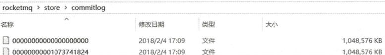
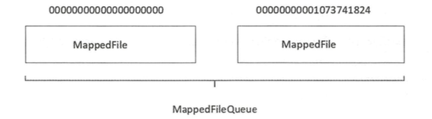

# RocketMQ内存映射

RocketMQ通过使用内存映射文件来提高IO访问性能，无论是CommitLog、  ConsumeQueue还是IndexFile，单个文件都被设计为固定长度，如果一个文件写满以后再创建一个新文件，文件名就为该文件第一条消息对应的全局物理偏移量。例如CommitLog的文件组织方式如下图所示。


RocketMQ使用 MappedFile、 MappedFileQueue来封装存储文件。 



### MappedFileQueue

MappedFileQueue是MappedFile的管理容器，MappedFileQueue是对存储目录的封装。MappedFileQueue类的核心属性如下：

```java
private final String storePath; // 存储目录
private final int mappedFileSize; // 单个文件的存储大小
private final CopyOnWriteArrayList<MappedFile> mappedFiles = new CopyOnWriteArrayList<MappedFile>(); //MappedFile文件集合
private final AllocateMappedFileService allocateMappedFileService; // 创建MappedFile服务类
private long flushedWhere = 0; // 当前刷盘指针，表示该指针之前的所有数据全部持久化到磁盘
private long committedWhere = 0; // 当前数据提交指针，内存中ByteBuffer当前的写指针，该值大于等于flushedWhere
private volatile long storeTimestamp = 0; // 刷盘时间戳
```

### MappedFile

MappedFile是RocketMQ内存映射文件的具体实现，其核心属性如下：

```java
/ 操作系统每页大小，默认4k
public static final int OS_PAGE_SIZE = 1024 * 4;
// 当前JVM实例中MappedFile虚拟内存
private static final AtomicLong TOTAL_MAPPED_VIRTUAL_MEMORY = new AtomicLong(0);
// 当前JVM实例中MappedFile对象个数
private static final AtomicInteger TOTAL_MAPPED_FILES = new AtomicInteger(0);
// 当前该文件的写指针，从0开始(内存映射文件中的写指针)
protected final AtomicInteger wrotePosition = new AtomicInteger(0);
// 当前文件的提交指针，如果开启transientStorePoolEnable，则数据会存储在TransientStorePool中，然后提交到内存映射ByteBuffer中，再刷写到磁盘。
protected final AtomicInteger committedPosition = new AtomicInteger(0);
// 刷写到磁盘指针，该指针之前的数据持久化到磁盘中
private final AtomicInteger flushedPosition = new AtomicInteger(0);
// 文件大小
protected int fileSize;
// 文件通道
protected FileChannel fileChannel;
/**
 * Message will put to here first, and then reput to FileChannel if writeBuffer is not null.
 */
//堆外内存ByteBuffer，如果不为空，数据首先将存储在该Buffer中，然后提交到MappedFile对应的内存映射文件Buffer。transientStorePoolEnable为true时不为空。
protected ByteBuffer writeBuffer = null;
// 堆外内存池，transientStorePoolEnable为true时启用。
protected TransientStorePool transientStorePool = null;
// 文件名称
private String fileName;
// 该文件的初始偏移量
private long fileFromOffset;
// 物理文件
private File file;
// 物理文件对应的内存映射Buffer
private MappedByteBuffer mappedByteBuffer;
// 文件最后一次内容写入时间
private volatile long storeTimestamp = 0;
// 是否是MappedFileQueue队列中第一个文件
private boolean firstCreateInQueue = false;
```

在详细介绍RocketMQ的MappedFile之前，我们先插播一段关于MappedByteBuffer的介绍，它是RocketMQ实现内存映射的关键，也是Java官方给出的内存映射方案。

### MappedByteBuffer

在深入MappedByteBuffer之前，先看看计算机内存管理的几个术语：

- MMC：CPU的内存管理单元。
- 物理内存：即内存条的内存空间。
- 虚拟内存：计算机系统内存管理的一种技术。它使得应用程序认为它拥有连续的可用的内存（一个连续完整的地址空间），而实际上，它通常是被分隔成多个物理内存碎片，还有部分暂时存储在外部磁盘存储器上，在需要时进行数据交换。
- 页面文件：物理内存被占满后，将暂时不用的数据移动到硬盘上。
- 缺页中断：当程序试图访问已映射在虚拟地址空间中但未被加载至物理内存的一个分页时，由MMC发出的中断。如果操作系统判断此次访问是有效的，则尝试将相关的页从虚拟内存文件中载入物理内存。

如果正在运行的一个进程，它所需的内存是有可能大于内存条容量之和的，如内存条是256M，程序却要创建一个2G的数据区，那么所有数据不可能都加载到内存（物理内存），必然有数据要放到其他介质中（比如硬盘），待进程需要访问那部分数据时，再调度进入物理内存。

假设你的计算机是32位，那么它的地址总线是32位的，也就是它可以寻址0xFFFFFFFF（4G）的地址空间，但如果你的计算机只有256M的物理内存0x0FFFFFFF（256M），同时你的进程产生了一个不在这256M地址空间中的地址，那么计算机该如何处理呢？

计算机会对虚拟内存地址空间（32位为4G）进行分页，从而产生页（page），对物理内存地址空间（假设256M）进行分页产生页帧（page frame），页和页帧的大小一样，所以虚拟内存页的个数势必要大于物理内存页帧的个数。在计算机上有一个页表（page  table），就是映射虚拟内存页到物理内存页的，更确切的说是页号到页帧号的映射，而且是一对一的映射。

那么问题来了，虚拟内存页的个数 >  物理内存页帧的个数，岂不是有些虚拟内存页的地址永远没有对应的物理内存地址空间？不是的，操作系统是这样处理的：如果要用的页没有找到，操作系统会触发一个页面失效（page  fault）功能，操作系统找到一个最少使用的页帧，使之失效，并把它写入磁盘，随后把需要访问的页放到页帧中，并修改页表中的映射，保证了所有的页都会被调度。

FileChannel提供了map方法把文件映射到虚拟内存：

```java
// 只保留了核心代码
public MappedByteBuffer map(MapMode mode, long position, long size)  throws IOException {
    // allocationGranularity一般等于64K，它是虚拟内存的分配粒度，由操作系统指定
    // 这里将position与分配粒度取余，然后真实映射起始位置为mapPosition = position-pagePosition，pagePosition是根据内存分配粒度取余的结果，position - pagePosition这样算是为了内存对齐
    // 这样无论position为多少，得出的各个MappedByteBuffer实例之间的内存都是成块对齐的
    // 对齐的好处：如果两个不同的MappedByteBuffer，即便它们的position不同，但是只要它们有公共映射区域的话，这些公共区域在物理内存上的分页会被共享
    // 如果它们的MapMode是PRIVATE的话，那么会copy-on-write的方式来对修改内容进行私有化
    // 而如果它们的MapMode是SHARED的话，那么对映射的修改，其他实例均可见
    // 实际上，上述的过程都是内核来做的，我们要做的只是调用map0时将对齐好的position输入即可，这实际上是map0下层使用的mmap系统调用的约束
    
  //计算余数
  int pagePosition = (int)(position % allocationGranularity);
  	//计算起始地址，整数，用来对齐
    long mapPosition = position - pagePosition;
    long mapSize = size + pagePosition;
    try {
      	//指定文件应被映射到进程空间的起始地址
        addr = map0(imode, mapPosition, mapSize);
    } catch (OutOfMemoryError x) {
      	//内存溢出，进行gc
        System.gc();
        try {
            Thread.sleep(100);
        } catch (InterruptedException y) {
            Thread.currentThread().interrupt();
        }
        try {
          	//重新映射
            addr = map0(imode, mapPosition, mapSize);
        } catch (OutOfMemoryError y) {
            // After a second OOME, fail
            throw new IOException("Map failed", y);
        }
    }
    int isize = (int)size;
    Unmapper um = new Unmapper(addr, mapSize, isize, mfd);
    if ((!writable) || (imode == MAP_RO)) {
        return Util.newMappedByteBufferR(isize,
                                         addr + pagePosition,
                                         mfd,
                                         um);
    } else {
        return Util.newMappedByteBuffer(isize,
                                        addr + pagePosition,
                                        mfd,
                                        um);
    }
}
```

上述代码可以看出：

1. map通过native函数map0完成文件的映射工作，下层使用系统调用mmap
2. 如果第一次文件映射导致OOM，则手动触发垃圾回收，休眠100ms后再次尝试映射，如果失败，则抛出异常。
3. 如果映射成功，会得到虚拟内存地址address
4. 根据得到的虚拟内存地址，通过newMappedByteBuffer方法初始化MappedByteBuffer实例，其最终返回的是DirectByteBuffer，如下就是从内存地址生成DirectByteBuffer实例的过程

```java
static MappedByteBuffer newMappedByteBuffer(int size, long addr, FileDescriptor fd, Runnable unmapper) {
    MappedByteBuffer dbb;
    if (directByteBufferConstructor == null)
        initDBBConstructor();
    dbb = (MappedByteBuffer)directByteBufferConstructor.newInstance(
          new Object[] { new Integer(size),
                         new Long(addr),
                         fd,
                         unmapper }
    return dbb;
}
// 访问权限
private static void initDBBConstructor() {
    AccessController.doPrivileged(new PrivilegedAction<Void>() {
        public Void run() {
            Class<?> cl = Class.forName("java.nio.DirectByteBuffer");
                Constructor<?> ctor = cl.getDeclaredConstructor(
                    new Class<?>[] { int.class,
                                     long.class,
                                     FileDescriptor.class,
                                     Runnable.class });
                ctor.setAccessible(true);
                directByteBufferConstructor = ctor;
        }});
}
```

由于FileChannelImpl和DirectByteBuffer不在同一个包中，所以有权限访问问题，通过AccessController类获取DirectByteBuffer的构造器进行实例化。

map0()函数返回一个虚拟内存地址address，这样就无需调用read或write方法对文件进行读写，通过address就能够操作文件。底层采用unsafe.getByte方法，通过（address + 偏移量）获取指定内存的数据。

- 第一次访问address所指向的内存区域，导致缺页中断，中断响应函数会在交换区中查找相对应的页面，如果找不到（也就是该文件从来没有被读入内存的情况），则从硬盘上将文件指定页读取到物理内存中（非jvm堆内存）。
- 如果在拷贝数据时，发现物理内存不够用，则会通过虚拟内存机制（swap）将暂时不用的物理页面交换到硬盘的虚拟内存中。

MappedByteBuffer的效率之所以比read/write高，主要是因为read/write过程会涉及到用户内存拷贝到内核缓冲区，而MappedByteBuffer在发生缺页中断时，也是直接将硬盘内容拷贝到了内核，但是缺少内核到用户空间这一步骤，这也就是我们所说的零拷贝技术。所以，采用内存映射的读写效率要比传统的read/write性能高。

MappedByteBuffer使用虚拟内存，因此分配(map)的内存大小不受JVM的-Xmx参数限制，但是也是有大小限制的。如果当文件超出大小限制Integer.MAX_VALUE时，可以通过position参数重新map文件后面的内容。

至此，我们已经了解了文件内存映射的技术，既然Java已经提供了内存映射的方案，还有MappedFile什么事呢？这一层封装又有何意义呢？接下来再回到MappedFile的介绍中来，我将详细介绍RocketMQ的MappedFile都对原生内存映射方案做了哪些增强。

### 消息存储

```java
public PutMessageResult putMessage(final MessageExtBrokerInner msg) {
    //设置消息存储到文件中的时间
    msg.setStoreTimestamp(System.currentTimeMillis());
    //设置消息的校验码CRC
    msg.setBodyCRC(UtilAll.crc32(msg.getBody()));
    AppendMessageResult result = null;
    StoreStatsService storeStatsService = this.defaultMessageStore.getStoreStatsService();
 
    String topic = msg.getTopic();
    int queueId = msg.getQueueId();
 
    final int tranType = MessageSysFlag.getTransactionValue(msg.getSysFlag());
    if (tranType == MessageSysFlag.TRANSACTION_NOT_TYPE
        || tranType == MessageSysFlag.TRANSACTION_COMMIT_TYPE) {
        // Delay Delivery消息的延迟级别是否大于0
        if (msg.getDelayTimeLevel() > 0) {
        	//如果消息的延迟级别大于最大的延迟级别则置为最大延迟级别
            if (msg.getDelayTimeLevel() > this.defaultMessageStore.getScheduleMessageService().getMaxDelayLevel()) {
                msg.setDelayTimeLevel(this.defaultMessageStore.getScheduleMessageService().getMaxDelayLevel());
            }
            //将消息主题设置为SCHEDULE_TOPIC_XXXX
            topic = ScheduleMessageService.SCHEDULE_TOPIC;
            //将消息队列设置为延迟的消息队列的ID
            queueId = ScheduleMessageService.delayLevel2QueueId(msg.getDelayTimeLevel());
            //消息的原有的主题和消息队列存入属性中
            MessageAccessor.putProperty(msg, MessageConst.PROPERTY_REAL_TOPIC, msg.getTopic());
            MessageAccessor.putProperty(msg, MessageConst.PROPERTY_REAL_QUEUE_ID, String.valueOf(msg.getQueueId()));
            msg.setPropertiesString(MessageDecoder.messageProperties2String(msg.getProperties()));
            msg.setTopic(topic);
            msg.setQueueId(queueId);
        }
    }
 
    long eclipseTimeInLock = 0;
    MappedFile unlockMappedFile = null;
    //获取最后一个消息的映射文件，mappedFileQueue可看作是CommitLog文件夹下的一个个文件的映射
    MappedFile mappedFile = this.mappedFileQueue.getLastMappedFile();
 
    //写入消息之前先申请putMessageLock，也就是保证消息写入CommitLog文件中串行的
    putMessageLock.lock(); //spin or ReentrantLock ,depending on store config
    try {
        long beginLockTimestamp = this.defaultMessageStore.getSystemClock().now();
        this.beginTimeInLock = beginLockTimestamp;
 
        //设置消息的存储时间
        msg.setStoreTimestamp(beginLockTimestamp);
        //mappedFile==null标识CommitLog文件还未创建，第一次存消息则创建CommitLog文件
        //mappedFile.isFull()表示mappedFile文件已满，需要重新创建CommitLog文件
        if (null == mappedFile || mappedFile.isFull()) {
        	//里面的参数0代表偏移量
            mappedFile = this.mappedFileQueue.getLastMappedFile(0); // Mark: NewFile may be cause noise
        }
        //mappedFile==null说明创建CommitLog文件失败抛出异常，创建失败可能是磁盘空间不足或者权限不够
        if (null == mappedFile) {
            log.error("create mapped file1 error, topic: " + msg.getTopic() + " clientAddr: " + msg.getBornHostString());
            beginTimeInLock = 0;
            return new PutMessageResult(PutMessageStatus.CREATE_MAPEDFILE_FAILED, null);
        }
        //mappedFile文件后面追加消息
        result = mappedFile.appendMessage(msg, this.appendMessageCallback);
        switch (result.getStatus()) {
            case PUT_OK:
                break;
            case END_OF_FILE:
                unlockMappedFile = mappedFile;
                // Create a new file, re-write the message
                mappedFile = this.mappedFileQueue.getLastMappedFile(0);
                if (null == mappedFile) {
                    // XXX: warn and notify me
                    log.error("create mapped file2 error, topic: " + msg.getTopic() + " clientAddr: " + msg.getBornHostString());
                    beginTimeInLock = 0;
                    return new PutMessageResult(PutMessageStatus.CREATE_MAPEDFILE_FAILED, result);
                }
                result = mappedFile.appendMessage(msg, this.appendMessageCallback);
                break;
            case MESSAGE_SIZE_EXCEEDED:
            case PROPERTIES_SIZE_EXCEEDED:
                beginTimeInLock = 0;
                return new PutMessageResult(PutMessageStatus.MESSAGE_ILLEGAL, result);
            case UNKNOWN_ERROR:
                beginTimeInLock = 0;
                return new PutMessageResult(PutMessageStatus.UNKNOWN_ERROR, result);
            default:
                beginTimeInLock = 0;
                return new PutMessageResult(PutMessageStatus.UNKNOWN_ERROR, result);
        }
 
        eclipseTimeInLock = this.defaultMessageStore.getSystemClock().now() - beginLockTimestamp;
        beginTimeInLock = 0;
    } finally {
    	//释放锁
        putMessageLock.unlock();
    }
 
    if (eclipseTimeInLock > 500) {
        log.warn("[NOTIFYME]putMessage in lock cost time(ms)={}, bodyLength={} AppendMessageResult={}", eclipseTimeInLock, msg.getBody().length, result);
    }
 
    if (null != unlockMappedFile && this.defaultMessageStore.getMessageStoreConfig().isWarmMapedFileEnable()) {
        this.defaultMessageStore.unlockMappedFile(unlockMappedFile);
    }
 
    PutMessageResult putMessageResult = new PutMessageResult(PutMessageStatus.PUT_OK, result);
 
    // Statistics
    storeStatsService.getSinglePutMessageTopicTimesTotal(msg.getTopic()).incrementAndGet();
    storeStatsService.getSinglePutMessageTopicSizeTotal(topic).addAndGet(result.getWroteBytes());
    //消息刷盘
    handleDiskFlush(result, putMessageResult, msg);
    //主从数据同步复制
    handleHA(result, putMessageResult, msg);
    return putMessageResult;
}
```

# 2、获取映射文件MappedFile

## 2.1、MappedFile和Commitlog的关系

每个MappedFile对象对于一个Commitlog文件，我们分析下这个对应关系的业务操作发生在什么时候，我们分析下[源码](https://so.csdn.net/so/search?q=源码&spm=1001.2101.3001.7020)。

Broker服务启动时会创建BrokerController对象并对其初始化initialize()该方法调用DefaultMessageStore.load()方法加载Commitlog文件和消费队列文。

```java
public boolean load() {
    //省略代码...
    // 加载Commitlog文件
    result = result && this.commitLog.load();
    // 加载消费队列文件
    result = result && this.loadConsumeQueue();
    //省略代码...
}
```

我们分析下commitLog.load()调用mappedFileQueue.load()

```java
public boolean load() {
	//消息存储路径
    File dir = new File(this.storePath);
    File[] files = dir.listFiles();
    if (files != null) {
        // 升序
        Arrays.sort(files);
        for (File file : files) {
            if (file.length() != this.mappedFileSize) {
                log.warn(file + "\t" + file.length()
                    + " length not matched message store config value, ignore it");
                return true;
            }
            try {
                MappedFile mappedFile = new MappedFile(file.getPath(), mappedFileSize);
                //当前文件的写指针
                mappedFile.setWrotePosition(this.mappedFileSize);
                //刷写到磁盘指针，该指针之前的数据持久化到磁盘中
                mappedFile.setFlushedPosition(this.mappedFileSize);
                //当前文件的提交指针
                mappedFile.setCommittedPosition(this.mappedFileSize);
                //添加到MappedFile文件集合中
                this.mappedFiles.add(mappedFile);
                log.info("load " + file.getPath() + " OK");
            } catch (IOException e) {
                log.error("load file " + file + " error", e);
                return false;
            }
        }
    }
    return true;
}
```

很明显此方法就是MappedFile对象和一个Commitlog文件建立的逻辑关系

循环消息存储路径文件夹中的Commitlog文件，升序排列，创建MappedFile对象设置基础参数数据，添加到MappedFile文件集合中,我们查看new MappedFile(),调用MappedFile.init()方法

```java
private void init(final String fileName, final int fileSize) throws IOException {
    this.fileName = fileName;
    this.fileSize = fileSize;
    this.file = new File(fileName);
    //初始化的初始偏移量是文件名称
    this.fileFromOffset = Long.parseLong(this.file.getName());
    boolean ok = false;
    ensureDirOK(this.file.getParent());
    try {
    	//创建读写文件通道NIO
        this.fileChannel = new RandomAccessFile(this.file, "rw").getChannel();
        //将文件映射到内存
        this.mappedByteBuffer = this.fileChannel.map(MapMode.READ_WRITE, 0, fileSize);
        TOTAL_MAPPED_VIRTUAL_MEMORY.addAndGet(fileSize);
        TOTAL_MAPPED_FILES.incrementAndGet();
        ok = true;
    } catch (FileNotFoundException e) {
        log.error("create file channel " + this.fileName + " Failed. ", e);
        throw e;
    } catch (IOException e) {
        log.error("map file " + this.fileName + " Failed. ", e);
        throw e;
    } finally {
        if (!ok && this.fileChannel != null) {
            this.fileChannel.close();
        }
    }
}
```

将文件映射到内存。

上面我们分析了mappedFile和commitlog的逻辑建立关系，将mappedFile加入mappedFileQueue中，并讲解了MappedFile初始化的过程。

## 2.2、获取mappedFileQueue中最后一个mappedFile

上面我们了解到commitlog和mappedFile一一对应的关系，我们需要存储消息就需要找到最后一个未存满消息的commitlog文件，即查找的是最后一个mappedFiled对象

```java
public MappedFile getLastMappedFile() {
    MappedFile mappedFileLast = null;
 
    while (!this.mappedFiles.isEmpty()) {
        try {
            mappedFileLast = this.mappedFiles.get(this.mappedFiles.size() - 1);
            break;
        } catch (IndexOutOfBoundsException e) {
            //continue;
        } catch (Exception e) {
            log.error("getLastMappedFile has exception.", e);
            break;
        }
    }
 
    return mappedFileLast;
}
```

# 3、创建映射文件MappedFile

当获取的MappedFile对象不存在或者消息已经存满我们需要创建,this.mappedFileQueue.getLastMappedFile(0)

```java
public MappedFile getLastMappedFile(final long startOffset, boolean needCreate) {
	//创建映射问价的起始偏移量
    long createOffset = -1;
    //获取最后一个映射文件，如果为null或者写满则会执行创建逻辑
    MappedFile mappedFileLast = getLastMappedFile();
    //最后一个映射文件为null,创建一个新的映射文件
    if (mappedFileLast == null) {
    	//计算将要创建的映射文件的起始偏移量
    	//如果startOffset<=mappedFileSize则起始偏移量为0
    	//如果startOffset>mappedFileSize则起始偏移量为是mappedFileSize的倍数
        createOffset = startOffset - (startOffset % this.mappedFileSize);
    }
    //映射文件满了，创建新的映射文件
    if (mappedFileLast != null && mappedFileLast.isFull()) {
    	//创建的映射文件的偏移量等于最后一个映射文件的起始偏移量  + 映射文件的大小（commitlog文件大小）
        createOffset = mappedFileLast.getFileFromOffset() + this.mappedFileSize;
    }
    //创建新的映射文件
    if (createOffset != -1 && needCreate) {
    	//构造commitlog名称
        String nextFilePath = this.storePath + File.separator + UtilAll.offset2FileName(createOffset);
        String nextNextFilePath = this.storePath + File.separator
            + UtilAll.offset2FileName(createOffset + this.mappedFileSize);
        MappedFile mappedFile = null;
        //优先通过allocateMappedFileService中方式构建映射文件，预分配方式，性能高
        //如果上述方式失败则通过new创建映射文件
        if (this.allocateMappedFileService != null) {
            mappedFile = this.allocateMappedFileService.putRequestAndReturnMappedFile(nextFilePath,
                nextNextFilePath, this.mappedFileSize);
        } else {
            try {
                mappedFile = new MappedFile(nextFilePath, this.mappedFileSize);
            } catch (IOException e) {
                log.error("create mappedFile exception", e);
            }
        }
        if (mappedFile != null) {
            if (this.mappedFiles.isEmpty()) {
                mappedFile.setFirstCreateInQueue(true);
            }
            this.mappedFiles.add(mappedFile);
        }
        return mappedFile;
    }
    return mappedFileLast;
}
```

AllocateMappedFileService是创建MappedFile核心类，我们分析下该类

| 字段         | 类型                                   | 说明                                                         |
| ------------ | -------------------------------------- | ------------------------------------------------------------ |
| waitTimeOut  | int                                    | 等待创建映射文件的超时时间，默认5秒                          |
| requestTable | ConcurrentMap<String, AllocateRequest> | 用来保存当前所有待处理的分配请求，其中KEY是filePath,VALUE是分配请求。如果分配请求被成功处理，即获取到映射文件则从请求会从requestTable中移除 |
| requestQueue | PriorityBlockingQueue<AllocateRequest> | 分配请求队列，注意是优先级队列，从该队列中获取请求，进而根据请求创建映射文件 |
| hasException | boolean                                | 标识是否发生异常                                             |
| messageStore | DefaultMessageStore                    |                                                              |

```java
public MappedFile putRequestAndReturnMappedFile(String nextFilePath, String nextNextFilePath, int fileSize) {
    //默认提交两个请求
	int canSubmitRequests = 2;
	//当transientStorePoolEnable为true，刷盘方式是ASYNC_FLUSH，broker不是SLAVE，才启动TransientStorePool
    if (this.messageStore.getMessageStoreConfig().isTransientStorePoolEnable()) {
    	//启动快速失败策略时，计算TransientStorePool中剩余的buffer数量减去requestQueue中待分配的数量后，剩余的buffer数量
        if (this.messageStore.getMessageStoreConfig().isFastFailIfNoBufferInStorePool()
            && BrokerRole.SLAVE != this.messageStore.getMessageStoreConfig().getBrokerRole()) { //if broker is slave, don't fast fail even no buffer in pool
            canSubmitRequests = this.messageStore.getTransientStorePool().remainBufferNumbs() - this.requestQueue.size();
        }
    }
    
    AllocateRequest nextReq = new AllocateRequest(nextFilePath, fileSize);
    //判断requestTable中是否存在该路径的分配请求，如果存在则说明该请求已经在排队中
    boolean nextPutOK = this.requestTable.putIfAbsent(nextFilePath, nextReq) == null;
    
    //该路径没有在排队
    if (nextPutOK) {
    	//如果剩余的buffer数量小于等于0则快速失败
        if (canSubmitRequests <= 0) {
            log.warn("[NOTIFYME]TransientStorePool is not enough, so create mapped file error, " +
                "RequestQueueSize : {}, StorePoolSize: {}", this.requestQueue.size(), this.messageStore.getTransientStorePool().remainBufferNumbs());
            this.requestTable.remove(nextFilePath);
            return null;
        }
        //将指定的元素插入到此优先级队列中
        boolean offerOK = this.requestQueue.offer(nextReq);
        if (!offerOK) {
            log.warn("never expected here, add a request to preallocate queue failed");
        }
        //剩余的buffer数量减1
        canSubmitRequests--;
    }
    
    //创建第二个映射文件
    AllocateRequest nextNextReq = new AllocateRequest(nextNextFilePath, fileSize);
    boolean nextNextPutOK = this.requestTable.putIfAbsent(nextNextFilePath, nextNextReq) == null;
    if (nextNextPutOK) {
    	//检查buffer数量
        if (canSubmitRequests <= 0) {
            log.warn("[NOTIFYME]TransientStorePool is not enough, so skip preallocate mapped file, " +
                "RequestQueueSize : {}, StorePoolSize: {}", this.requestQueue.size(), this.messageStore.getTransientStorePool().remainBufferNumbs());
            this.requestTable.remove(nextNextFilePath);
        } else {
        	//将指定的元素插入到此优先级队列中
            boolean offerOK = this.requestQueue.offer(nextNextReq);
            if (!offerOK) {
                log.warn("never expected here, add a request to preallocate queue failed");
            }
        }
    }
    if (hasException) {
        log.warn(this.getServiceName() + " service has exception. so return null");
        return null;
    }
    AllocateRequest result = this.requestTable.get(nextFilePath);
    try {
        if (result != null) {
        	//等待
            boolean waitOK = result.getCountDownLatch().await(waitTimeOut, TimeUnit.MILLISECONDS);
            if (!waitOK) {
                log.warn("create mmap timeout " + result.getFilePath() + " " + result.getFileSize());
                return null;
            } else {
                this.requestTable.remove(nextFilePath);
                return result.getMappedFile();
            }
        } else {
            log.error("find preallocate mmap failed, this never happen");
        }
    } catch (InterruptedException e) {
        log.warn(this.getServiceName() + " service has exception. ", e);
    }
    return null;
}
```

将创建请求插入到requestQueue和requestTable中，由于优先级队列中requestQueue存入的是AllocateRequest对象实现了compareTo方法，优先级的排序，由于创建MappedFile时传入的是预创建两个，我们需要创建最新的请求的结果，其他请求需要进行排队。

AllocateMappedFileService是个多线程类，内部实现了run()的核心方法mmapOperation()

```java
private boolean mmapOperation() {
    boolean isSuccess = false;
    AllocateRequest req = null;
    try {
    	//检索并删除此队列的头，如有必要，等待元素可用
        req = this.requestQueue.take();
        //
        AllocateRequest expectedRequest = this.requestTable.get(req.getFilePath());
        if (null == expectedRequest) {
            log.warn("this mmap request expired, maybe cause timeout " + req.getFilePath() + " "
                + req.getFileSize());
            return true;
        }
        if (expectedRequest != req) {
            log.warn("never expected here,  maybe cause timeout " + req.getFilePath() + " "
                + req.getFileSize() + ", req:" + req + ", expectedRequest:" + expectedRequest);
            return true;
        }
 
        if (req.getMappedFile() == null) {
            long beginTime = System.currentTimeMillis();
 
            MappedFile mappedFile;
            //判断TransientStorePoolEnable是否启用
            if (messageStore.getMessageStoreConfig().isTransientStorePoolEnable()) {
                try {
                    mappedFile = ServiceLoader.load(MappedFile.class).iterator().next();
                    mappedFile.init(req.getFilePath(), req.getFileSize(), messageStore.getTransientStorePool());
                } catch (RuntimeException e) {//默认方式创建
                    log.warn("Use default implementation.");
                    mappedFile = new MappedFile(req.getFilePath(), req.getFileSize(), messageStore.getTransientStorePool());
                }
            } else {
                mappedFile = new MappedFile(req.getFilePath(), req.getFileSize());
            }
 
            long eclipseTime = UtilAll.computeEclipseTimeMilliseconds(beginTime);
            if (eclipseTime > 10) {
                int queueSize = this.requestQueue.size();
                log.warn("create mappedFile spent time(ms) " + eclipseTime + " queue size " + queueSize
                    + " " + req.getFilePath() + " " + req.getFileSize());
            }
 
            // pre write mappedFile
            if (mappedFile.getFileSize() >= this.messageStore.getMessageStoreConfig().getMapedFileSizeCommitLog()
                && this.messageStore.getMessageStoreConfig().isWarmMapedFileEnable()) {
            	//对MappedFile进行预热
                mappedFile.warmMappedFile(this.messageStore.getMessageStoreConfig().getFlushDiskType(),
                    this.messageStore.getMessageStoreConfig().getFlushLeastPagesWhenWarmMapedFile());
            }
 
            req.setMappedFile(mappedFile);
            this.hasException = false;
            isSuccess = true;
        }
    } catch (InterruptedException e) {
        log.warn(this.getServiceName() + " interrupted, possibly by shutdown.");
        this.hasException = true;
        return false;
    } catch (IOException e) {
        log.warn(this.getServiceName() + " service has exception. ", e);
        this.hasException = true;
        if (null != req) {
            requestQueue.offer(req);
            try {
                Thread.sleep(1);
            } catch (InterruptedException ignored) {
            }
        }
    } finally {
        if (req != null && isSuccess)
            req.getCountDownLatch().countDown();
    }
    return true;
}
```

我们发现有两种方式创建mappedFile对象

1、mappedFile = new MappedFile(req.getFilePath(), req.getFileSize())

```java
public MappedFile(final String fileName, final int fileSize) throws IOException {
    init(fileName, fileSize);
}
private void init(final String fileName, final int fileSize) throws IOException {
    this.fileName = fileName;
    this.fileSize = fileSize;
    this.file = new File(fileName);
    //初始化的初始偏移量是文件名称
    this.fileFromOffset = Long.parseLong(this.file.getName());
    boolean ok = false;
    ensureDirOK(this.file.getParent());
    try {
    	//创建读写文件通道NIO
        this.fileChannel = new RandomAccessFile(this.file, "rw").getChannel();
        //将文件映射到内存
        this.mappedByteBuffer = this.fileChannel.map(MapMode.READ_WRITE, 0, fileSize);
        TOTAL_MAPPED_VIRTUAL_MEMORY.addAndGet(fileSize);
        TOTAL_MAPPED_FILES.incrementAndGet();
        ok = true;
    } catch (FileNotFoundException e) {
        log.error("create file channel " + this.fileName + " Failed. ", e);
        throw e;
    } catch (IOException e) {
        log.error("map file " + this.fileName + " Failed. ", e);
        throw e;
    } finally {
        if (!ok && this.fileChannel != null) {
            this.fileChannel.close();
        }
    }
}
```

MappedByteBuffer实际上使用的是虚拟内存，当虚拟内存的使用超过物理内存大小时，势必会造成内存交换，这就会导致在内存使用的过程中进行磁盘IO，而且它不一定是顺序磁盘IO，所以会很慢。而且虚拟内存的交换是由操作系统控制的，系统中的其他进程活动，也会触发RocketMQ内存映射的内存交换。此外，因为文件内存映射的写入过程实际上是写入 PageCache，这就涉及到 PageCache  的锁竞争，而如果直接写入内存的话就不存在该竞争，在异步刷盘的场景下可以达到更快的速度。综上RocketMQ就对其进行了优化，该优化使用transientStorePoolEnable参数控制。

如果transientStorePoolEnable为true，则初始化MappedFile的writeBuffer，该buffer从transientStorePool中获取。

2、mappedFile = ServiceLoader.load(MappedFile.class).iterator().next();  mappedFile.init(req.getFilePath(), req.getFileSize(),  messageStore.getTransientStorePool())

```java
//transientStorePoolEnable 为 true
public void init(final String fileName, final int fileSize,
    final TransientStorePool transientStorePool) throws IOException {
    init(fileName, fileSize);
    //初始化MappedFile的writeBuffer
    this.writeBuffer = transientStorePool.borrowBuffer();
    this.transientStorePool = transientStorePool;
}
```

那么TransientStorePool中拿到的buffer和MappedByteBuffer又有什么区别呢？这就得看看transientStorePool的代码了。

```java
// TransientStorePool初始化过程
public void init() {
    for (int i = 0; i < poolSize; i++) {
        ByteBuffer byteBuffer = ByteBuffer.allocateDirect(fileSize);
        final long address = ((DirectBuffer) byteBuffer).address();
        Pointer pointer = new Pointer(address);
        LibC.INSTANCE.mlock(pointer, new NativeLong(fileSize)); // 加锁后，该内存就不会发生交换
        availableBuffers.offer(byteBuffer);
    }
}
```


从上的代码，我们可以看出该内存池的内存实际上用的也是直接内存，把要存储的数据先存入该buffer中，然后再需要刷盘的时候，将该buffer的数据传入FileChannel，这样就和MappedByteBuffer一样能做到零拷贝了。除此之外，该Buffer还使用了com.sun.jna.Library类库将该批内存锁定，避免被置换到交换区，提高存储性能。

至此，我们已经知道了RocketMQ根据配置的不同，可能会使用来自TransientStorePool的writeBuffer或者MappedByteBuffer来存储数据。

创建完mappedFile对象后，有个预热操作，每个字节填充**(byte) 0**

```java
public void warmMappedFile(FlushDiskType type, int pages) {
    long beginTime = System.currentTimeMillis();
    //创建一个新的字节缓冲区，其内容是此缓冲区内容的共享子序列
    ByteBuffer byteBuffer = this.mappedByteBuffer.slice();
    //记录上一次刷盘的字节数
    int flush = 0;
    long time = System.currentTimeMillis();
    for (int i = 0, j = 0; i < this.fileSize; i += MappedFile.OS_PAGE_SIZE, j++) {
        byteBuffer.put(i, (byte) 0);
        // 刷盘方式是同步策略时，进行刷盘操作
        // 每修改pages个分页刷一次盘，相当于4096*4k = 16M  每16M刷一次盘，1G文件 1024M/16M = 64次
        if (type == FlushDiskType.SYNC_FLUSH) {
            if ((i / OS_PAGE_SIZE) - (flush / OS_PAGE_SIZE) >= pages) {
                flush = i;
                mappedByteBuffer.force();
            }
        }
 
        // 防止垃圾回收GC
        if (j % 1000 == 0) {
            log.info("j={}, costTime={}", j, System.currentTimeMillis() - time);
            time = System.currentTimeMillis();
            try {
                Thread.sleep(0);
            } catch (InterruptedException e) {
                log.error("Interrupted", e);
            }
        }
    }
    // force flush when prepare load finished
    if (type == FlushDiskType.SYNC_FLUSH) {
        log.info("mapped file warm-up done, force to disk, mappedFile={}, costTime={}",
            this.getFileName(), System.currentTimeMillis() - beginTime);
        //刷盘，强制将此缓冲区内容的任何更改写入包含映射文件的存储设备
        mappedByteBuffer.force();
    }
    log.info("mapped file warm-up done. mappedFile={}, costTime={}", this.getFileName(),
        System.currentTimeMillis() - beginTime);
    
    this.mlock();
}
```

# 4、映射文件中写入消息

MappedFile.appendMessage()的核心方法MappedFile.appendMessagesInner()

```java
public AppendMessageResult appendMessagesInner(final MessageExt messageExt, final AppendMessageCallback cb) {
    assert messageExt != null;
    assert cb != null;
    //获取当前写的指针
    int currentPos = this.wrotePosition.get();
 
    if (currentPos < this.fileSize) {
    	//创建一个与MappedFile的共享内存区
        ByteBuffer byteBuffer = writeBuffer != null ? writeBuffer.slice() : this.mappedByteBuffer.slice();
        //设置指针
        byteBuffer.position(currentPos);
        AppendMessageResult result = null;
        if (messageExt instanceof MessageExtBrokerInner) {
            result = cb.doAppend(this.getFileFromOffset(), byteBuffer, this.fileSize - currentPos, (MessageExtBrokerInner) messageExt);
        } else if (messageExt instanceof MessageExtBatch) {
            result = cb.doAppend(this.getFileFromOffset(), byteBuffer, this.fileSize - currentPos, (MessageExtBatch) messageExt);
        } else {
            return new AppendMessageResult(AppendMessageStatus.UNKNOWN_ERROR);
        }
        this.wrotePosition.addAndGet(result.getWroteBytes());
        this.storeTimestamp = result.getStoreTimestamp();
        return result;
    }
    //当前写的指针大于文件的大小则抛出异常
    log.error("MappedFile.appendMessage return null, wrotePosition: {} fileSize: {}", currentPos, this.fileSize);
    return new AppendMessageResult(AppendMessageStatus.UNKNOWN_ERROR);
}
```

追加消息的核心方法Commotlog.doAppend()

```java
public AppendMessageResult doAppend(final long fileFromOffset, final ByteBuffer byteBuffer, final int maxBlank,
    final MessageExtBrokerInner msgInner) {
    // STORETIMESTAMP + STOREHOSTADDRESS + OFFSET <br>
 
    // PHY OFFSET
	//写入的位置
    long wroteOffset = fileFromOffset + byteBuffer.position();
 
    this.resetByteBuffer(hostHolder, 8);
    //创建全局唯一的消息ID，消息ID有16字节，4个字节IP+4个字节的端口号+8字节的消息偏移量
    String msgId = MessageDecoder.createMessageId(this.msgIdMemory, msgInner.getStoreHostBytes(hostHolder), wroteOffset);
 
    // Record ConsumeQueue information
    keyBuilder.setLength(0);
    keyBuilder.append(msgInner.getTopic());
    keyBuilder.append('-');
    keyBuilder.append(msgInner.getQueueId());
    String key = keyBuilder.toString();
    //从CommitLog中保存了主题和队列的组合      待写入的偏移量
    Long queueOffset = CommitLog.this.topicQueueTable.get(key);
    //可能是第一次还没有偏移量设置为0
    if (null == queueOffset) {
        queueOffset = 0L;
        CommitLog.this.topicQueueTable.put(key, queueOffset);
    }
 
    // Transaction messages that require special handling
    final int tranType = MessageSysFlag.getTransactionValue(msgInner.getSysFlag());
    switch (tranType) {
        // Prepared and Rollback message is not consumed, will not enter the
        // consumer queuec
        case MessageSysFlag.TRANSACTION_PREPARED_TYPE:
        case MessageSysFlag.TRANSACTION_ROLLBACK_TYPE:
            queueOffset = 0L;
            break;
        case MessageSysFlag.TRANSACTION_NOT_TYPE:
        case MessageSysFlag.TRANSACTION_COMMIT_TYPE:
        default:
            break;
    }
 
    /**
     * Serialize message
     */
    final byte[] propertiesData =
        msgInner.getPropertiesString() == null ? null : msgInner.getPropertiesString().getBytes(MessageDecoder.CHARSET_UTF8);
 
    final int propertiesLength = propertiesData == null ? 0 : propertiesData.length;
 
    if (propertiesLength > Short.MAX_VALUE) {
        log.warn("putMessage message properties length too long. length={}", propertiesData.length);
        return new AppendMessageResult(AppendMessageStatus.PROPERTIES_SIZE_EXCEEDED);
    }
 
    final byte[] topicData = msgInner.getTopic().getBytes(MessageDecoder.CHARSET_UTF8);
    final int topicLength = topicData.length;
 
    final int bodyLength = msgInner.getBody() == null ? 0 : msgInner.getBody().length;
    //计算：消息长度 = 消息体的长度+消息主题的长度 +消息属性的长度
    final int msgLen = calMsgLength(bodyLength, topicLength, propertiesLength);
 
    // Exceeds the maximum message
   
    if (msgLen > this.maxMessageSize) {
        CommitLog.log.warn("message size exceeded, msg total size: " + msgLen + ", msg body size: " + bodyLength
            + ", maxMessageSize: " + this.maxMessageSize);
        return new AppendMessageResult(AppendMessageStatus.MESSAGE_SIZE_EXCEEDED);
    }
    //如果消息的长度+END_FILE_MIN_BLANK_LENGTH大于剩余的空闲长度
    // Determines whether there is sufficient free space
    //每一个CommitLog文件至少会空闲8个字节，前4位记录当前文件剩余空间，后四位存储魔数（CommitLog.MESSAGE_MAGIC_CODE）
    if ((msgLen + END_FILE_MIN_BLANK_LENGTH) > maxBlank) {
        this.resetByteBuffer(this.msgStoreItemMemory, maxBlank);
        // 1 TOTALSIZE
        this.msgStoreItemMemory.putInt(maxBlank);
        // 2 MAGICCODE
        this.msgStoreItemMemory.putInt(CommitLog.BLANK_MAGIC_CODE);
        // 3 The remaining space may be any value
        // Here the length of the specially set maxBlank
        final long beginTimeMills = CommitLog.this.defaultMessageStore.now();
        byteBuffer.put(this.msgStoreItemMemory.array(), 0, maxBlank);
        return new AppendMessageResult(AppendMessageStatus.END_OF_FILE, wroteOffset, maxBlank, msgId, msgInner.getStoreTimestamp(),
            queueOffset, CommitLog.this.defaultMessageStore.now() - beginTimeMills);
    }
 
    // Initialization of storage space
    this.resetByteBuffer(msgStoreItemMemory, msgLen);
    // 1 TOTALSIZE 该消息条目的总长度，4字节
    this.msgStoreItemMemory.putInt(msgLen);
    // 2 MAGICCODE 魔数 ，4字节
    this.msgStoreItemMemory.putInt(CommitLog.MESSAGE_MAGIC_CODE);
    // 3 BODYCRC 消息体crc校验码 4字节
    this.msgStoreItemMemory.putInt(msgInner.getBodyCRC());
    // 4 QUEUEID 消息消费队列的ID 4字节
    this.msgStoreItemMemory.putInt(msgInner.getQueueId());
    // 5 FLAG
    this.msgStoreItemMemory.putInt(msgInner.getFlag());
    // 6 QUEUEOFFSET 消息在消息消费队列的偏移量，8字节
    this.msgStoreItemMemory.putLong(queueOffset);
    // 7 PHYSICALOFFSET 消息在CommitLog文件中的偏移量 8字节
    this.msgStoreItemMemory.putLong(fileFromOffset + byteBuffer.position());
    // 8 SYSFLAG
    this.msgStoreItemMemory.putInt(msgInner.getSysFlag());
    // 9 BORNTIMESTAMP 消息生产者调用消息发送的API的时间戳 8字节
    this.msgStoreItemMemory.putLong(msgInner.getBornTimestamp());
    // 10 BORNHOST  消息发送者的ip、端口号 8字节
    this.resetByteBuffer(hostHolder, 8);
    this.msgStoreItemMemory.put(msgInner.getBornHostBytes(hostHolder));
    // 11 STORETIMESTAMP  消息存储时间戳，8字节
    this.msgStoreItemMemory.putLong(msgInner.getStoreTimestamp());
    // 12 STOREHOSTADDRESS  broker服务器的IP+端口号 8字节
    this.resetByteBuffer(hostHolder, 8);
    this.msgStoreItemMemory.put(msgInner.getStoreHostBytes(hostHolder));
    //this.msgBatchMemory.put(msgInner.getStoreHostBytes());
    // 13 RECONSUMETIMES 消息重试的次数，4字节
    this.msgStoreItemMemory.putInt(msgInner.getReconsumeTimes());
    // 14 Prepared Transaction Offset 事务消息物理偏移量，8字节
    this.msgStoreItemMemory.putLong(msgInner.getPreparedTransactionOffset());
    // 15 BODY 消息体内容，bodyLength的长度
    this.msgStoreItemMemory.putInt(bodyLength);
    if (bodyLength > 0)
        this.msgStoreItemMemory.put(msgInner.getBody());
    // 16 TOPIC 主题
    this.msgStoreItemMemory.put((byte) topicLength);
    this.msgStoreItemMemory.put(topicData);
    // 17 PROPERTIES 消息属性
    this.msgStoreItemMemory.putShort((short) propertiesLength);
    if (propertiesLength > 0)
        this.msgStoreItemMemory.put(propertiesData);
 
    final long beginTimeMills = CommitLog.this.defaultMessageStore.now();
    // Write messages to the queue buffer
    //写到消息队列缓存中
    byteBuffer.put(this.msgStoreItemMemory.array(), 0, msgLen);
 
    AppendMessageResult result = new AppendMessageResult(AppendMessageStatus.PUT_OK, wroteOffset, msgLen, msgId,
        msgInner.getStoreTimestamp(), queueOffset, CommitLog.this.defaultMessageStore.now() - beginTimeMills);
 
    switch (tranType) {
        case MessageSysFlag.TRANSACTION_PREPARED_TYPE:
        case MessageSysFlag.TRANSACTION_ROLLBACK_TYPE:
            break;
        case MessageSysFlag.TRANSACTION_NOT_TYPE:
        case MessageSysFlag.TRANSACTION_COMMIT_TYPE:
            // The next update ConsumeQueue information
            CommitLog.this.topicQueueTable.put(key, ++queueOffset);
            break;
        default:
            break;
    }
    return result;
}
```

构建消息的基础参数，返回放入缓存的状态及写指针的位置。

# 5、MappedFile提交

MappedFile提交实际上是将writeBuffer中的数据，传入FileChannel，所以只有在transientStorePoolEnable为true时才有实际作用：

```java
public int commit(final int commitLeastPages) {
    if (writeBuffer == null) {
        //no need to commit data to file channel, so just regard wrotePosition as committedPosition.
        return this.wrotePosition.get();
    }
    if (this.isAbleToCommit(commitLeastPages)) {
        if (this.hold()) {
            commit0(commitLeastPages);
            this.release();
        } else {
            log.warn("in commit, hold failed, commit offset = " + this.committedPosition.get());
        }
    }
    // All dirty data has been committed to FileChannel.
    if (writeBuffer != null && this.transientStorePool != null && this.fileSize == this.committedPosition.get()) {
        this.transientStorePool.returnBuffer(writeBuffer);
        this.writeBuffer = null;
    }
    return this.committedPosition.get();
}
```

commitLeastPages 为本次提交最小的页数，如果待提交数据不满commitLeastPages，则不执行本次提交操作，待下次提交。writeBuffer如果为空，直接返回wrotePosition指针，无须执行commit操作，正如前面所说，commit操作主体是writeBuffer。

```java
private boolean isAbleToFlush(final int flushLeastPages) {
    int flush = this.flushedPosition.get();
    int write = getReadPosition();
    if (this.isFull()) {
        return true;
    }
    if (flushLeastPages > 0) {
        return ((write / OS_PAGE_SIZE) - (flush / OS_PAGE_SIZE)) >= flushLeastPages;
    }
    return write > flush;
}
```

判断是否执行commit操作。如果文件己满返回true;如果commitLeastPages大于0,  则比较wrotePosition(当前writeBuffer的写指针)与上一次提交的指针(committedPosition)的差值，除以OS_PAGE_SIZE得到当前脏页的数量，如果大于commitLeastPages则返回true;如果commitLeastPages小于0表示只要存在脏页就提交。

```java
protected void commit0() {
    int writePos = this.wrotePosition.get();
    int lastCommittedPosition = this.committedPosition.get();

    if (writePos - lastCommittedPosition > 0) {
        try {
            ByteBuffer byteBuffer = writeBuffer.slice();
            byteBuffer.position(lastCommittedPosition);
            byteBuffer.limit(writePos);
            this.fileChannel.position(lastCommittedPosition);
          //将缓存写入到channel
            this.fileChannel.write(byteBuffer);
            this.committedPosition.set(writePos);
        } catch (Throwable e) {
            log.error("Error occurred when commit data to FileChannel.", e);
        }
    }
}
```

具体的提交实现。首先创建writeBuffer的共享缓存区，然后将新创建的buffer  position回退到上一次提交的位置(committedPosition)，设置limit为wrotePosition(当前最大有效数据指针)，然后把committedPosition到wrotePosition的数据复制(写入)到FileChannel中，然后更新committedPosition指针为wrotePosition,commit的作用就是将writeBuffer中的数据提交到文件通道FileChannel中,CommitLog在采用异步存储方式时，会有一个后台任务循环的进行commit操作，如果进行同步存储，也会主动调用MappedFile的commit，随后再调用flush刷盘。

### MappedFile刷盘

刷盘指的是将内存中的数据刷写到磁盘，永久存储在磁盘中，其具体实现由MappedFile的flush方法实现，如下所示。

```java
public int flush(final int flushLeastPages) {
    if (this.isAbleToFlush(flushLeastPages)) {
        if (this.hold()) {
            int value = getReadPosition();

            try {
                //We only append data to fileChannel or mappedByteBuffer, never both.
                if (writeBuffer != null || this.fileChannel.position() != 0) {
                    this.fileChannel.force(false);
                } else {
                    this.mappedByteBuffer.force();
                }
            } catch (Throwable e) {
                log.error("Error occurred when force data to disk.", e);
            }

            this.flushedPosition.set(value);
            this.release();
        } else {
            log.warn("in flush, hold failed, flush offset = " + this.flushedPosition.get());
            this.flushedPosition.set(getReadPosition());
        }
    }
    return this.getFlushedPosition();
}
```

flush函数和commit一样也可以传入一个刷盘页数，当脏页数量达到要求时，会进行刷盘操作，如果使用writeBuffer存储的话则调用fileChannel的force将内存中的数据持久化到磁盘，刷盘结束后，flushedPosition会等于committedPosition，否则调用mappedByteBuffer的force，最后flushedPosition会等于writePosition。

我们不妨分析一下wrotePosition，committedPosition，flushedPosition的关系，当有新的数据要写入时，先会写入内存，然后writePosition代表的就是内存写入的末尾，commit过程只有transientStorePoolEnable为true时才有意义，代表的是从writeBuffer拷贝到FileChannel时，拷贝数据的末尾，而flushedPosition则代表将内存数据刷盘到物理磁盘的末尾。

综上所述，我们可以得到一个关于这三个position之间的关系：

- transientStorePoolEnable: flushedPosition<=committedPosition<=wrotePosition
- MappedByteBuffer only: flushedPosition<=wrotePosition

# 6、获取MappedFile最大读指针

RocketMQ文件的一个组织方式是内存映射文件，预先申请一块连续的固定大小的内存，需要一套指针标识当前最大有效数据的位置，获取最大有效数据偏移量的方法由MappedFile的getReadPosition方法实现，如下所示。

```java
/**
 * @return The max position which have valid data
 */
public int getReadPosition() {
    return this.writeBuffer == null ? this.wrotePosition.get() : this.committedPosition.get();
}
```

获取当前文件最大的可读指针。如果 writeBuffer 为空，则直接返回当前的写指针;如果 writeBuffer  不为空，则返回上一次提交的指针。在 MappedFile 设计中，只有提交了的数据(写入到 MappedByteBuffer 或  FileChannel 中的数据)才是安全的数据。为什么没刷盘之前也认为是安全数据呢，这就和 MappedByteBuffer 和  FileChannel 的写入机制有关了，无论是 MappedByteBuffer 还是 FileChannel  在写入数据时，实际上只是将数据写入 PageCache，而操作系统会自动的将脏页刷盘，这层 PageCache  就是我们应用和物理存储之间的夹层，当我们将数据写入 PageCache  后，即便我们的应用崩溃了，但是只要系统不崩溃，最终也会将数据刷入磁盘。所以，RocketMQ 以写入 PageCache  作为数据安全可读的判断标准。

# 7、读取数据

RocketMQ 在读数据时，使用的是 MappedByteBuffer，并且以最大读指针作为可读数据的末尾。之所以使用MappedByteBuffer而不是FileChannel主要是因为它更快，这一点在后面的各种流速度对比中就能看到。

```java
public SelectMappedBufferResult selectMappedBuffer(int pos, int size) {
    int readPosition = getReadPosition();
    if ((pos + size) <= readPosition) {
        if (this.hold()) {
            ByteBuffer byteBuffer = this.mappedByteBuffer.slice();
            byteBuffer.position(pos);
            ByteBuffer byteBufferNew = byteBuffer.slice();
            byteBufferNew.limit(size);
            return new SelectMappedBufferResult(this.fileFromOffset + pos, byteBufferNew, size, this);
        } else {
            log.warn("matched, but hold failed, request pos: " + pos + ", fileFromOffset: "
                + this.fileFromOffset);
        }
    } else {
        log.warn("selectMappedBuffer request pos invalid, request pos: " + pos + ", size: " + size
            + ", fileFromOffset: " + this.fileFromOffset);
    }
    return null;
}
```

# 8、MappedFile销毁

为了保证 MappedFile 在销毁的时候，不对正在进行的读写造成影响，所以 MappedFile 实际上还是一个计数引用资源，每当要进行读写操作时，都需要调用其 hold 函数，当使用完成后需要主动调用 release 函数释放资源。

```java
/ ReferenceResource
// 默认引用数为1，当需要销毁时调用release将其减为0，最后释放资源
protected final AtomicLong refCount = new AtomicLong(1);
// 标识资源是否可用（未被销毁）
protected volatile boolean available = true;
// 每当持有资源时，引用数加一，如果发现已经不可用就回退，这里用双层检验保证线程安全：1.isAvailable（）2.this.refCount.getAndIncrement() > 0
public synchronized boolean hold() {
    if (this.isAvailable()) {
        if (this.refCount.getAndIncrement() > 0) {
            return true;
        } else {
            this.refCount.getAndDecrement();
        }
    }
    return false;
}
// 释放资源，如果引用数小于0，则开始销毁逻辑
public void release() {
    long value = this.refCount.decrementAndGet();
    if (value > 0)
        return;
    synchronized (this) {
        this.cleanupOver = this.cleanup(value);
    }
}
// 主动触发销毁过程，实际上会调用 release 函数来进行销毁，这里如果销毁失败，会在每次尝试销毁时，按照一定的时间间隔，将引用数-1000来强制进行销毁。
public void shutdown(final long intervalForcibly) {
    if (this.available) {
        this.available = false;
        this.firstShutdownTimestamp = System.currentTimeMillis();
        this.release();
    } else if (this.getRefCount() > 0) {
        if ((System.currentTimeMillis() - this.firstShutdownTimestamp) >= intervalForcibly) {
            this.refCount.set(-1000 - this.getRefCount());
            this.release();
        }
    }
```

MappedFile 的销毁就是通过调用 ReferenceResource 的shutdown来实现的，实际上 MappedFile 是  ReferenceResource 的子类，并实现了其 cleanup 函数。综上所述，MappedFile  的销毁过程就是：MappedFile::destroy -> ReferenceResource::shutdown ->  ReferenceResource::release -> MappedFile::cleanup。

```java
public boolean destroy(final long intervalForcibly) {
    this.shutdown(intervalForcibly);
    if (this.isCleanupOver()) {
        try {
            this.fileChannel.close();
            log.info("close file channel " + this.fileName + " OK");
            long beginTime = System.currentTimeMillis();
            boolean result = this.file.delete();
            log.info("delete file[REF:" + this.getRefCount() + "] " + this.fileName
                + (result ? " OK, " : " Failed, ") + "W:" + this.getWrotePosition() + " M:"
                + this.getFlushedPosition() + ", "
                + UtilAll.computeElapsedTimeMilliseconds(beginTime));
        } catch (Exception e) {
            log.warn("close file channel " + this.fileName + " Failed. ", e);
        }
        return true;
    } else {
        log.warn("destroy mapped file[REF:" + this.getRefCount() + "] " + this.fileName
            + " Failed. cleanupOver: " + this.cleanupOver);
    }
    return false;
}
```

MappedByteBuffer 的释放过程实际上有些诡异，Java官方没有提供公共的方法来进行 MappedByteBuffer 的回收，所以不得不通过反射来进行回收，这也是 MappedByteBuffer 比较坑的一点，我们不妨简单看下 MappedFile 的 cleanup 逻辑。

```java
public boolean cleanup(final long currentRef) {
    if (this.isAvailable()) {
        log.error("this file[REF:" + currentRef + "] " + this.fileName
            + " have not shutdown, stop unmapping.");
        return false;
    }
    if (this.isCleanupOver()) {
        log.error("this file[REF:" + currentRef + "] " + this.fileName
            + " have cleanup, do not do it again.");
        return true;
    }
    clean(this.mappedByteBuffer);
    TOTAL_MAPPED_VIRTUAL_MEMORY.addAndGet(this.fileSize * (-1));
    TOTAL_MAPPED_FILES.decrementAndGet();
    log.info("unmap file[REF:" + currentRef + "] " + this.fileName + " OK");
    return true;
}
public static void clean(final ByteBuffer buffer) {
    if (buffer == null || !buffer.isDirect() || buffer.capacity() == 0)
        return;
    invoke(invoke(viewed(buffer), "cleaner"), "clean");
}

private static Object invoke(final Object target, final String methodName, final Class<?>... args) {
    return AccessController.doPrivileged(new PrivilegedAction<Object>() {
        public Object run() {
            try {
                Method method = method(target, methodName, args);
                method.setAccessible(true);
                return method.invoke(target);
            } catch (Exception e) {
                throw new IllegalStateException(e);
            }
        }
    });
}

private static Method method(Object target, String methodName, Class<?>[] args)
    throws NoSuchMethodException {
    try {
        return target.getClass().getMethod(methodName, args);
    } catch (NoSuchMethodException e) {
        return target.getClass().getDeclaredMethod(methodName, args);
    }
}

private static ByteBuffer viewed(ByteBuffer buffer) {
    String methodName = "viewedBuffer";
    Method[] methods = buffer.getClass().getMethods();
    for (int i = 0; i < methods.length; i++) {
        if (methods[i].getName().equals("attachment")) {
            methodName = "attachment";
            break;
        }
    }

    ByteBuffer viewedBuffer = (ByteBuffer) invoke(buffer, methodName);
    if (viewedBuffer == null)
        return buffer;
    else
        return viewed(viewedBuffer);
}
```

从上面的代码中我们可以看出 cleanup 先是进行了一些验证，然后就通过多个反射过程进行 MappedByteBuffer 的回收。

### 