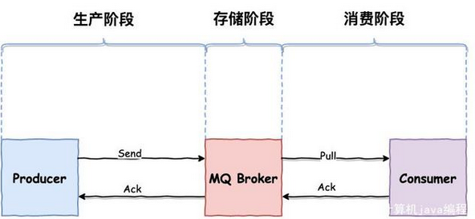

### RocketMQ消息不丢失

一条消息从生产到被消费，将会经历三个阶段：



* 生产阶段，Producer 新建消息，然后通过网络将消息投递给 MQBroker
* 存储阶段，消息将会存储在 Broker 端磁盘中
* 消息阶段， Consumer 将会从 Broker 拉取消息

#### 生成阶段

生产者（Producer） 通过网络发送消息给 Broker，当 Broker 收到之后，将会返回确认响应信息给 Producer。所以生产者只要接收到返回的确认响应，就代表消息在生产阶段未丢失。

```java
DefaultMQProducer defaultMQProducer = new DefaultMQProducer("test");
defaultMQProducer.setNamesrvAddr("");
defaultMQProducer.start();
Message message = new Message("test","hello world".getBytes(RemotingHelper.DEFAULT_CHARSET));
SendResult sendResult =  defaultMQProducer.send(message);
```

send 方法是一个同步操作，只要这个方法不抛出任何异常，就代表消息已经发送成功。

消息发送成功仅代表消息已经到了 Broker 端，Broker 在不同配置下，可能会返回不同响应状态:

* SendStatus.SEND_OK

  消息发送成功。要注意的是消息发送成功也不意味着它是可靠的。要确保不会丢失任何消息，还应启用同步Master服务器或同步刷盘，即SYNC_MASTER或SYNC_FLUSH

* SendStatus.FLUSH_DISK_TIMEOUT

  消息发送成功但是服务器刷盘超时。此时消息已经进入服务器队列（内存），只有服务器宕机，消息才会丢失。消息存储配置参数中可以设置刷盘方式和同步刷盘时间长度，如果Broker服务器设置了刷盘方式为同步刷盘，即FlushDiskType=SYNC_FLUSH（默认为异步刷盘方式），当Broker服务器未在同步刷盘时间内（默认为5s）完成刷盘，则将返回该状态——刷盘超时

* SendStatus.FLUSH_SLAVE_TIMEOUT

  消息发送成功，但是服务器同步到Slave时超时。此时消息已经进入服务器队列，只有服务器宕机，消息才会丢失。如果Broker服务器的角色是同步Master，即SYNC_MASTER（默认是异步Master即ASYNC_MASTER），并且从Broker服务器未在同步刷盘时间（默认为5秒）内完成与主服务器的同步，则将返回该状态——数据同步到Slave服务器超时

* SendStatus.SLAVE_NOT_AVAILABLE

  消息发送成功，但是此时Slave不可用。如果Broker服务器的角色是同步Master，即SYNC_MASTER（默认是异步Master服务器即ASYNC_MASTER），但没有配置slave Broker服务器，则将返回该状态——无Slave服务器可用。

#### Broker 存储阶段

默认情况下，消息只要到了 Broker 端，将会优先保存到内存中，然后立刻返回确认响应给生产者。随后 Broker 定期批量的将一组消息从内存异步刷入磁盘。

这种方式减少 I/O 次数，可以取得更好的性能，但是如果发生机器掉电，异常宕机等情况，消息还未及时刷入磁盘，就会出现丢失消息的情况。

若想保证 Broker 端不丢消息，保证消息的可靠性，我们需要将消息保存机制修改为同步刷盘方式，即消息存储磁盘成功，才会返回响应。

```
ASYNC_FLUSH flushDiskType = SYNC_FLUSH
```

若 Broker 未在同步刷盘时间内（默认为 5s）完成刷盘，将会返回 SendStatus.FLUSH_DISK_TIMEOUT 状态给生产者。

**集群部署**

为了保证可用性，Broker 通常采用一主（master）多从（slave）部署方式。为了保证消息不丢失，消息还需要复制到 slave 节点。

默认方式下，消息写入 master成功，就可以返回确认响应给生产者，接着消息将会异步复制到 slave 节点。

此时若 master 突然宕机且不可恢复，那么还未复制到 slave的消息将会丢失。

为了进一步提高消息的可靠性，我们可以采用同步的复制方式，master节点将会同步等待 slave 节点复制完成，才会返回确认响应。

如果 slave节点未在指定时间内同步返回响应，生产者将会收到SendStatus.FLUSH_SLAVE_TIMEOUT 返回状态。

#### 消费阶段

消费者从 broker 拉取消息，然后执行相应的业务逻辑。一旦执行成功，将会返回 ConsumeConcurrentlyStatus.CONSUME_SUCCESS 状态给 Broker。

如果 Broker 未收到消费确认响应或收到其他状态，消费者下次还会再次拉取到该条消息，进行重试。这样的方式有效避免了消费者消费过程发生异常，或者消息在网络传输中丢失的情况

