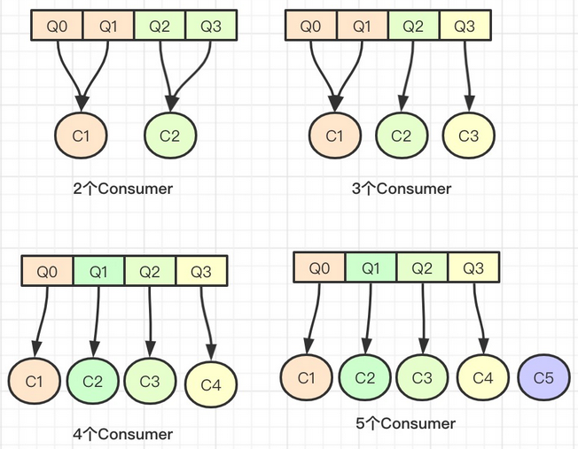
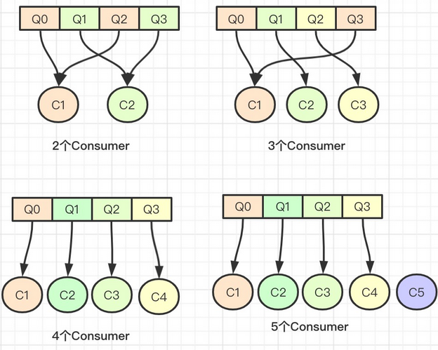

### RocketMQ消费者负载均衡

#### AllocateMessageQueueAveragely

平均负载策略，RocketMQ默认使用的就是这种方式。算法思想是根据消费者算出平均值，然后依次连续的将队列分给消费者。



具体代码实现：

```java
//consumerGroup消费者群组 currentCID 当前消费者id mqAll 当前topic下所有的的消息队列
//cidAll 当前消费者组下所有的消费者id
public List<MessageQueue> allocate(String consumerGroup, String currentCID, List<MessageQueue> mqAll,
    List<String> cidAll) {
    if (currentCID == null || currentCID.length() < 1) {
        throw new IllegalArgumentException("currentCID is empty");
    }
    if (mqAll == null || mqAll.isEmpty()) {
        throw new IllegalArgumentException("mqAll is null or mqAll empty");
    }
    if (cidAll == null || cidAll.isEmpty()) {
        throw new IllegalArgumentException("cidAll is null or cidAll empty");
    }

    List<MessageQueue> result = new ArrayList<MessageQueue>();
    if (!cidAll.contains(currentCID)) {
        log.info("[BUG] ConsumerGroup: {} The consumerId: {} not in cidAll: {}",
            consumerGroup,
            currentCID,
            cidAll);
        return result;
    }
	//取出当前消费者在消息队列中的位置
    int index = cidAll.indexOf(currentCID);
    //取模，计算出剩余的没有均分的消息队列
    int mod = mqAll.size() % cidAll.size();
    //计算当前消费者可以分配多少个消息队列
    //如果队列数小于消费者数量则将队列数设置为1，否则，如果取模余数大于index，则将队列数设置为平均数+1最后条件就是平均数
    int averageSize =
        mqAll.size() <= cidAll.size() ? 1 : (mod > 0 && index < mod ? mqAll.size() / cidAll.size()
            + 1 : mqAll.size() / cidAll.size());
     //consumer获取第一个MessageQueue的索引
    int startIndex = (mod > 0 && index < mod) ? index * averageSize : index * averageSize + mod;
   //计算可以循环的次数
    int range = Math.min(averageSize, mqAll.size() - startIndex);
    for (int i = 0; i < range; i++) {
        result.add(mqAll.get((startIndex + i) % mqAll.size()));
    }
    return result;
}
```

#### AllocateMessageQueueAveragelyByCircle

环形分配就可以看成：所有消费者围成一个环，然后循环这个环分配队列。环形分配的就是间隔的队列。



具体代码实现：

```java
public List<MessageQueue> allocate(String consumerGroup, String currentCID, List<MessageQueue> mqAll,
    List<String> cidAll) {
    if (currentCID == null || currentCID.length() < 1) {
        throw new IllegalArgumentException("currentCID is empty");
    }
    if (mqAll == null || mqAll.isEmpty()) {
        throw new IllegalArgumentException("mqAll is null or mqAll empty");
    }
    if (cidAll == null || cidAll.isEmpty()) {
        throw new IllegalArgumentException("cidAll is null or cidAll empty");
    }

    List<MessageQueue> result = new ArrayList<MessageQueue>();
    if (!cidAll.contains(currentCID)) {
        log.info("[BUG] ConsumerGroup: {} The consumerId: {} not in cidAll: {}",
            consumerGroup,
            currentCID,
            cidAll);
        return result;
    }

    int index = cidAll.indexOf(currentCID);
    //简单的for循环，如果取模的余数等于index，则设置为当前消费者的队列
    for (int i = index; i < mqAll.size(); i++) {
        if (i % cidAll.size() == index) {
            result.add(mqAll.get(i));
        }
    }
    return result;
}
```

#### AllocateMessageQueueByMachineRoom机房分配算法

机房负载策略，其实这个策略就是当前Consumer只负载处在指定的机房内的MessageQueue，还有brokerName的命名必须要按要求的格式来设置： `机房名@brokerName`

```java
public List<MessageQueue> allocate(String consumerGroup, String currentCID, List<MessageQueue> mqAll,
    List<String> cidAll) {
    List<MessageQueue> result = new ArrayList<MessageQueue>();
    int currentIndex = cidAll.indexOf(currentCID);
    if (currentIndex < 0) {
        return result;
    }
    List<MessageQueue> premqAll = new ArrayList<MessageQueue>();
    //循环所有的消息队列
    for (MessageQueue mq : mqAll) {
        String[] temp = mq.getBrokerName().split("@");
        //获取符合要求的消息队列
        if (temp.length == 2 && consumeridcs.contains(temp[0])) {
            premqAll.add(mq);
        }
    }
	//平均数
    int mod = premqAll.size() / cidAll.size();
    //求余计算出无法均分的消息队列数量
    int rem = premqAll.size() % cidAll.size();
    //开始当前消费者开始循环的
    int startIndex = mod * currentIndex;
    //结束位置
    int endIndex = startIndex + mod;
    for (int i = startIndex; i < endIndex; i++) {
        result.add(mqAll.get(i));
    }
    //如果有不均分的队列
    if (rem > currentIndex) {
        result.add(premqAll.get(currentIndex + mod * cidAll.size()));
    }
    return result;
}
```

#### AllocateMachineRoomNearby

这个策略我个人感觉是`AllocateMessageQueueByMachineRoom`的改进版本，因为这个策略的处理方式要比`AllocateMessageQueueByMachineRoom`更加灵活，还考虑到了那些同机房只有MessageQueue却没有Consumer的情况。

```java
public List<MessageQueue> allocate(String consumerGroup, String currentCID, List<MessageQueue> mqAll,
    List<String> cidAll) {
    if (currentCID == null || currentCID.length() < 1) {
        throw new IllegalArgumentException("currentCID is empty");
    }
    if (mqAll == null || mqAll.isEmpty()) {
        throw new IllegalArgumentException("mqAll is null or mqAll empty");
    }
    if (cidAll == null || cidAll.isEmpty()) {
        throw new IllegalArgumentException("cidAll is null or cidAll empty");
    }

    List<MessageQueue> result = new ArrayList<MessageQueue>();
    if (!cidAll.contains(currentCID)) {
        log.info("[BUG] ConsumerGroup: {} The consumerId: {} not in cidAll: {}",
            consumerGroup,
            currentCID,
            cidAll);
        return result;
    }

    //group mq by machine room
    Map<String/*machine room */, List<MessageQueue>> mr2Mq = new TreeMap<String, List<MessageQueue>>();
    //循环所有的消息队列
    for (MessageQueue mq : mqAll) {
        //得到broker的机房的名称
        String brokerMachineRoom = machineRoomResolver.brokerDeployIn(mq);
        if (StringUtils.isNoneEmpty(brokerMachineRoom)) {
            //将mq根据机房名称分组存放
            if (mr2Mq.get(brokerMachineRoom) == null) {
                mr2Mq.put(brokerMachineRoom, new ArrayList<MessageQueue>());
            }
            mr2Mq.get(brokerMachineRoom).add(mq);
        } else {
            throw new IllegalArgumentException("Machine room is null for mq " + mq);
        }
    }

    //group consumer by machine room
    //消费者按照机房名称分组存储
    Map<String/*machine room */, List<String/*clientId*/>> mr2c = new TreeMap<String, List<String>>();
    for (String cid : cidAll) {
        String consumerMachineRoom = machineRoomResolver.consumerDeployIn(cid);
        if (StringUtils.isNoneEmpty(consumerMachineRoom)) {
            if (mr2c.get(consumerMachineRoom) == null) {
                mr2c.put(consumerMachineRoom, new ArrayList<String>());
            }
            mr2c.get(consumerMachineRoom).add(cid);
        } else {
            throw new IllegalArgumentException("Machine room is null for consumer id " + cid);
        }
    }

    //当前消费者分到的所有messageQueue
    List<MessageQueue> allocateResults = new ArrayList<MessageQueue>();

    //1.allocate the mq that deploy in the same machine room with the current consumer
    //当前机房名称
    String currentMachineRoom = machineRoomResolver.consumerDeployIn(currentCID);
    //获取分配给当前机房的队列
    List<MessageQueue> mqInThisMachineRoom = mr2Mq.remove(currentMachineRoom);
    //当前机房分配的消费者
    List<String> consumerInThisMachineRoom = mr2c.get(currentMachineRoom);
    //得到当前机房所有MessageQueue和Consumers后根据指定的策略再负载
    if (mqInThisMachineRoom != null && !mqInThisMachineRoom.isEmpty()) {
        allocateResults.addAll(allocateMessageQueueStrategy.allocate(consumerGroup, currentCID, mqInThisMachineRoom, consumerInThisMachineRoom));
    }
	//如果该MessageQueue的机房 没有同机房的consumer,将这些MessageQueue按配置好的备用策略分配给所有的consumer
    //2.allocate the rest mq to each machine room if there are no consumer alive in that machine room
    for (String machineRoom : mr2Mq.keySet()) {
        if (!mr2c.containsKey(machineRoom)) { // no alive consumer in the corresponding machine room, so all consumers share these queues
            allocateResults.addAll(allocateMessageQueueStrategy.allocate(consumerGroup, currentCID, mr2Mq.get(machineRoom), cidAll));
        }
    }
    return allocateResults;
}
```

#### AllocateMessageQueueConsistentHash

一致性哈希有一个哈希环的概念，哈希环由数值 0到2^32-1 组成，不管内容多长的字符，经过哈希计算都能得到一个等长的数字，最后都会落在哈希环上的某个点，哈希环上的点都是虚拟的，比如我们这里使用Consumer的Id来进行哈希计算，得到的这几个是物理的点，然后把得到的点存到TreeMap里面，然后将所有的MessageQueue依次进行同样的哈希计算，得到距离MessageQueue顺时针方向最近的那个Consumer点，这个就是MessageQeueu最终归属的那个Consumer。


```java
public List<MessageQueue> allocate(String consumerGroup, String currentCID, List<MessageQueue> mqAll,
    List<String> cidAll) {

    if (currentCID == null || currentCID.length() < 1) {
        throw new IllegalArgumentException("currentCID is empty");
    }
    if (mqAll == null || mqAll.isEmpty()) {
        throw new IllegalArgumentException("mqAll is null or mqAll empty");
    }
    if (cidAll == null || cidAll.isEmpty()) {
        throw new IllegalArgumentException("cidAll is null or cidAll empty");
    }

    List<MessageQueue> result = new ArrayList<MessageQueue>();
    if (!cidAll.contains(currentCID)) {
        log.info("[BUG] ConsumerGroup: {} The consumerId: {} not in cidAll: {}",
            consumerGroup,
            currentCID,
            cidAll);
        return result;
    }
	//将所有consumer变成节点，到时候经过hash计算分布在hash环上
    Collection<ClientNode> cidNodes = new ArrayList<ClientNode>();
    for (String cid : cidAll) {
        cidNodes.add(new ClientNode(cid));
    }
	//构建hash环
    final ConsistentHashRouter<ClientNode> router; //for building hash ring
    if (customHashFunction != null) {
        router = new ConsistentHashRouter<ClientNode>(cidNodes, virtualNodeCnt, customHashFunction);
    } else {
        //默认使用md5进行hash计算
        router = new ConsistentHashRouter<ClientNode>(cidNodes, virtualNodeCnt);
    }

    List<MessageQueue> results = new ArrayList<MessageQueue>();
    for (MessageQueue mq : mqAll) {
        //对messageQueue进行hash计算，找到顺时针最近的consumer节点
        ClientNode clientNode = router.routeNode(mq.toString());
        //如果最近的node是当前节点则保存
        if (clientNode != null && currentCID.equals(clientNode.getKey())) {
            results.add(mq);
        }
    }

    return results;

}
```