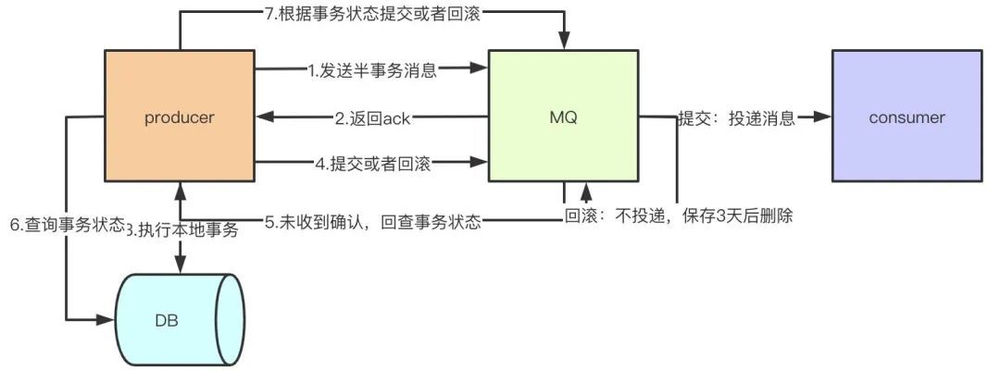

### RocketMq面试题

1. 你们为什么使用mq？

   ```
   1.mq的作用很简单，削峰填谷
   2.解耦
   3.异步，不需要同步执行的远程调用可以有效提高响应时间
   ```

2. 那你们使用什么mq？基于什么做的选型？

   ```
   - 业务场景，可能会用到顺序消息、事务消息等。
   - 开发语言。
   - 生态。
   ```

3. 消息可靠性怎么保证.

4. 你说到消费者消费失败的问题，那么如果一直消费失败导致消息积压怎么处理？

       1.消费者出错，肯定是程序或者其他问题导致的，如果容易修复，先把问题修复，让consumer恢复正常消费
       
       2.如果时间来不及处理很麻烦，做转发处理，写一个临时的consumer消费方案，先把消息消费，然后再转发到一个新的topic和MQ资源，这个新的topic的机器资源单独申请，要能承载住当前积压的消息
       
       3.处理完积压数据后，修复consumer，去消费新的MQ和现有的MQ数据，新MQ消费完成后恢复原状

5. 那如果消息积压达到磁盘上限，消息被删除了怎么办？

   ```
   消息都是落库了，已经成功发送的消息也会修改状态，可以单独跑一个脚步重发丢失的那部分数据，或者找消费方去对比。
   ```

6. RocketMQ实现原理。

   ```
   RocketMQ由NameServer注册中心集群、Producer生产者集群、Consumer消费者集群和若干Broker（RocketMQ进程）组成，它的架构原理是这样的：
   
   1.Broker在启动的时候去向所有的NameServer注册，并保持长连接，每30s发送一次心跳
   2.Producer在发送消息的时候从NameServer获取Broker服务器地址，根据负载均衡算法选择一台服务器来发送消息
   3.Conusmer消费消息的时候同样从NameServer获取Broker地址，然后主动拉取消息来消费
   ```

7. 为什么RocketMQ不使用Zookeeper作为注册中心呢。

   ```
   1.根据CAP理论，同时最多只能满足两个点，而zookeeper满足的是CP，也就是说zookeeper并不能保证服务的可用性，zookeeper在进行选举的时候，整个选举的时间太长，期间整个集群都处于不可用的状态，而这对于一个注册中心来说肯定是不能接受的，作为服务发现来说就应该是为可用性而设计。
   2.消息发送应该弱依赖注册中心，而RocketMQ的设计理念也正是基于此，生产者在第一次发送消息的时候从NameServer获取到Broker地址后缓存到本地，如果NameServer整个集群不可用，短时间内对于生产者和消费者并不会产生太大影响。
   3.持久化的机制来带的问题，ZooKeeper 的 ZAB 协议对每一个写请求，会在每个 ZooKeeper 节点上保持写一个事务日志，同时再加上定期的将内存数据镜像（Snapshot）到磁盘来保证数据的一致性和持久性，而对于一个简单的服务发现的场景来说，这其实没有太大的必要，这个实现方案太重了。而且本身存储的数据应该是高度定制化的。
   ```

8. Broker是怎么保存数据的。

   ```
   Broker在收到消息之后，会把消息保存到commitlog的文件当中，而同时在分布式的存储当中，每个broker都会保存一部分topic的数据，同时，每个topic对应的messagequeue下都会生成consumequeue文件用于保存commitlog的物理位置偏移量offset，indexfile中会保存key和offset的对应关系。
   ```

9. RocketMQ Broker中的消息被消费后会立即删除吗

   ```
   不会，每条消息都会持久化到CommitLog中，每个Consumer连接到Broker后会维持消费进度信息，当有消息消费后只是当前Consumer的消费进度（CommitLog的offset）更新了
   ```

10. 那么消息会堆积吗？什么时候清理过期消息？

   ```java
   4.6版本默认48小时后会删除不再使用的CommitLog文件
       1.检查这个文件最后访问时间
       2.判断是否大于过期时间
       3.指定时间删除，默认凌晨4点
   ```

   ```java
   private boolean isTimeToDelete() {
       // when = "04";
       String when = DefaultMessageStore.this.getMessageStoreConfig().getDeleteWhen();
       // 是04点，就返回true
       if (UtilAll.isItTimeToDo(when)) {
           return true;
       }
   	// 不是04点，返回false
       return false;
   }
   
   /**
    * {@link org.apache.rocketmq.store.DefaultMessageStore.CleanCommitLogService#deleteExpiredFiles()}
    */
   private void deleteExpiredFiles() {
       // isTimeToDelete()这个方法是判断是不是凌晨四点，是的话就执行删除逻辑。
       if (isTimeToDelete()) {
           // 默认是72，但是broker配置文件默认改成了48，所以新版本都是48。
           long fileReservedTime = 48 * 60 * 60 * 1000;
           deleteCount = DefaultMessageStore.this.commitLog.deleteExpiredFile(72 * 60 * 60 * 1000, xx, xx, xx);
       }
   }
                                                                          
   /**
    * {@link org.apache.rocketmq.store.CommitLog#deleteExpiredFile()}
    */
   public int deleteExpiredFile(xxx) {
       // 这个方法的主逻辑就是遍历查找最后更改时间+过期时间，小于当前系统时间的话就删了（也就是小于48小时）。
       return this.mappedFileQueue.deleteExpiredFileByTime(72 * 60 * 60 * 1000, xx, xx, xx);
   }
   ```

11. RocketMQ消费模式有几种

    ```
    1.集群消费
    	1.一条消息只会被同Group中的一个Consumer消费
      2.多个Group同时消费一个Topic时，每个Group都会有一个Consumer消费到数据
      
     2.广播消费
     	消息将对一 个Consumer Group 下的各个 Consumer 实例都消费一遍。即即使这些 Consumer 属于同一个Consumer Group ，消息也会被 Consumer Group 中的每个 Consumer 都消费一次。
    
    ```

12. 消费消息是push还是pull

    ```
    RocketMQ没有真正意义的push，都是pull，虽然有push类，但实际底层实现采用的是长轮询机制，即拉取方式
    ```

13. 为什么要主动拉取消息而不使用事件监听方式

    ```
    事件驱动方式是建立好长连接，由事件（发送数据）的方式来实时推送。
    如果broker主动推送消息的话有可能push速度快，消费速度慢的情况，那么就会造成消息在consumer端堆积过多，同时又不能被其他consumer消费的情况。而pull的方式可以根据当前自身情况来pull，不会造成过多的压力而造成瓶颈。所以采取了pull的方式
    ```

14. broker如何处理拉取请求的

    ```
    Consumer首次请求Broker
        -Broker中是否有符合条件的消息
        -有 
        	--响应Consumer
        	--等待下次Consumer的请求
        -没有
        	--挂起consumer的请求，即不断开连接，也不返回数据
          --使用consumer的offset，
          	---DefaultMessageStore#ReputMessageService#run方法
               -每隔1ms检查commitLog中是否有新消息，有的话写入到pullRequestTable
               -当有新消息的时候返回请求
            ---PullRequestHoldService 来Hold连接，每个5s执行一次检查pullRequestTable有没有消息，有的话立即推送
    
    ```

15. RocketMQ如何做负载均衡

    ```
    producer端
     1.默认策略是随机选择：
    	1.producer维护一个index
      2.每次取节点会自增
      3.index向所有broker个数取余
      4.自带容错策略
     2.自定义实现MessageQueueSelector接口中的select方法  consumer端
     1.采用的是平均分配算法来进行负载均衡。
    ```

16. 当消费负载均衡consumer和queue不对等的时候会发生什么

    ```
    Consumer和queue会优先平均分配，如果Consumer少于queue的个数，则会存在部分Consumer消费多个queue的情况，如果Consumer等于queue的个数，那就是一个Consumer消费一个queue，如果Consumer个数大于queue的个数，那么会有部分Consumer空余出来，白白的浪费了
    ```

17. 消息重复消费.

    ```
    1.ack
    	正常情况下在consumer真正消费完消息后应该发送ack，通知broker该消息已正常消费，从queue中剔除.当ack因为网络原因无法发送到broker，broker会认为词条消息没有被消费，此后会开启消息重投机制把消息再次投递到consumer
    
    解决方案:
    	数据库表:处理消息前，使用消息主键在表中带有约束的字段中insert.
    	Map:单机时可以使用map ConcurrentHashMap -> putIfAbsent guava cache
    	Redis:分布式锁搞起来
    ```

18. 如何让RocketMQ保证消息的顺序消费

    ```
    首先多个queue只能保证单个queue里的顺序，queue是典型的FIFO，天然顺序。多个queue同时消费是无法绝对保证消息的有序性的。所以总结如下：
    
    同一topic，同一个QUEUE，发消息的时候一个线程去发送消息，消费的时候 一个线程去消费一个queue里的消息。
    ```

19. 怎么保证消息发到同一个queue

    ```
    Rocket MQ给我们提供了MessageQueueSelector接口，可以自己重写里面的接口，实现自己的算法，举个最简单的例子：判断i % 2 == 0，那就都放到queue1里，否则放到queue2里。
    ```

    ```java
    for (int i = 0; i < 5; i++) {
        Message message = new Message("orderTopic", ("hello!" + i).getBytes());
        producer.send(
            // 要发的那条消息
            message,
            // queue 选择器 ，向 topic中的哪个queue去写消息
            new MessageQueueSelector() {
                // 手动 选择一个queue
                @Override
                public MessageQueue select(
                    // 当前topic 里面包含的所有queue
                    List<MessageQueue> mqs,
                    // 具体要发的那条消息
                    Message msg,
                    // 对应到 send（） 里的 args，也就是2000前面的那个0
                    Object arg) {
                    // 向固定的一个queue里写消息，比如这里就是向第一个queue里写消息
                    if (Integer.parseInt(arg.toString()) % 2 == 0) {
                        return mqs.get(0);
                    } else {
                        return mqs.get(1);
                    }
                }
            },
            // 自定义参数：0
            // 2000代表2000毫秒超时时间
            i, 2000);
    }
    
    ```

20. rocketMQ的消息堆积如何处理。

    ```
    1.消费者出错，肯定是程序或者其他问题导致的，如果容易修复，先把问题修复，让consumer恢复正常消费
    
    2.如果时间来不及处理很麻烦，做转发处理，写一个临时的consumer消费方案，把消息转发到一个新的topic和MQ资源，这个新的topic的机器资源单独申请，要能承载住当前积压的消息
    
    3.处理完积压数据后，修复consumer，去消费新的MQ和现有的MQ数据，新MQ消费完成后恢复原状
    
    ```

21. 如果Consumer和Queue不对等，上线了多台也在短时间内无法消费完堆积的消息怎么办

    ```
    -准备一个临时的topic
    -queue的数量是堆积的几倍
    -queue分布到多Broker中
    -上线一台Consumer做消息的搬运工，把原来Topic中的消息挪到新的Topic里，不做业务逻辑处理，只是挪过去
    -上线N台Consumer同时消费临时Topic中的数据
    -改bug
    -恢复原来的Consumer，继续消费之前的Topic
    ```

22. 堆积的消息会不会进死信队列

    ```
    不会，消息在消费失败后会进入重试队列（%RETRY%+ConsumerGroup），16次（默认16次）才会进入死信队列（%DLQ%+ConsumerGroup）。
    ```

    ```java
    public class SubscriptionGroupConfig {
        private int retryMaxTimes = 16;
    }
    
    // {@link org.apache.rocketmq.broker.processor.SendMessageProcessor#asyncConsumerSendMsgBack}
    // maxReconsumeTimes = 16
    int maxReconsumeTimes = subscriptionGroupConfig.getRetryMaxTimes();
    // 如果重试次数大于等于16，则创建死信队列
    if (msgExt.getReconsumeTimes() >= maxReconsumeTimes || delayLevel < 0) {
        // MixAll.getDLQTopic()就是给原有groupname拼上DLQ，死信队列
        newTopic = MixAll.getDLQTopic(requestHeader.getGroup());
        // 创建死信队列
        topicConfig = this.brokerController.getTopicConfigManager().createTopicInSendMessageBackMethod(xxx)
    }
    
    public class MessageStoreConfig {
        // 每隔如下时间会进行重试，到最后一次时间重试失败的话就进入死信队列了。
    	private String messageDelayLevel = "1s 5s 10s 30s 1m 2m 3m 4m 5m 6m 7m 8m 9m 10m 20m 30m 1h 2h";
    }
    
    /**
     * {@link org.apache.rocketmq.client.impl.consumer.DefaultMQPushConsumerImpl#sendMessageBack()}
     *
     * sendMessageBack()这个方法是消费失败后会请求他，意思是把消息重新放到队列，进行重试。
     */
    public void sendMessageBack(MessageExt msg, int delayLevel, final String brokerName) {
        Message newMsg = new Message();
        // ！！！我TM，真相了，3 + xxx。他是从第三个开始的。也就是舍弃了前两个时间间隔，18 - 2 = 16。也就是说第一次重试是在10s，第二次30s。
        // TMD！！！
        // TMD！！！
        // TMD！！！
        newMsg.setDelayTimeLevel(3 + msg.getReconsumeTimes());
    	this.mQClientFactory.getDefaultMQProducer().send(newMsg);
     }
    
    
    ```

23. RocketMQ在分布式事务支持这块机制的底层原理?

24. 如果让你来动手实现一个分布式消息中间件，整体架构你会如何设计实现

    ```
    -需要考虑能快速扩容、天然支持集群
    -持久化的姿势
    -高可用性
    -数据0丢失的考虑
    -服务端部署简单、client端使用简单
    ```

25. 高吞吐量下如何优化生产者和消费者的性能

    ```
    开发
    -同一group下，多机部署，并行消费
    -单个Consumer提高消费线程个数
    -业务逻辑批量处理
    ```

26. 再说说RocketMQ 是如何保证数据的高容错性的

    ```
    在不开启容错的情况下，轮询队列进行发送，如果失败了，重试的时候过滤失败的Broker
    如果开启了容错策略，会通过RocketMQ的预测机制来预测一个Broker是否可用
    如果上次失败的Broker可用那么还是会选择该Broker的队列
    如果上述情况失败，则随机选择一个进行发送
    在发送消息的时候会记录一下调用的时间与是否报错，根据该时间去预测broker的可用时间
    ```

27. 任何一台Broker突然宕机了怎么办

    ```
    Broker主从架构以及多副本策略。Master收到消息后会同步给Slave，这样一条消息就不止一份了，Master宕机了还有slave中的消息可用，保证了MQ的可靠性和高可用性。而且Rocket MQ4.5.0开始就支持了Dlegder模式，基于raft的，做到了真正意义的HA
    ```

28. Broker把自己的信息注册到哪个NameServer上

    ```
    Broker会向所有的NameServer上注册自己的信息，而不是某一个，是每一个，全部！
    ```

29. Master和Slave之间是怎么同步数据的呢

    ```
    消息在master和slave之间的同步是根据raft协议来进行的：
        1.在broker收到消息后，会被标记为uncommitted状态
        2.然后会把消息发送给所有的slave
        3.slave在收到消息之后返回ack响应给master
        4.master在收到超过半数的ack之后，把消息标记为committed
        6.发送committed消息给所有slave，slave也修改状态为committed
        
        https://blog.csdn.net/prestigeding/article/details/93672079
    ```

30. 你知道RocketMQ为什么速度快吗

    ```
    是因为使用了顺序存储、Page Cache和异步刷盘。
    我们在写入commitlog的时候是顺序写入的，这样比随机写入的性能就会提高很多
    写入commitlog的时候并不是直接写入磁盘，而是先写入操作系统的PageCache,最后由操作系统异步将缓存中的数据刷到磁盘
    
    ```

31. 什么是事务、半事务消息？怎么实现的？

    ```
    事务消息就是MQ提供的类似XA的分布式事务能力，通过事务消息可以达到分布式事务的最终一致性。
    半事务消息就是MQ收到了生产者的消息，但是没有收到二次确认，不能投递的消息。
    实现原理如下：
        1.生产者先发送一条半事务消息到MQ
        2.MQ收到消息后返回ack确认
        3.生产者开始执行本地事务
        4.如果事务执行成功发送commit到MQ，失败发送rollback
        5.如果MQ长时间未收到生产者的二次确认commit或者rollback，MQ对生产者发起消息回查
        6.生产者查询事务执行最终状态
        7.根据查询事务状态再次提交二次确认
    最终，如果MQ收到二次确认commit，就可以把消息投递给消费者，反之如果是rollback，消息会保存下来并且在3天后被删除。
    ```

    

32. 如果Broker宕了，NameServer是怎么感知到的

    ```
    Broker会定时（30s）向NameServer发送心跳
    然后 NameServer会定时（10s）运行一个任务，去检查一下各个Broker的最近一次心跳时间，如果某个Broker超过120s都没发送心跳了，那么就认为这个Broker已经挂掉了。
    ```

33. Broker挂了，系统是怎么感知到的？

    ```
    主要是通过拉取NameServer上Broker的信息。
    但是，因为Broker心跳、NameServer定时任务、生产者和消费者拉取Broker信息，这些操作都是周期性的，所以不会实时感知，所以存在发送消息和消费消息失败的情况，现在 我们先知道，对于生产者而言，他是有 一套容错机制的。
    
    如果某个Broker没有宕机，而是该Broker和Nameserver之间的网络问题造成NameSrv认为某个Broker宕机了，Producer后续拿到新的路由信息后，其实此时Producer可以连通该Broker，此时Producer就不会给该Broker发送消息了
    ```

34. **消费者的系统在获取消息的时候，是从**  **Master Broker**  **获取的？还是从**  **Slave Broker** 获取的。

    ```
    可能从Master Broker获取消息，也有可能从Slave Broker获取消息
    1、消费者的系统在获取消息的时候会先发送请求到Master Broker上去，请求获取一批消息，此时Master Broker是会返回一批消息给消费者系统的
    2、Master Broker在返回消息给消费者系统的时候，会根据当时Master Broker的 负载情况和Slave Broker的 同步情况，向消费者系统建议下一次拉取消息的时候是从Master Broker拉取还是从Slave Broker拉取。 
    
    ```

35. **如果**  **Slave Broker**  **挂掉了，会对整个系统有影响吗？**

    ```
     有一点影响，但是影响不太大，因为消息写入全部是发送到Master Broker的，获取消息也可以Master获取，少了Slave Broker，会导致所有读写压力都集中在Master Broker
    ```

36. **Master Broker**  **突然挂了，这样会怎么样？**

    ```
    RocketMQ 4.5版本之前，用Slave Broker同步数据，尽量保证数据不丢失，但是一旦Master故障了，Slave是没法自动切换成Master的。
    所以在这种情况下，如果Master Broker宕机了，这时就得手动做一些运维操作，把Slave Broker重新修改一些配置，重启机器给调整为Master Broker，这是有点麻烦的，而且会导致中间一段时间不可用。
    ```

37. **基于**  **Dledger**  **实现**  **RocketMQ**  **高可用自动切换**

    ```
    RocketMQ 4.5之后支持了一种叫做Dledger机制，基于Raft协议实现的一个机制。
    我们可以让一个Master Broker对应多个Slave Broker， 一旦 Master Broker 宕机了，在多个 Slave 中通过 Dledger 技术 将一个 Slave Broker 选为新的 Master Broker 对外提供服务。
    在生产环境中可以是用Dledger机制实现自动故障切换，只要10秒或者几十秒的时间就可以完成
    ```

38. Master宕机了,  修改slave为Master,  此时如果有的消息没有同步到slave，这个时候要丢失部分数据,丢失的数据如何处理呢

    ```
    对的，master挂了应该让slave提供读，同时修复master，但4.5以后通常建议用dledger自动切换
    ```

39. 现在Broker slave主动从Master拉取消息，一旦Master宕机，是不就会丢失一部分消息？不是说RocketMQ可以保证不丢消息么

    ```
    要同时设置刷盘策略和副本同步相关配置
    ```

    


