### Rocketmq 存储原理

#### 前置概念

**1.磁盘顺序I/O**

- 硬盘内部主要部件为磁盘盘片、传动手臂、读写磁头和主轴马达。实际数据都是写在盘片上，读写主要是通过传动手臂上的读写磁头来完成。实际运行时，主轴让磁盘盘片转动，然后传动手臂可伸展让读取头在盘片上进行读写操作。磁盘物理结构如下图所示：

* 磁盘读取时间
  * 寻道时间，表示磁头在不同磁道之间移动的时间。
  * 旋转延迟，表示在磁道找到时，中轴带动盘面旋转到合适的扇区开头处。
  * 传输时间，表示盘面继续转动，实际读取数据的时间。

* 顺序读写和随机读写对于机械硬盘来说为什么性能差异巨大？
  * 随机读写：操作的磁盘地址不是连续的；需要多次寻道和旋转延迟，而这个时间可能是传输时间的许多倍。
  * 顺序读写：操作的磁盘地址是连续的；主要时间花费在了传输时间，不需要寻道；磁盘会预读，预读即在读取的起始地址连续读取多个页面。

**2.磁盘Cache**

- 磁盘Cache有两大功能：预读和回写。

  - 预读：利用了局部性原理，具体过程是：对于每个文件的第一个读请求，系统读入所请求的页面并读入紧随其后的少数几个页面（X86的Linux中一个标准页面大小是4KB），这时的预读称为同步预读。对于第二次读请求，如果所读页面不在 Cache 中，即不在前次预读的页中，则表明文件访问不是顺序访问，系统继续采用同步预读；如果所读页面在 Cache  中，则表明前次预读命中，操作系统把预读页的大小扩大一倍，此时预读过程是异步的，应用程序可以不等预读完成即可返回，只要后台慢慢读页面即可，这时的预读称为异步预读。任何接下来的读请求都会处于两种情况之一：

    1. 若不在cache，操作系统从磁盘中读取对应的数据页，并且系统还会将该数据页之后的连续几页（X86的Linux中一个标准页面大小是4KB）也一并读入到cache中，再将应用需要的数据返回给应用。此情况操作系统认为是跳跃读取，属于同步预读。

    2. 若命中cache，相当于上次缓存的内容有效，操作系统认为顺序读盘，则继续扩大缓存的数据范围，将之前缓存的数据页往后的N页数据再读取到cache中，属于异步预读。

  - 回写：暂时将数据存在Cache里，然后统一异步写到磁盘中。通过这种异步的数据 I/O 模式解决了程序中的计算速度和数据存储速度不匹配的鸿沟，减少了访问底层存储介质的次数，使存储系统的性能大大提高。

**3.I/O调度**

- 如果所有读写请求都直接发给硬盘，对传统硬盘来说太残忍了。IO调度层主要做两个事情，合并和排序。合并是将相同和相邻扇区(每个512字节)的操作合并成一个，比如我现在要读扇区1，2，3，那可以合并成一个读扇区1-3的操作。排序就是将所有操作按扇区方向排成一个队列，让磁盘的磁头可以按顺序移动，有效减少了机械硬盘寻址这个最慢最慢的操作。
- 现在操作系统内核实现了I/O调度器(I/O Scheduler),通过操作I/O请求的服务顺序以及服务时间点，最大程度的减小磁盘寻址次数和移动距离。
- IO调度器的总体目标是希望让磁头能够总是往一个方向移动，移动到底了再往反方向走，这恰恰就是现实生活中的电梯模型，所以IO调度器也被叫做电梯，(elevator)而相应的算法也就被叫做电梯算法。调度器将bio结构进行排序和合并组织成队列且确保读写操作尽可能理想：将一个或多个进程的读操作合并到一起读，将一个或多个进程的写操作合并到一起写，尽可能变随机为顺序（因为随机读写比顺序读写要慢），读必须优先满足，而写也不能等太久。
  - CFQ算法（完全公正排队 I/O 调度算法，新内核版本的默认算法）： 主要目标是在触发 I/O 请求的所有进程中确保磁盘 I/O  带宽的公平分配。CFQ为每个进程/线程，单独创建一个队列来管理该进程所产生的请求，IO  Scheduler对每个IO队列轮询，对于不同的进程IO请求处理是公平的，平均IO响应时间很小。每个进程队列可以设置IO优先级使得有更多的调度时间片。
  - Noop 算法（No Operation，在Linux2.4或更早的版本的调度程序，那时只有这一种I/O调度算法）：  该算法仅适当合并用户请求，并不排序请求。NOOP实现了一个简单的FIFO队列，它像电梯的工作主法一样对I/O请求进行组织，当有一个新的请求到来时，它将请求合并到最近的请求之后，以此来保证请求同一介质。NOOP倾向饿死读而利于写。（在 SSD 或者 Fusion IO，最简单的 NOOP  反而可能是最好的算法，因为其他三个算法的优化是基于缩短寻道时间的，而固态硬盘没有所谓的寻道时间且 I/O 响应时间非常短。）
  - Deadline算法：对于读写操作有截止时间，对读和写操作用两条不同的队列管理，可以解决读取饥饿的现象。因为操作系统对读请求是同步处理的，写入请求可以异步处理。操作系统可以数据写到内存，然后对IO队列中的请求做合并，提高IO的吞吐量。通过设置read_expire < write_expire时间，避免读取操作处于饥饿调度的状态。对于数据库存储应用，Deadline是最佳的IO  Scheduler，甚至很多PCIE卡作为设备内置默认参数。
  - 其他算法。

**4.内存映射（Memory Mapped Files / mmap）：**

- 内存映射文件，是由一个文件到一块内存的映射。在使用内存映射文件进行I/O处理时，系统对数据的传输按页面来进行。至于内部的所有内存页面则是由虚拟内存管理器来负责管理，由其来决定内存页面何时被分页到磁盘，哪些页面应该被释放以便为其它进程提供空闲空间，以及每个进程可以拥有超出实际分配物理内存之外的多少个页面空间等等。由于虚拟内存管理器是以一种统一的方式来处理所有磁盘I/O的（以页面为单位对内存数据进行读写），因此这种优化使其有能力以足够快的速度来处理内存操作。
- 文件内的数据就可以用内存读/写指令来访问，而不是用ReadFile和WriteFile这样的I/O系统函数，从而提高了文件存取速度。
- 从硬盘上将文件读入内存，都要经过文件系统进行数据拷贝，并且数据拷贝操作是由文件系统和硬件驱动实现的，理论上来说，拷贝数据的效率是一样的。但是通过内存映射的方法访问硬盘上的文件，效率要比read和write系统调用高，这是为什么呢？
  - 当应用程序访问某块数据时，操作系统首先会检查，是不是最近访问过此文件，文件内容是否缓存在内核缓冲区，如果是，操作系统则直接根据read系统调用提供的buf地址，将内核缓冲区的内容拷贝到buf所指定的用户空间缓冲区中去。如果不是，操作系统则首先将磁盘上的数据拷贝的内核缓冲区，这一步目前主要依靠DMA来传输，然后再把内核缓冲区上的内容拷贝到用户缓冲区中。接下来，write系统调用再把用户缓冲区的内容拷贝到网络堆栈相关的内核缓冲区中，最后socket再把内核缓冲区的内容发送到网卡上。
  - 应用程序调用mmap()，磁盘上的数据会通过DMA被拷贝的内核缓冲区，接着操作系统会把这段内核缓冲区与应用程序共享，这样就不需要把内核缓冲区的内容往用户空间拷贝。应用程序再调用write(),操作系统直接将内核缓冲区的内容拷贝到socket缓冲区中，这一切都发生在内核态，最后，socket缓冲区再把数据发到网卡去。减少数据在内核空间和用户空间来回拷贝。

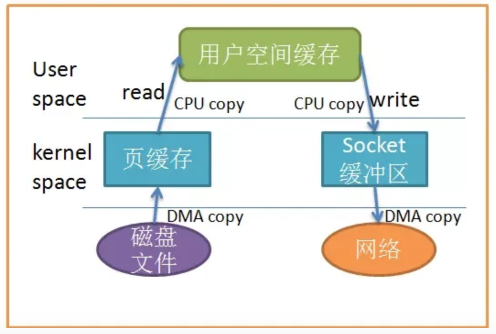

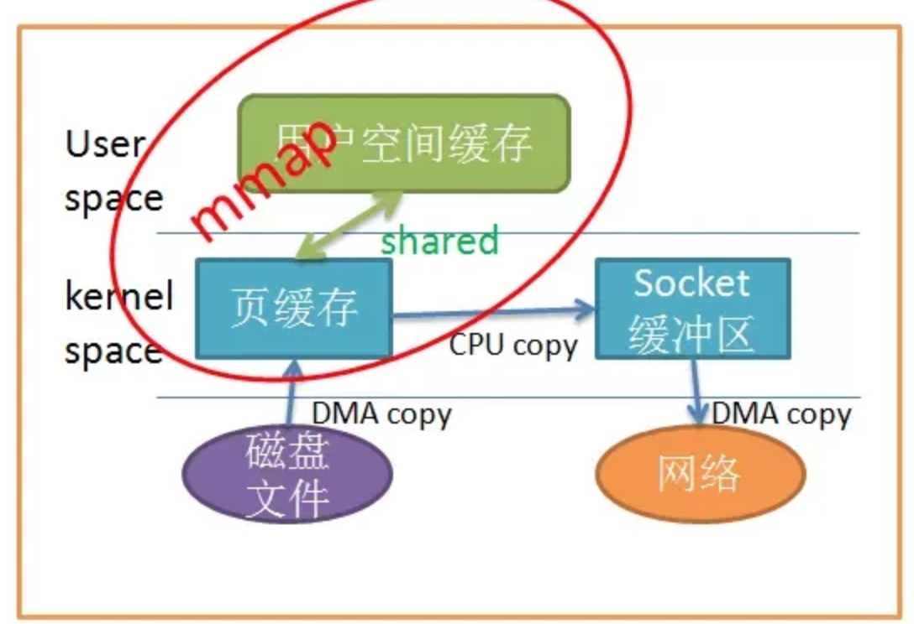

#### RocketMQ与Kafka

**1.kafka：**

- Kafka中的Message是以topic为基本单位组织的，不同的topic之间是相互独立的。每个topic又可以分成几个不同的partition(每个topic有几个partition是在创建topic时指定的)，每个partition存储一部分Message。

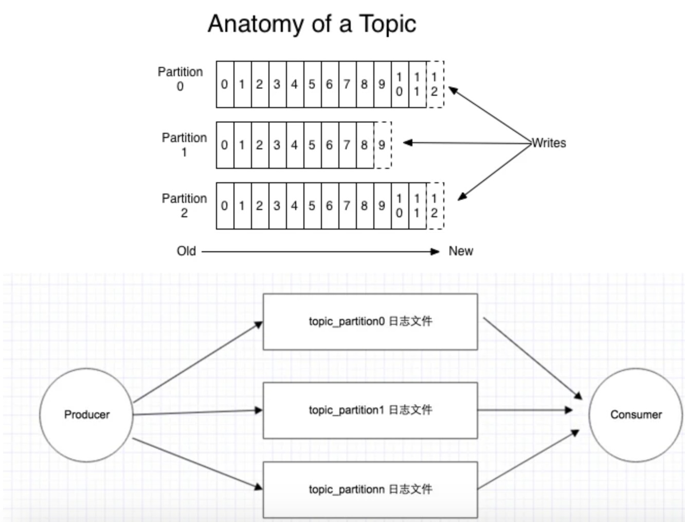

- 每个topic_partition对应一个日志文件夹（含log、index、timeindex、checkpoint等），Producer对该日志文件进行“顺序写”，新数据是添加在文件末尾（调用FileMessageSet的append方法），不论文件数据文件有多大，这个操作永远都是O(1)的；
- Consumer对该文件进行“顺序读”，这种存储方式，对于每个文件来说是顺序IO。
- 将I/O调用调成DeadLine或者NOOP，将更大的发挥kafka在顺序读写上的性能。
- 但是当并发的读写多个partition的时候，对应多个文件的顺序IO，表现在文件系统的磁盘层面，还是随机IO。因此出现了当partition或者topic个数过多时。

**2.RocketMQ**

- 官方介绍：“淘宝中间件团队在对Kafka做过充分Review之后，Kafka无限消息堆积，高效的持久化速度吸引了我们，但是同时发现这个消息系统主要定位于日志传输，对于使用在淘宝交易、订单、充值等场景下还有诸多特性不满足，为此我们重新用Java语言编写了RocketMQ”。
- RocketMQ采用了单一的日志文件，即把同1台机器上面所有topic的所有queue的消息，存放在一个文件里面，从而避免了随机的磁盘写入。

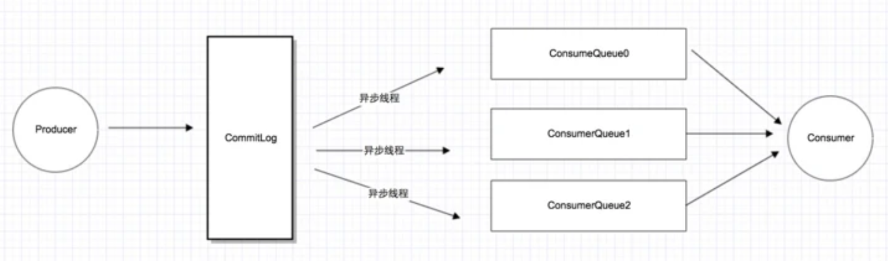

* 所有消息都存在一个单一的CommitLog文件里面，然后有后台线程异步的同步到ConsumeQueue，再由Consumer进行消费。

* RocketMQ这样处理有什么优缺点：
  * 队列轻量化，单个队列数据量非常少。对磁盘的访问串行化，避免磁盘竟争，不会因为队列增加导致IO WAIT增高。
  * 读一条消息，会先读ConsumeQueue，再读CommitLog，对于CommitLog的读变成了完全的随机读，并且增加了开销。

* RocketMQ如何处理CommitLog随机读：
  * 内存映射：RocketMQ中的文件读写主要就是通过MappedByteBuffer进行操作，来进行文件映射。利用了nio中的FileChannel模型，可以直接将物理文件映射到缓冲区，提高读写速度（RocketMQ并不会把所有的CommitLog都做映射，只会映射最新写入的文件）。
  * page cache：由于MQ的特性，几乎每次都需要获取一批连续的消息，可以很好的利用到操作系统的预读功能。

* kafka也用到了内存映射和page cache，为什么partition或者topic操作一定的量，性能就会急剧下降：

  * 内存映射采用LRU的方式，将热点数据放入内存，物理内存不足以处理文件时，就会经常跟磁盘做swap操作，从而导致性能下降。

  * 由于MQ的特性，热点数据基本上都是新发送的消息：由于PageCache的局部性热点原理且MQ整体情况下还是从旧到新的有序读，因此大部分情况下消息还是可以直接从Page Cache中读取，不会产生太多的缺页（Page Fault）中断而从磁盘读取。。

  * kafka将每个topic和partition拆成独立的各个文件，也就是会有很多个文件需要映射，写数据时，需要在不同的文件之间切换；由于数据分散为多个文件，很难利用IO层面的Group Commit机制，网络传输也会用到类似优化算法。。

  * RocketMQ都写在一个CommitLog文件内，热点数据几乎都是在同一个文件内，甚至热点数据可能都凑在一起，能更好的利用NOOP（合并操作）和更高的命中page  cache。ConsumerQueue文件虽然多，但是文件非常小，文件内每条记录只有20Byte，加载所有的ConsumerQueue文件并不需要很大的内容，相当于对ConsumerQueue的操作都是在内存里操作。

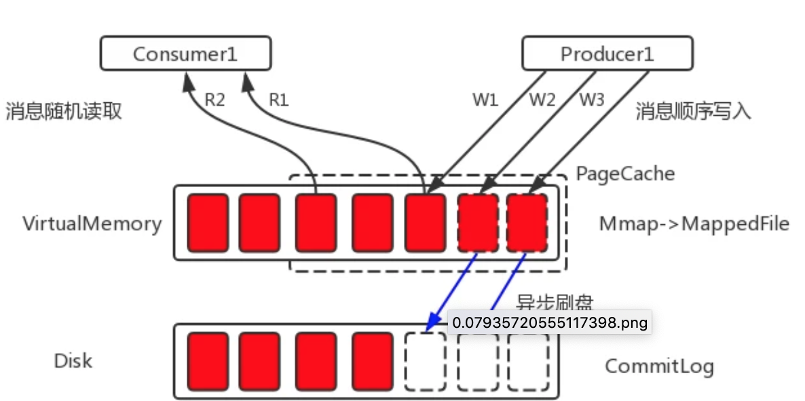

以上并不是说RocketMQ的设计比kafka更好，RocketMQ在存储上借鉴了kafka，很多地方原理是一样的；有人做了性能测试（[https://yq.aliyun.com/article...](https://link.segmentfault.com/?enc=Gsk8gSJDCRRehGhnRNzk%2FQ%3D%3D.6EPnOacEBF9FdvJPsR80XvJueLSPFPHygHTXlPXAEdmm0ZoSbjZl3f1i1tcKg%2Flj)），在topic/partition文件不多的情况下，kafka吞吐量优于RocketMQ一个量级，超过一定的量之后，RocktMQ吞吐量更优。

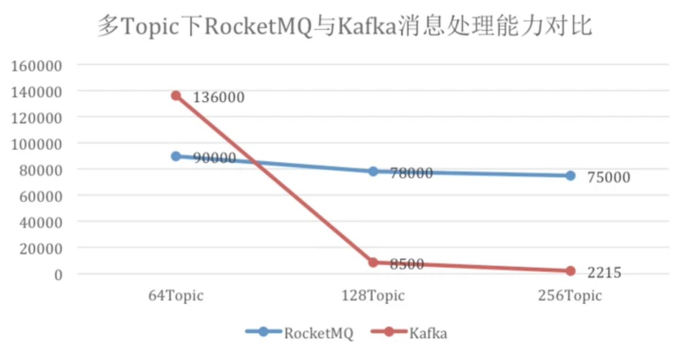

#### RocketMQ的实现

**1.CommitLog**

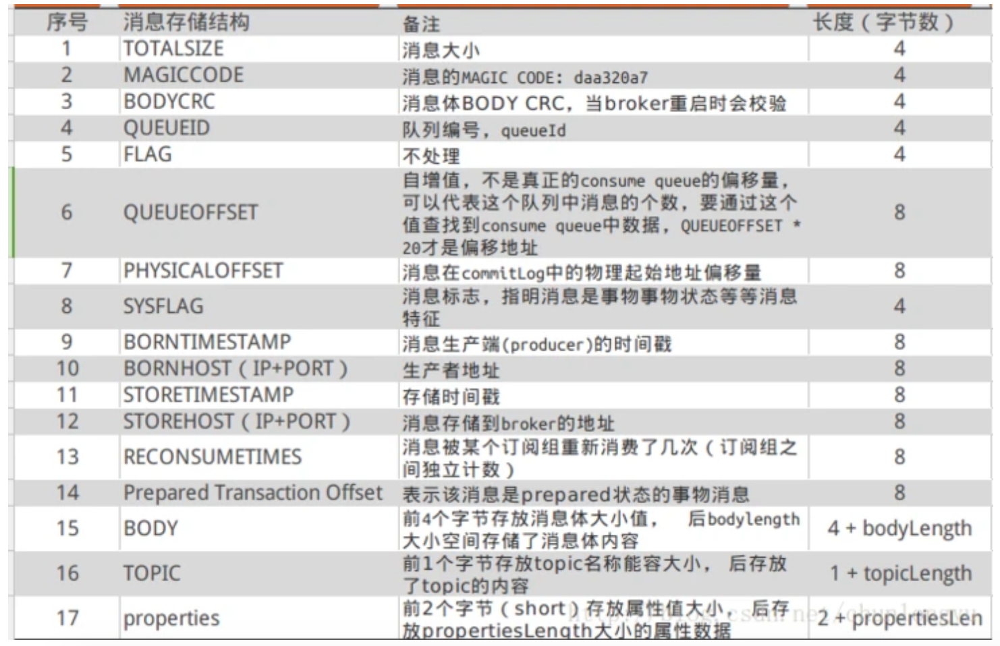

文件创建：

* RocketMQ在创建文件时，会完成文件的内存映射工作，并且会异步预先创建好下个文件和映射，文件大小为1G（默认，可配置，MappedByteBuffer最大只能操作2G文件）。

* 文件预热：调用Mmap进行内存映射后，OS只是建立虚拟内存地址至物理地址的映射表，而实际并没有加载任何文件至内存中。程序要访问数据时OS会检查该部分的分页是否已经在内存中，如果不在，则发出一次缺页中断。这里，可以想象下1G的CommitLog需要发生多少次缺页中断，才能使得对应的数据才能完全加载至物理内存中？：

  * 创建完文件之后，预先用默认字节填充（每隔4K写入一个byte‘0’，即每个内存页写入一个字节，跳跃式写入，缩减填充耗时），写入至mmap映射的内存空间里。

  * 调用系统mlock，将文件内容锁定在物理内存中，防止被swap到磁盘；对已写满的映射文件执行munlock（异步，延迟6秒）。

  * RocketMQ会调用madvise函数，这个函数会传入一个地址指针，已经一个区间长度，madvise会向内核提供一个针对于于地址区间的I/O的建议，内核可能会采纳这个建议，会做一些预读的操作。RocketMQ采用的是MADV_WILLNEED模式，它的效果是，对所有当前不在内存中的数据进行页面调度。

* 文件名20位长度的数字，数字值为当前文件起始偏移量（offset），前面补0，方便根据offset查找消息内容（后面会详细讲解）。

* 支持同步刷盘和异步刷盘：同步刷盘是每个内存页（page cache）刷一次；异步刷盘是数据先写入page cache后即返回，由其他线程异步定时批量刷入磁盘。

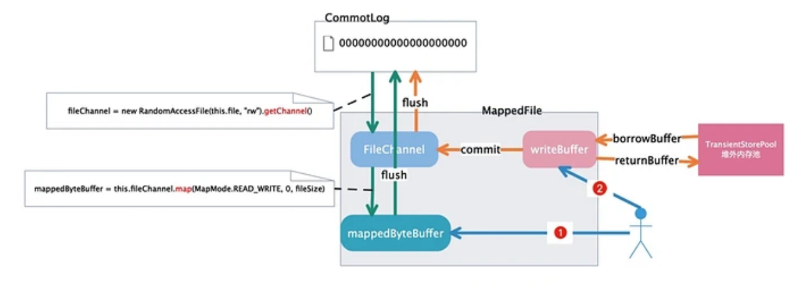

消息读写流程：

1. Producer发送消息：消息从socket进入java堆，从java堆转入page cache，物理内存，由异步线程刷盘，消息从PAGECACHE刷入磁盘。
2. Consumer拉消息(正常消费)，消息直接从page cache(数据在物理内存)转入socket，到达consumer，不经过java堆。这种消费场景最多，线上96G物理内存，按照1K消息算，可以在物理内存缓存1亿条消息。
3. Consumer拉消息(异常消费)，由于Socket访问了虚拟内存，产生缺页中断，此时会产生磁盘IO，从磁盘Load消息到page cache，然后直接从socket发出去。

**2.ConsumerQueue**

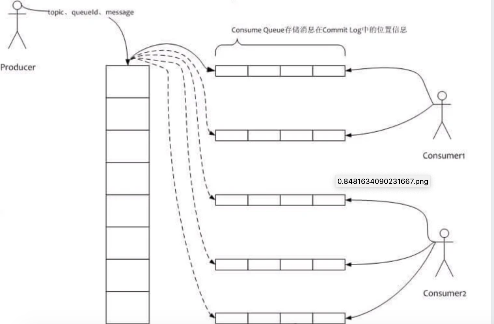

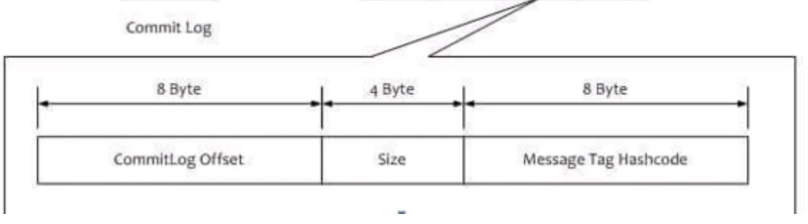

* 文件生成方式：
  * 线程每隔1毫秒，从CommitLog中同步未同步的记录，如果进程（程序）刚启动，同步记录分两种：

    * 配置成允许重复消息，则从第一个（没被删除的文件中，最早的文件）CommitLog的起始offset开始同步。

    * 如果配置成不允许同步，则从CommitLog最大的offset开始同步。

  * 同CommitLog一样，名字为queueOffset的起始值，20个数字长度，不足前面补零。

  * 同CommitLog一样，分同步刷盘和异步刷盘。

* consumerOffset.json文件会记下每个topic下的每个queue的消费进度。

* 文件内，每条记录20byte（8byte的CommitLog offset、4byte的消息长度、8字节的tag信息），单个文件为30W条记录，单文件大小为5.86M多；文件小，全部做内存映射也占用不了多少内存。

* 单文件顺序读取。

* 消息拉取查找：
  - Conumser拉取的时候，会带上QueueOffset，真实的文件偏移量offset是`queueOffset * 20`（每条记录20个字节大小，QueueOffset实际更像是序号）。
  - 根据文件名就能知道当前文件的起始offset。
  - 根据offset获取MappedFile，获取方式如下(过期的文件会删除，所以第一个文件的起始offset不一定是0)：
    1. int index = (int) ((offset / this.mappedFileSize) - (firstMappedFile.getFileFromOffset() / this.mappedFileSize));
    2. 以上获取不到，就遍历所有的MappedFile，对每个文件的起始offset和最终offset做比较。
  - 找到ComsumerQueue之后，根据offset能定位到详细的位置，取到对应的记录。
  - ConsumerQueue记录内，会包含CommitLog的offset，在以c步骤同样的方式找到对应的记录。

**3.Index**

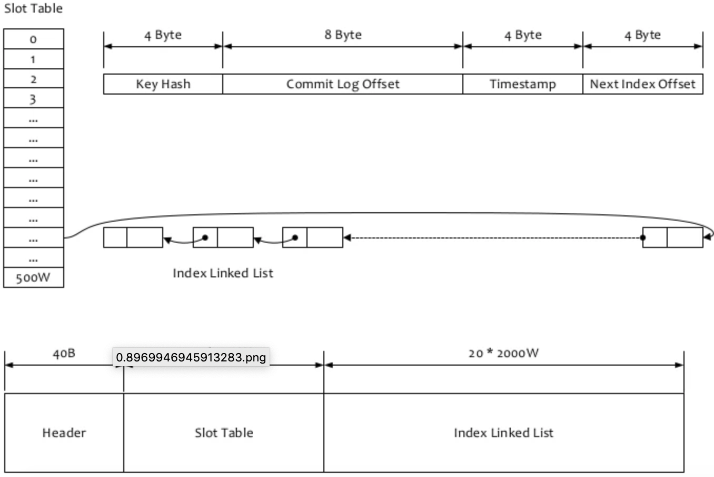

文件生成：

- 文件同步方式跟ConsumerQueue一样。
- 文件名为创建文件时的时间戳。
- 文件分为三部分：
  1. 40B的头部信息。
  2. 19M多的hash槽点（slot），每个槽大小为4B，共500W个槽点。
  3. 381M多的索引内容槽点，每个槽大小为20B，共2000W个槽点。
- 头部信息如下：
    		1. beginTimestamp和endTimestamp分别是文件内包含的索引内容的起始时间和结束时间
    		2. beginPhyOffset和endPhyOffset分别是文件内包含的索引内容的起始偏移量和结束偏移量。
    		3. hashslotcount和indexCount记录当前hash槽点和索引内容槽点的数据量。

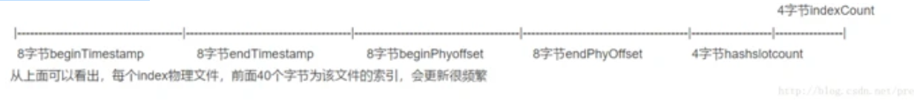

* hash槽点的值为索引内容的序号。

* 索引内存槽点的值如下：

  1. 4位int值，存储的是的key的hash值。

  2. 8位long值，存储的是消息在commitlog的物理偏移量phyOffset。

  3. 4位int值，存储了当前消息跟索引文件中第一个消息在broker落地的时间（beginTimestamp）差。

  4. 4位int值，如果存在hash冲突，存储的是上一个消息的索引地址

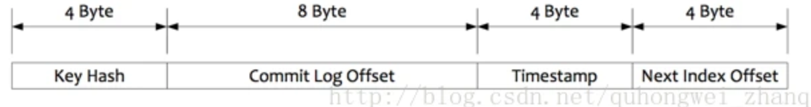

* 内容插入：
  1. 判断最新的索引文件数据是否已满（索引内容数大于等于2000W），如果已满，则创建新文件。
  2. 根据消息的key生成的hash值，找到对应的hash槽点（hashcode % 500W），取当前槽点的值，如果值非默认值，即存在hash冲突，值是上一个消息的索引地址。
  3. index文件起始空白位填入20位的内容，将hash槽点值设成当前内容的序号（每插入一条，序号加1）。
* 内容查找：
  - 根据时间获取到相应的索引文件。
  - 根据消息的key生成的hash值，获取到相应的hash槽点，取文件的`40B + 槽点值 * 4`的值为偏移量，得到索引内容的序号。
  - 取`40B + 500W * 4 + 索引序号 * 20`起的20个字节为索引内容。
  - 根据内容里的CommitLog的offset查找消息内容，方式同ConsumerQueue一样。

