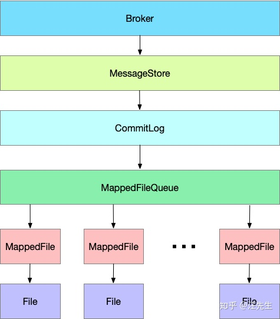

# rocketmq源码分析-消息存储

## **二：存储设计**

试想一下，如果让你来设计消息的存储，你会如何设计呢？

- 首先我们肯定需要有块内存缓冲区，用来接收消息
- 但是内存毕竟有限，当消息大量堆积的时候，全放在内存肯定是不合适的，所以我们肯定需要将消息从内存写到文件中。
- 如果所有消息全都存放到一个文件中，消息检索会很耗时，过期消息的清理也会很麻烦，所以消息肯定要进行多文件存储。

其实 RocketMQ 大概就是按照上面这样去实现的：

**每个Broker都对应有一个MessageStore，专门用来存储发送到它的消息，不过MessageStore本身不是文件，只是存储的一个抽象，MessageStore 中保存着一个 CommitLog，CommitLog 维护了一个 MappedFileQueue，而MappedFileQueue  中又维护了多个  MappedFile，每个MappedFile都会映射到文件系统中一个文件，这些文件才是真正的存储消息的地方，MappedFile的文件名为它记录的第一条消息的全局物理偏移量**



## **二：源码分析**

**3.1 消息接收**

Broker对于每个请求 Code，都注册了对应的处理类，其中用于接收消息的处理类为：SendMessageProcessor

```java
this.remotingServer.registerProcessor(RequestCode.SEND_MESSAGE, sendProcessor, this.sendMessageExecutor);
this.remotingServer.registerProcessor(RequestCode.SEND_MESSAGE_V2, sendProcessor, this.sendMessageExecutor);
```

SendMessageProcessor 实现了 NettyRequestProcessor  接口，并在接口方法processRequest（）中处理接收到的请求：

```java
public RemotingCommand processRequest(ChannelHandlerContext ctx,RemotingCommand request) throws RemotingCommandException {
    RemotingCommand response = null;
    try {
        response = asyncProcessRequest(ctx, request).get();
    } catch (InterruptedException | ExecutionException e) {
        log.error("process SendMessage error, request : " + request.toString(), e);
    }
    return response;
}
```

```java
public CompletableFuture<RemotingCommand> asyncProcessRequest(ChannelHandlerContext ctx,
                                                              RemotingCommand request) throws RemotingCommandException {
    final SendMessageContext mqtraceContext;
    switch (request.getCode()) {
        case RequestCode.CONSUMER_SEND_MSG_BACK:
            return this.asyncConsumerSendMsgBack(ctx, request);
        default:
            SendMessageRequestHeader requestHeader = parseRequestHeader(request);
            if (requestHeader == null) {
                return CompletableFuture.completedFuture(null);
            }
            mqtraceContext = buildMsgContext(ctx, requestHeader);
            this.executeSendMessageHookBefore(ctx, request, mqtraceContext);
            if (requestHeader.isBatch()) {
                return this.asyncSendBatchMessage(ctx, request, mqtraceContext, requestHeader);
            } else {
              //broker 处理消息
                return this.asyncSendMessage(ctx, request, mqtraceContext, requestHeader);
            }
    }
}
```

**3.2 消息存储**

接收到消息请求后，就要处理请求了，上面调用了sendMessage（）来处理消息。

***SendMessageProcessor 中 sendMessage（）中主要分为下面几步：\***

1：根据收到请求，封装成内部消息结构：MessageExtBrokerInner。

```java
MessageExtBrokerInner msgInner = new MessageExtBrokerInner();
//主题
msgInner.setTopic(requestHeader.getTopic());
//队列id
msgInner.setQueueId(queueIdInt);

if (!handleRetryAndDLQ(requestHeader, response, request, msgInner, topicConfig)) {
    return CompletableFuture.completedFuture(response);
}
//消息
msgInner.setBody(body);
msgInner.setFlag(requestHeader.getFlag());
Map<String, String> origProps = MessageDecoder.string2messageProperties(requestHeader.getProperties());
MessageAccessor.setProperties(msgInner, origProps);
msgInner.setBornTimestamp(requestHeader.getBornTimestamp());
msgInner.setBornHost(ctx.channel().remoteAddress());
msgInner.setStoreHost(this.getStoreHost());
msgInner.setReconsumeTimes(requestHeader.getReconsumeTimes() == null ? 0 : requestHeader.getReconsumeTimes());
```

2：调用 Broker 中 的MessageStore的putMessage（）方法，将消息放入MessageStore中。

```java
putMessageResult = this.brokerController.getMessageStore().asyncPutMessage(msgInner);
```

前面我们已经提过，每个Broker都有一个MessageStore实例，MessageStore本身是一个接口，定义了一些用来存储消息的接口协议，RocketMQ中MessageStore默认的实现类为DefaultMessageStore，Broker在其初始化方法initialize（）中便会初始化好DefaultMessageStore。

***DefaultMessageStore 中\*** ***putMessage（）逻辑又分为下面几步：\***

1：检查当前Broker是否可以存储消息，比如 MessageStore 被关闭、Broker 状态为 Slave 都会拒绝存储。

```java
private PutMessageStatus checkStoreStatus() {
  //是否关闭
    if (this.shutdown) {
        log.warn("message store has shutdown, so putMessage is forbidden");
        return PutMessageStatus.SERVICE_NOT_AVAILABLE;
    } else {
        long value;
      	//如果是slave，返回不可用状态
        if (BrokerRole.SLAVE == this.messageStoreConfig.getBrokerRole()) {
            value = this.printTimes.getAndIncrement();
            if (value % 50000L == 0L) {
                log.warn("broke role is slave, so putMessage is forbidden");
            }

            return PutMessageStatus.SERVICE_NOT_AVAILABLE;
          //检查是否可写
        } else if (!this.runningFlags.isWriteable()) {
            value = this.printTimes.getAndIncrement();
            if (value % 50000L == 0L) {
                log.warn("the message store is not writable. It may be caused by one of the following reasons: the broker's disk is full, write to logic queue error, write to index file error, etc");
            }

            return PutMessageStatus.SERVICE_NOT_AVAILABLE;
        } else {
            this.printTimes.set(0L);
            return this.isOSPageCacheBusy() ? PutMessageStatus.OS_PAGECACHE_BUSY : PutMessageStatus.PUT_OK;
        }
    }
}
```

2：检查消息合法性，比如消息的Topic长度和内容长度是否超出限制。这种情况下也会拒绝存储。

```java
private PutMessageStatus checkMessage(MessageExtBrokerInner msg) {
  	//检查主题长度
    if (msg.getTopic().length() > 127) {
        log.warn("putMessage message topic length too long " + msg.getTopic().length());
        return PutMessageStatus.MESSAGE_ILLEGAL;
      //检查消息长度
    } else if (msg.getPropertiesString() != null && msg.getPropertiesString().length() > 32767) {
        log.warn("putMessage message properties length too long " + msg.getPropertiesString().length());
        return PutMessageStatus.MESSAGE_ILLEGAL;
    } else {
        return PutMessageStatus.PUT_OK;
    }
}
```

3：如果消息通过了上面的重重考验，便会被提交给 MessageStore 中的 CommitLog，进行下一步处理。

```java
PutMessageResult result = this.commitLog.putMessage(msg);
```

消息到了CommitLog后，便要开始进入存储逻辑了。我们来看看CommitLog中是如何处理消息的。

***CommitLog 中的 PutMessage（）大概步骤如下：\***

1：获取写锁，保证同一时刻只处理一条消息的存储操作。

```java
putMessageLock.lock();
```

2：从CommitLog的Message 中获取最新的MappedFile，追加消息。

```java
MappedFile mappedFile = this.mappedFileQueue.getLastMappedFile();
if (null == mappedFile || mappedFile.isFull()) {
    mappedFile = this.mappedFileQueue.getLastMappedFile(0L);
}
result = mappedFile.appendMessage(msg, this.appendMessageCallback);
```

前面介绍到，CommitLog 中保存了一个MappedFileQueue，MappedFileQueue  初始化的时候配置了消息文件MappedFile的存储路径以及单个MappedFile文件的大小，当某个消息文件写满后，便会生成一个新的MappedFile继续写入消息，所以MappedFileQueue中会按照消息写入时间顺序，维护多个MappedFile。

3：消息追加结束后，释放写锁

```java
putMessageLock.unlock();
```

**上面这几步中，我们重点要关注的便是第2步，即将消息追加到当前最新的MappedFile中。**

上面追加消息调用的是MappedFile.appendMessage（）方法，此方法最终调用到MappedFile.appendMessagesInner（）中：

```java
public AppendMessageResult appendMessagesInner(MessageExt messageExt, AppendMessageCallback cb, PutMessageContext putMessageContext) {
    assert messageExt != null;

    assert cb != null;
		//获取当前文件的写入位置
    int currentPos = this.wrotePosition.get();
  	//如果当前文件还没有写满
    if (currentPos < this.fileSize) {
        ByteBuffer byteBuffer = this.writeBuffer != null ? this.writeBuffer.slice() : this.mappedByteBuffer.slice();
        byteBuffer.position(currentPos);
        AppendMessageResult result;
        if (messageExt instanceof MessageExtBrokerInner) {
            result = cb.doAppend(this.getFileFromOffset(), byteBuffer, this.fileSize - currentPos, (MessageExtBrokerInner)messageExt, putMessageContext);
        } else {
            if (!(messageExt instanceof MessageExtBatch)) {
                return new AppendMessageResult(AppendMessageStatus.UNKNOWN_ERROR);
            }
						//追加
            result = cb.doAppend(this.getFileFromOffset(), byteBuffer, this.fileSize - currentPos, (MessageExtBatch)messageExt, putMessageContext);
        }

        this.wrotePosition.addAndGet(result.getWroteBytes());
        this.storeTimestamp = result.getStoreTimestamp();
        return result;
    } else {
        log.error("MappedFile.appendMessage return null, wrotePosition: {} fileSize: {}", currentPos, this.fileSize);
        return new AppendMessageResult(AppendMessageStatus.UNKNOWN_ERROR);
    }
}
```

**我们来分析下appendMessagesInner（）中追加的的逻辑：**

1：获取MappedFile中的 writeBuffer，如果 writeBuffer 为空，则获取mappedByteBuffer。

在MessageStore 初始化的时候，会初始化一个Buffer缓存池：**TransientStorePool**，TransientStorePool在初始化时会初始化若干DirectBuffer，放入一个Deque中，默认池子容量为5。MappedFile的writeBuffer就是从这个池子中获取的。
mappedByteBuffer 类型为 MappedByteBuffer，前面说到每个MappedFile都会映射到文件系统中的一个文件，mappedByteBuffer 即为该文件在内存中的映射。
当追加消息到MappedFile中，会优先追加到 writeBuffer中。

```java
public void init() {
    for(int i = 0; i < this.poolSize; ++i) {
        ByteBuffer byteBuffer = ByteBuffer.allocateDirect(this.fileSize);
        long address = ((DirectBuffer)byteBuffer).address();
        Pointer pointer = new Pointer(address);
        LibC.INSTANCE.mlock(pointer, new NativeLong((long)this.fileSize));
        this.availableBuffers.offer(byteBuffer);
    }
}
```

2：调用 cb.doAppend（）追加消息，调用该方法时，传入了下面几个参数

* **his.getFileFromOffset()：**MappedFile的全局消息物理偏移量。
* **byteBuffer：**即MappedFile的内存缓冲区。
* **this.fileSize - currentPos：**fileSize为单个文件的额定大小，默认为1GB；currentPos为当前文件中已经写到什么位置，两个相减即为当前文件剩余容量。
* **(MessageExtBrokerInner) messageExt：**内部封装好的消息。

**doAppend（）主要逻辑如下：**

1：计算消息存储的各个属性，如消息长度，消息在消息队列中的长度等。

```java
String msgId = MessageDecoder.createMessageId(this.msgIdMemory, msgInner.getStoreHostBytes(hostHolder), wroteOffset);

// Record ConsumeQueue information
keyBuilder.setLength(0);
keyBuilder.append(msgInner.getTopic());
keyBuilder.append('-');
keyBuilder.append(msgInner.getQueueId());
String key = keyBuilder.toString();
Long queueOffset = CommitLog.this.topicQueueTable.get(key);
......
final byte[] topicData = msgInner.getTopic().getBytes(MessageDecoder.CHARSET_UTF8);
final int topicLength = topicData.length;

final int bodyLength = msgInner.getBody() == null ? 0 : msgInner.getBody().length;

final int msgLen = calMsgLength(bodyLength, topicLength, propertiesLength);
```

2：判断消息追加后是否超过单个MappedFile大小，如果超出，则返回状态码：AppendMessageStatus.*END_OF_FILE*

```java
// Determines whether there is sufficient free space
if ((msgLen + END_FILE_MIN_BLANK_LENGTH) > maxBlank) {
    this.resetByteBuffer(this.msgStoreItemMemory, maxBlank);
    // 1 TOTALSIZE
    this.msgStoreItemMemory.putInt(maxBlank);
    // 2 MAGICCODE
    this.msgStoreItemMemory.putInt(CommitLog.BLANK_MAGIC_CODE);
    // 3 The remaining space may be any value
    // Here the length of the specially set maxBlank
    final long beginTimeMills = CommitLog.this.defaultMessageStore.now();
    byteBuffer.put(this.msgStoreItemMemory.array(), 0, maxBlank);
    return new AppendMessageResult(AppendMessageStatus.END_OF_FILE, wroteOffset, maxBlank, msgId, msgInner.getStoreTimestamp(),
        queueOffset, CommitLog.this.defaultMessageStore.now() - beginTimeMills);
}
```

此时 CommitLog 会新创建一个MappedFile，重新追加消息。

```java
switch (result.getStatus()) {
    ......
    case END_OF_FILE:
        unlockMappedFile = mappedFile;
        // Create a new file, re-write the message
        mappedFile = this.mappedFileQueue.getLastMappedFile(0);
        if (null == mappedFile) {
            // XXX: warn and notify me
            log.error("create mapped file2 error, topic: " + msg.getTopic() + " clientAddr: " + msg.getBornHostString());
            beginTimeInLock = 0;
            return new PutMessageResult(PutMessageStatus.CREATE_MAPEDFILE_FAILED, result);
        }
        result = mappedFile.appendMessage(msg, this.appendMessageCallback);
        break;
}
```

3：序列化消息内容，存储到内存缓存区中

```java
// Initialization of storage space
this.resetByteBuffer(msgStoreItemMemory, msgLen);
// 1 TOTALSIZE
this.msgStoreItemMemory.putInt(msgLen);
// 2 MAGICCODE
this.msgStoreItemMemory.putInt(CommitLog.MESSAGE_MAGIC_CODE);
// 3 BODYCRC
this.msgStoreItemMemory.putInt(msgInner.getBodyCRC());
// 4 QUEUEID
this.msgStoreItemMemory.putInt(msgInner.getQueueId());
// 5 FLAG
this.msgStoreItemMemory.putInt(msgInner.getFlag());
// 6 QUEUEOFFSET
this.msgStoreItemMemory.putLong(queueOffset);
// 7 PHYSICALOFFSET
this.msgStoreItemMemory.putLong(fileFromOffset + byteBuffer.position());
// 8 SYSFLAG
this.msgStoreItemMemory.putInt(msgInner.getSysFlag());
// 9 BORNTIMESTAMP
this.msgStoreItemMemory.putLong(msgInner.getBornTimestamp());
// 10 BORNHOST
this.resetByteBuffer(hostHolder, 8);
this.msgStoreItemMemory.put(msgInner.getBornHostBytes(hostHolder));
// 11 STORETIMESTAMP
this.msgStoreItemMemory.putLong(msgInner.getStoreTimestamp());
// 12 STOREHOSTADDRESS
this.resetByteBuffer(hostHolder, 8);
this.msgStoreItemMemory.put(msgInner.getStoreHostBytes(hostHolder));
//this.msgBatchMemory.put(msgInner.getStoreHostBytes());
// 13 RECONSUMETIMES
this.msgStoreItemMemory.putInt(msgInner.getReconsumeTimes());
// 14 Prepared Transaction Offset
this.msgStoreItemMemory.putLong(msgInner.getPreparedTransactionOffset());
// 15 BODY
this.msgStoreItemMemory.putInt(bodyLength);
if (bodyLength > 0)
    this.msgStoreItemMemory.put(msgInner.getBody());
// 16 TOPIC
this.msgStoreItemMemory.put((byte) topicLength);
this.msgStoreItemMemory.put(topicData);
// 17 PROPERTIES
this.msgStoreItemMemory.putShort((short) propertiesLength);
if (propertiesLength > 0)
    this.msgStoreItemMemory.put(propertiesData);

final long beginTimeMills = CommitLog.this.defaultMessageStore.now();
// Write messages to the queue buffer
byteBuffer.put(this.msgStoreItemMemory.array(), 0, msgLen);
```

4：返回追加成功的结果

```java
AppendMessageResult result = new AppendMessageResult(AppendMessageStatus.PUT_OK, wroteOffset, msgLen, msgId,
msgInner.getStoreTimestamp(), queueOffset, CommitLog.this.defaultMessageStore.now() - beginTimeMills);
```

## **四：总结**

总结一下，RocketMQ 会创建多个MappedFile用来存储文件，每个MappedFile大小固定，有自己的内存缓冲区和对应的系统文件，所有的MappedFile由CommitLog中的MappedFileQueue统一维护。