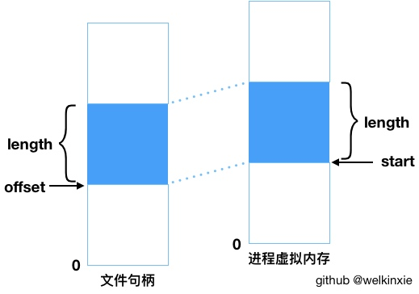

# 内存映射

## mmap

 **mmap** ，也就是内存映射 。内存映射是将一个虚拟内存区域与一个磁盘上的对象关联起来，以初始化这个虚拟内存区域的内容的过程。

### 1.1 基础概念

先讲下内存映射里的一些概念。

虚拟内存区域可以映射以下两种类型的对象：

1. 普通文件：即磁盘文件中的一块 **连续** 的区域。
2. 匿名文件：一个由内核创建的全为 **二进制零** 的文件。当CPU首次引用此区域时，将以二进制零填充到页表中。

系统为每个进程提供了单独的页表，从而也实现了进程间数据访问权限的管理以及数据的保护。通过内存映射的机制，将对象作为 **共享对象** 映射到两个进程的虚拟内存亦可实现数据的共享。


### 2.2 使用方式

然后先讲下如果我们应该如何通过内存映射的方式来访问文件。 **mmap()** 的函数定义如下：

```c
void * mmap(void *start, size_t length, int prot, int flags, int fd, off_t offset)
```

其中参数的含义分别是：

    start: 期望的进程虚拟内存起始位置，填 NULL 时由内核来决定起始位置
    length: 需要映射的对象字节大小
    fd: 文件句柄
    offset: 距离文件开始处的偏移量
    prot: 映射对象的访问权限，用于可指定是否可读写、执行。
    flags: 映射对象的类型，例如指定是映射普通文件还是请求二进制零、映射共享对象还是私有的写时复制对象等。


1.3 读取过程

当我们通过 mmap 读取文件时，将经历以下步骤：

1. 在当前用户虚拟内存空间中分配一片 指定映射大小 的虚拟内存区域
2. 将磁盘中的文件映射到这片内存区域，等待后续 按需 进行页面调度
3. 当CPU真正访问数据时，触发 缺页异常 将所需的数据页从磁盘拷贝到物理内存，并将物理页地址记录到页表。
4. 进程通过页表得到的物理页地址访问文件数据。


而作为对比，当通过 **标准IO** 读取一个文件时，步骤为：

1. 将 **完整** 的文件从磁盘拷贝到物理内存（内核空间）。
2. 将完整文件数据从 **内核空间** 拷贝到 **用户空间** 以供进程访问。


2.4 优劣

通过上面 mmap 与 标准IO 的对比，不难发现调用mmap具有以下的优势：

1. 物理内存占用延后：数据直到真正被使用时才会发生拷贝。
2. 物理内存占用减少：对于同一份文件无需在物理内存中存放两份，且文件区被划分成片，缺页异常时只将所需的页拷贝到物理内存。
3. 方便实现跨进程数据交互、共享：当映射到虚拟内存的对象被设置为共享对象，则不同进程对映射对象的写操作相互可见

然而也能发现 mmap 存在以下 劣势 ：

1. 无法映射变长文件：调用mmap()时需指定要映射的文件位置和需要映射的大小范围。
2. 如果需要映射的文件过大，会导致过度占用虚拟内存：在调用mmap()后，虚拟内存空间就创建了，此时虽然不会占用物理内存，但依然会占用虚拟内存。此时可考虑只映射文件中自己需要的部分。

由此，当我们需要访问一个比较大的文件，尤其是当我们只需要访问其中的一小部分数据的时候，我们可以尝试通过 mmap 的方式来进行访问，减少由于该文件过大而对物理内存的过度占用。


https://blog.csdn.net/kongliand/article/details/110879099?spm=1001.2101.3001.6650.1&utm_medium=distribute.pc_relevant.none-task-blog-2%7Edefault%7ECTRLIST%7ERate-1.pc_relevant_aa&depth_1-utm_source=distribute.pc_relevant.none-task-blog-2%7Edefault%7ECTRLIST%7ERate-1.pc_relevant_aa&utm_relevant_index=2

