 ### 消息队列

#### 消息队列的作用

* 业务解耦：将模块间的RPC调用改为通过消息队列中转，解除系统间的耦合。

  作用：提升系统稳定性，通过广播消息避免多次调用，提供编码效率。

  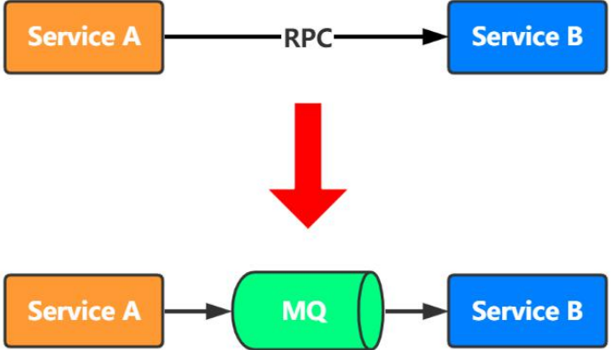

  

* 异步调用：对于无需关注调用结果的场景，可以通过消息队列异步处理。

  未使用消息队列前，全部使用rpc调用：

  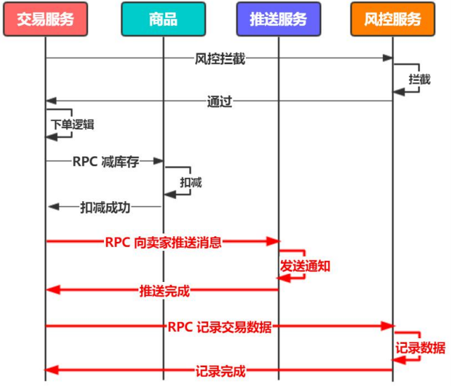

  如下图，使用消息队列后，向卖家推消息和记录交易数据通过mq来异步调用：

  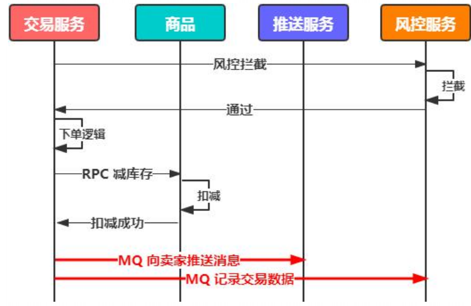

* 流量削峰：系统的吞吐量往往取决于底层存储服务的处理能力，数据访问层可以调整消费速度缓解存储服务压力，避免短暂的高峰将系统压垮。

  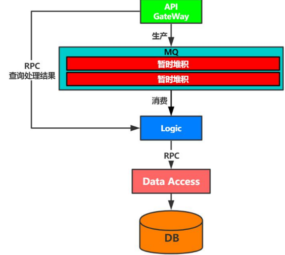

#### 对系统架构的影响

* 系统可用性，系统依赖于mq，mq的不可用会影响系统的可用性。
* 架构复杂度。
* 排查问题路径。

#### RocketMQ架构

* Broker 主从部署，自身信息注册在NameServer中。
* Client从NameServer中获取Broker信息。
* NameServer节点相互独立，无数据交互。

拓扑图：Broker Master 和Broker Slave 都向Name Server集群注册，Producer集群从Name Server集群获取Broker 集群信息，然后向Broker Master写入数据；Consumer同样从Name Server拉取集群信息，同时向Broker Master 和Broker Slave注册监听，这样的好处是当master不可用时，Consumer 还可以读取数据

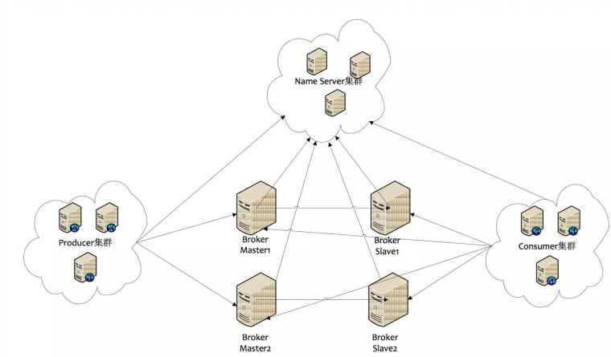

RocketMQ架构图：

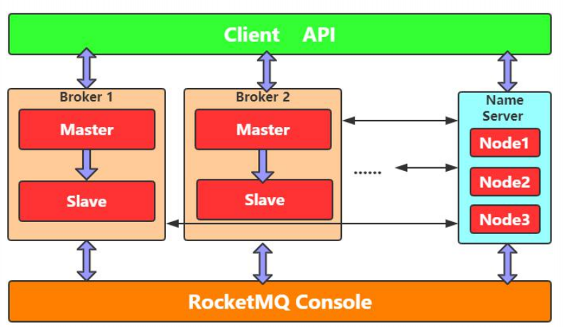

#### 消息存储

* CommitLog：存储信息主体。生产者顺序写入到CommitLog文件中。当CommitLog文件过大时，会对该文件进行切割，默认是1G。消费者在读消息时，可以将分割后的文件加载到内存中。
* ConsumeQueue：消息消费队列。RocketMQ通过dispatch顺序将消息的迁移位置，消息的大小分发到消息队列，然后消费者通过迁移位置读取真正的消息。minOffset最小消息迁移位置表示在队列中已读取还没有提交的数据，consumerOffset还没有读取的消息，maxOffset队列的最大位置。
* IndexFile：消息索引位置。

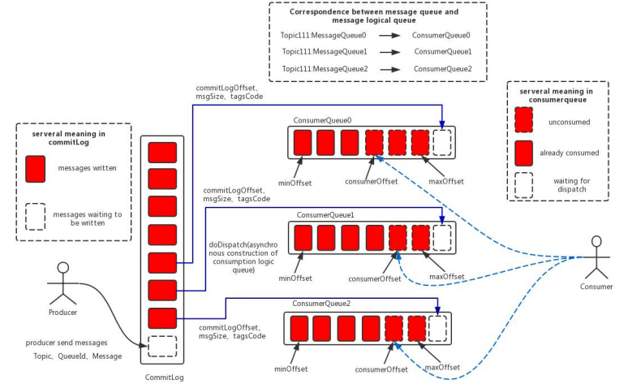

#### 特性分析

* 可靠性分析，可靠性分为写入master的刷盘时机和master同步到slave的方式。

  * 同步刷盘：当消息存储到硬盘后，再返回ack。性能低，可靠性高。

    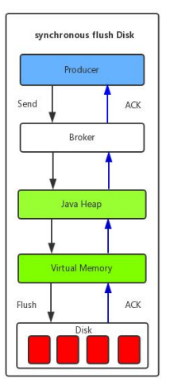

  * 异步刷盘：性能高，可靠性低。

    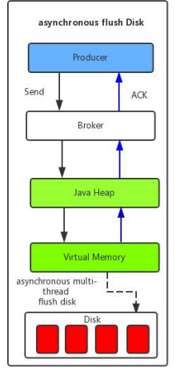

  * 异步复制：master异步复制到从库。

  * 同步双写：mater和slave写成功后才返回ack

* 可用性分析。

  * 单Master模式。开发、测试环境使用。
  * 多Master模式。Master不可用，因为没有slave，可能会导致数据丢失。
  * 多Master多Slave模式-异步复制。主从模式，Master宕机，Broker可读不可写。
  * 多Master多Slave模式-同步双写。

* 生产方式：

  * 同步(sync)：生成者发送消息到队列后，同步阻塞等待broker响应。
  * 异步(aync)：异步回传响应。
  * 单向(oneway)：生成者将消息发送到队列，不管消息有没有丢失。

* 消费方式：

  * push：消息队列主动将消息推送给消费者。消息实时性高，但没有考虑客户端的消费能力。
  * pull：由消费者客户端主动向消息队列拉取消息。消息实时性低，可能造成大量无效请求。

  RecketMQ的消费模式属于拉模式，但是使用了一种长轮询机制，来平衡上面的push/pull模型的各自缺点。

  * LongPoll：Consumer发送拉取消息，Broker hold住请求，直到有新消息再返回；如果请求超时，Consumer再次发起请求，请求超时默认30s。

  **消息消费方式**

  > Group 内竞争Group间广播

  * 集群消费：集群内竞争消费，单条消息只消费一次，各节点均匀消费Topic的消息
  * 广播消费：各集群消费全量的消息，单条消息在每个集群都会被消费一次。

* 负载均衡

  * Producer端负载均衡：

    定时获取Queue信息。

    负载均衡算法：随机递增取模

    容错机制：故障延迟。发送队列失败会进行重试，重试时间一次比一次长。

  * Consumer端负载均衡：

    客户端定时上报心跳，

    定时Rebalance(20s)，即重新负载均衡:

    * 获取队列信息

    * 获取消费者信息

    * 排序平均消费

      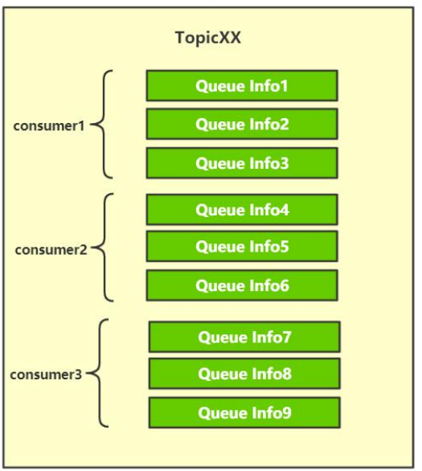

* 消费失败策略：消费失败后，消息会被投递到重试队列，如果重试还是一直失败，说明客户端无法消费该信息，将消息投递到死信队列，等待运营处理。

  * 重试16次。
  * 重试时间间隔递增
  * 失败进入死信队列。

  实现原理：

  * 自动创建失败消息主题
  * 客户端默认订阅
  * 结合延时消息实现重试间隔

   

#### 事务消息

* 强一致性协议

  * 两阶段提交2pc

    **提交请求(投票)阶段**

    * 协调者向所有参与者发送Prepare请求与事务内容，询问是否可以准备事务提交，并等待参与者的响应。
    * 参与者执行事务中包含的操作，并记录undo日志(用于回滚)和redo日志(用于重放)，但不真正提交。
    * 参与者向协调者返回事务操作的执行结果，执行成功返回yes，否则返回no。

    **提交(执行)阶段**

    若第一阶段所有参与者都返回yes，说明事务可以提交：

    * 协调者向所有参与者发送commit请求。
    * 参与者收到commit请求后，将事务真正地提交上去，并释放占用的事务资源，并向协调者返回ack。
    * 协议者收到所有参与者的ack消息，事务成功完成。

    若第一阶段返回no或者超时返回，需要回滚

    * 协调者向所有参与者发送rollback请求。
    * 参与者收到rollback请求后，根据undo日志回滚到事务执行前的状态，释放占用的事务资源，并向协调者返回ack。
    * 协调者收到所有参与者的ack消息，事务回滚完成。

    **缺陷**

    * 同步阻塞：算法执行过程中，所有节点都处于阻塞状态，所有节点持有的资源都处于封锁状态。
    * 单点故障：协调者一旦发生故障，参与者会一直阻塞下去，尤其第二阶段，所有的参与者都处于锁定事务资源的状态中，无法继续完成事务操作(如果协调者挂掉，可以重新选举一个协调者，但是无法解决因为协调者宕机导致的参与者处于阻塞状态的问题)。
    * 数据不一致性：在第二阶段，当协调者向参与者发送commit请求之后，发生了局部网络异常或者在发送commit请求过程中协调者发生了故障，导致只有一部分参与者接受到了commit请求。接到commit请求的参与者会执行commit操作，但是其他部分未接到commit请求的机器则无法执行事务提交，于是整个分布式系统便出现了数据部一致性的现象。
    * 二阶段无法解决的问题：协调者再发出commit消息之后宕机，而唯一接收到这条消息的参与者同时也宕机了。那么即使协调者通过选举协议产生了新的协调者，这条事务的状态也是不确定的，没人知道事务是否被已经提交

    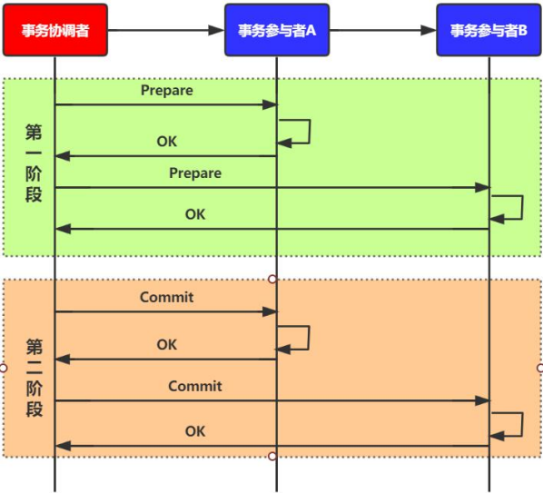

  * 三阶段提交

    与两阶段提交不同的是，三阶段提交有两个改动点：

    1、引入超时机制。同时在协调者和参与者中都引入超时机制。
    2、在第一阶段和第二阶段中插入一个准备阶段。保证了在最后提交阶段之前各参与节点的状态是一致的。

    **第一阶段**

     1.事务询问 协调者向参与者发送Prepare请求。询问是否可以执行事务提交操作。然后开始等待参与者的响应。

     2.响应反馈 参与者接到Prepare请求之后，正常情况下，如果其自身认为可以顺利执行事务，则返回OK响应，并进入预备状态。否则反馈No

    **第二阶段**

    假如第一阶段协调者从所有的参与者获得的反馈都是OK响应，那么就会执行事务的预执行

    1.发送预提交请求 协调者向参与者发送PreCommit请求，并进入Prepared阶段。

    2.事务预提交 参与者接收到PreCommit请求后，会执行事务操作，并将undo和redo信息记录到事务日志中。

    3.响应反馈 如果参与者成功的执行了事务操作，则返回ACK响应，同时开始等待最终指令。

    假如有任何一个参与者向协调者发送了No响应，或者等待超时之后，协调者都没有接到参与者的响应，那么就执行事务的中断

     1.发送中断请求 协调者向所有参与者发送abort请求。

     2.中断事务 参与者收到来自协调者的abort请求之后（或超时之后，仍未收到协调者的请求），执行事务的中断

    **第三阶段**

    该阶段进行真正的事务提交，也可以分为以下两种情况。

    执行提交

    1.发送提交请求： 协调接收到参与者发送的ACK响应，那么他将从预提交状态进入到提交状态。并向所有参与者发送doCommit请求。

    2.事务提交：参与者接收到doCommit请求之后，执行正式的事务提交。并在完成事务提交之后释放所有事务资源。

    3.响应反馈：事务提交完之后，向协调者发送Ack响应。

    4.完成事务：协调者接收到所有参与者的ack响应之后，完成事务。

    中断事务 协调者没有接收到参与者发送的ACK响应（可能是接受者发送的不是ACK响应，也可能响应超时），那么就会执行中断事务

    1.发送中断请求：协调者向所有参与者发送abort请求

    2.事务回滚：参与者接收到abort请求之后，利用其在阶段二记录的undo信息来执行事务的回滚操作，并在完成回滚之后释放所有的事务资源。

    3.反馈结果：参与者完成事务回滚之后，向协调者发送ACK消息

    4.中断事务：协调者接收到参与者反馈的ACK消息之后，执行事务的中断

    

    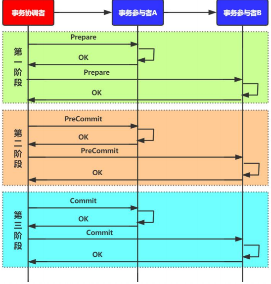

    2PC与3PC的区别:

    相对于2PC，3PC主要解决的单点故障问题，并减少阻塞，因为一旦参与者无法及时收到来自协调者的信息之后，他会默认执行commit。而不会一直持有事务资源并处于阻塞状态。但是这种机制也会导致数据 一致性问题，因为，由于网络原因，协调者发送的abort响应没有及时被参与者接收到，那么参与者在等待超时之后执行了commit操作。这样就和其他接到abort命令并执行回滚的参与者之间存在数据不一致的情况

* 柔性事务(最终一致性方案)

  * TCC(Try-Confirm-Cancel)

    * 尝试执行业务，预留资源
    * 确认执行业务，使用try阶段资源
    * 取消执行业务，释放try阶段预留的资源。

    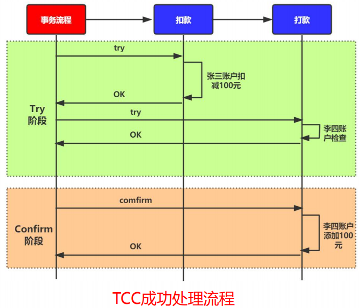

    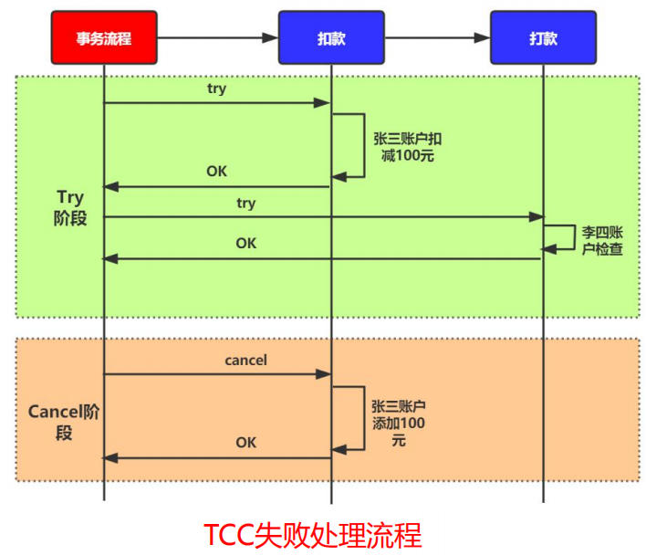

    **用户在实现TCC服务时，有以下注意事项**

    TCC属于**应用层**的一种补偿方式，需要程序员在实现的时候多写很多补偿的代码，在一些场景中，一些业务流程可能用TCC不太好定义及处理。

    **1、业务操作分两阶段完成：**

    接入TCC前，业务操作只需要一步就能完成，但是在接入TCC之后，需要考虑如何将其分成2阶段完成，把资源的检查和预留放在一阶段的Try操作中进行，把真正的业务操作的执行放在二阶段的Confirm操作中进行

    **2、允许空回滚；**

    事务协调器在调用TCC服务的一阶段Try操作时，可能会出现因为丢包而导致的网络超时，此时事务协调器会触发二阶段回滚，调用TCC服务的Cancel操作；

    TCC服务在未收到Try请求的情况下收到Cancel请求，这种场景被称为空回滚；TCC服务在实现时应当允许空回滚的执行；

    **3、防悬挂控制；**

    事务协调器在调用TCC服务的一阶段Try操作时，可能会出现因网络拥堵而导致的超时，此时事务协调器会触发二阶段回滚，调用TCC服务的Cancel操作；在此之后，拥堵在网络上的一阶段Try数据包被TCC服务收到，出现了二阶段Cancel请求比一阶段Try请求先执行的情况；

    用户在实现TCC服务时，应当允许空回滚，但是要拒绝执行空回滚之后到来的一阶段Try请求；

    **4、幂等控制：**

    无论是网络数据包重传，还是异常事务的补偿执行，都会导致TCC服务的Try、Confirm或者Cancel操作被重复执行；用户在实现TCC服务时，需要考虑幂等控制，即Try、Confirm、Cancel 执行次和执行多次的业务结果是一样的；

    **5、业务数据并发访问控制；**

    TCC服务的一阶段Try操作预留资源之后，在二阶段操作执行之前，预留的资源都不会被释放；如果此时其他分布式事务修改这些业务资源，会出现分布式事务的并发问题；

    用户在实现TCC服务时，需要考虑业务数据的并发控制，尽量将逻辑锁粒度降到最低，以最大限度的提高分布式事务的并发性；

  * SAGA模型

    * 一个分布式事务拆分为多个本地事务。
    * 本地事务都有相应的执行模块和补偿模块。
    * 事务管理器负责失败时调度执行补偿逻辑

    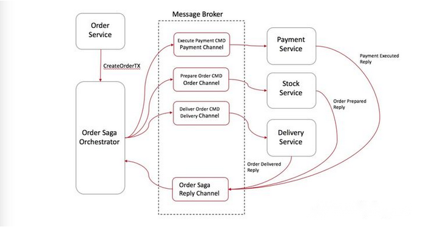

    以下单模式为例子：

    1、订单服务创建一笔新订单，将订单状态设置为"待处理"，然后让Order Saga Orchestrator（OSO）开启创建订单事务。

    2、OSO发送一个"支付命令"给支付服务，支付服务完成扣款并回复"支付完成"消息。

    3、OSO发送一个"备货命令"给库存服务，库存服务完成库存扣减和备货，并回复"出库"消息。

    4、OSO发送一个"配送命令"给物流服务，物流服务完成配送，并回复"配送完成"消息。

    5、OSO向订单服务发送"订单结束命令"给订单服务，订单服务将订单状态设置为"完成"。

    OSO清楚一个订单处理Saga的具体流程，并在出现异常时向相关服务发送补偿命令来回滚整个分布式事务。实现协调中心的一个比较好的方式是使用状态机（Sate Machine）

    **该模式下分布式事务的回滚**

    1、库存服务回复OSO一个"库存不足"消息。

    2、OSO意识到该分布式事务失败了，触发回滚流程：

    1. 2.1、OSO发送"退款命令"给支付服务，支付服务完成退款并回复"退款成功"消息。

    2. 2.2、OSO向订单服务发送"将订单状态改为失败命令"，订单服务将订单状态更新为"失败"。

#### RocketMQ事务消息机制

**两阶段提交**

* 发送半消息。
* 执行本地事务
* 发送Commit/Rollback
* 提供回查接口

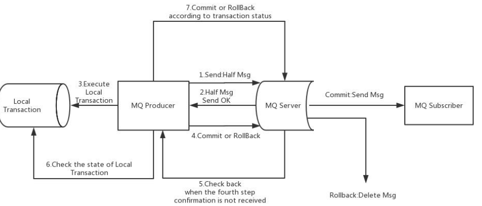

**半消息主题**

* HALF消息：RMQ_SYS_TRANS_HALF_TOPIC(临时存放消息)

  * 事务消息替换主题，保存原主题和队列信息。
  * 半消息对Consumer不可见，不会被投递。

* OP消息：RMQ_SYS_TRANS_OP_HALF_TOPIC（记录二阶段操作）

  * Rollback：只做记录
  * Commit：根据备份信息重新构造信息并投递

* 回查

  * 对比HALF信息和OP信息进行回查。

  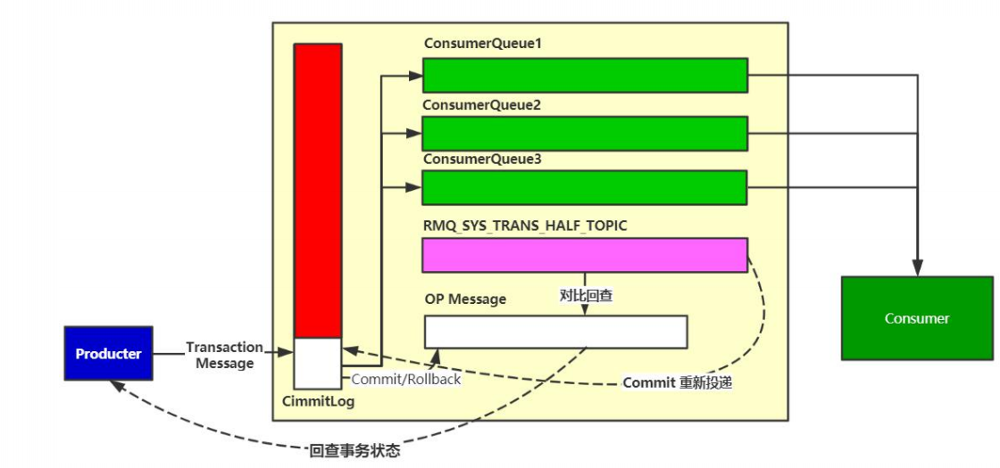

如上图所示，RocketMQ通过两个内部的topic来实现对消息的两阶段支持，RocketMQ在实现事务消息时，实际上是通过将生产投递过来的消息（消息上带有事务标识）投递到一个名为RMS_SYS_TRANS_HALF_TOPIC的topic中，而不是投递到真正的topic中，这个过程是第一阶段(prepare)，然后producer再通过TransactionListener的executeLocalTransaction方法执行本地事务，当producer的localTransaction处理成功或者失败后，producer会向broker发送commit或rollback命令，如果是commit，则broker会将投递到RMQ_SYS_TRANS_HALF_TOPIC中的消息投递到真实的topic中，然后再投递一个表示删除的消息到RMQ_SYS_TRANS_OP_HALF_TOPIC中，表示当前事务已完成；如果是rollback，则没有投递到真实topic的过程，只需要投递表示删除的消息到RMQ_SYS_TRANS_OP_HALF_TOPIC。最后，消费者和消费普通的消息一样消费事务消息

整个过程如果没有遇到问题，则一切OK，但整个过程中可能会遇到以下错误：

- 第一阶段（prepare）失败：给应用返回发送消息失败
- 事务失败：发送回滚命令给broker，由broker执行消息的回滚
- Commit或rollback失败：由broker定时向producer发起事务检查，如果本地事务成功，则提交消息事务，否则回滚消息事务。

qq