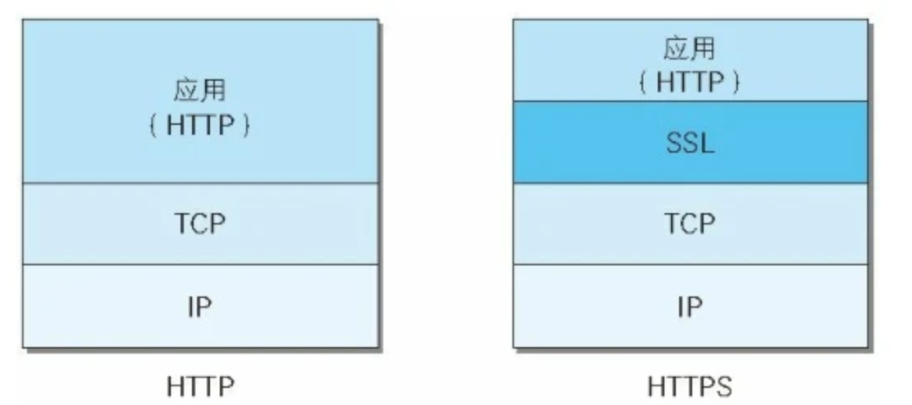
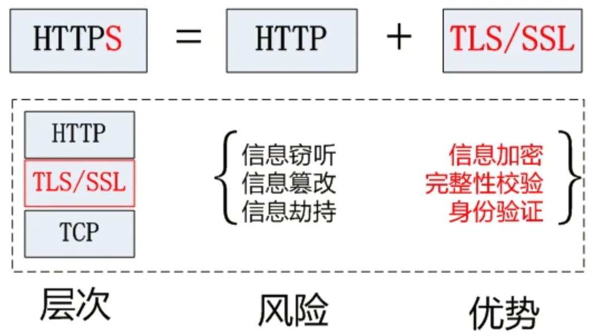
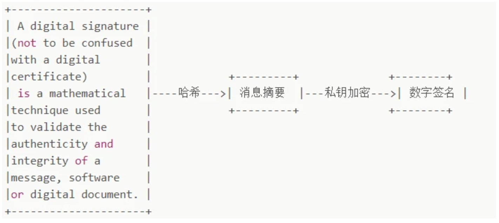
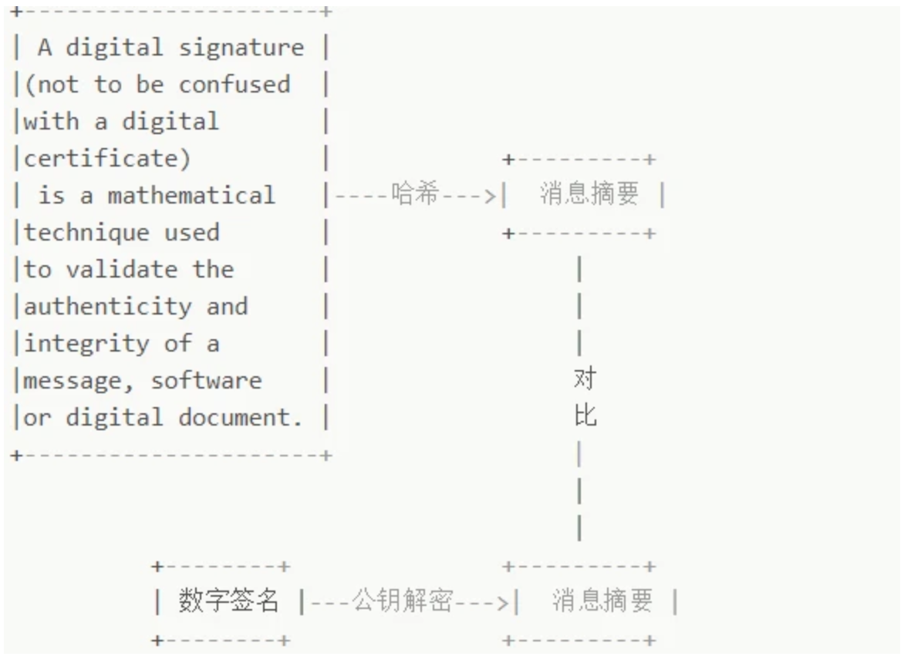
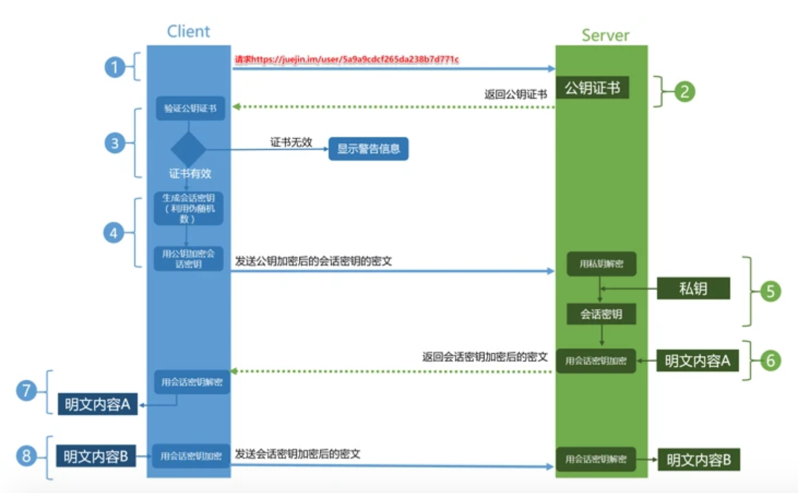

## 深入理解HTTPS工作原理

## 一、什么是HTTPS

HTTPS是在HTTP上建立SSL加密层，并对传输数据进行加密，是HTTP协议的安全版。现在它被广泛用于万维网上安全敏感的通讯，例如交易支付方面。

HTTPS主要作用是：

（1）对数据进行加密，并建立一个信息安全通道，来保证传输过程中的数据安全;

（2）对网站服务器进行真实身份认证。

我们经常会在Web的登录页面和购物结算界面等使用HTTPS通信。使用HTTPS通信时，不再用`http://`，而是改用`https://`。另外，当浏览器访问HTTPS通信有效的Web网站时，浏览器的地址栏内会出现一个带锁的标记。对HTTPS的显示方式会因浏览器的不同而有所改变。

## 二、为什么需要HTTPS

在HTTP协议中有可能存在信息窃取或身份伪装等安全问题。使用HTTPS通信机制可以有效地防止这些问题，接下来，我们先来了解下
HTTP协议存在的哪些问题：

- 通信使用明文（不加密），内容可能被窃听

由于HTTP本身不具备加密的功能，所以也无法做到对通信整体（使用HTTP协议通信的请求和响应的内容）进行加密。即，**HTTP报文使用明文（指未经过加密的报文）方式发送**。

HTTP明文协议的缺陷是导致数据泄露、数据篡改、流量劫持、钓鱼攻击等安全问题的重要原因。HTTP协议无法加密数据，所有通信数据都在网络中明文“裸奔”。通过网络的嗅探设备及一些技术手段，就可还原HTTP报文内容。

- 无法证明报文的完整性，所以可能遭篡改

所谓完整性是指信息的准确度。若无法证明其完整性，通常也就意味着无法判断信息是否准确。由于HTTP协议无法证明通信的报文完整性，因此，在请求或响应送出之后直到对方接收之前的这段时间内，即使请求或响应的内容遭到篡改，也没有办法获悉。

换句话说，**没有任何办法确认，发出的请求/响应和接收到的请求/响应是前后相同的**。

- 不验证通信方的身份，因此有可能遭遇伪装

**HTTP协议中的请求和响应不会对通信方进行确认**。在HTTP协议通信时，由于不存在确认通信方的处理步骤，任何人都可以发起请求。另外，服务器只要接收到请求，不管对方是谁都会返回一个响应（但也仅限于发送端的IP地址和端口号没有被Web服务器设定限制访问的前提下）

HTTP协议无法验证通信方身份，任何人都可以伪造虚假服务器欺骗用户，实现“钓鱼欺诈”，用户无法察觉。

反观HTTPS协议，它比HTTP协议相比多了以下优势（下文会详细介绍）:

- 数据隐私性：内容经过对称加密，每个连接生成一个唯一的加密密钥
- 数据完整性：内容传输经过完整性校验
- 身份认证：第三方无法伪造服务端（客户端）身份

## 三、HTTPS如何解决HTTP上述问

HTTPS并非是应用层的一种新协议。只是HTTP通信接口部分用SSL和TLS协议代替而已。

通常，HTTP直接和TCP通信。当使用SSL时，则演变成先和SSL通信，再由SSL和TCP通信了。简言之，**所谓HTTPS，其实就是身披SSL协议这层外壳的HTTP**。

在采用SSL后，HTTP就拥有了HTTPS的加密、证书和完整性保护这些功能。也就是说**HTTP加上加密处理和认证以及完整性保护后即是HTTPS**。

HTTPS 协议的主要功能基本都依赖于 TLS/SSL 协议，TLS/SSL 的功能实现主要依赖于三类基本算法：散列函数 、对称加密和非对称加密，**其利用非对称加密实现身份认证和密钥协商，对称加密算法采用协商的密钥对数据加密，基于散列函数验证信息的完整性**。

### 1.解决内容可能被窃听的问题——加密

#### 方法1.对称加密

这种方式加密和解密同用一个密钥。加密和解密都会用到密钥。**没有密钥就无法对密码解密，反过来说，任何人只要持有密钥就能解密了**。

以对称加密方式加密时必须将密钥也发给对方。可究竟怎样才能安全地转交？在互联网上转发密钥时，如果通信被监听那么密钥就可会落人攻击者之手，同时也就失去了加密的意义。另外还得设法安全地保管接收到的密钥。

#### 方法2.非对称加密

公开密钥加密使用一对非对称的密钥。一把叫做私有密钥，另一把叫做公开密钥。顾名思义，**私有密钥不能让其他任何人知道，而公开密钥则可以随意发布，任何人都可以获得**。

使用公开密钥加密方式，发送密文的一方使用**对方的公开密钥**进行加密处理，对方收到被加密的信息后，再使用自己的私有密钥进行解密。利用这种方式，不需要发送用来解密的私有密钥，也不必担心密钥被攻击者窃听而盗走。

这种方式有以下缺点：

- 公钥是公开的，所以针对私钥加密的信息，黑客截获后可以使用公钥进行解密，获取其中的内容；
- 公钥并不包含服务器的信息，使用非对称加密算法无法确保服务器身份的合法性，存在中间人攻击的风险，服务器发送给客户端的公钥可能在传送过程中被中间人截获并篡改；
- 使用非对称加密**在数据加密解密过程需要消耗一定时间**，降低了数据传输效率；

#### 方法3.对称加密+非对称加密(HTTPS采用这种方式)

使用对称密钥的好处是解密的效率比较快，使用非对称密钥的好处是可以使得传输的内容不能被破解，因为就算你拦截到了数据，但是没有对应的私钥，也是不能破解内容的。就比如说你抢到了一个保险柜，但是没有保险柜的钥匙也不能打开保险柜。那我们就将对称加密与非对称加密结合起来,充分利用两者各自的优势，**在交换密钥环节使用非对称加密方式，之后的建立通信交换报文阶段则使用对称加密方式**。

具体做法是：**发送密文的一方使用对方的公钥进行加密处理“对称的密钥”，然后对方用自己的私钥解密拿到“对称的密钥”，这样可以确保交换的密钥是安全的前提下，使用对称加密方式进行通信**。所以，HTTPS采用对称加密和非对称加密两者并用的混合加密机制。

### 2.解决报文可能遭篡改问题——数字签名

网络传输过程中需要经过很多中间节点，虽然数据无法被解密，但可能被篡改，那如何校验数据的完整性呢？----校验数字签名。

**数字签名有两种功效**：

- 能确定消息确实是由发送方签名并发出来的，因为别人假冒不了发送方的签名。
- 数字签名能确定消息的完整性,证明数据是否未被篡改过。

**数字签名如何生成:**

将一段文本先用Hash函数生成消息摘要，然后用发送者的私钥加密生成数字签名，与原文文一起传送给接收者。接下来就是接收者校验数字签名的流程了。

**校验数字签名流程**

接收者只有用发送者的公钥才能解密被加密的摘要信息，然后用HASH函数对收到的原文产生一个摘要信息，与上一步得到的摘要信息对比。如果相同，则说明收到的信息是完整的，在传输过程中没有被修改，否则说明信息被修改过，因此数字签名能够验证信息的完整性。

假设消息传递在Kobe，James两人之间发生。James将消息连同数字签名一起发送给Kobe，Kobe接收到消息后，通过校验数字签名，就可以验证接收到的消息就是James发送的。当然，这个过程的前提是Kobe知道James的公钥。问题的关键的是，和消息本身一样，公钥不能在不安全的网络中直接发送给Kobe,或者说拿到的公钥如何证明是James的。

此时就需要引入了**证书颁发机构**（Certificate Authority，简称CA），CA数量并不多，Kobe客户端内置了所有受信任CA的证书。CA对James的公钥（和其他信息）数字签名后生成证书。

### 3.解决通信方身份可能被伪装的问题——数字证书

我们来介绍一下数字证书认证机构的业务流程：

- 服务器的运营人员向第三方机构CA提交公钥、组织信息、个人信息(域名)等信息并申请认证;
- CA通过线上、线下等多种手段验证申请者提供信息的真实性，如组织是否存在、企业是否合法，是否拥有域名的所有权等;
- 如信息审核通过，CA会向申请者签发认证文件-证书。证书包含以下信息：申请者公钥、申请者的组织信息和个人信息、签发机构  CA的信息、有效时间、证书序列号等信息的明文，同时包含一个签名。 其中签名的产生算法：首先，使用散列函数计算公开的明文信息的信息摘要，然后，采用 CA的私钥对信息摘要进行加密，密文即签名;
- 客户端 Client 向服务器 Server 发出请求时，Server 返回证书文件;
- 客户端 Client 读取证书中的相关的明文信息，采用相同的散列函数计算得到信息摘要，然后，利用对应 CA的公钥解密签名数据，对比证书的信息摘要，如果一致，则可以确认证书的合法性，即服务器的公开密钥是值得信赖的。
- 客户端还会验证证书相关的域名信息、有效时间等信息; 客户端会内置信任CA的证书信息(包含公钥)，如果CA不被信任，则找不到对应 CA的证书，证书也会被判定非法。

## 四、 HTTPS工作流程

1.Client发起一个HTTPS（比如`https://juejin.im/user/5a9a9cdcf265da238b7d771c`）的请求，根据RFC2818的规定，Client知道需要连接Server的443（默认）端口。

2.Server把事先配置好的公钥证书（public key certificate）返回给客户端。

3.Client验证公钥证书：比如是否在有效期内，证书的用途是不是匹配Client请求的站点，是不是在CRL吊销列表里面，它的上一级证书是否有效，这是一个递归的过程，直到验证到根证书（操作系统内置的Root证书或者Client内置的Root证书）。如果验证通过则继续，不通过则显示警告信息。

4.Client使用伪随机数生成器生成加密所使用的对称密钥，然后用证书的公钥加密这个对称密钥，发给Server。

5.Server使用自己的私钥（private key）解密这个消息，得到对称密钥。至此，Client和Server双方都持有了相同的对称密钥。

6.Server使用对称密钥加密“明文内容A”，发送给Client。

7.Client使用对称密钥解密响应的密文，得到“明文内容A”。

8.Client再次发起HTTPS的请求，使用对称密钥加密请求的“明文内容B”，然后Server使用对称密钥解密密文，得到“明文内容B”。