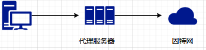

### 分布式代理

#### 代理服务器

代理服务器是位于请求客户端和服务器端之间的一台跳板服务器，代理服务器分为正向代理服务器和反向代理服务器。

#### 正向代理

代理客户端，隐藏真实的请求客户端，服务器不知道真实的客户端是谁，客户端发出的请求都被代理服务器替代。

##### 正向代理作用

* 代理浏览器访问。例如在公司内部限制员工直接访问外网，通过搭建正向代理来访问。
* 缓存访问资源。
* 客户端访问授权。
* 上网行为管理。
* 对外隐藏用户信息。隐藏用户真实ip，通过代理去获取资源。(爬虫)

##### Nginx搭建正向代理

