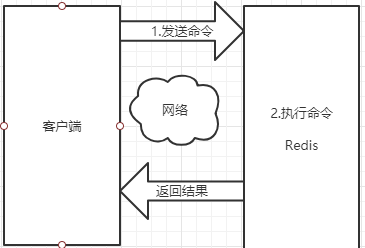
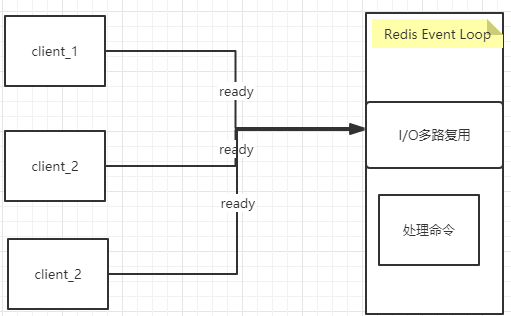
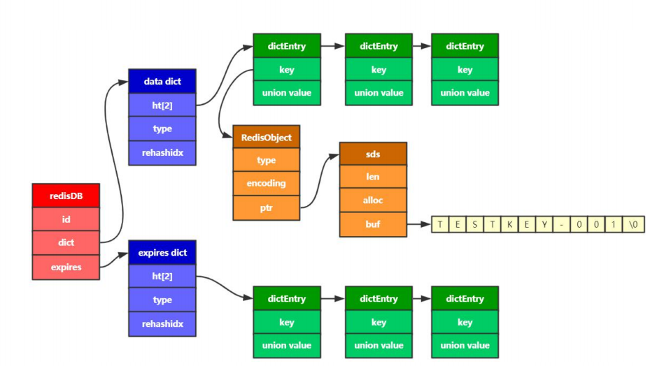
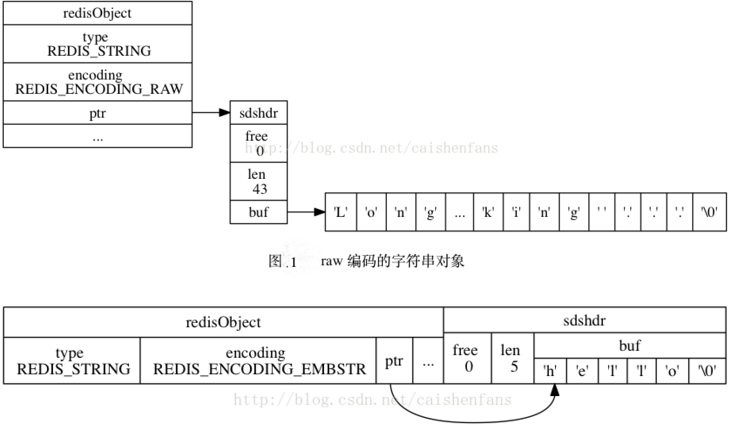
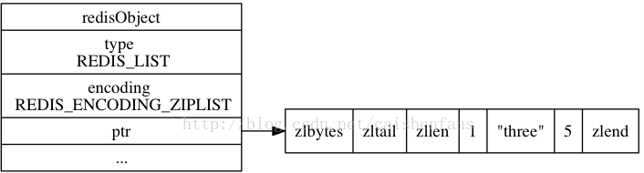
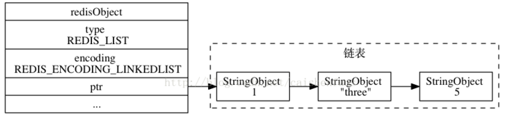

### Redis介绍

Redis客户端与服务的的模型可以简化成如下图，每次客户端调用都经历发送命令、执行命令、返回结果三个过程。其中第2步骤，因为Redis是单线程来处理命令的，所以一条命令从客户端到达服务端不是立刻被执行，而是所有命令都会进入一个队列，然后逐个被执行。



### Redis单线程快的原因

1、纯内存访问，Redis将所有数据放在内存中，内存的响应时长大约为100纳秒，这是Redis达到没秒万级别访问的重要基础。

2、非阻塞I/O，Redis使用epoll作为I/O多路复用技术的实现，再加上Redis自身的事件处理模型将epoll中的连接、读写、关闭都转换为事件，不在网络I/O上浪费过多的时间。



3、单线程避免线程切换和竞态产生的消耗。

#### Redis 底层数据结构

#### Redis数据存储原理

Redis可以看作是一个大的hash表，通过一个数组来实现哈希槽，然后每个槽指向一个链表。



哈希表结构定义：

```c
typedef struct dict {  
    dictType *type;  
    void *privdata; 
    //只有ht[0]有用，ht[1]是扩容时使用
    dictht ht[2];  
    long rehashidx; /* rehashing not in progress if rehashidx == -1 */  
    int iterators; /* number of iterators currently running */  
} dict;

typedef struct dictht{
     //哈希表数组
     dictEntry **table;
     //哈希表大小
     unsigned long size;
     //哈希表大小掩码，用于计算索引值
     //总是等于 size-1
     unsigned long sizemask;
     //该哈希表已有节点的数量
     unsigned long used;
 
}dictht
```

哈希表是由数组 table 组成，table 中每个元素都是指向 dict.h/dictEntry 结构，dictEntry 结构定义如下：

```c
typedef struct dictEntry{
     //键 指向一个redisObject
     void *key;
     //值
     union{
         //如果值是字符串，则它指向redisObject
          void *val;
          uint64_tu64;
          int64_ts64;
     }v;
 
     //指向下一个哈希表节点，形成链表。因为key的哈希值可能会有冲突
     struct dictEntry *next;
}dictEntry
    
typedef struct redisObject {  
    // 类型  指明数据是一个什么类型 string hash 集合 有序集合 链表
    unsigned type:4;          
    // 编码方式  
    unsigned encoding: 4;  
    // 引用计数  
    int refcount;  
    // 指向对象的值  字符串指向 sds对象
    void *ptr;  
} robj
    
struct sdshdr{
     //记录buf数组中已使用字节的数量
     //等于 SDS 保存字符串的长度
     int len;
     //记录 buf 数组中未使用字节的数量
     int free;
     //字节数组，用于保存字符串
     char buf[];
}    
```

1、字符串对象

字符串对象的编码可以是int、raw或者embstr。如果一个字符串的内容可以转换为long，那么该字符串就会被转换成为long类型，对象的ptr就会指向该long，并且对象类型也用int类型表示。
普通的字符串有两种，embstr和raw。如果字符串对象的长度小于39字节，就用embstr对象。否则用传统的raw对象。

embstr的好处有如下几点：

1. embstr的创建只需分配一次内存，而raw为两次（一次为[`sds`](https://github.com/antirez/redis/blob/unstable/src/sds.h)分配对象，另一次为redisObjet分配对象，embstr省去了第一次）。
2. 相对地，释放内存的次数也由两次变为一次。
3. embstr的objet和sds放在一起，更好地利用缓存带来的优势。

raw和embstr的区别可以用下面两幅图所示：



2、列表对象

列表对象的编码可以是ziplist或者linkedlist。

1. ziplist是一种压缩链表，它的好处是更能节省内存空间(碎片化少)，因为它所存储的内容都是在连续的内存区域当中的。当列表对象元素不大，每个元素也不大的时候，就采用ziplist存储但当数据量过大时就ziplist就不是那么好用了(数据量大，很难申请到连续空间)。因为为了保证他存储内容在内存中的连续性，插入的复杂度是O(N)，即每次插入都会重新进行realloc。如下图所示，对象结构中ptr所指向的就是一个ziplist整个ziplist只需要malloc一次，它们在内存中是一块连续的区域。

   `ziplist` 是为了节省内存而设计出来的一种数据结构。`ziplist` 是由一系列特殊编码组成的连续内存块的顺序型数据结构，一个 `ziplist` 可以包含任意多个 `entry`，而每一个 `entry` 又可以保存一个字节数组或者一个整数值。

   `ziplist` 作为一种列表，其和普通的双端列表，如 `linkedlist` 的最大区别就是 `ziplist` 并不存储前后节点的指针，而 `linkedlist` 一般每个节点都会维护一个指向前置节点和一个指向后置节点的指针。那么 `ziplist` 不维护前后节点的指针，它又是如何寻找前后节点的呢？

   `ziplist`  虽然不维护前后节点的指针，但是它却维护了上一个节点的长度和当前节点的长度，然后每次通过长度来计算出前后节点的位置。既然涉及到了计算，那么相对于直接存储指针的方式肯定有性能上的损耗，这就是一种典型的用时间来换取空间的做法。因为每次读取前后节点都需要经过计算才能得到前后节点的位置，所以会消耗更多的时间，而在 `Redis` 中，一个指针是占了 `8` 个字节，但是大部分情况下，如果直接存储长度是达不到 `8` 个字节的，所以采用存储长度的设计方式在大部分场景下是可以节省内存空间的。

   

2. linkedlist是一种双向链表。它的结构比较简单，节点中存放pre和next两个指针，还有节点相关的信息。当每增加一个node的时候，就需要重新malloc一块内存

   

3. 哈希对象

   哈希对象的底层实现可以是ziplist或者hashtable。
   ziplist中的哈希对象是按照key1,value1,key2,value2这样的顺序存放来存储的。当对象数目不多且内容不大时，这种方式效率是很高的。

   hashtable数据结构参考前面的哈希表结构。

   **①、哈希算法：**Redis计算哈希值和索引值方法如下：

   ```
   #1、使用字典设置的哈希函数，计算键 key 的哈希值``hash = dict->type->hashFunction(key);``#2、使用哈希表的sizemask属性和第一步得到的哈希值，计算索引值``index = hash & dict->ht[x].sizemask;
   ```

   　　**②、解决哈希冲突：**这个问题上面我们介绍了，方法是链地址法。通过字典里面的 *next 指针指向下一个具有相同索引值的哈希表节点。

   　　**③、扩容和收缩：**当哈希表保存的键值对太多或者太少时，就要通过 rerehash(重新散列）来对哈希表进行相应的扩展或者收缩。具体步骤：

   　　　　　　1、如果执行扩展操作，会基于原哈希表创建一个大小等于 ht[0].used*2n 的哈希表（也就是每次扩展都是根据原哈希表已使用的空间扩大一倍创建另一个哈希表）。相反如果执行的是收缩操作，每次收缩是根据已使用空间缩小一倍创建一个新的哈希表。

   　　　　　　2、重新利用上面的哈希算法，计算索引值，然后将键值对放到新的哈希表位置上。

   　　　　　　3、所有键值对都迁徙完毕后，释放原哈希表的内存空间。

   　　**④、触发扩容的条件：**

   　　　　　　1、服务器目前没有执行 BGSAVE 命令或者 BGREWRITEAOF 命令，并且负载因子大于等于1。

   　　　　　　2、服务器目前正在执行 BGSAVE 命令或者 BGREWRITEAOF 命令，并且负载因子大于等于5。

   　　　　ps：负载因子 = 哈希表已保存节点数量 / 哈希表大小。

   　　**⑤、渐近式 rehash**

   　　　　什么叫渐进式  rehash？也就是说扩容和收缩操作不是一次性、集中式完成的，而是分多次、渐进式完成的。如果保存在Redis中的键值对只有几个几十个，那么  rehash 操作可以瞬间完成，但是如果键值对有几百万，几千万甚至几亿，那么要一次性的进行  rehash，势必会造成Redis一段时间内不能进行别的操作。所以Redis采用渐进式  rehash,这样在进行渐进式rehash期间，字典的删除查找更新等操作可能会在两个哈希表上进行，第一个哈希表没有找到，就会去第二个哈希表上进行查找。但是进行 增加操作，一定是在新的哈希表上进行的。

4. 集合对象

   集合对象的编码可以是intset(当元素都是int 且元素个数小于默认512个)或者hashtable
   intset是一个整数集合，里面存的为某种同一类型的整数，支持如下三种长度的整数：

   ```c
   #define INTSET_ENC_INT16 (sizeof(int16_t))  
   #define INTSET_ENC_INT32 (sizeof(int32_t))  
   #define INTSET_ENC_INT64 (sizeof(int64_t))
   ```

   intset是一个有序集合，查找元素的复杂度为O(logN)，但插入时不一定为O(logN)，因为有可能涉及到升级操作。比如当集合里全是int16_t型的整数，这时要插入一个int32_t，那么为了维持集合中数据类型的一致，那么所有的数据都会被转换成int32_t类型，涉及到内存的重新分配，这时插入的复杂度就为O(N)了。

   ```c
   typedef struct intset{
        //编码方式
        uint32_t encoding;
        //集合包含的元素数量
        uint32_t length;
        //保存元素的数组
        int8_t contents[];
    
   }intset;
   ```

   整数集合的每个元素都是 contents 数组的一个数据项，它们按照从小到大的顺序排列，并且不包含任何重复项。

   　　length 属性记录了 contents 数组的大小。

   　　需要注意的是虽然 contents 数组声明为 int8_t 类型，但是实际上contents 数组并不保存任何 int8_t 类型的值，其真正类型有 encoding 来决定。

   　　**①、升级**

   　　当我们新增的元素类型比原集合元素类型的长度要大时，需要对整数集合进行升级，才能将新元素放入整数集合中。具体步骤：

   　　1、根据新元素类型，扩展整数集合底层数组的大小，并为新元素分配空间。

   　　2、将底层数组现有的所有元素都转成与新元素相同类型的元素，并将转换后的元素放到正确的位置，放置过程中，维持整个元素顺序都是有序的。

   　　3、将新元素添加到整数集合中。

5. 有序集合

   有序集合的编码可能两种，一种是ziplist，另一种是skiplist与dict的结合。
   ziplist作为集合和作为哈希对象是一样的，member和score顺序存放。按照score从小到大顺序排列
   skiplist是一种跳跃表，它实现了有序集合中的快速查找，在大多数情况下它的速度都可以和平衡树差不多。但它的实现比较简单，可以作为平衡树的替代品。它的结构比较特殊。下面分别是跳跃表skiplist和它内部的节点skiplistNode的结构体

