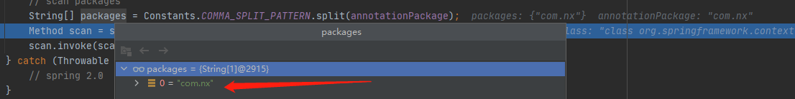
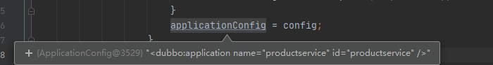
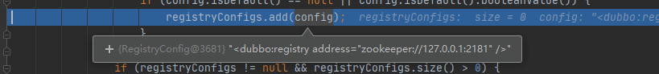
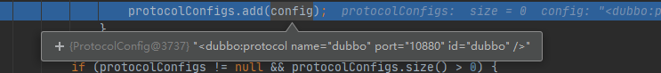
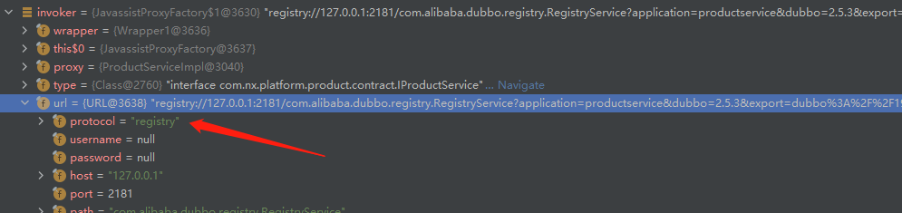
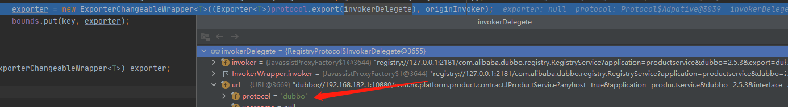
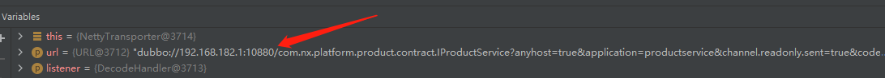
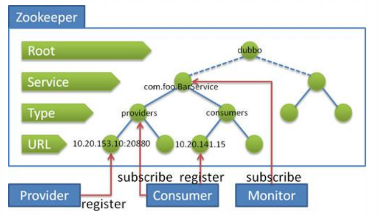
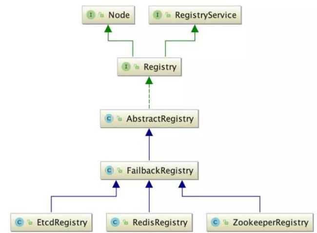
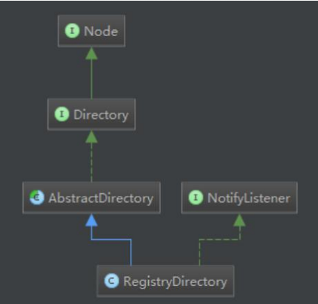

### 服务暴露

#### AnnotationBean 服务入口

服务启动时会将服务的接口注册到注册中心，入口在com.alibaba.dubbo.config.spring.AnnotationBean。

1、扫描接口。

```java
String[] packages = Constants.COMMA_SPLIT_PATTERN.split(annotationPackage);
Method scan = scannerClass.getMethod("scan", new Class<?>[]{String[].class});
scan.invoke(scanner, new Object[] {packages});
```

```properties
#指定扫描目录
spring.dubbo.scan=com.nx
```



AnnotationBean实现InitializingBean接口，在afterPropertiesSet方法中将配置文件中的配置设置到配置类中。

```java
public Object postProcessAfterInitialization(Object bean, String beanName){
    //创建ServiceBean方法
    ServiceBean<Object> serviceConfig = new ServiceBean<Object>(service);
    //执行ServiceBean的afterPropertiesSet方法，在此方法中设置服务相关配置
    serviceConfig.afterPropertiesSet();
    //暴露服务
    serviceConfig.export();
}
```

#### ServiceBean 将服务配置加载到bean中

1、设置application。

```
if (getApplication() == null
        && (getProvider() == null || getProvider().getApplication() == null)) {
    Map<String, ApplicationConfig> applicationConfigMap = applicationContext == null ? null : BeanFactoryUtils.beansOfTypeIncludingAncestors(applicationContext, ApplicationConfig.class, false, false);
    if (applicationConfigMap != null && applicationConfigMap.size() > 0) {
        ApplicationConfig applicationConfig = null;
        for (ApplicationConfig config : applicationConfigMap.values()) {
            if (config.isDefault() == null || config.isDefault().booleanValue()) {
                if (applicationConfig != null) {
                    throw new IllegalStateException("Duplicate application configs: " + applicationConfig + " and " + config);
                }
                applicationConfig = config;
            }
        }
        if (applicationConfig != null) {
            setApplication(applicationConfig);
        }
    }
}
```



2、设置注册中心配置

```java
if ((getRegistries() == null || getRegistries().size() == 0)
        && (getProvider() == null || getProvider().getRegistries() == null || getProvider().getRegistries().size() == 0)
        && (getApplication() == null || getApplication().getRegistries() == null || getApplication().getRegistries().size() == 0)) {
    Map<String, RegistryConfig> registryConfigMap = applicationContext == null ? null : BeanFactoryUtils.beansOfTypeIncludingAncestors(applicationContext, RegistryConfig.class, false, false);
    if (registryConfigMap != null && registryConfigMap.size() > 0) {
        List<RegistryConfig> registryConfigs = new ArrayList<RegistryConfig>();
        for (RegistryConfig config : registryConfigMap.values()) {
            if (config.isDefault() == null || config.isDefault().booleanValue()) {
                registryConfigs.add(config);
            }
        }
        if (registryConfigs != null && registryConfigs.size() > 0) {
            super.setRegistries(registryConfigs);
        }
    }
}
```



3、设置协议

```java
if ((getProtocols() == null || getProtocols().size() == 0)
        && (getProvider() == null || getProvider().getProtocols() == null || getProvider().getProtocols().size() == 0)) {
    Map<String, ProtocolConfig> protocolConfigMap = applicationContext == null ? null  : BeanFactoryUtils.beansOfTypeIncludingAncestors(applicationContext, ProtocolConfig.class, false, false);
    if (protocolConfigMap != null && protocolConfigMap.size() > 0) {
        List<ProtocolConfig> protocolConfigs = new ArrayList<ProtocolConfig>();
        for (ProtocolConfig config : protocolConfigMap.values()) {
            if (config.isDefault() == null || config.isDefault().booleanValue()) {
                protocolConfigs.add(config);
            }
        }
        if (protocolConfigs != null && protocolConfigs.size() > 0) {
            super.setProtocols(protocolConfigs);
        }
    }
}
```



#### 暴露服务

```java
private void doExportUrls() {
    List<URL> registryURLs = loadRegistries(true);
    for (ProtocolConfig protocolConfig : protocols) {
        //向注册中心注册url
        doExportUrlsFor1Protocol(protocolConfig, registryURLs);
    }
}

  private void doExportUrlsFor1Protocol(ProtocolConfig protocolConfig, List<URL> registryURLs) {
      
      //主要是将IP，端口，服务名称，方法名称放到自定义URL实例，然后将注册中心的信息和URL的信息整合得到一起，到注册中心进行暴露服务
      //ref 接口实现类
      //url registry://127.0.0.1:2181/com.alibaba.dubbo.registry.RegistryService?application=productservice&dubbo=2.5.3&pid=25316&registry=zookeeper&timestamp=1619686851561
     //addParameterAndEncoded 后的url：registry://127.0.0.1:2181/com.alibaba.dubbo.registry.RegistryService?application=productservice&dubbo=2.5.3&export=dubbo://192.168.182.1:10880/com.nx.platform.product.contract.IProductService?anyhost=true&application=productservice&dubbo=2.5.3&interface=com.nx.platform.product.contract.IProductService&methods=getProductsById,getProductsByTimestamp&pid=25316&revision=1.0.0&side=provider&timestamp=1619686851570&version=1.0.0&pid=25316&registry=zookeeper&timestamp=1619686851561
      Invoker<?> invoker = proxyFactory.getInvoker(ref, (Class) interfaceClass, registryURL.addParameterAndEncoded(Constants.EXPORT_KEY, url.toFullString()));

      Exporter<?> exporter = protocol.export(invoker);
  }
```

protocol.export：调用协议的export接口进行服务暴露，exprot接口被Adaptive注解修饰，可以根据请求参数动态的选则具体的协议实现类。

```java
@Adaptive
<T> Exporter<T> export(Invoker<T> invoker) throws RpcException;
```



如上截图，url参数中有registry参数，根据spi配置，会调用RegistryProtocol的export方法。

```properties
registry=com.alibaba.dubbo.registry.integration.RegistryProtocol
```

1、RegistryProtocol

```java
//服务注册
public <T> Exporter<T> export(final Invoker<T> originInvoker) throws RpcException {
    //export invoker
    //本地暴露，监听某个端口
    final ExporterChangeableWrapper<T> exporter = doLocalExport(originInvoker);
    //获取注册中心实例
    final Registry registry = getRegistry(originInvoker);
    //构造注册url
    final URL registedProviderUrl = getRegistedProviderUrl(originInvoker);
    //向注册中心传递接口信息
    registry.register(registedProviderUrl);
}
```

2、doLocalExport

```java
private <T> ExporterChangeableWrapper<T>  doLocalExport(final Invoker<T> originInvoker){
    String key = getCacheKey(originInvoker);
    ExporterChangeableWrapper<T> exporter = (ExporterChangeableWrapper<T>) bounds.get(key);
    if (exporter == null) {
        synchronized (bounds) {
            exporter = (ExporterChangeableWrapper<T>) bounds.get(key);
            if (exporter == null) {
                final Invoker<?> invokerDelegete = new InvokerDelegete<T>(originInvoker, getProviderUrl(originInvoker));
                //调用DubboProtocol export方法
                exporter = new ExporterChangeableWrapper<T>((Exporter<T>)protocol.export(invokerDelegete), originInvoker);
                bounds.put(key, exporter);
            }
        }
    }
    return (ExporterChangeableWrapper<T>) exporter;
}
```



如上截图，根据协议会调用DubboProtocol的export方法，追踪该方法最终会调用到Netty的bind方法监听某个端口来响应外来的请求。

```java
public Server bind(URL url, ChannelHandler listener) throws RemotingException {
    return new NettyServer(url, listener);
}
```



3、向注册中心注册接口信息。

```java
//FailbackRegistry
public void register(URL url) {
    super.register(url);
    //先删除重试任务
    failedRegistered.remove(url);
    failedUnregistered.remove(url);
    try {
        // 向服务器端发送注册请求 根据具体注册中心来实现
        doRegister(url);
    } catch (Exception e) {
        
        // 将失败的注册请求记录到失败列表，定时重试
        failedRegistered.add(url);
    }
}
```

#### Zookeeper

**数据结构**

* DataNode：其内部除了保存节点的数据内容、ACL列表、节点状态之外，还记录了父节点的引用和子节点列表两个属性。

  ```java
  public class DataNode implements Record {
     //父节点
      DataNode parent;
      //该节点存储数据
      byte data[];
      //acl控制权限
      Long acl;
      //持久化节点状态
      public StatPersisted stat;
      //子节点，只是路径的最后一部分
      private Set<String> children = null;
  }
  ```

* DataTree：以树形结构存储了zookeeper中所有的数据信息。

  ```java
  //key是path value是DataNode 可以快速查找DataNode
  private final ConcurrentHashMap<String, DataNode> nodes =
      new ConcurrentHashMap<String, DataNode>();
  //数据变更通知
  private final WatchManager dataWatches = new WatchManager();
  //节点变更通知
  private final WatchManager childWatches = new WatchManager();
  //根节点
  private static final String rootZookeeper = "/"
  //临时节点信息 key session，Value path的集合
  private final Map<Long, HashSet<String>> ephemerals =
      new ConcurrentHashMap<Long, HashSet<String>>();
  
  //WatchManager
  //key path,value 订阅客户端,快速查找path下有多少订阅者
  private final HashMap<String, HashSet<Watcher>> watchTable =
          new HashMap<String, HashSet<Watcher>>();
  //key 订阅客户端，value path的集合，可以快速查找某个客户端订阅了多少path
  private final HashMap<Watcher, HashSet<String>> watch2Paths =
          new HashMap<Watcher, HashSet<String>>();
  ```

* ZKDataBase：负责管理Zookeeper的数据、会话信息和事务日志。

  ```java
  protected DataTree dataTree;
  //客户端会话连接管理
  protected ConcurrentHashMap<Long, Integer> sessionsWithTimeouts;
  //事务日志
  protected FileTxnSnapLog snapLog;
  ```

**zookeeper 作注册中心**

* 服务注册：创建临时Node。Zookeeper顺序一致性，不保证读到最新数据，选举过程中不可用。
* 服务发现：查找Node节点数据。Zookeeper顺序一致性，不保证读到最新数据，选举过程中不可用。
* 健康检查：临时节点。
* 信息订阅：watch机制。

dubbo使用zk作为注册中心：

* 注册：服务提供者在对应的Provider下写入自身元信息(url)。url节点是临时节点，其他是持久化节点。
* 订阅：服务消费者订Providers子节点变更事件。



* /dubbo：这是dubbo在Zookeeper上创建的根节点。
* /dubbo/com.foo.BarService：这是服务节点，代表了Dubbo的一个服务。
* /dubbo/com.foo.BarService/providers：这是服务提供者的根节点，其子节点代表了每一个真正的服务提供者。
* /dubbo/com.foo.BarService/consumers：这是服务消费者的根节点，其子节点代表了每一个真正的消费者。

服务注册接口结构：



1、向zookeeper注册中心注册

```java
//url dubbo://192.168.182.1:10880/com.nx.platform.product.contract.IProductService?anyhost=true&application=productservice&dubbo=2.5.3&interface=com.nx.platform.product.contract.IProductService&methods=getProductsById,getProductsByTimestamp&pid=23884&revision=1.0.0&side=provider&timestamp=1619692089684&version=1.0.0
protected void doRegister(URL url) {
    try {
       zkClient.create(toUrlPath(url), url.getParameter(Constants.DYNAMIC_KEY, true));
    } catch (Throwable e) {
        throw new RpcException("Failed to register " + url + " to zookeeper " + getUrl() + ", cause: " + e.getMessage(), e);
    }
}
```

2、创建节点，目录是永久节点，数据是临时节点

```java
public void create(String path, boolean ephemeral) {
    //节点目录  /dubbo/com.alibaba.dubbo.demo.DemoService/providers/
   int i = path.lastIndexOf('/');
   if (i > 0) {
       //递归调用，创建数据节点目录
      create(path.substring(0, i), false);
   }
   if (ephemeral) {
       //数据是临时节点
      createEphemeral(path);
   } else {
       //其他都是持久化节点
      createPersistent(path);
   }
}
```

3、重试任务，注册失败的服务会存储在失败队列，再通过失败重新重新注册。

```java
protected void retry() {
    if (! failedRegistered.isEmpty()) {
        Set<URL> failed = new HashSet<URL>(failedRegistered);
        if (failed.size() > 0) {
            if (logger.isInfoEnabled()) {
                logger.info("Retry register " + failed);
            }
            try {
                for (URL url : failed) {
                    try {
                        //注册
                        doRegister(url);
                        //清除缓存
                        failedRegistered.remove(url);
                    } catch (Throwable t) { // 忽略所有异常，等待下次重试
                        logger.warn("Failed to retry register " + failed + ", waiting for again, cause: " + t.getMessage(), t);
                    }
                }
            } catch (Throwable t) { // 忽略所有异常，等待下次重试
                logger.warn("Failed to retry register " + failed + ", waiting for again, cause: " + t.getMessage(), t);
            }
        }
    }
}
```

#### dubbo服务订阅



dubbo订阅服务

```java
// com.alibaba.dubbo.registry.zookeeper.ZookeeperRegistry
protected void doSubscribe(final URL url, final NotifyListener listener) {
    try {
        if (Constants.ANY_VALUE.equals(url.getServiceInterface())) {
            //客户端第一次连上注册中心，进行全量数据拉取
            //接口名为"*"  订阅所有服务,如监控中心的订阅
            //root下的子节点是service接口，创建子节点监听器，对root下的子节点做监听，一旦子节点发生改变，那么就对这个节点进行订阅
            String root = toRootPath();
            // 2.获取URL的所有监听器，若url对应的监听器为空，那么初始化一个监听器返回  zkListeners是一个监听器集合
            ConcurrentMap<NotifyListener, ChildListener> listeners = zkListeners.get(url);
            if (listeners == null) {
                //创建一个监听器集合
                zkListeners.putIfAbsent(url, new ConcurrentHashMap<NotifyListener, ChildListener>());
                listeners = zkListeners.get(url);
            }
            // 3.获取ChildListener，若第一次连接时为空，根据computeIfAbsent（）方法肯定会新建一个ChildListener
            ChildListener zkListener = listeners.get(listener);
            if (zkListener == null) {
                listeners.putIfAbsent(listener, new ChildListener() {
                    //监听触发时的行为
                    public void childChanged(String parentPath, List<String> currentChilds) {
                        for (String child : currentChilds) {
                            //遍历监听节点的所有子节点
                            if (! anyServices.contains(child)) {
                                //若有新增服务，那么对这个服务发起订阅
                                anyServices.add(child);
  //发起订阅                            subscribe(url.setPath(child).addParameters(Constants.INTERFACE_KEY, child, 
                                        Constants.CHECK_KEY, String.valueOf(false)), listener);
                            }
                        }
                    }
                });
                zkListener = listeners.get(listener);
            }
            
            zkClient.create(root, false);
            //监听root节点子节点，root下的子节点是service接口
            List<String> services = zkClient.addChildListener(root, zkListener);
            if (services != null && services.size() > 0) {
                anyServices.addAll(services);
                //订阅整个service层  
                for (String service : services) {
           subscribe(url.setPath(service).addParameters(Constants.INTERFACE_KEY, service, 
                            Constants.CHECK_KEY, String.valueOf(false)), listener);
                }
            }
        } else {
            //客户端非第一次连上注册中心，对应具体的服务进行订阅
            List<URL> urls = new ArrayList<URL>();
            //url provider://192.168.182.1:10880/com.nx.platform.product.contract.IProductService?anyhost=true&application=productservice&category=configurators&check=false&dubbo=2.5.3&interface=com.nx.platform.product.contract.IProductService&methods=getProductsById,getProductsByTimestamp&pid=17220&revision=1.0.0&side=provider&timestamp=1619697301687&version=1.0.0
            for (String path : toCategoriesPath(url)) {
                //2.获取url对应的监听器，没有则创建，并且缓存起来
                ConcurrentMap<NotifyListener, ChildListener> listeners = zkListeners.get(url);
                if (listeners == null) {
                    zkListeners.putIfAbsent(url, new ConcurrentHashMap<NotifyListener, ChildListener>());
                    listeners = zkListeners.get(url);
                }
                //4.获取ChildListener，没有则创建，并且在子节点数据发生变更时则调用notify方法进行通知这个listener
                ChildListener zkListener = listeners.get(listener);
                if (zkListener == null) {
                    listeners.putIfAbsent(listener, new ChildListener() {
                        public void childChanged(String parentPath, List<String> currentChilds) {
                          //匿名实现回调方法  
                           ZookeeperRegistry.this.notify(url, listener, toUrlsWithEmpty(url, parentPath, currentChilds));
                        }
                    });
                    zkListener = listeners.get(listener);
                }
                //.创建type的持久化节点，且对于这个节点进行订阅
                zkClient.create(path, false);
                List<String> children = zkClient.addChildListener(path, zkListener);
                if (children != null) {
                   urls.addAll(toUrlsWithEmpty(url, path, children));
                }
            }
             // 7.回调，更新本地缓存信息
            notify(url, listener, urls);
        }
    } catch (Throwable e) {
        throw new RpcException("Failed to subscribe " + url + " to zookeeper " + getUrl() + ", cause: " + e.getMessage(), e);
    }
}
```

notify回调方法：

```java
protected void notify(URL url, NotifyListener listener, List<URL> urls) {
        if (url == null) {
            throw new IllegalArgumentException("notify url == null");
        }
        if (listener == null) {
            throw new IllegalArgumentException("notify listener == null");
        }
        if ((urls == null || urls.size() == 0) 
                && ! Constants.ANY_VALUE.equals(url.getServiceInterface())) {
            logger.warn("Ignore empty notify urls for subscribe url " + url);
            return;
        }
        if (logger.isInfoEnabled()) {
            logger.info("Notify urls for subscribe url " + url + ", urls: " + urls);
        }
    	//用于分类url
        Map<String, List<URL>> result = new HashMap<String, List<URL>>();
        for (URL u : urls) {
            if (UrlUtils.isMatch(url, u)) {
            	String category = u.getParameter(Constants.CATEGORY_KEY, Constants.DEFAULT_CATEGORY);
            	List<URL> categoryList = result.get(category);
            	if (categoryList == null) {
            		categoryList = new ArrayList<URL>();
            		result.put(category, categoryList);
            	}
            	categoryList.add(u);
            }
        }
        if (result.size() == 0) {
            return;
        }
    	//获取url在notified集合中的数据,若notified无则创建一个且放入
        Map<String, List<URL>> categoryNotified = notified.get(url);
        if (categoryNotified == null) {
            notified.putIfAbsent(url, new ConcurrentHashMap<String, List<URL>>());
            categoryNotified = notified.get(url);
        }
        for (Map.Entry<String, List<URL>> entry : result.entrySet()) {
            String category = entry.getKey();
            List<URL> categoryList = entry.getValue();
            categoryNotified.put(category, categoryList);
            // 3.将url进行缓存，因为当我们的注册表由于网络抖动而出现订阅失败时，我们可以返回现有的缓存URL。
            saveProperties(url);
            //2.对于所有url进行分类的通知
            listener.notify(categoryList);
        }
    }
```


