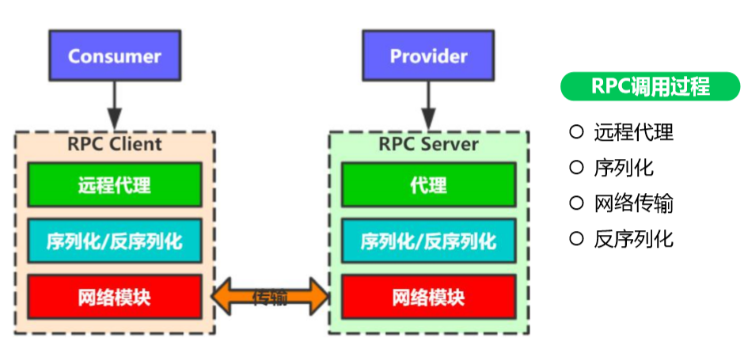

### ``RPC``介绍及原理分析

定义：```RPC(Remote Produre Call)```：远程过程调用。它是一个计算机通信协议，允许像本地方法一样调用远程服务。由于不在一个内存空间，不能直接调用，需要通过网络来表达调用的语义和表达调用的数据。

#### ```RPC```作用

* 提高开发效率：相比```http```调用，```RPC```调用更简单，如同调用本地方法一样。
* 屏蔽组包解包(序列化/反序列化)。
* 屏蔽数据发送/接收。

#### ```RPC```核心组成 

* 远程方法对象代理：在客户端，```RPC```会生成代理方法供客户端调用。
* 连接管理：```RPC```本质是对网络数据传输的封装，所以需要对网络连接进行管理(建立网络连接需要进行三次握手，代价大)，实现网络连接重用。
* 序列化/反序列化：```RPC```将对象序列化成二进制数据/二进制数据反序列化成对象。
* 寻址与负载均衡：客户端只有知道服务端的```ip```地址，才能进行建立网络连接，然后进行数据传输；同样，在一个集群中，可能会存在多个节点，通过负载均衡达到流量的均衡访问。

#### ``RPC``调用方式

* 同步调用。
* 异步调用。

异步调用在某些情况下，异步执行效率比同步高：

```
//电商获取商品信息，同时将用户信息和购买次数查询出来
同步方式：1+2+3 = 110s
1. 查询商品信息 80ms
2. 查询用户信息 20ms
3. 查询商品购买次数。 10ms

异步方式： 1+2 = 100
1. 查询商品信息 80s
2.查询用户信息和商品购买次数 20ms
异步方式中，将查询用户、商品购买次数一起执行，取最长执行时间，相对同步可以节省一些时间。
```

```rpc```执行流程：

