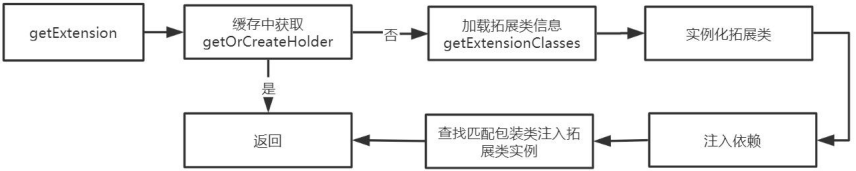
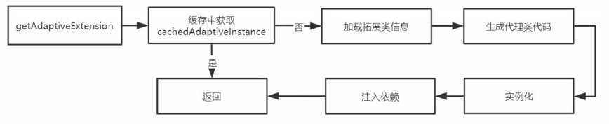

### Dubbo扩展点源码分析

* 什么是Dubbo扩展点

  Dubbo的SPI层所有的接口都可以基于Dubbo框架做定制性的二次开发，扩展功能。如负载均衡、协议、注册中心等都可以扩展。

* Dubbo SPI 扩展点加载机制

  * Java SPI：Service Provider Interface 一个接口多种实现，通过配置确定使用哪个实现。
  * Dubbo SPI：Java SPI增强版，增加了对扩展点IoC和AOP的支持。

Dubbo的扩展点都是以键值对的形式在配置文件中配置，然后通过ExtensionLoader读取配置文件进行加载。每一种扩展点单独对应一个ExtensionLoader。

Dubbo 负载均衡器和rpc协议配置如下：

```properties
## 负载均衡配置，目录/META-INF/dubbo.internal/com.alibaba.dubbo.rpc.cluster.LoadBalance
random=com.alibaba.dubbo.rpc.cluster.loadbalance.RandomLoadBalance
roundrobin=com.alibaba.dubbo.rpc.cluster.loadbalance.RoundRobinLoadBalance
leastactive=com.alibaba.dubbo.rpc.cluster.loadbalance.LeastActiveLoadBalance
consistenthash=com.alibaba.dubbo.rpc.cluster.loadbalance.ConsistentHashLoadBalance

##网络协议 /META-INF/com.alibaba.dubbo.rpc.Protocol
registry=com.alibaba.dubbo.registry.integration.RegistryProtocol
filter=com.alibaba.dubbo.rpc.protocol.ProtocolFilterWrapper
listener=com.alibaba.dubbo.rpc.protocol.ProtocolListenerWrapper
mock=com.alibaba.dubbo.rpc.support.MockProtocol
injvm=com.alibaba.dubbo.rpc.protocol.injvm.InjvmProtocol
dubbo=com.alibaba.dubbo.rpc.protocol.dubbo.DubboProtocol
rmi=com.alibaba.dubbo.rpc.protocol.rmi.RmiProtocol
hessian=com.alibaba.dubbo.rpc.protocol.hessian.HessianProtocol
com.alibaba.dubbo.rpc.protocol.http.HttpProtocol
com.alibaba.dubbo.rpc.protocol.webservice.WebServiceProtocol
thrift=com.alibaba.dubbo.rpc.protocol.thrift.ThriftProtocol
memcached=memcom.alibaba.dubbo.rpc.protocol.memcached.MemcachedProtocol
redis=com.alibaba.dubbo.rpc.protocol.redis.RedisProtocol

```

#### 拓展点特性

* 拓展点自动包装：AOP增强。它们是Wrapper类，不是扩展点真正的实现，而是在扩展点上添加逻辑。整个包装类的创建，它创建的新的实例将作为构造参数传递给下一个包装类，依次递归包装类能自动依次触发执行。

  ```java
  //ProtocolFilterWrapper
  //对暴露接口和引用接口进行包装
  public <T> Exporter<T> export(Invoker<T> invoker) throws RpcException {
      if (Constants.REGISTRY_PROTOCOL.equals(invoker.getUrl().getProtocol())) {
          return protocol.export(invoker);
      }
      return protocol.export(buildInvokerChain(invoker, Constants.SERVICE_FILTER_KEY, Constants.PROVIDER));
  }
  
  public <T> Invoker<T> refer(Class<T> type, URL url) throws RpcException {
      if (Constants.REGISTRY_PROTOCOL.equals(url.getProtocol())) {
          return protocol.refer(type, url);
      }
      //构造过滤器调用链，在过滤器中实现包装逻辑
      return buildInvokerChain(protocol.refer(type, url), Constants.REFERENCE_FILTER_KEY, Constants.CONSUMER);
  }
  ```

* 拓展点自动装配：ioc增强，自动注入依赖。

* 拓展点自适应：有些扩展不想在框架启动阶段加载，而是希望在扩展方法被调用时，根据运行时参数加载。

  * 静态实现：SPI注解或者配置，如在配置文件中配置spi接口的具体实现类的键值对，然后通过spi注解指定默认实现，最后通过反射加载。
  * 动态指定扩展点：运行时实现。Adaptive注解修饰的类可以作为唯一的扩展类或者接口可以根据参数查找扩展点实现类。

  ```java
  @SPI(RandomLoadBalance.NAME)
  public interface LoadBalance {
  
     /**
      * select one invoker in list.
      * 
      * @param invokers invokers.
      * @param url refer url
      * @param invocation invocation.
      * @return selected invoker.
      */
      @Adaptive("loadbalance")
     <T> Invoker<T> select(List<Invoker<T>> invokers, URL url, Invocation invocation) throws RpcException;
  }
  ```

* 拓展点自动激活：对于集合类扩展点，例如Filter，每个Filter实现不同的功能，需要多个同时激活，可以用自动激活来简化配置。

#### 获取拓展点加载器

拓展实现类需要通过拓展加载器来进行加载，所以需要先去加载拓展加载器。

```java
//ExtensionLoader
//type就加载器类型，如如协议：Protocol.class
public static <T> ExtensionLoader<T> getExtensionLoader(Class<T> type) {
    if (type == null)
        throw new IllegalArgumentException("Extension type == null");
    if(!type.isInterface()) {
        throw new IllegalArgumentException("Extension type(" + type + ") is not interface!");
    }
    //校验接口是否有SPI注解。所有的可扩展点都有一个@SPI注解，该注解可指定默认的扩展点
    if(!withExtensionAnnotation(type)) {
        throw new IllegalArgumentException("Extension type(" + type + 
                ") is not extension, because WITHOUT @" + SPI.class.getSimpleName() + " Annotation!");
    }
    //从缓存中获取扩展点加载器。EXTENSION_LOADERS是一个并发map,key是type，value是ExtensionLoader
    ExtensionLoader<T> loader = (ExtensionLoader<T>) EXTENSION_LOADERS.get(type);
    if (loader == null) {
        //如果没有获取到，则新创建一个
        EXTENSION_LOADERS.putIfAbsent(type, new ExtensionLoader<T>(type));
        loader = (ExtensionLoader<T>) EXTENSION_LOADERS.get(type);
    }
    return loader;
}
```

检查接口是否有SPI注解，@SPI标记该接口可以被拓展。

```java
private static <T> boolean withExtensionAnnotation(Class<T> type) {
    return type.isAnnotationPresent(SPI.class);
}
```

在每个可扩展点的顶级接口都有个SPI注解，该注解指定了默认实现，如下Protocol接口，它的SPI接口指定了dubbo：

```java
@SPI("dubbo")
public interface Protocol {
    
    /**
     * 获取缺省端口，当用户没有配置端口时使用。
     * 
     * @return 缺省端口
     */
    int getDefaultPort();

    /**
     * 暴露远程服务：<br>
     * 1. 协议在接收请求时，应记录请求来源方地址信息：RpcContext.getContext().setRemoteAddress();<br>
     * 2. export()必须是幂等的，也就是暴露同一个URL的Invoker两次，和暴露一次没有区别。<br>
     * 3. export()传入的Invoker由框架实现并传入，协议不需要关心。<br>
     * 
     * @param <T> 服务的类型
     * @param invoker 服务的执行体
     * @return exporter 暴露服务的引用，用于取消暴露
     * @throws RpcException 当暴露服务出错时抛出，比如端口已占用
     */
    @Adaptive
    <T> Exporter<T> export(Invoker<T> invoker) throws RpcException;
    }
```

@SPI("dubbo")指定Dubbo默认RPC协议是dubbo，也就是DubboProtoco：

```java
public class DubboProtocol extends AbstractProtocol {
	//通过name指定协议的key	
    public static final String NAME = "dubbo";

    public static final String COMPATIBLE_CODEC_NAME = "dubbo1compatible";
    
    public static final int DEFAULT_PORT = 20880;
   }
```

#### 获取接口默认拓展点

```java
/**
 * 返回缺省的扩展，如果没有设置则返回<code>null</code>。 
 */
public T getDefaultExtension() {
    //加载所有的实现类
    getExtensionClasses();
    //在创建拓展加载器时，会指定type，根据type的注解可以知道该接口的默认拓展点
    if(null == cachedDefaultName || cachedDefaultName.length() == 0
               || "true".equals(cachedDefaultName)) {
    	return null;
    }
    return getExtension(cachedDefaultName);
}
```

加载所有的拓展类，先扫描META-INF目录下的配置文件，再通过反射加载类对象。

```java
private Map<String, Class<?>> getExtensionClasses() {
	//cachedClasses  new Holder<Map<String,Class<?>>>()
       Map<String, Class<?>> classes = cachedClasses.get();
       if (classes == null) {
           synchronized (cachedClasses) {
               classes = cachedClasses.get();
               //双重校验
               if (classes == null) {
                   //从配置文件中加载扩展类
                   classes = loadExtensionClasses();
                   //设置缓存
                   cachedClasses.set(classes);
               }
           }
       }
       return classes;
}
```

读取配置文件

```java
private Map<String, Class<?>> loadExtensionClasses() {
    //或者@SPI注解内的值，如Protocol的是dubbo
    final SPI defaultAnnotation = type.getAnnotation(SPI.class);
    if(defaultAnnotation != null) {
        String value = defaultAnnotation.value();
        if(value != null && (value = value.trim()).length() > 0) {
            String[] names = NAME_SEPARATOR.split(value);
            if(names.length > 1) {
                throw new IllegalStateException("more than 1 default extension name on extension " + type.getName()
                        + ": " + Arrays.toString(names));
            }
            //设置cachedDefaultName缓存 在getDefaultExtension中需要根据该值获取实例
            if(names.length == 1) cachedDefaultName = names[0];
        }
    }
    
    Map<String, Class<?>> extensionClasses = new HashMap<String, Class<?>>();
    //从配置文件中加载
    //private static final String SERVICES_DIRECTORY = "META-INF/services/";
    //private static final String DUBBO_DIRECTORY = "META-INF/dubbo/";
    //private static final String DUBBO_INTERNAL_DIRECTORY = DUBBO_DIRECTORY + "internal/";
    
    loadFile(extensionClasses, DUBBO_INTERNAL_DIRECTORY);
    loadFile(extensionClasses, DUBBO_DIRECTORY);
    loadFile(extensionClasses, SERVICES_DIRECTORY);
    return extensionClasses;
}
```

loadFile的实现，一行一行的读取配置文件，再通过类加载器加载类。

如果类是包装类则缓存到cachedWrapperClasses集合中。

如果不是包装类并且它有Adaptive注解则将类缓存到cachedAdaptiveClass引用上，只能有一个Adaptive类。

如果类上有Activate注解，则缓存到cachedActivates集合。

最后将类与名称的映射存储到cachedNames集合，名称与类的映射存储到extensionClasses集合。

```java
private void loadFile(Map<String, Class<?>> extensionClasses, String dir) {
    //组装文件路径
    String fileName = dir + type.getName();
    //读取文件
    BufferedReader reader = new BufferedReader(new InputStreamReader(url.openStream(), "utf-8"));
    //一行一行的读取文件
     while ((line = reader.readLine()) != null) {
         //dubbo
          name = line.substring(0, i).trim();
         //com.alibaba.dubbo.rpc.protocol.dubbo.DubboProtocol
          line = line.substring(i + 1).trim();
         //加载类
         Class<?> clazz = Class.forName(line, true, classLoader);
         //如果类上有Adaptive注解，则将类缓存到cachedAdaptiveClass，目前只有一个类有该注解
         if (clazz.isAnnotationPresent(Adaptive.class)) {
         	if(cachedAdaptiveClass == null) {
            	cachedAdaptiveClass = clazz;
            }
         }else{
             try {
                 //判断是否是包装类，所有的包装类都会替换默认的构造函数，创建一个以type类型的构造函数
             	clazz.getConstructor(type);
                Set<Class<?>> wrappers = cachedWrapperClasses;
                if (wrappers == null) {
                	cachedWrapperClasses = new ConcurrentHashSet<Class<?>>();
                    wrappers = cachedWrapperClasses;
                 }
                 //如果是包装类，则缓存到cachedWrapperClasses集合中
                 wrappers.add(clazz);
              } catch (NoSuchMethodException e) {
             	//如果不是包装类
                //检查是否有默认构造函数
             	clazz.getConstructor();
             	if (names != null && names.length > 0) {
                    //类上面是否有Activate注解
                	Activate activate = clazz.getAnnotation(Activate.class);
                    if (activate != null) {
                        //如果有则缓存到cachedActivates
                        cachedActivates.put(names[0], activate);
                     }
                     for (String n : names) {
                     	if (! cachedNames.containsKey(clazz)) {
                            //将所有的类和类名缓存到cachedNames
                        	cachedNames.put(clazz, n);
                         }
                      Class<?> c = extensionClasses.get(n);
                      if (c == null) {
                         //最后缓存到extensionClasses中
                      	extensionClasses.put(n, clazz);
                      }
                    }
               }
         }
     }    
}
```

#### 根据name 获取拓展实现类

先尝试从缓存中获取，如果没有，则先创建一个holder，然后去创建对象。

```java
public T getExtension(String name) {
   if (name == null || name.length() == 0)
       throw new IllegalArgumentException("Extension name == null");
   if ("true".equals(name)) {
       return getDefaultExtension();
   }
   //先从缓存中获取实例对象 cachedInstances = new ConcurrentHashMap<String, Holder<Object>>();
   Holder<Object> holder = cachedInstances.get(name);
   if (holder == null) {
       //不存在缓存，先创建一个holder
       cachedInstances.putIfAbsent(name, new Holder<Object>());
       holder = cachedInstances.get(name);
   }
   Object instance = holder.get();
   if (instance == null) {
       synchronized (holder) {
            instance = holder.get();
            if (instance == null) {
                //创建实例
                instance = createExtension(name);
                //设置缓存
                holder.set(instance);
            }
        }
   }
   return (T) instance;
}
```

创建拓展类实例，先从cachedClasses获取缓存好的拓展类对象，它保存的name与class的键值对，然后根据name获得class，再从EXTENSION_INSTANCES集合中获取缓存好的对象，如果没有缓存，则创建一个对象并缓存。创建完对象后，注入它的依赖。最后创建包装类的调用链，调用链的参数是上一个包装类对象，这样包装整个调用链都能执行。

```java
private T createExtension(String name) {
    //从缓存中获取类
    Class<?> clazz = getExtensionClasses().get(name);
    //经过前面的从配置文件中加载类，clazz 应该不会为空
    if (clazz == null) {
        throw findException(name);
    }
    try {
        //EXTENSION_INSTANCES = new ConcurrentHashMap<Class<?>, Object>();
        T instance = (T) EXTENSION_INSTANCES.get(clazz);
        if (instance == null) {
            //通过newInstance创建实例，并缓存到EXTENSION_INSTANCES
            EXTENSION_INSTANCES.putIfAbsent(clazz, (T) clazz.newInstance());
            instance = (T) EXTENSION_INSTANCES.get(clazz);
        }
        //依赖注入，拓展点自动装入
        injectExtension(instance);
        
        Set<Class<?>> wrapperClasses = cachedWrapperClasses;
        if (wrapperClasses != null && wrapperClasses.size() > 0) {
            for (Class<?> wrapperClass : wrapperClasses) {
               //如果是包装类，则层层包装上一次创建的对象。这种设计可以使所有的包装类都执行。
                instance = injectExtension((T)                                            wrapperClass.getConstructor(type).newInstance(instance));
            }
        }
        return instance;
    } catch (Throwable t) {
       
    }
}
```



#### 获取自适应拓展类

先从缓存中获取，如果缓存为空，则创建对象。

```java
public T getAdaptiveExtension() {
    Object instance = cachedAdaptiveInstance.get();
    if (instance == null) {
        if(createAdaptiveInstanceError == null) {
            synchronized (cachedAdaptiveInstance) {
                instance = cachedAdaptiveInstance.get();
                if (instance == null) {
                    try {
                        instance = createAdaptiveExtension();
                        //缓存
                        cachedAdaptiveInstance.set(instance);
                    } catch (Throwable t) {
                        createAdaptiveInstanceError = t;
                        throw new IllegalStateException("fail to create adaptive instance: " + t.toString(), t);
                    }
                }
            }
        }
        else {
            throw new IllegalStateException("fail to create adaptive instance: " + createAdaptiveInstanceError.toString(), createAdaptiveInstanceError);
        }
    }

    return (T) instance;
}
```

创建自适应拓展类对象：

```java
private T createAdaptiveExtension() {
    try {
        //创建对象
        return injectExtension((T) getAdaptiveExtensionClass().newInstance());
    } catch (Exception e) {
        throw new IllegalStateException("Can not create adaptive extenstion " + type + ", cause: " + e.getMessage(), e);
    }
}
```

getAdaptiveExtensionClass 获取动态扩展类对象

```java
private Class<?> getAdaptiveExtensionClass() {
    getExtensionClasses();
    //前面在加载扩展类时，有提到会加载类上有Adaptive的类并缓存起来
    if (cachedAdaptiveClass != null) {
        return cachedAdaptiveClass;
    }
    return cachedAdaptiveClass = createAdaptiveExtensionClass();
}

private Class<?> createAdaptiveExtensionClass() {
    //生成动态代码，主要是拼接字符串，生成代码
    String code = createAdaptiveExtensionClassCode();
    ClassLoader classLoader = findClassLoader();
    com.alibaba.dubbo.common.compiler.Compiler compiler = ExtensionLoader.getExtensionLoader(com.alibaba.dubbo.common.compiler.Compiler.class).getAdaptiveExtension();
    //编译
    return compiler.compile(code, classLoader);
}
```

createAdaptiveExtensionClassCode生成后的代码如下：自定义ThriftAdaptiveExt2扩展类的代理类：

```java
package com.yy.adaptive;
import com.alibaba.dubbo.common.extension.ExtensionLoader;
public class AdaptiveExt2$Adpative implements com.yy.adaptive.AdaptiveExt2 {
public java.lang.String echo(java.lang.String arg0, com.alibaba.dubbo.common.URL arg1) {
    if (arg1 == null) throw new IllegalArgumentException("url == null");
    com.alibaba.dubbo.common.URL url = arg1;
    String extName = url.getParameter("t", "dubbo");
    if(extName == null) throw new IllegalStateException("Fail to get extension(com.yy.adaptive.AdaptiveExt2) name from url(" + url.toString() + ") use keys([t])");
    com.yy.adaptive.AdaptiveExt2 extension = (com.yy.adaptive.AdaptiveExt2)ExtensionLoader.getExtensionLoader(com.yy.adaptive.AdaptiveExt2.class).getExtension(extName);
    return extension.echo(arg0, arg1);
	}
}
```



#### 拓展点自动激活

获取自激活拓展类，主要用在过滤器上，如根据order对过滤器进行排序：

```java
public List<T> getActivateExtension(URL url, String[] values, String group) {
    //存放到list集合
    List<T> exts = new ArrayList<T>();
    //将传递过来的value封装成list集合
    List<String> names = values == null ? new ArrayList<String>(0) : Arrays.asList(values);
    //_default，如果传过来的value不包含default
    if (! names.contains(Constants.REMOVE_VALUE_PREFIX + Constants.DEFAULT_KEY)) {
        //加载扩展类
        getExtensionClasses();
        //循环缓存的cachedActivates
        for (Map.Entry<String, Activate> entry : cachedActivates.entrySet()) {
            String name = entry.getKey();
            Activate activate = entry.getValue();
            //先根据group参数过滤符合要求的拓展类
            if (isMatchGroup(group, activate.group())) {
                T ext = getExtension(name);
                //判断扩展类是否是自激活，通过url参数的key与扩展类的value属性
                if (! names.contains(name)
                        && ! names.contains(Constants.REMOVE_VALUE_PREFIX + name) 		
                        && isActive(activate, url)) {
                    exts.add(ext);
                }
            }
        }
        //排序 Activate注解有order befor的属性可以用来排序
        Collections.sort(exts, ActivateComparator.COMPARATOR);
    }
    List<T> usrs = new ArrayList<T>();
    for (int i = 0; i < names.size(); i ++) {
       String name = names.get(i);
        if (! name.startsWith(Constants.REMOVE_VALUE_PREFIX)
              && ! names.contains(Constants.REMOVE_VALUE_PREFIX + name)) {
           if (Constants.DEFAULT_KEY.equals(name)) {
              if (usrs.size() > 0) {
              exts.addAll(0, usrs);
              usrs.clear();
              }
           } else {
           T ext = getExtension(name);
           usrs.add(ext);
           }
        }
    }
    if (usrs.size() > 0) {
       exts.addAll(usrs);
    }
    return exts;
}

private boolean isActive(Activate activate, URL url) {
    //扩展类注解内的value属性
    String[] keys = activate.value();
    if (keys == null || keys.length == 0) {
        return true;
    }
    //校验value与url参数的key是否有相同的
    for (String key : keys) {
        for (Map.Entry<String, String> entry : url.getParameters().entrySet()) {
            String k = entry.getKey();
            String v = entry.getValue();
            if ((k.equals(key) || k.endsWith("." + key))
                    && ConfigUtils.isNotEmpty(v)) {
                return true;
            }
        }
    }
    return false;
}

```


#### IoC依赖注入

```java
private T injectExtension(T instance) {
    try {
        if (objectFactory != null) {
            //遍历实例中的所有方法
            for (Method method : instance.getClass().getMethods()) {
                //将set方法找出来，一般属性都是通过set方法来注入
                if (method.getName().startsWith("set")
                        && method.getParameterTypes().length == 1
                        && Modifier.isPublic(method.getModifiers())) {
                    Class<?> pt = method.getParameterTypes()[0];
                    try {
                        String property = method.getName().length() > 3 ? method.getName().substring(3, 4).toLowerCase() + method.getName().substring(4) : "";
                        //从对象工厂中获取此类型的的扩展对象
                        Object object = objectFactory.getExtension(pt, property);
                        if (object != null) {
                            //利用反射来调用方法设置属性值
                            method.invoke(instance, object);
                        }
                    } catch (Exception e) {
                        logger.error("fail to inject via method " + method.getName()
                                + " of interface " + type.getName() + ": " + e.getMessage(), e);
                    }
                }
            }
        }
    } catch (Exception e) {
        logger.error(e.getMessage(), e);
    }
    return instance;
}
```