### 精简版RPC

#### Client 端工作

* 建立与Server的连接。
* 组装数据，序列化数据。
* 发送数据包。
* 接收处理结果数据包。
* 解析返回数据包。

#### Server 端工作

* 监听端口。
* 相应连接请求。
* 接收数据包。
* 解析数据包，调用相应方法。
* 组装请求处理结果数据包。
* 发送结果数据包。

#### 客户端优化

* 连接管理。复用网络连接。

  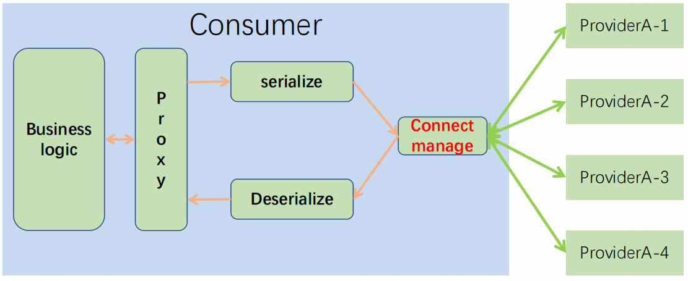

  * 初始化时机。比如项目启动时初始化连接或者第一次访问节点时初始化。
  * 连接数维护。根据节点的访问频率建立连接数，有一些访问少的节点连接数可以少一些。
  * 心跳、重连。

  客户端线程模型：客户端的请求统一存储到请求队列，由网络IO统一调用服务端；同样服务端响应结果存储在响应队列，再分别将结果返回给调用方。

  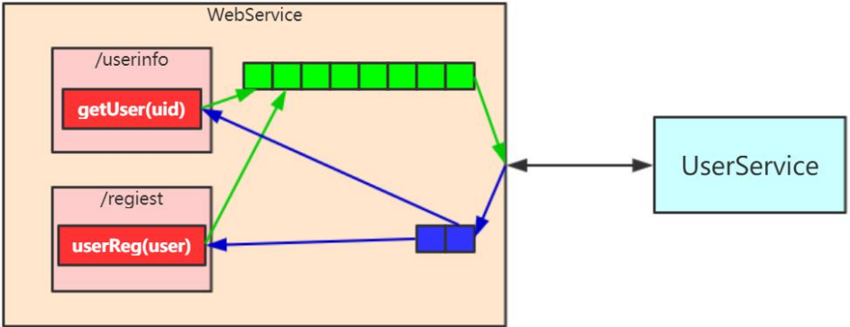

* 负载均衡。服务端有多个节点，需要提供负载均衡策略来选择节点。

  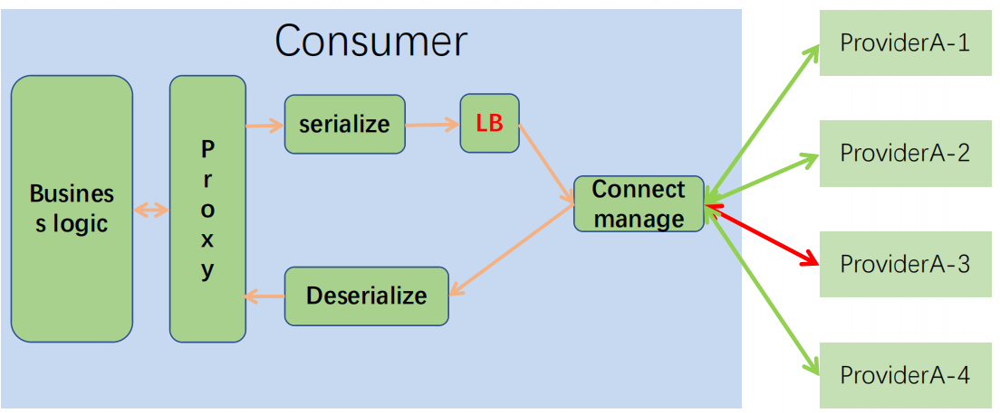

  * 轮询

  * 随机

  * 取模。缺点：当服务挂了之后，请求还是会进去。

  * 带权重。

    实现思路：

    1. 设计一个有界数组，用0和1随机填充，1的个数就是节点的权重值。

       ```java
       public static byte[] randomGenerator(int limit, int num) {
       
           byte[] tempArray = new byte[limit];
       
           if (num <= 0) {
               for (int i = 0; i < limit; i++) {
                   tempArray[i] = 0;
               }
               return tempArray;
           }
           if (num >= limit) {
               for (int i = 0; i < limit; i++) {
                   tempArray[i] = 1;
               }
               return tempArray;
           }
       
           //在数组中随机填充num个1
           Random random = new Random();
           for (int i = 0; i < num; i++) {
               int temp = Math.abs(random.nextInt()) % limit;
               while (tempArray[temp] == 1) {
                   temp = Math.abs(random.nextInt()) % limit;
               }
               tempArray[temp] = 1;
           }
           return tempArray;
       }
       ```

    2. 轮询节点，将调用次数与权重数组取模得到数组下标，根据下标去查询权重数组，如果是1则允许访问。

  * 一致性哈希。

* 请求路由。根据规则，将某些流量打到某几台服务器上，如灰度。

  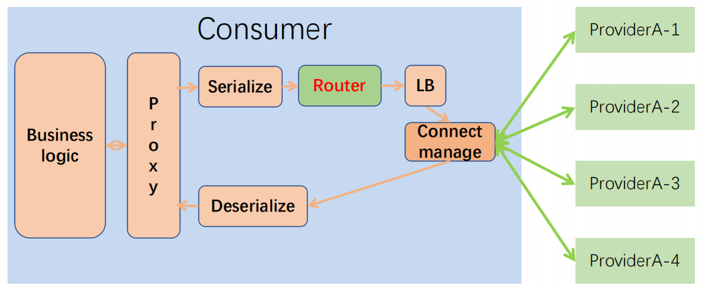

  路由功能设计实现：

  * 匹配规则

    * 待比较属性，如ip。
    * 运算符，如in。
    * 属性匹配值。
    * 匹配节点。

    如：IP分流规则举例：attribute=Ip，operator=IN，value=IP1,IP2，servers:Node1,Node2。

  * 规则编排

    * 通过链表的形式编排。

  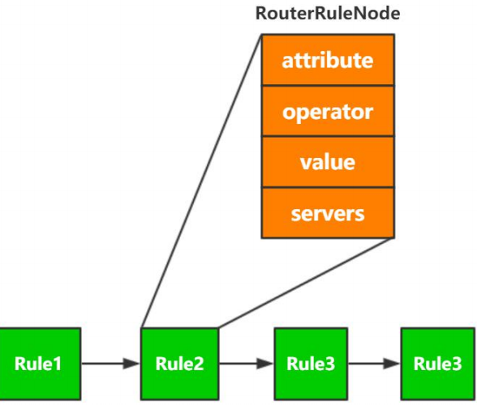

* 超时处理。

  RPC超时等待数据的返回，客户端发送数据是将数据发送到队列，等待网络IO发送数据到服务端。当数据有返回时再唤醒客户端线程。

  **代理类请求发送数据和接收调用逻辑**：

  1、注册WindowData。

  2、异步发送。

  3、等待数据到达。

  4、注销WindowData。

  ```java
  public Protocol request(Protocol requestProtocol) throws Exception {
          //Server状态判断
          if (ServerState.Reboot == state || ServerState.Dead == state) {
              throw new RebootException();
          }
          increaseCU();
          CSocket socket = null;
          try {
              try {
                  socket = socketPool.getSocket();
                  byte[] data = requestProtocol.toBytes(socket.isRights(), socket.getDESKey());
                  //注册WindowData，放入SessionID-WindowData的Map
                  socket.registerRec(requestProtocol.getSessionID());
                  //异步发送，将数据放入发送队列
                  socket.send(data);
              } catch (TimeoutException e) { 
                  timeout();
                  throw e;
              } catch (IOException e) {
                  if (socket == null || !socket.connecting()) {
                      if (testServerState() != ServerState.Normal) {
                          this.asDeath();
                          logger.info("this server : {}  is dead , will choose another one !", address);
  //                        logger.error(String.format("server %s is dead", new Object[]{this.address}), e);
                          throw new RebootException();
                      }
                  }
                  throw e;
              } catch (Exception e) {
                  throw e;
              } finally {
                  if (socket != null) {
                      socket.dispose();
                  }
              }
              
              //接收数据（等待数据到达通知）
              byte[] buffer = socket.receive(requestProtocol.getSessionID(), currUserCount);
              Protocol receiveProtocol = Protocol.fromBytes(buffer, socket.isRights(), socket.getDESKey());
  			
              return receiveProtocol;
          } finally {
              if (socket != null) {
                  //注销WindowData
                  socket.unregisterRec(requestProtocol.getSessionID());
              }
          }
  ```

  **数据发送实现逻辑**：

  1、注册发送事件SessionID-WindowData的Map

  ```java
  public void registerRec(int sessionId) {
      AutoResetEvent event = new AutoResetEvent();
      WindowData wd = new WindowData(event);
      WaitWindows.put(sessionId, wd);
  }
  ```

  2、异步发送

  ```java
  public void send(byte[] data) {
      try {
          if (null != transmitter) {
              TiresiasClientHelper.getInstance().setEndPoint(channel);
              TransmitterTask task = new TransmitterTask(this, data);
              transmitter.invoke(task);
          }
      } catch (NotYetConnectedException ex) {
          _connecting = false;
          throw ex;
      }
  }
  
  
  public void invoke(TransmitterTask task) {
          int size = wqueue.size();
          if (size > 1024 * 64) {
              logger.warn(Version.ID + " send queue is to max size is:" + size);
          }
      	//放入队列，异步发送
          wqueue.offer(task);
      }
  ```

  3、发送线程处理逻辑

  ```java
  class sendTask implements Runnable {
      @Override
      public void run() {
          int offset = 0;
          //缓存数据，用于聚合发送
          TransmitterTask[] elementData = new TransmitterTask[5];
          int waitTime = 0;
          for (; ; ) {
              try {
                  TransmitterTask task = wqueue.poll(waitTime, TimeUnit.MILLISECONDS);
                  if (null == task) {
                      if (elementData.length > 0 && offset > 0) {
                          send(elementData, offset);
                          offset = 0;
                          arrayClear(elementData);
                      }
                      waitTime = 10;
                      continue;
                  }
                  if (offset == 5) {
                      //发送
                      if (null != elementData) {
                          send(elementData, offset);
                      }
                      offset = 0;
                      arrayClear(elementData);
                  }
                  
                  //不实时发送，暂时放入数组
                  elementData[offset] = task;
                  waitTime = 0;
                  ++offset;
              } catch (Exception ex) {
                  offset = 0;
                  arrayClear(elementData);
                  ex.printStackTrace();
              } catch (Throwable e) {
                  e.printStackTrace();
              }
          }
      }
  }
  ```

  **工作线程接收数据处理逻辑**：

  ```java
  public byte[] receive(int sessionId, int queueLen) {
      //获取WindowData
      WindowData wd = WaitWindows.get(sessionId);
      if (wd == null) {
          throw new RuntimeException("Need invoke 'registerRec' method before invoke 'receive' method!");
      }
      AutoResetEvent event = wd.getEvent();
      //等待数据到达事件
      if (!event.waitOne(socketConfig.getReceiveTimeout())) {
          throw new TimeoutException("ServiceIP:[" + this.getServiceIP() + "],Receive data timeout or error!timeout:" + socketConfig.getReceiveTimeout() + "ms,queue length:"
                  + queueLen);
      }
      
      //从WindowData中获取Data数据
      byte[] data = wd.getData();
      int offset = SFPStruct.Version;
      int len = ByteConverter.bytesToIntLittleEndian(data, offset);
      if (len != data.length) {
          throw new ProtocolException("The data length inconsistent!datalen:" + data.length + ",check len:" + len);
      }
      return data;
  }
  ```

  AutoResetEvent实现

  ```java
  public class AutoResetEvent {
      CountDownLatch cdl;
  	//创建一个countDownLatch对象
      public AutoResetEvent() {
          cdl = new CountDownLatch(1);
      }
  
      public AutoResetEvent(int waitCount) {
          cdl = new CountDownLatch(waitCount);
      }
  	//数据返回后调用，唤醒线程
      public void set() {
          cdl.countDown();
      }
  
      public boolean waitOne(long time) {
          try {
              return cdl.await(time, TimeUnit.MILLISECONDS);
          } catch (Exception e) {
              throw new RuntimeException(e);
          }
      }
  }
  ```

  接收线程处理逻辑

  ```java
  public void decode(ByteBuffer receiveBuffer, byte[] receiveArray) throws Exception {
      try {
          int limit = receiveBuffer.limit();
          int num = 0;
          for (; num < limit; num++) {
              byte b = receiveArray[num];
              receiveData.write(b);
              if (b == ProtocolConst.P_END_TAG[index]) {
                  index++;
                  if (index == ProtocolConst.P_END_TAG.length) {
                      byte[] pak = receiveData.toByteArray(ProtocolConst.P_START_TAG.length, receiveData.size() - ProtocolConst.P_END_TAG.length - ProtocolConst.P_START_TAG.length);
                      
                      //解析返回包中的SessionId
                      int pSessionId = ByteConverter.bytesToIntLittleEndian(pak, SFPStruct.Version + SFPStruct.TotalLen);
                      
                      //根据SessionId获取对应的已WindowData
                      WindowData wd = WaitWindows.get(pSessionId);
                      if (wd != null) {
                          if (wd.getFlag() == 0) {
                              //将返回数据放入WindowData
                              wd.setData(pak);
                              //调用CountDownLatch的countDown，结束工作线程的等待
                              wd.getEvent().set();
                          } else if (wd.getFlag() == 1) {
                              /** 异步 */
                              if (null != unregisterRec(pSessionId)) {
                                  wd.getReceiveHandler().notify(pak, wd.getInvokeCnxn());
                              }
                          } else if (wd.getFlag() == 2) {
                              /** 异步 */
                              logger.info("un support request type !");
                          }
                      }
                      index = 0;
                      receiveData.reset();
                      continue;
                  }
              } else if (index != 0) {
                  if (b == ProtocolConst.P_END_TAG[0]) {
                      index = 1;
                  } else {
                      index = 0;
                  }
              }
          }
      } catch (Exception ex) {
          index = 0;
          ex.printStackTrace();
          receiveData.clear();
      }
  }
  ```

* 健康检查。

#### 服务端优化

* 队列/线程池。客户端请求放到请求队列中等待对应的handler来处理。

  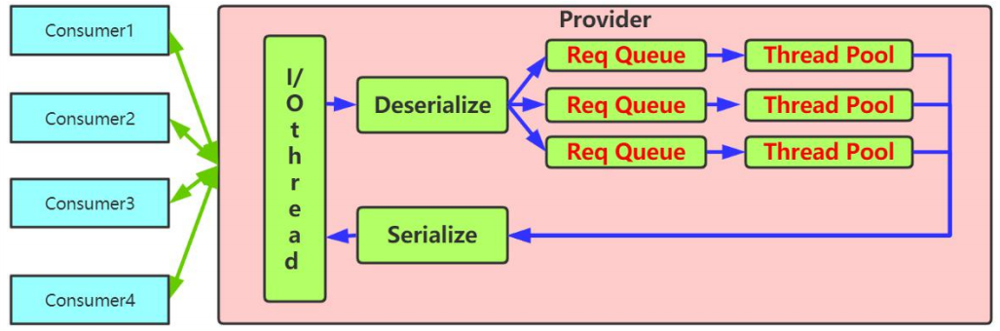

* 超时丢弃。

  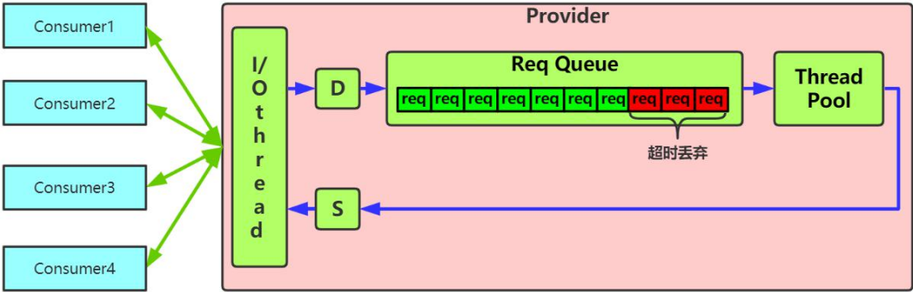

  超时丢弃逻辑：从队列中取出请求对象，判断请求是否超时，如果不超时则将请求转给对应的handler处理，否则丢弃请求。如下图，请求入队列时，会设置超时时间和入队时间：

  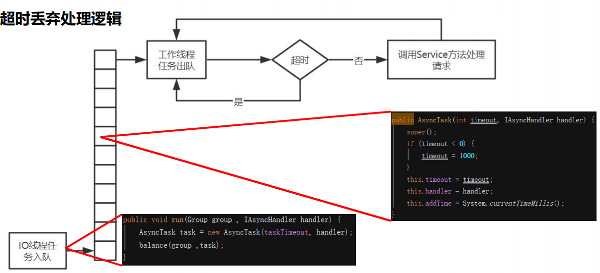

  如下图，从队列中取出请求数据后，会判断当前时间-请求入队时间是否大于超时时间，如果大于则丢弃。

  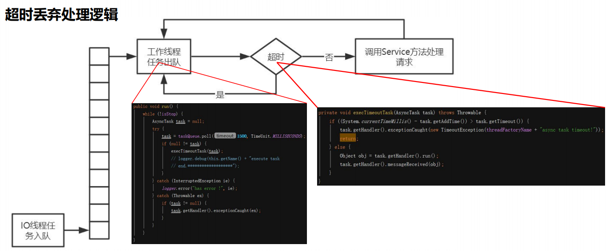

* 优雅关闭。暴力关闭，可能会导致请求队列中的请求丢失。

  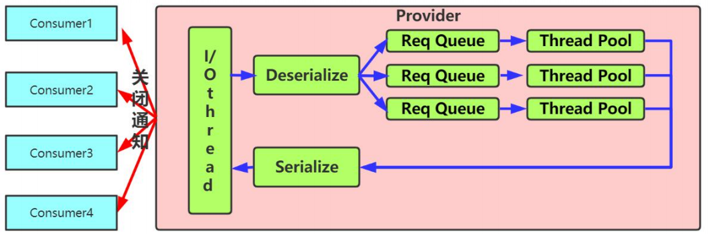

  1. 项目启动监听信号，如kill -12，当用户在控制台发出kill -12命令后，监听程序触发优雅关闭操作。

  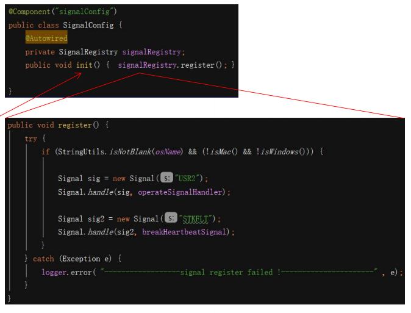

  2. 触发优雅关闭后，改变服务状态。

     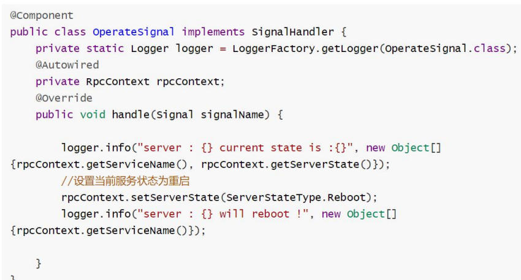

  3. 通知客户端。

     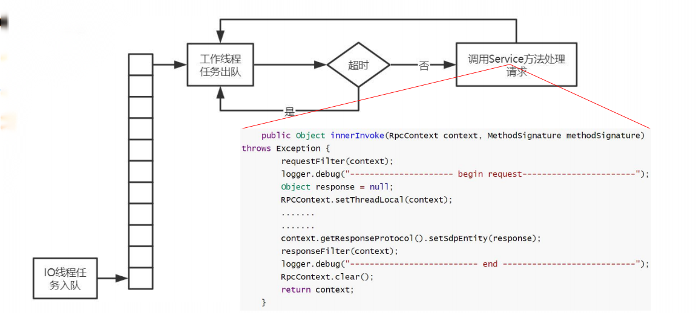

     状态改变放在过滤器中统一处理，可以将通用的处理逻辑定义成一系列过滤器，依次调用处理：

     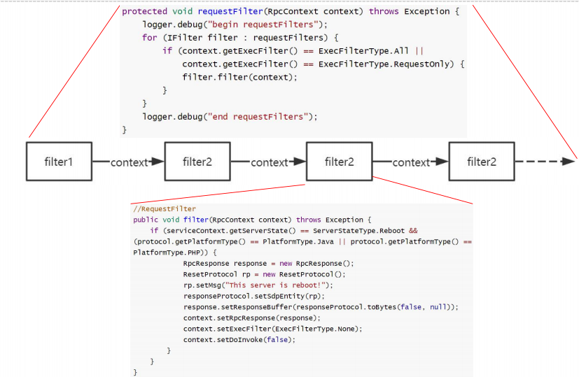

     4. 客户端改变节点状态为重启，并抛出异常，重新查询可用节点。

        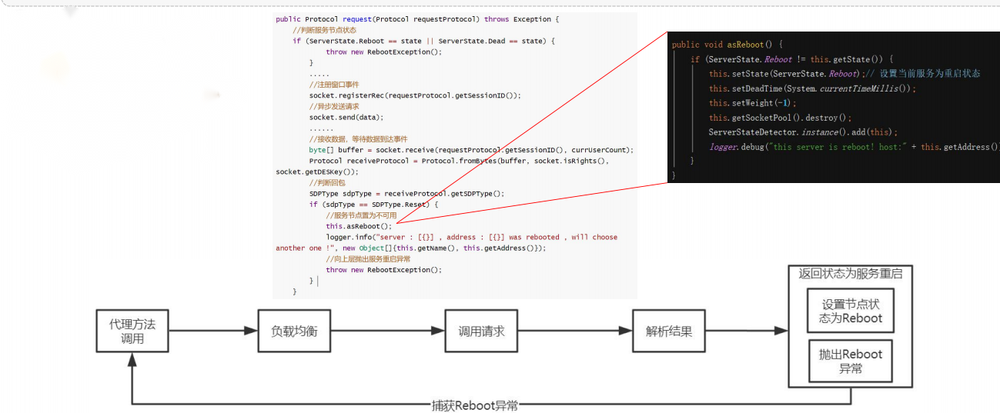

        5.客户端探活。服务端的节点变成重启状态后，客户端需要通过心跳机制来检测节点是否已经可用。

* 过载保护。超过处理能力。

  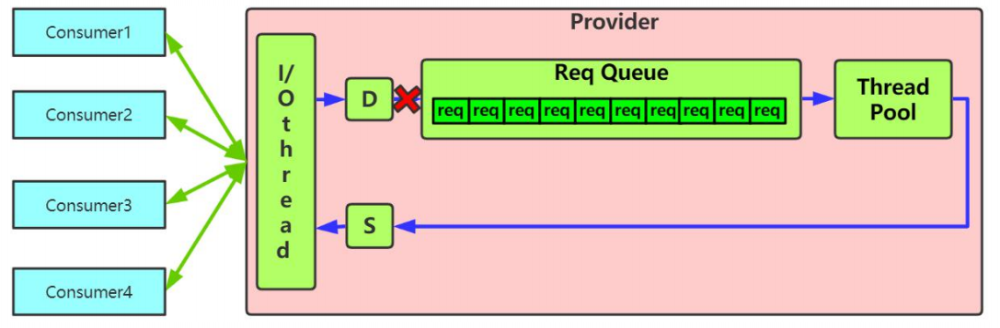

  过载保护主要是在入队列的时候判断当前队列中的请求数据是否已经达到的限制大小，如果大于则直接抛出新的请求或者将该请求替换队列中老的请求数据。

  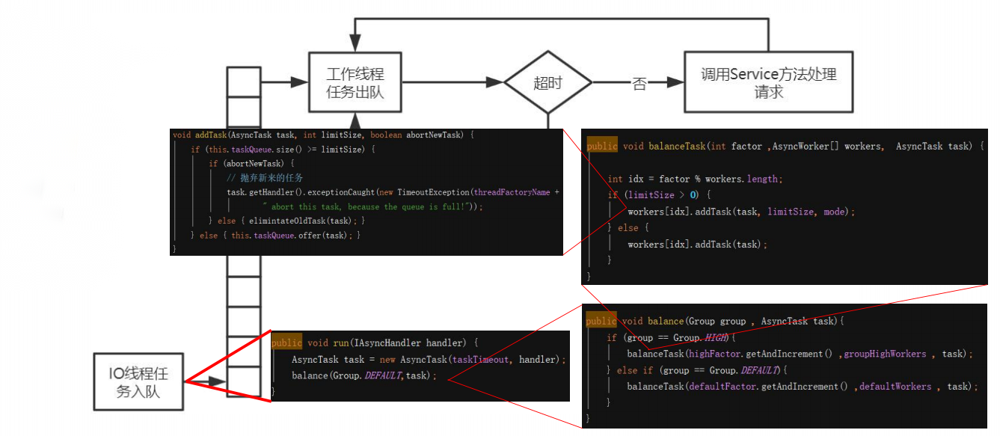

#### 高级功能

* 服务熔断
* 服务降级
* 动态权重
* 限流

