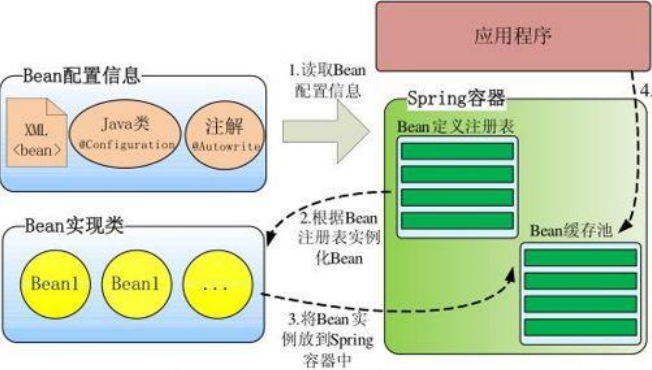
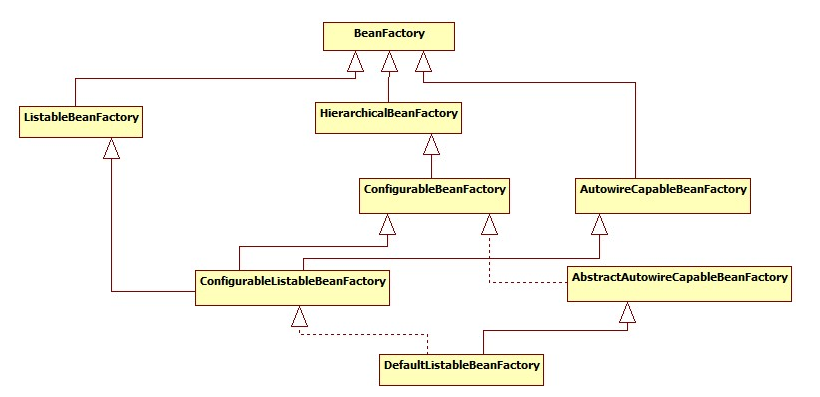
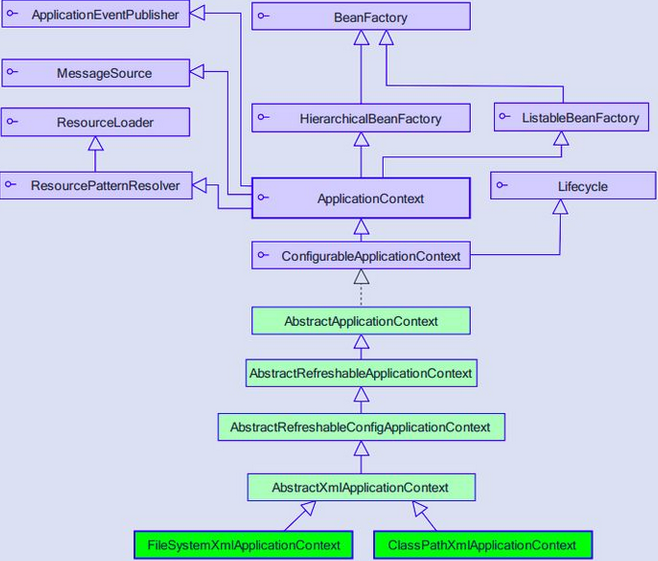

### Spring IOC

IOC-Inversion of Control 即控制反转，用户自己不进行对象的创建，依靠容器完成对象的创建和依赖注入。

#### Spring 容器视图

如下图是Spring 实例化对象的过程，先从配置文件或者扫描注解将类信息保存到注册表也就是Map集合，然后根据注册表实例化对象，然后将创建的对象缓存起来。




#### Spring IOC 体系结构

 Spring Bean的创建是典型的工厂模式，这一系列的Bean工厂，也即IOC容器为开发者管理对象间的依赖关系提供了很多便利和基础服务， 在Spring中有许多的IOC容器的实现供用户选择和使用，其相互关系如下：



* BeanFactory：最顶层的一个接口类，定义了容器的基本功能。

  ```JAVA
  //获取对象
  Object getBean(String name) throws BeansException;
  ```

* ListableBeanFactory：提供接口可以枚举所有的对象而不是根据名称来查询某一个对象。

* HierarchicalBeanFactory ：子对象可以继承一个工厂类，形成父子级联IoC容器的接口。通过setParentBeanFactory方法可以设置父工厂类。

  ```java
  //返回父工厂
  BeanFactory getParentBeanFactory()
  ```

* AutowireCapableBeanFactory ：定义了将容器中的 Bean 按某种规则（如按名字匹配、按类型匹配等）进行自动装配的方法；

这四个接口共同定义了 Bean 的集合、Bean 之间的关系、以及 Bean 行为。

#### ApplicationContext

ApplicationContext 由 BeanFactory 派生而来，提供了更多面向实际应用的功能。



* ClassPathXmlApplicationContext：默认从类路径加载配置文件

* FileSystemXmlApplicationContext：默认从文件系统中装载配置文件

* ApplicationEventPublisher：让容器拥有发布应用上下文事件的功能，包括容器启动事件、关闭事件等。实现了 ApplicationListener 事件监听接口的 Bean 可以接收到容器事件 ， 并对事件进行响应处理 。 在  ApplicationContext 抽象实现类AbstractApplicationContext 中，我们可以发现存在一个  ApplicationEventMulticaster，它负责保存所有监听器，以便在容器产生上下文事件时通知这些事件监听者。 

  ```java
  /**
  	 * Add a listener to be notified of all events.
  	 * @param listener the listener to add
  	 */
  	void addApplicationListener(ApplicationListener<?> listener);
  
  	/**
  	 * Add a listener bean to be notified of all events.
  	 * @param listenerBeanName the name of the listener bean to add
  	 */
  	void addApplicationListenerBean(String listenerBeanName);
  ```

  

* MessageSource：为应用提供 i18n 国际化消息访问的功能； 

* ResourcePatternResolver ： 所 有 ApplicationContext 实现类都实现了类似于PathMatchingResourcePatternResolver  的功能，可以通过带前缀的 Ant 风格的资源文件路径装载 Spring 的配置文件。 

* LifeCycle：该接口是  Spring 2.0 加入的，该接口提供了 start()和 stop()两个方法，主要用于控制异步处理过程。在具体使用时，该接口同时被  ApplicationContext 实现及具体 Bean 实现， ApplicationContext 会将 start/stop  的信息传递给容器中所有实现了该接口的 Bean，以达到管理和控制 JMX、任务调度等目的。

* ConfigurableApplicationContext 扩展于 ApplicationContext，它新增加了两个主要的方法： refresh()和 close()，让  ApplicationContext 具有启动、刷新和关闭应用上下文的能力。在应用上下文关闭的情况下调用  refresh()即可启动应用上下文，在已经启动的状态下，调用  refresh()则清除缓存并重新装载配置信息，而调用close()则可关闭应用上下文。

#### 启动过程分析

```java
    public static void main(String[] args) {
        // 用我们的配置文件来启动一个 ApplicationContext
        ApplicationContext context = new ClassPathXmlApplicationContext("classpath:application.xml");
        // 从 context 中取出我们的 Bean，而不是用 new MessageServiceImpl() 这种方式
        MessageService messageService = context.getBean(MessageService.class);
        System.out.println(messageService.getMessage());
    }
```

进入ClassPathXmlApplicationContext类，看看它是如何从xml文件中解析、实例化对象。

```java
//ClassPathXmlApplicationContext
//构造方法
public ClassPathXmlApplicationContext(String[] paths, Class<?> clazz, @Nullable ApplicationContext parent)
      throws BeansException {

   super(parent);
   Assert.notNull(paths, "Path array must not be null");
   Assert.notNull(clazz, "Class argument must not be null");
   this.configResources = new Resource[paths.length];
   for (int i = 0; i < paths.length; i++) {
      //可能指定多个路径 
      this.configResources[i] = new ClassPathResource(paths[i], clazz);
   }
   //核心方法 
   refresh();
}
```

核心逻辑在AbstractApplicationContext的refresh方法中：

```java
//AbstractApplicationContext
public void refresh() throws BeansException, IllegalStateException {
   //加锁 
   synchronized (this.startupShutdownMonitor) {
      StartupStep contextRefresh = this.applicationStartup.start("spring.context.refresh");

      // 1.准备工作，记录容器的启动时间，将容器标记为已启动，创建一些监听器的容器。
      prepareRefresh();
		
      // 2.创建BeanFactory，读取bean配置信息，并缓存到Map集合中
      ConfigurableListableBeanFactory beanFactory = obtainFreshBeanFactory();
   }
}
```

接上，创建BeanFactory，并且将Bean的信息加载到BeanFactory

```java
//AbstractApplicationContext
protected ConfigurableListableBeanFactory obtainFreshBeanFactory() {
   //关闭旧的Factory，创建新的BeanFactory，加载Bean定义，注册Bean。
    refreshBeanFactory();
   //返回beanFactory 
   return getBeanFactory();
}

//AbstractRefreshableApplicationContext
protected final void refreshBeanFactory() throws BeansException {
	if (hasBeanFactory()) {
        //关闭旧的工厂
		destroyBeans();
		closeBeanFactory();
	}
	try {
        //创建beanFactory，这里创建的是DefaultListableBeanFactory，它位于beanFactory的最底层，实现的功能最多。
		DefaultListableBeanFactory beanFactory = createBeanFactory();
		beanFactory.setSerializationId(getId());
        //设置是否允许循环依赖、是否可以被覆盖
		customizeBeanFactory(beanFactory);
        //加载Bean配置的BeanFactory
		loadBeanDefinitions(beanFactory);
		this.beanFactory = beanFactory;
	}
	catch (IOException ex) {
		throw new ApplicationContextException("I/O error parsing bean definition source for " + getDisplayName(), ex);
	}
}

//customizeBeanFactory
protected void customizeBeanFactory(DefaultListableBeanFactory beanFactory) {
    //bean定义是否能被覆盖
    //如果在同一个文件中存在相同的id或者name会抛错，但是如果不在同一个文件中，会发生覆盖。
    //有些时候我们不希望在系统启动过程中发生Bean覆盖，因为万一出现这种请求会增加排查问题的成本
	if (this.allowBeanDefinitionOverriding != null) {		beanFactory.setAllowBeanDefinitionOverriding(this.allowBeanDefinitionOverriding);
	}
    //是否可以循环依赖
    //A依赖B,B又依赖A
	if (this.allowCircularReferences != null) {
		beanFactory.setAllowCircularReferences(this.allowCircularReferences);
	}
}

```

追踪loadBeanDefinitions方法到XmlBeanDefinitionReader.doLoadBeanDefinitions，从名字也可以看出，从xml文件中加载Bean的定义信息：

```java
//XmlBeanDefinitionReader
protected int doLoadBeanDefinitions(InputSource inputSource, Resource resource)
      throws BeanDefinitionStoreException {

   try {
   	//流转换成Document
      Document doc = doLoadDocument(inputSource, resource);
     //解析doc
      int count = registerBeanDefinitions(doc, resource);
      if (logger.isDebugEnabled()) {
         logger.debug("Loaded " + count + " bean definitions from " + resource);
      }
      return count;
   }
}


//DefaultBeanDefinitionDocumentReader
protected void doRegisterBeanDefinitions(Element root) {
    //解析xml文件之前的处理逻辑
	preProcessXml(root);
    //解析xml文件
	parseBeanDefinitions(root, this.delegate);
    //解析完xml之后
	postProcessXml(root);
	this.delegate = parent;
}


//DefaultBeanDefinitionDocumentReader
protected void parseBeanDefinitions(Element root, BeanDefinitionParserDelegate delegate) {
   //检查xml文件是否是默认命名空间
   //即namespace的Uri 是否是 http://www.springframework.org/schema/beans
   if (delegate.isDefaultNamespace(root)) {
      NodeList nl = root.getChildNodes();
      for (int i = 0; i < nl.getLength(); i++) {
         Node node = nl.item(i);
         if (node instanceof Element) {
            Element ele = (Element) node;
             //解析默认命名空间,<import/>,<bean/>,<alias/>,<beans/>
            if (delegate.isDefaultNamespace(ele)) {
               parseDefaultElement(ele, delegate);
            }
            else {
             //非默认命名空间，包括：<mvc/>,<aop/>,<context/>   
               delegate.parseCustomElement(ele);
            }
         }
      }
   }
   else {
      delegate.parseCustomElement(root);
   }
}

//DefaultBeanDefinitionDocumentReader
//解析默认命名空间的标签
private void parseDefaultElement(Element ele, BeanDefinitionParserDelegate delegate) {
    //import
   if (delegate.nodeNameEquals(ele, IMPORT_ELEMENT)) {
      importBeanDefinitionResource(ele);
   }
    //alias
   else if (delegate.nodeNameEquals(ele, ALIAS_ELEMENT)) {
      processAliasRegistration(ele);
   }
    //bean
   else if (delegate.nodeNameEquals(ele, BEAN_ELEMENT)) {
      processBeanDefinition(ele, delegate);
   }
    //beans
   else if (delegate.nodeNameEquals(ele, NESTED_BEANS_ELEMENT)) {
      // recurse
      doRegisterBeanDefinitions(ele);
   }
}

//DefaultBeanDefinitionDocumentReader
//解析bean标签
protected void processBeanDefinition(Element ele, BeanDefinitionParserDelegate delegate) {
    //将bean节点从配置文件中解析出来。
   BeanDefinitionHolder bdHolder = delegate.parseBeanDefinitionElement(ele);
   
    if (bdHolder != null) {
      bdHolder = delegate.decorateBeanDefinitionIfRequired(ele, bdHolder);
      try {
        //将加载出来的bean存储map集合中
         BeanDefinitionReaderUtils.registerBeanDefinition(bdHolder, getReaderContext().getRegistry());
      }
   }
}

```

遍历Document节点，将节点信息解析出来：

```java
//BeanDefinitionParserDelegate
public BeanDefinitionHolder parseBeanDefinitionElement(Element ele, @Nullable BeanDefinition containingBean) {
    //id属性
   String id = ele.getAttribute(ID_ATTRIBUTE);
    //name属性，可以指定多个，别名
    //<bean id="messageService" name="m1, m2, m3" class="com.javadoop.example.MessageServi
   String nameAttr = ele.getAttribute(NAME_ATTRIBUTE);
   List<String> aliases = new ArrayList<>();
   if (StringUtils.hasLength(nameAttr)) {
       //别名以逗号分隔
      String[] nameArr = StringUtils.tokenizeToStringArray(nameAttr, MULTI_VALUE_ATTRIBUTE_DELIMITERS);
      aliases.addAll(Arrays.asList(nameArr));
   }
	//beanName默认是id
   String beanName = id;
    //如果bean没有设置id，并且有设置别名，那么beanName默认取第一个别名
   if (!StringUtils.hasText(beanName) && !aliases.isEmpty()) {
      //remove方法清空掉第一个元素并返回
      beanName = aliases.remove(0);
   }
   if (containingBean == null) {
       //检查beanName是否有重复
      checkNameUniqueness(beanName, aliases, ele);
   }
	//解析
   AbstractBeanDefinition beanDefinition = parseBeanDefinitionElement(ele, beanName, containingBean);
   if (beanDefinition != null) {
      if (!StringUtils.hasText(beanName)) {
         try {
            if (containingBean != null) {
               beanName = BeanDefinitionReaderUtils.generateBeanName(
                     beanDefinition, this.readerContext.getRegistry(), true);
            }
            else {
               //如果没有指定beanName，则生成一个。注解模式的bean的beanName是类名成的第一个字母变成小写。如果类的前两个字母都是大写，则直接返回
               beanName = this.readerContext.generateBeanName(beanDefinition);
               // Register an alias for the plain bean class name, if still possible,
               // if the generator returned the class name plus a suffix.
               // This is expected for Spring 1.2/2.0 backwards compatibility.
               String beanClassName = beanDefinition.getBeanClassName();
               if (beanClassName != null &&
                     beanName.startsWith(beanClassName) && beanName.length() > beanClassName.length() &&
                     !this.readerContext.getRegistry().isBeanNameInUse(beanClassName)) {
                  aliases.add(beanClassName);
               }
            }
            if (logger.isTraceEnabled()) {
               logger.trace("Neither XML 'id' nor 'name' specified - " +
                     "using generated bean name [" + beanName + "]");
            }
         }
         catch (Exception ex) {
            error(ex.getMessage(), ele);
            return null;
         }
      }
      String[] aliasesArray = StringUtils.toStringArray(aliases);
       //返回BeanDefinitionHolder，它封装了beanDefinition、beanName、aliasesArray
      return new BeanDefinitionHolder(beanDefinition, beanName, aliasesArray);
   }
   return null;
}


//生成beanName ,以注解为例子
//AnnotationBeanNameGenerator
public String generateBeanName(BeanDefinition definition, BeanDefinitionRegistry registry) {
		if (definition instanceof AnnotatedBeanDefinition) {
            //注解是否有指定value,如果存在则直接返回
			String beanName = determineBeanNameFromAnnotation((AnnotatedBeanDefinition) definition);
			if (StringUtils.hasText(beanName)) {
				// Explicit bean name found.
				return beanName;
			}
		}
		// Fallback: generate a unique default bean name.
    	//生成beanName
		return buildDefaultBeanName(definition, registry);
}

protected String buildDefaultBeanName(BeanDefinition definition, BeanDefinitionRegistry registry) {
		return buildDefaultBeanName(definition);
}

protected String buildDefaultBeanName(BeanDefinition definition) {
    	//获取类的全称，包括包名
		String beanClassName = definition.getBeanClassName();
		Assert.state(beanClassName != null, "No bean class name set");
    	//获取类的短名称，不包括包名称
		String shortClassName = ClassUtils.getShortName(beanClassName);
		return Introspector.decapitalize(shortClassName);
}

public static String decapitalize(String name) {
        if (name == null || name.length() == 0) {
            return name;
        }
    	//如果前两个字符都是大写，则直接返回类名
        if (name.length() > 1 && Character.isUpperCase(name.charAt(1)) &&
                        Character.isUpperCase(name.charAt(0))){
            return name;
        }
        char chars[] = name.toCharArray();
    	//将类名的第一个字母变成小写
        chars[0] = Character.toLowerCase(chars[0]);
        return new String(chars);
}


```

接着上面方法中的parseBeanDefinitionElement来分析Spring是怎么解析xml文件的：

```java
public AbstractBeanDefinition parseBeanDefinitionElement(
      Element ele, String beanName, @Nullable BeanDefinition containingBean) {

   this.parseState.push(new BeanEntry(beanName));

   String className = null;
   //获取class CLASS_ATTRIBUTE --->calss
   //<bean id="messageService" class="com.javadoop.example.MessageServiceImpl">
   if (ele.hasAttribute(CLASS_ATTRIBUTE)) {
      className = ele.getAttribute(CLASS_ATTRIBUTE).trim();
   }
   String parent = null;
    
   //PARENT_ATTRIBUTE -->parent
   //如下注释，inheritsWithDifferentClass通过parent继承了inheritedTestBean
   /**<bean id="inheritedTestBean" abstract="true" 		   	        class="org.springframework.beans.TestBean">
     	<property name="name" value="parent"/>
     	<property name="age" value="1"/>
   	</bean>
     
    <bean id="inheritsWithDifferentClass" class="org.springframework.beans.DerivedTestBean"
    parent="inheritedTestBean" init-method="initialize">
     	<property name="name" value="override"/>
    </bean>
   */
   if (ele.hasAttribute(PARENT_ATTRIBUTE)) {
      parent = ele.getAttribute(PARENT_ATTRIBUTE);
   }

   try {
       //创建BeanDefinition
      AbstractBeanDefinition bd = createBeanDefinition(className, parent);
	//设置BeanDefinition的属性，如是否是非单例，是否是虚拟类、是否懒加载等等。
      parseBeanDefinitionAttributes(ele, beanName, containingBean, bd);
      bd.setDescription(DomUtils.getChildElementValueByTagName(ele, DESCRIPTION_ELEMENT));
	//解析<meta/>属性
      parseMetaElements(ele, bd);
       //解析<lookup-method>
      parseLookupOverrideSubElements(ele, bd.getMethodOverrides());
       //解析<replaced-method>
      parseReplacedMethodSubElements(ele, bd.getMethodOverrides());
       
	   //解析<constructor-arg>
      parseConstructorArgElements(ele, bd);
       //解析property
      parsePropertyElements(ele, bd);
       //解析<qualifier>
      parseQualifierElements(ele, bd);

      bd.setResource(this.readerContext.getResource());
      bd.setSource(extractSource(ele));

      return bd;
   }
   catch (ClassNotFoundException ex) {
      error("Bean class [" + className + "] not found", ele, ex);
   }
   catch (NoClassDefFoundError err) {
      error("Class that bean class [" + className + "] depends on not found", ele, err);
   }
   catch (Throwable ex) {
      error("Unexpected failure during bean definition parsing", ele, ex);
   }
   finally {
      this.parseState.pop();
   }

   return null;
}
```

到这里已经根据bean标签创建了一个BeanDefinitionHolder实例，我再回到DefaultBeanDefinitionDocumentReader的processBeanDefinition方法，看看当我们将bean的配置信息从配置文件中解析出来后，怎样保存的。

```java
//DefaultBeanDefinitionDocumentReader
protected void processBeanDefinition(Element ele, BeanDefinitionParserDelegate delegate) {
    //前面的分析，已经将bean的配置信息封装进BeanDefinitionHolder对象
   BeanDefinitionHolder bdHolder = delegate.parseBeanDefinitionElement(ele);
   if (bdHolder != null) {
      bdHolder = delegate.decorateBeanDefinitionIfRequired(ele, bdHolder);
      try {
         // Register the final decorated instance.
          //将bean信息存储到map集合
         BeanDefinitionReaderUtils.registerBeanDefinition(bdHolder, getReaderContext().getRegistry());
      }
      catch (BeanDefinitionStoreException ex) {
         getReaderContext().error("Failed to register bean definition with name '" +
               bdHolder.getBeanName() + "'", ele, ex);
      }
      // Send registration event.
      getReaderContext().fireComponentRegistered(new BeanComponentDefinition(bdHolder));
   }
}

//registerBeanDefinition
public static void registerBeanDefinition(
      BeanDefinitionHolder definitionHolder, BeanDefinitionRegistry registry)
      throws BeanDefinitionStoreException {

   // Register bean definition under primary name.
   String beanName = definitionHolder.getBeanName();
    //保存BeanDefinition
   registry.registerBeanDefinition(beanName, definitionHolder.getBeanDefinition());

   // Register aliases for bean name, if any.
   String[] aliases = definitionHolder.getAliases();
   if (aliases != null) {
       //循环别名，将beanName与别名形成映射
      for (String alias : aliases) {
         registry.registerAlias(beanName, alias);
      }
   }
}
```

真正将beanDefinition存储到map集合的逻辑：

```java
//DefaultListableBeanFactory
public void registerBeanDefinition(String beanName, BeanDefinition beanDefinition)
      throws BeanDefinitionStoreException {

   Assert.hasText(beanName, "Bean name must not be empty");
   Assert.notNull(beanDefinition, "BeanDefinition must not be null");

   if (beanDefinition instanceof AbstractBeanDefinition) {
      try {
         ((AbstractBeanDefinition) beanDefinition).validate();
      }
      catch (BeanDefinitionValidationException ex) {
         throw new BeanDefinitionStoreException(beanDefinition.getResourceDescription(), beanName,
               "Validation of bean definition failed", ex);
      }
   }
	//所有的BeanDefinition都会存储在beanDefinitionMap集合中
   BeanDefinition existingDefinition = this.beanDefinitionMap.get(beanName);
   if (existingDefinition != null) {
       //如果已经存在，则需要判断是否允许覆盖
      if (!isAllowBeanDefinitionOverriding()) {
         throw new BeanDefinitionOverrideException(beanName, beanDefinition, existingDefinition);
      }
     //保存
      this.beanDefinitionMap.put(beanName, beanDefinition);
   }
   else {
      if (hasBeanCreationStarted()) {
          //bean是否已经开始初始化了，一般情况下，现节点还没有开始初始化
         // Cannot modify startup-time collection elements anymore (for stable iteration)
         synchronized (this.beanDefinitionMap) {
            this.beanDefinitionMap.put(beanName, beanDefinition);
            List<String> updatedDefinitions = new ArrayList<>(this.beanDefinitionNames.size() + 1);
            updatedDefinitions.addAll(this.beanDefinitionNames);
            updatedDefinitions.add(beanName);
            this.beanDefinitionNames = updatedDefinitions;
            removeManualSingletonName(beanName);
         }
      }
      else {
           //默认情况下，流程会进入此
         // Still in startup registration phase
         this.beanDefinitionMap.put(beanName, beanDefinition);
         this.beanDefinitionNames.add(beanName);
         removeManualSingletonName(beanName);
      }
      this.frozenBeanDefinitionNames = null;
   }

   if (existingDefinition != null || containsSingleton(beanName)) {
      resetBeanDefinition(beanName);
   }
   else if (isConfigurationFrozen()) {
      clearByTypeCache();
   }
}
```


#### 实例化bean

将bean的信息加载到map集合后，就开始进行实例化bean，我们再把refresh方法贴一遍：

```java
//AbstractApplicationContext
public void refresh() throws BeansException, IllegalStateException {
   synchronized (this.startupShutdownMonitor) {
      StartupStep contextRefresh = this.applicationStartup.start("spring.context.refresh");

      // Prepare this context for refreshing.
      prepareRefresh();

      // Tell the subclass to refresh the internal bean factory.
      ConfigurableListableBeanFactory beanFactory = obtainFreshBeanFactory();
		//设置 BeanFactory，添加几个 BeanPostProcessor，手动注册几个特殊的 bean
      // Prepare the bean factory for use in this context.
      prepareBeanFactory(beanFactory);

      try {
          //这里需要知道 BeanFactoryPostProcessor 这个知识点，Bean 如果实现了此接口，
         // 那么在容器初始化以后，Spring 会负责调用里面的 postProcessBeanFactory 方法
         // Allows post-processing of the bean factory in context subclasses.
         postProcessBeanFactory(beanFactory);

         StartupStep beanPostProcess = this.applicationStartup.start("spring.context.beans.post-process");
         // Invoke factory processors registered as beans in the context.
         //调用 BeanFactoryPostProcessor 各个实现类的 postProcessBeanFactory(factory) 方法
         invokeBeanFactoryPostProcessors(beanFactory);

         // Register bean processors that intercept bean creation.
         registerBeanPostProcessors(beanFactory);
         beanPostProcess.end();

         // Initialize message source for this context.
         //初始化当前 ApplicationContext 的 MessageSource，国际化这里
         initMessageSource();

         // Initialize event multicaster for this context.
         //初始化当前 ApplicationContext 的事件广播器
         initApplicationEventMulticaster();

         // Initialize other special beans in specific context subclasses.
         //具体的子类可以在这里初始化一些特殊的 Bean（在初始化 singleton beans 之前）
         onRefresh();

         // Check for listener beans and register them.
         //注册事件监听器，监听器需要实现 ApplicationListener 接口
         registerListeners();

         // Instantiate all remaining (non-lazy-init) singletons.
         //初始化所有的 singleton，beans lazy-init 的除外
         finishBeanFactoryInitialization(beanFactory);

         // Last step: publish corresponding event.
         //最后，广播事件，ApplicationContext 初始化完成
         finishRefresh();
      }
   }
}
```

**准备beanFactory**

```java
protected void prepareBeanFactory(ConfigurableListableBeanFactory beanFactory) {
   // Tell the internal bean factory to use the context's class loader etc.
   //设置beanFactory的类加载器，在其他用的到beanFactory的地方可以通过类加载器加载它
   beanFactory.setBeanClassLoader(getClassLoader());
   if (!shouldIgnoreSpel) {
       //设置表达式的解析策略
      beanFactory.setBeanExpressionResolver(new StandardBeanExpressionResolver(beanFactory.getBeanClassLoader()));
   }
   beanFactory.addPropertyEditorRegistrar(new ResourceEditorRegistrar(this, getEnvironment()));

   // Configure the bean factory with context callbacks.
   // 在bean在初始化的时候，这个 processor 负责回调
   beanFactory.addBeanPostProcessor(new ApplicationContextAwareProcessor(this));
   //如果某个bean实现了以下几个接口。自动装配的时候先忽略掉。
   beanFactory.ignoreDependencyInterface(EnvironmentAware.class);
   beanFactory.ignoreDependencyInterface(EmbeddedValueResolverAware.class);
   beanFactory.ignoreDependencyInterface(ResourceLoaderAware.class);
   beanFactory.ignoreDependencyInterface(ApplicationEventPublisherAware.class);
   beanFactory.ignoreDependencyInterface(MessageSourceAware.class);
   beanFactory.ignoreDependencyInterface(ApplicationContextAware.class);
   beanFactory.ignoreDependencyInterface(ApplicationStartup.class);

   // BeanFactory interface not registered as resolvable type in a plain factory.
   // MessageSource registered (and found for autowiring) as a bean.
   //注册beanFactory
   beanFactory.registerResolvableDependency(BeanFactory.class, beanFactory);
   beanFactory.registerResolvableDependency(ResourceLoader.class, this);
   beanFactory.registerResolvableDependency(ApplicationEventPublisher.class, this);
   beanFactory.registerResolvableDependency(ApplicationContext.class, this);

   // Register early post-processor for detecting inner beans as ApplicationListeners.
   beanFactory.addBeanPostProcessor(new ApplicationListenerDetector(this));

   // Detect a LoadTimeWeaver and prepare for weaving, if found.
   if (!NativeDetector.inNativeImage() && beanFactory.containsBean(LOAD_TIME_WEAVER_BEAN_NAME)) {
      beanFactory.addBeanPostProcessor(new LoadTimeWeaverAwareProcessor(beanFactory));
      // Set a temporary ClassLoader for type matching.
      beanFactory.setTempClassLoader(new ContextTypeMatchClassLoader(beanFactory.getBeanClassLoader()));
   }

   // Register default environment beans.
   //注册默认的环境bean到单例
   if (!beanFactory.containsLocalBean(ENVIRONMENT_BEAN_NAME)) {
      beanFactory.registerSingleton(ENVIRONMENT_BEAN_NAME, getEnvironment());
   }
   if (!beanFactory.containsLocalBean(SYSTEM_PROPERTIES_BEAN_NAME)) {
      beanFactory.registerSingleton(SYSTEM_PROPERTIES_BEAN_NAME, getEnvironment().getSystemProperties());
   }
   if (!beanFactory.containsLocalBean(SYSTEM_ENVIRONMENT_BEAN_NAME)) {
      beanFactory.registerSingleton(SYSTEM_ENVIRONMENT_BEAN_NAME, getEnvironment().getSystemEnvironment());
   }
   if (!beanFactory.containsLocalBean(APPLICATION_STARTUP_BEAN_NAME)) {
      beanFactory.registerSingleton(APPLICATION_STARTUP_BEAN_NAME, getApplicationStartup());
   }
}
```

**开始初始化singleton**

```java
//AbstractApplicationContext
protected void finishBeanFactoryInitialization(ConfigurableListableBeanFactory beanFactory) {
   //开始初始化
   beanFactory.preInstantiateSingletons();
}

//DefaultListableBeanFactory
public void preInstantiateSingletons() throws BeansException {
   if (logger.isTraceEnabled()) {
      logger.trace("Pre-instantiating singletons in " + this);
   }

   // Iterate over a copy to allow for init methods which in turn register new bean definitions.
   // While this may not be part of the regular factory bootstrap, it does otherwise work fine.
   //beanDefinitionNames保存的beanName
   List<String> beanNames = new ArrayList<>(this.beanDefinitionNames);

   // Trigger initialization of all non-lazy singleton beans...
   for (String beanName : beanNames) {
      //合并父 Bean中的配置，注意 <bean id="" class="" parent="" /> 中的 parent
      RootBeanDefinition bd = getMergedLocalBeanDefinition(beanName);
       //如果类是抽象类或者懒加载，则不需要继续初始化
      if (!bd.isAbstract() && bd.isSingleton() && !bd.isLazyInit()) {
         if (isFactoryBean(beanName)) {
            //FactoryBean 的话，在 beanName 前面加上 ‘&’ 符号
            Object bean = getBean(FACTORY_BEAN_PREFIX + beanName);
            if (bean instanceof FactoryBean) {
               FactoryBean<?> factory = (FactoryBean<?>) bean;
               boolean isEagerInit;
               if (System.getSecurityManager() != null && factory instanceof SmartFactoryBean) {
                  isEagerInit = AccessController.doPrivileged(
                        (PrivilegedAction<Boolean>) ((SmartFactoryBean<?>) factory)::isEagerInit,
                        getAccessControlContext());
               }
               else {
                  isEagerInit = (factory instanceof SmartFactoryBean &&
                        ((SmartFactoryBean<?>) factory).isEagerInit());
               }
               if (isEagerInit) {
                  getBean(beanName);
               }
            }
         }
         else {
            //普通bean,只需要调用getBean方法
            getBean(beanName);
         }
      }
   }
}
```

getBean方法：

```java
//AbstractBeanFactory
public Object getBean(String name) throws BeansException {
		return doGetBean(name, null, null, false);
}

protected <T> T doGetBean(
      String name, @Nullable Class<T> requiredType, @Nullable Object[] args, boolean typeCheckOnly)
      throws BeansException {
	//获取真正的beanName，前面FactoryBean的beanName拼接了&
   String beanName = transformedBeanName(name);
   Object beanInstance;

   // Eagerly check singleton cache for manually registered singletons.
   //第一次先从缓存中获取单例对象
   Object sharedInstance = getSingleton(beanName);
   if (sharedInstance != null && args == null) {
  beanInstance = getObjectForBeanInstance(sharedInstance, name, beanName, null);
   }else {
      // Fail if we're already creating this bean instance:
      // We're assumably within a circular reference.
      if (isPrototypeCurrentlyInCreation(beanName)) {
         //当前线程已经创建过了此 beanName 的 prototype 类型的 bean，那么抛异常
         throw new BeanCurrentlyInCreationException(beanName);
      }
      
      if (!typeCheckOnly) {
         // // typeCheckOnly 为 false，将当前 beanName 放入一个 alreadyCreated 的 Set 集合中
         markBeanAsCreated(beanName);
      }

      try {
         // Create bean instance.
         //创建singleton的实例
         if (mbd.isSingleton()) {
           //第二次尝试获取bean，没有获取到则执行createBean方法
            sharedInstance = getSingleton(beanName, () -> {
               try {
                  //创建bean
                  return createBean(beanName, mbd, args);
               }
               catch (BeansException ex) {
                  // Explicitly remove instance from singleton cache: It might have been put there
                  // eagerly by the creation process, to allow for circular reference resolution.
                  // Also remove any beans that received a temporary reference to the bean.
                  destroySingleton(beanName);
                  throw ex;
               }
            });
            beanInstance = getObjectForBeanInstance(sharedInstance, name, beanName, mbd);
         }
      catch (BeansException ex) {
         beanCreation.tag("exception", ex.getClass().toString());
         beanCreation.tag("message", String.valueOf(ex.getMessage()));
         cleanupAfterBeanCreationFailure(beanName);
         throw ex;
      }
      finally {
         beanCreation.end();
      }
   }

   return adaptBeanInstance(name, beanInstance, requiredType);
}

//第一次从缓存中查询对象    
protected Object getSingleton(String beanName, boolean allowEarlyReference) {
   // Quick check for existing instance without full singleton lock
   //先尝试从singletonObjects获取缓存
   Object singletonObject = this.singletonObjects.get(beanName);
   ////如果singletonObject为空，并且beanName正处于处于创建期间，说明双方存在循环依赖
   if (singletonObject == null && isSingletonCurrentlyInCreation(beanName)) {
      
      singletonObject = this.earlySingletonObjects.get(beanName);
      if (singletonObject == null && allowEarlyReference) {
         synchronized (this.singletonObjects) {
            // Consistent creation of early reference within full singleton lock
            //双重判断
             singletonObject = this.singletonObjects.get(beanName);
            if (singletonObject == null) {
               singletonObject = this.earlySingletonObjects.get(beanName);
               if (singletonObject == null) {
                  ObjectFactory<?> singletonFactory = this.singletonFactories.get(beanName);
                  if (singletonFactory != null) {
                     singletonObject = singletonFactory.getObject();
                     this.earlySingletonObjects.put(beanName, singletonObject);
                     this.singletonFactories.remove(beanName);
                  }
               }
            }
         }
      }
   }
   return singletonObject;
}
    
//第二次尝试获取    
public Object getSingleton(String beanName, ObjectFactory<?> singletonFactory) {
   Assert.notNull(beanName, "Bean name must not be null");
   synchronized (this.singletonObjects) {
       //先尝试从singletonObjects缓存中获取对象
      Object singletonObject = this.singletonObjects.get(beanName);
      if (singletonObject == null) {
         if (this.singletonsCurrentlyInDestruction) {
            throw new BeanCreationNotAllowedException(beanName,
                  "Singleton bean creation not allowed while singletons of this factory are in destruction " +
                  "(Do not request a bean from a BeanFactory in a destroy method implementation!)");
         }
         if (logger.isDebugEnabled()) {
            logger.debug("Creating shared instance of singleton bean '" + beanName + "'");
         }
         //将对象标记为正在创建
         beforeSingletonCreation(beanName);
         boolean newSingleton = false;
         boolean recordSuppressedExceptions = (this.suppressedExceptions == null);
         if (recordSuppressedExceptions) {
            this.suppressedExceptions = new LinkedHashSet<>();
         }
         try {
            // singletonFactory 是createBean的回调
            singletonObject = singletonFactory.getObject();
            newSingleton = true;
         }
         catch (IllegalStateException ex) {
            // Has the singleton object implicitly appeared in the meantime ->
            // if yes, proceed with it since the exception indicates that state.
             singletonObject = this.singletonObjects.get(beanName);
            if (singletonObject == null) {
               throw ex;
            }
         }
         catch (BeanCreationException ex) {
            if (recordSuppressedExceptions) {
               for (Exception suppressedException : this.suppressedExceptions) {
                  ex.addRelatedCause(suppressedException);
               }
            }
            throw ex;
         }
         finally {
            if (recordSuppressedExceptions) {
               this.suppressedExceptions = null;
            }
            //将正在创建对像的标记清除掉，程序执行到此处，createBean方法已经执行完成 
            afterSingletonCreation(beanName);
         }
         if (newSingleton) {
            //添加到缓存 
            addSingleton(beanName, singletonObject);
         }
      }
      return singletonObject;
   }
}    

protected void addSingleton(String beanName, Object singletonObject) {
   synchronized (this.singletonObjects) {
      //缓存到map集合
      this.singletonObjects.put(beanName, singletonObject);
       //从singletonFactories移除，前面为了允许循环依赖，先将未初始化的对象保存到该集合
      this.singletonFactories.remove(beanName);
      //同上
      this.earlySingletonObjects.remove(beanName);
      this.registeredSingletons.add(beanName);
   }
}    
    
```

createBean方法：尝试创建对象

```java
//AbstractAutowireCapableBeanFactory
protected Object createBean(String beanName, RootBeanDefinition mbd, @Nullable Object[] args)
      throws BeanCreationException {
      //创建bean
      Object beanInstance = doCreateBean(beanName, mbdToUse, args);
}

protected Object doCreateBean(String beanName, RootBeanDefinition mbd, @Nullable Object[] args)
      throws BeanCreationException {

   // Instantiate the bean.
   //实例化bean
   BeanWrapper instanceWrapper = null;
   if (mbd.isSingleton()) {
      instanceWrapper = this.factoryBeanInstanceCache.remove(beanName);
   }
   if (instanceWrapper == null) {
       //说明不是 FactoryBean,创建实例
      instanceWrapper = createBeanInstance(beanName, mbd, args);
   }
   Object bean = instanceWrapper.getWrappedInstance();
 
   // Eagerly cache singletons to be able to resolve circular references
   // even when triggered by lifecycle interfaces like BeanFactoryAware.
   //判断Spring 是否配置了支持提前暴露目标bean，也就是支持提前暴露半成品的bean
   boolean earlySingletonExposure = (mbd.isSingleton() && this.allowCircularReferences &&
         isSingletonCurrentlyInCreation(beanName));
    
   if (earlySingletonExposure) {
      if (logger.isTraceEnabled()) {
         logger.trace("Eagerly caching bean '" + beanName +
               "' to allow for resolving potential circular references");
      }
      // 如果支持，这里就会将当前生成的半成品的bean放到singletonFactories中，这个singletonFactories，就是前面第一个getSingleton()方法中所使用到的singletonFactories属性
      addSingletonFactory(beanName, () -> getEarlyBeanReference(beanName, mbd, bean));
   }

   // Initialize the bean instance.
   Object exposedObject = bean;
   try {
      //判断当前bean是否依赖了其他bean，如果依赖了就会递归调用getBean()方法尝试获取目标bean
      populateBean(beanName, mbd, instanceWrapper);
      exposedObject = initializeBean(beanName, exposedObject, mbd);
   }
   catch (Throwable ex) {
      if (ex instanceof BeanCreationException && beanName.equals(((BeanCreationException) ex).getBeanName())) {
         throw (BeanCreationException) ex;
      }
      else {
         throw new BeanCreationException(
               mbd.getResourceDescription(), beanName, "Initialization of bean failed", ex);
      }
   }

   if (earlySingletonExposure) {
      Object earlySingletonReference = getSingleton(beanName, false);
      if (earlySingletonReference != null) {
         if (exposedObject == bean) {
            exposedObject = earlySingletonReference;
         }
         else if (!this.allowRawInjectionDespiteWrapping && hasDependentBean(beanName)) {
            String[] dependentBeans = getDependentBeans(beanName);
            Set<String> actualDependentBeans = new LinkedHashSet<>(dependentBeans.length);
            for (String dependentBean : dependentBeans) {
               if (!removeSingletonIfCreatedForTypeCheckOnly(dependentBean)) {
                  actualDependentBeans.add(dependentBean);
               }
            }
            if (!actualDependentBeans.isEmpty()) {
               throw new BeanCurrentlyInCreationException(beanName,
                     "Bean with name '" + beanName + "' has been injected into other beans [" +
                     StringUtils.collectionToCommaDelimitedString(actualDependentBeans) +
                     "] in its raw version as part of a circular reference, but has eventually been " +
                     "wrapped. This means that said other beans do not use the final version of the " +
                     "bean. This is often the result of over-eager type matching - consider using " +
                     "'getBeanNamesForType' with the 'allowEagerInit' flag turned off, for example.");
            }
         }
      }
   }

   // Register bean as disposable.
   try {
      registerDisposableBeanIfNecessary(beanName, bean, mbd);
   }
   catch (BeanDefinitionValidationException ex) {
      throw new BeanCreationException(
            mbd.getResourceDescription(), beanName, "Invalid destruction signature", ex);
   }

   return exposedObject;
}


//解决循环依赖
protected void addSingletonFactory(String beanName, ObjectFactory<?> singletonFactory) {
		Assert.notNull(singletonFactory, "Singleton factory must not be null");
		synchronized (this.singletonObjects) {
			if (!this.singletonObjects.containsKey(beanName)) {
                //将半成品的bean放到singletonFactories中，其他依赖方可以不等对象完全创建完就可以先引用。
				this.singletonFactories.put(beanName, singletonFactory);
				this.earlySingletonObjects.remove(beanName);
				this.registeredSingletons.add(beanName);
			}
	}
}

```

创建实例：

```java
protected BeanWrapper createBeanInstance(String beanName, RootBeanDefinition mbd, @Nullable Object[] args) {
  
   // No special handling: simply use no-arg constructor.
    //调用无参构造函数
   return instantiateBean(beanName, mbd);
}

protected BeanWrapper instantiateBean(String beanName, RootBeanDefinition mbd) {
   try {
      Object beanInstance;
      if (System.getSecurityManager() != null) {
         beanInstance = AccessController.doPrivileged(
               (PrivilegedAction<Object>) () -> getInstantiationStrategy().instantiate(mbd, beanName, this),
               getAccessControlContext());
      }
      else {
          //实例化
         beanInstance = getInstantiationStrategy().instantiate(mbd, beanName, this);
      }
      BeanWrapper bw = new BeanWrapperImpl(beanInstance);
      initBeanWrapper(bw);
      return bw;
   }
   catch (Throwable ex) {
      throw new BeanCreationException(
            mbd.getResourceDescription(), beanName, "Instantiation of bean failed", ex);
   }
}


public Object instantiate(RootBeanDefinition bd, @Nullable String beanName, BeanFactory owner) {
   // Don't override the class with CGLIB if no overrides.
   //如果不存在方法覆写，那就使用 java 反射进行实例化，否则使用 CGLIB
   //方法覆写 lookup-method 和 replaced-method
   if (!bd.hasMethodOverrides()) {
      Constructor<?> constructorToUse;
      synchronized (bd.constructorArgumentLock) {
         constructorToUse = (Constructor<?>) bd.resolvedConstructorOrFactoryMethod;
         if (constructorToUse == null) {
            final Class<?> clazz = bd.getBeanClass();
            if (clazz.isInterface()) {
               throw new BeanInstantiationException(clazz, "Specified class is an interface");
            }
            try {
               if (System.getSecurityManager() != null) {
                  constructorToUse = AccessController.doPrivileged(
                        (PrivilegedExceptionAction<Constructor<?>>) clazz::getDeclaredConstructor);
               }
               else {
                  constructorToUse = clazz.getDeclaredConstructor();
               }
               bd.resolvedConstructorOrFactoryMethod = constructorToUse;
            }
            catch (Throwable ex) {
               throw new BeanInstantiationException(clazz, "No default constructor found", ex);
            }
         }
      }
      //通过反射创建对象
      return BeanUtils.instantiateClass(constructorToUse);
   }
   else {
      // Must generate CGLIB subclass.
      //通过cglb完成实例化
      return instantiateWithMethodInjection(bd, beanName, owner);
   }
}
```

到这里实例化就算完成了。在看看属性注入是怎样进行的。

```java
//AbstractAutowireCapableBeanFactory
protected void populateBean(String beanName, RootBeanDefinition mbd, @Nullable BeanWrapper bw) {
   if (bw == null) {
      if (mbd.hasPropertyValues()) {
         throw new BeanCreationException(
               mbd.getResourceDescription(), beanName, "Cannot apply property values to null instance");
      }
      else {
         // Skip property population phase for null instance.
         return;
      }
   }

   // Give any InstantiationAwareBeanPostProcessors the opportunity to modify the
   // state of the bean before properties are set. This can be used, for example,
   // to support styles of field injection.
   if (!mbd.isSynthetic() && hasInstantiationAwareBeanPostProcessors()) {
      for (InstantiationAwareBeanPostProcessor bp : getBeanPostProcessorCache().instantiationAware) {
         if (!bp.postProcessAfterInstantiation(bw.getWrappedInstance(), beanName)) {
            return;
         }
      }
   }
	//类中所有的属性		
   PropertyValues pvs = (mbd.hasPropertyValues() ? mbd.getPropertyValues() : null);

   int resolvedAutowireMode = mbd.getResolvedAutowireMode();
   if (resolvedAutowireMode == AUTOWIRE_BY_NAME || resolvedAutowireMode == AUTOWIRE_BY_TYPE) {
      MutablePropertyValues newPvs = new MutablePropertyValues(pvs);
      // Add property values based on autowire by name if applicable.
      if (resolvedAutowireMode == AUTOWIRE_BY_NAME) {
          //根据名称进行注入
         autowireByName(beanName, mbd, bw, newPvs);
      }
      // Add property values based on autowire by type if applicable.
      if (resolvedAutowireMode == AUTOWIRE_BY_TYPE) {
          //根据类型进行注入
         autowireByType(beanName, mbd, bw, newPvs);
      }
      pvs = newPvs;
   }

   boolean hasInstAwareBpps = hasInstantiationAwareBeanPostProcessors();
   boolean needsDepCheck = (mbd.getDependencyCheck() != AbstractBeanDefinition.DEPENDENCY_CHECK_NONE);

   PropertyDescriptor[] filteredPds = null;
   if (hasInstAwareBpps) {
      if (pvs == null) {
         pvs = mbd.getPropertyValues();
      }
      for (InstantiationAwareBeanPostProcessor bp : getBeanPostProcessorCache().instantiationAware) {
         PropertyValues pvsToUse = bp.postProcessProperties(pvs, bw.getWrappedInstance(), beanName);
         if (pvsToUse == null) {
            if (filteredPds == null) {
               filteredPds = filterPropertyDescriptorsForDependencyCheck(bw, mbd.allowCaching);
            }
            pvsToUse = bp.postProcessPropertyValues(pvs, filteredPds, bw.getWrappedInstance(), beanName);
            if (pvsToUse == null) {
               return;
            }
         }
         pvs = pvsToUse;
      }
   }
   if (needsDepCheck) {
      if (filteredPds == null) {
         filteredPds = filterPropertyDescriptorsForDependencyCheck(bw, mbd.allowCaching);
      }
      checkDependencies(beanName, mbd, filteredPds, pvs);
   }

   if (pvs != null) {
      applyPropertyValues(beanName, mbd, bw, pvs);
   }
}
```

属性注入完成后，这一步其实就是处理各种回调了：

```java
//AbstractAutowireCapableBeanFactory
protected Object initializeBean(String beanName, Object bean, @Nullable RootBeanDefinition mbd) {
   if (System.getSecurityManager() != null) {
      AccessController.doPrivileged((PrivilegedAction<Object>) () -> {
         invokeAwareMethods(beanName, bean);
         return null;
      }, getAccessControlContext());
   }
   else {
      //如果 bean 实现了 BeanNameAware、BeanClassLoaderAware 或 BeanFactoryAware 接口，回调
      invokeAwareMethods(beanName, bean);
   }

   Object wrappedBean = bean;
   if (mbd == null || !mbd.isSynthetic()) {
       //BeanPostProcessor 的 postProcessBeforeInitialization 回调
      wrappedBean = applyBeanPostProcessorsBeforeInitialization(wrappedBean, beanName);
   }

   try {
      //处理 bean 中定义的 init-method，
      //或者如果 bean 实现了 InitializingBean 接口，调用 afterPropertiesSet() 方法
      invokeInitMethods(beanName, wrappedBean, mbd);
   }
   catch (Throwable ex) {
      throw new BeanCreationException(
            (mbd != null ? mbd.getResourceDescription() : null),
            beanName, "Invocation of init method failed", ex);
   }
   if (mbd == null || !mbd.isSynthetic()) {
      // BeanPostProcessor 的 postProcessAfterInitialization 回调
      wrappedBean = applyBeanPostProcessorsAfterInitialization(wrappedBean, beanName);
   }
   return wrappedBean;
}
```


#### 附

1、lookup-method的用法

```java

public abstract class CommandManager {
 
    public Object process(Object commandState) {
        // grab a new instance of the appropriate Command interface
        Command command = createCommand();
        // set the state on the (hopefully brand new) Command instance
        command.setState(commandState);
        return command.execute();
    }
 
    // okay... but where is the implementation of this method?
    protected abstract Command createCommand();
}
```

xml 配置 ：commandManager是一个虚拟类，它的具体实现可以通过lookup-method标签动态的指定

```xml
    <!-- a stateful bean deployed as a prototype (non-singleton) -->
    <bean id="myCommand" class="fiona.apple.AsyncCommand" scope="prototype">
        <!-- inject dependencies here as required -->
    </bean>
     
    <!-- commandProcessor uses statefulCommandHelper -->
    <bean id="commandManager" class="fiona.apple.CommandManager">
        <lookup-method name="createCommand" bean="myCommand"/>
    </bean>
```

2、replaced-method用法

```java
    public class MyValueCalculator {
     
        public String computeValue(String input) {
            // some real code...
        }
     
        // some other methods...
    }

```

```java
    public class ReplacementComputeValue implements org.springframework.beans.factory.support.MethodReplacer {
     
        public Object reimplement(Object o, Method m, Object[] args) throws Throwable {
            // get the input value, work with it, and return a computed result
            String input = (String) args[0];
            ...
            return ...;
        }
    }
```

```xml
<bean id="myValueCalculator" class="x.y.z.MyValueCalculator">
    <!-- 定义 computeValue 这个方法要被替换掉 -->
    <replaced-method name="computeValue" replacer="replacementComputeValue">
        <arg-type>String</arg-type>
    </replaced-method>
</bean>
 
<bean id="replacementComputeValue" class="a.b.c.ReplacementComputeValue"/>
```

