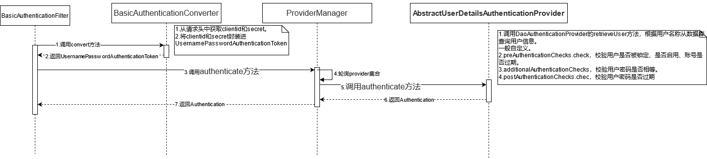
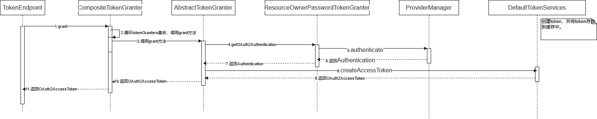
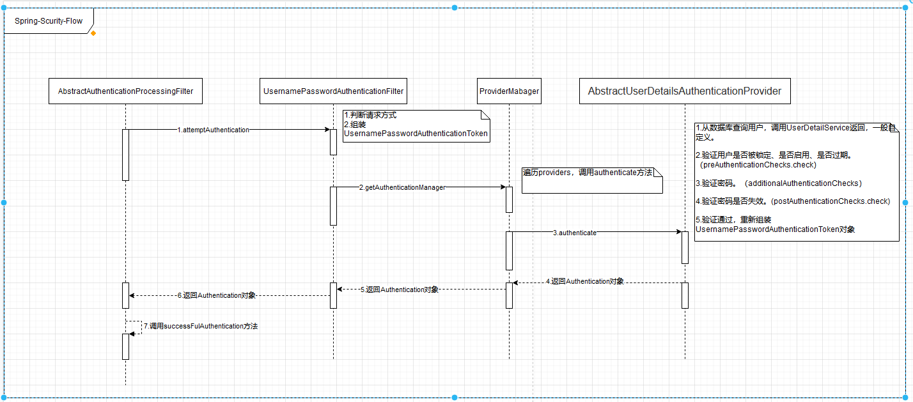
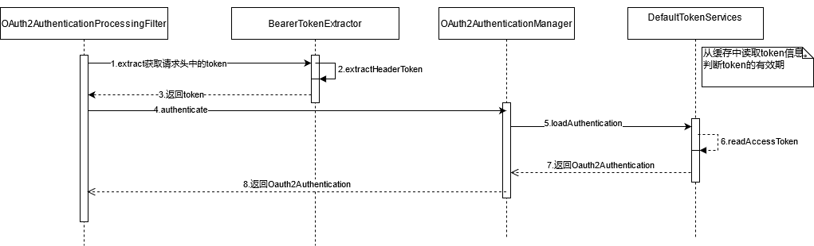

## Spring Sercurity 认证过程

> HTTP BASIC模式

### 获取token

获取token的流程分为两个大步骤：

1. 认证。在basic模式下，BasicAuthenticationFilter过滤器对请求进行拦截，并进行一系列的登录认证。



2. 获取token流程。过滤器链调用完之后，请求进入/oauth/token接口获取或者创建token。



#### 1. BasicAuthenticationFilter。

> Http Basic模式，请求头中Authorization=Basic xxxxxx

1. 调用BasicAuthenticationConverter的convert方法获取请求头Authorization头。它 是ClientId和secret BASE64后的字符串。
2. 调用ProviderManager的authenticate方法进行认证。

```java
void doFilterInternal(HttpServletRequest request,
			HttpServletResponse response, FilterChain chain)throws IOException, ServletException {
//1. 获取请求头中的Authorization
UsernamePasswordAuthenticationToken authRequest = authenticationConverter.convert(request);
if (authRequest == null) {
    //如果没有获取到Authorization，返回。
	chain.doFilter(request, response);
	return;
}
//2.认证
Authentication authResult = this.authenticationManager
						.authenticate(authRequest);
}
```

#### 2. BasicAuthenticationConverter

获取请求头中的Authorization，解析前端传递的clientid和secret，然后将clientid和secret封装成UsernamePasswordAuthenticationToken对象。

```java
public UsernamePasswordAuthenticationToken convert(HttpServletRequest request) {
    //获取请求头Authorization
	String header = request.getHeader(AUTHORIZATION);
	if (header == null) {
		return null;
	}
	header = header.trim();
    //判断是否是Basic模式
	if (!StringUtils.startsWithIgnoreCase(header, AUTHENTICATION_SCHEME_BASIC)) {
			return null;
	}
	//base64解析
	byte[] base64Token = header.substring(6).getBytes(StandardCharsets.UTF_8);
	byte[] decoded;
	try {
		decoded = Base64.getDecoder().decode(base64Token);
	}
catch (IllegalArgumentException e) {
	throw new BadCredentialsException(
					"Failed to decode basic authentication token");
	}

String token = new String(decoded, getCredentialsCharset(request));

	int delim = token.indexOf(":");

	if (delim == -1) {
			throw new BadCredentialsException("Invalid basic authentication token");
	}
    //封装成UsernamePasswordAuthenticationToken对象
	UsernamePasswordAuthenticationToken result  = new UsernamePasswordAuthenticationToken(token.substring(0, delim), token.substring(delim + 1));
		result.setDetails(this.authenticationDetailsSource.buildDetails(request));
		return result;
	}
```


#### 3. ProviderManager。

> 轮循AuthenticationProvider的实现类来进行登录认证。

1. 循环providers集合，如果AuthenticationProvider的supports函数返回true，那么就会调用该AuthenticationProvider的authenticate函数认证，如果认证成功则整个认证过程结束。如果不成功，则继续使用下一个合适的AuthenticationProvider进行认证，只要有一个认证成功则为认证成功。
2. 调用authenticate方法，进行登录认证。

```java
for (AuthenticationProvider provider : getProviders()) {
    //false 继续轮询
	if (!provider.supports(toTest)) {
		continue;
	}
result = provider.authenticate(authentication);
```

#### 3. AbstractUserDetailsAuthenticationProvider

1. 调用DaoAuthenticationProvider的retrieveUser方法，根据用户名称从数据库查询用户信息。一般自定义。
2. preAuthenticationChecks.check，校验用户是否被锁定、是否启用、账号是否过期。
3. additionalAuthenticationChecks，校验用户密码是否相等。
4. postAuthenticationChecks.chec，校验用户密码是否过期

```java
//查询用户信息
user = retrieveUser(username,(UsernamePasswordAuthenticationToken) authentication);
//校验用户状态
preAuthenticationChecks.check(user);
//校验密码是否相等
additionalAuthenticationChecks(user,(UsernamePasswordAuthenticationToken) authentication);
//校验密码是否过期
additionalAuthenticationChecks(user,
	(UsernamePasswordAuthenticationToken) authentication);
```

#### 4.FilterSecurityInterceptor。 

过滤器链中最后一个过滤器，主要是用来进行权限校验。判断用户访问的路径是否有权限。经过这个过滤器后，请求正式进入请求方法。


#### 5. 访问TokenEndpoint的/oauth/token接口

1. 在postAccessToken方法中会调用CompositeTokenGranter.grant方法。

```java
OAuth2AccessToken token = getTokenGranter().grant(tokenRequest.getGrantType(), tokenRequest);
		if (token == null) {
			throw new UnsupportedGrantTypeException("Unsupported grant type: " + tokenRequest.getGrantType());
		}
```

#### 6. CompositeTokenGranter。

循环tokenGranters集合，调用AbstractTokenGranter.grant方法。

```java

public OAuth2AccessToken grant(String grantType, TokenRequest tokenRequest) {
		for (TokenGranter granter : tokenGranters) {
			OAuth2AccessToken grant = granter.grant(grantType, tokenRequest);
			if (grant!=null) {
				return grant;
			}
		}
		return null;
	}
```

#### 7. AbstractTokenGranter

```java
if (!this.grantType.equals(grantType)) {
	return null;
}
		
String clientId = tokenRequest.getClientId();
		ClientDetails client = clientDetailsService.loadClientByClientId(clientId);
validateGrantType(grantType, client);

//获取token
return getAccessToken(client, tokenRequest);

```

* getAccessToken方法，先调用getOAuth2Authentication方法，验证用户信息，再调用createAccessToken方法创建token，并返回token。

```java
protected OAuth2AccessToken getAccessToken(ClientDetails client, TokenRequest tokenRequest) {
   return tokenServices.createAccessToken(getOAuth2Authentication(client, tokenRequest));
}
```

#### 8. ResourceOwnerPasswordTokenGranter

调用ProviderManager的authenticate方法来进行登录认证，username和password是用户的实际账号、密码，不是clientid。

```java
Map<String, String> parameters = new LinkedHashMap<String, String>(tokenRequest.getRequestParameters());
		//username 和password是用户表单填写的账号、密码。
		String username = parameters.get("username");
		String password = parameters.get("password");
		// Protect from downstream leaks of password
		parameters.remove("password");

		Authentication userAuth = new UsernamePasswordAuthenticationToken(username, password);
		((AbstractAuthenticationToken) userAuth).setDetails(parameters);
		try {
			userAuth = authenticationManager.authenticate(userAuth);
		}
```

#### 9.DefaultTokenServices

创建token，并将token信息保存到缓存中。

```java
public OAuth2AccessToken createAccessToken(OAuth2Authentication authentication) throws AuthenticationException {
//创建 token		
OAuth2AccessToken accessToken = createAccessToken(authentication, refreshToken);
    //保存token
		tokenStore.storeAccessToken(accessToken, authentication);
}
```


#### 附：密码模式认证流程

密码模式与前面的区别是过滤器BasicAuthenticationFilter换成了UsernamePasswordAuthenticationFilter，在密码模式下，username和password是用户表单提交的用户和密码。




### 用户请求调用链路



1. OAuth2AuthenticationProcessingFilter拦截用户请求

```java
public void doFilter(ServletRequest req, ServletResponse res, FilterChain chain) throws IOException,
			ServletException {
    //获取前端传送的token
	Authentication authentication = tokenExtractor.extract(request);
    //获取token信息、用户信息
    Authentication authResult = authenticationManager.authenticate(authentication);
}
```

2. 获取前端用户请求token。

```java
protected String extractHeaderToken(HttpServletRequest request) {
//获取请求头中的Authorization
		Enumeration<String> headers = request.getHeaders("Authorization");
    
		while (headers.hasMoreElements()) { 
			String value = headers.nextElement();
   //获取value以bearer开头的值         
			if ((value.toLowerCase().startsWith(OAuth2AccessToken.BEARER_TYPE.toLowerCase()))) {
   //获取token             
				String authHeaderValue = value.substring(OAuth2AccessToken.BEARER_TYPE.length()).trim();
				
				request.setAttribute(OAuth2AuthenticationDetails.ACCESS_TOKEN_TYPE,
						value.substring(0, OAuth2AccessToken.BEARER_TYPE.length()).trim());
				int commaIndex = authHeaderValue.indexOf(',');
				if (commaIndex > 0) {
					authHeaderValue = authHeaderValue.substring(0, commaIndex);
				}
				return authHeaderValue;
			}
		}

		return null;
	}
```

3. 调用OAuth2AuthenticationManager.authenticate获取用户信息。实现逻辑在DefaultTokenServices类中。


   ```java
   public OAuth2Authentication loadAuthentication(String accessTokenValue) throws AuthenticationException,
   			InvalidTokenException {
     //获取缓存中的token              
   		OAuth2AccessToken accessToken = tokenStore.readAccessToken(accessTokenValue);
   		if (accessToken == null) {
   			throw new InvalidTokenException("Invalid access token: " + accessTokenValue);
   		}
   		else if (accessToken.isExpired()) {
   			tokenStore.removeAccessToken(accessToken);
   			throw new InvalidTokenException("Access token expired: " + accessTokenValue);
   		}
   //获取用户认证信息。包括权限、账号有效期等。
   		OAuth2Authentication result = tokenStore.readAuthentication(accessToken);
   		if (result == null) {
   			// in case of race condition
   			throw new InvalidTokenException("Invalid access token: " + accessTokenValue);
   		}
   		if (clientDetailsService != null) {
   			String clientId = result.getOAuth2Request().getClientId();
   			try {
   				clientDetailsService.loadClientByClientId(clientId);
   			}
   			catch (ClientRegistrationException e) {
   				throw new InvalidTokenException("Client not valid: " + clientId, e);
   			}
   		}
   		return result;
   	}
   ```

   ​

4. 调用FilterSecurityInterceptor过滤器,，进行权限校验。


