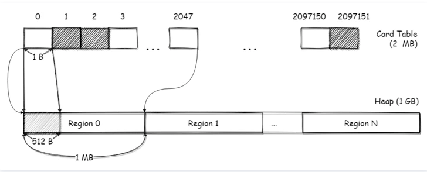

## Card Table是什么

在G1 堆中，存在一个CardTable的数据，CardTable 是由元素为1B的数组来实现的，数组里的元素称之为卡片/卡页（Page）。这个CardTable会映射到整个堆的空间，每个卡片会对应堆中的512B空间。

如下图所示，在一个大小为1 GB的堆下，那么CardTable的长度为2097151 (1GB / 512B)；每个Region 大小为1 MB，每个Region都会对应2048个Card Page。

那么查找一个对象所在的CardPage只需要简单的计算就可以得出：(对象地址-堆开始的地址)/512

## Card Table & RSet

介绍完了CardTable，下面说说G1中RSet和CardTable如何配合工作。

每个区域中都有一个RSet，通过hash表实现，这个hash表的key是引用本区域的其他区域的地址，value是一个数组，数组的元素是引用方的对象所对应的Card Page在Card Table中的下标。

如下图所示，区域B中的对象b引用了区域A中的对象a，这个引用关系跨了两个区域。b对象所在的CardPage为122，在区域A的RSet中，以区域B的起始地址作为key，b对象所在CardPage下标为value记录了这个引用关系，这样就完成了这个跨区域引用的记录。

不过这个CardTable的粒度有点粗，毕竟一个CardPage有512B，在一个CardPage内可能会存在多个对象。所以在扫描标记时，需要扫描RSet中关联的整个CardPage。