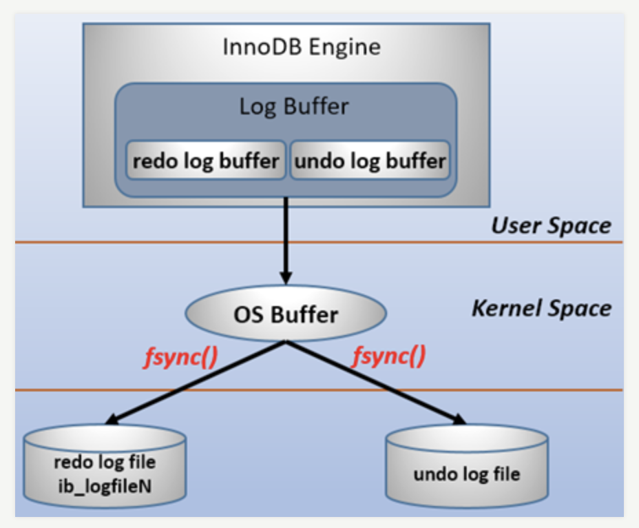
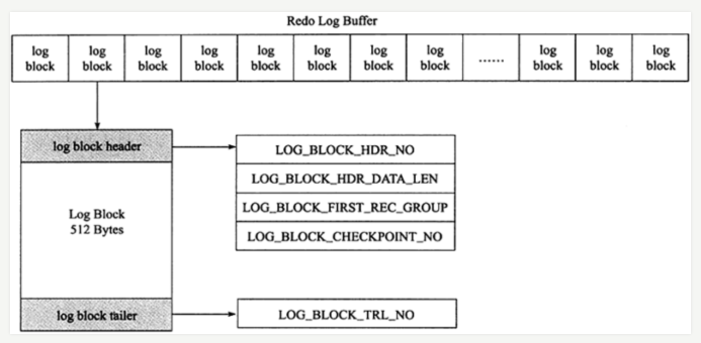
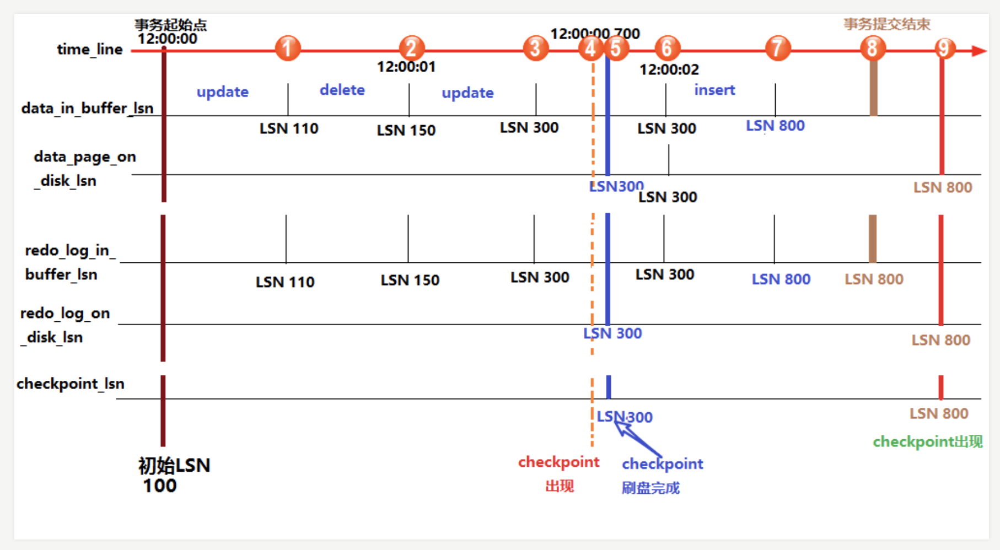

### MySQL事务日志           

InnoDB 事务日志包括`redo log`和`undo log`，其中`redo log`是重做日志，提供前滚操作；`undo log`是回滚日志，提供回滚操作。`undo log`不是`redo log`的逆向过程，其实它们都算是用来恢复的日志：

- `redo log`通常是物理日志，记录的是数据页的物理修改，而不是某一行或某几行修改成怎样，它用来恢复提交后的物理数据页，且只能恢复到最后一次提交的位置。
- `undo log`用来回滚行记录到某个版本，`undo log`一般是逻辑日志，根据每行记录进行记录。

## 1 redo log

### 1.1 redo log 和二进制日志的区别

`redo log`不是二进制日志。虽然二进制日志中也记录了 InnoDB 表的很多操作，也能实现重做的功能，但是它们之间有很大区别。

- 二进制日志是在存储引擎的上层产生的，不管是什么存储引擎，对数据库进行了修改都会产生二进制日志。而`redo log`是 InnoDB 层产生的，只记录该存储引擎中表的修改。并且二进制日志先于`redo log`被记录。
- 二进制日志记录操作的方法是逻辑性的语句。即便它是基于行格式的记录方式，其本质也还是逻辑的 SQL 设置，如该行记录的每列的值是多少。而`redo log`是在物理格式上的日志，它记录的是数据库中每个页的修改。
- 因为二进制日志只在提交的时候一次性写入，所以二进制日志中的记录方式和提交顺序有关，且一次提交对应一次记录。而`redo log`中是记录的物理页的修改，`redo log`文件中同一个事务可能多次记录，最后一个提交的事务记录会覆盖所有未提交的事务记录。例如事务`T1`，可能在`redo log`中记录了`T1-1`、`T1-2`、`T1-3`和`T1*`共 4 个操作，其中`T1*`表示最后提交时的日志记录，所以对应的数据页最终状态是`T1*`对应的操作结果。而且`redo log`是并发写入的，不同事务之间的不同版本的记录会穿插写入到`redo log`文件中，例如可能`redo log`的记录方式为`T1-1`、`T1-2`、`T2-1`、`T2-2`、`T2*`、`T1-3`和`T1*` 。
- 事务日志记录的是物理页的情况，它具有幂等性，因此记录日志的方式极其简练。幂等性的意思是多次操作前后状态是一样的，例如新插入一行后又删除该行，前后状态没有变化。而二进制日志记录的是所有影响数据的操作，记录的内容较多。例如插入一行记录一次，删除该行又记录一次。

### 1.2 redo log 的基本概念

`redo log`包括两部分：一是内存中的日志缓冲（`redo log buffer`），该部分日志是易失性的；二是磁盘上的重做日志文件（`redo log file`），该部分日志是持久的。

在概念上，InnoDB 通过`force log at commit`机制实现事务的持久性，即在事务提交的时候，必须先将该事务的所有事务日志写入到磁盘上的`redo log file`和`undo log file`中进行持久化。

为了确保每次日志都能写入到事务日志文件中，在每次将`log buffer`中的日志写入日志文件的过程中都会调用一次操作系统的`fsync`操作（即`fsync()`系统调用）。因为 MySQL 是工作在用户空间的，MySQL 的`log buffer`处于用户空间的内存中。要写入到磁盘上的`log file`中（`redo:ib_logfileN`文件、`undo:share tablespace`或`.ibd`文件），中间还要经过操作系统内核空间的`os buffer`，调用`fsync()`的作用就是将`os buffer`中的日志刷到磁盘上的`log file`中。

也就是说，从`redo log buffer`写日志到磁盘的`redo log file`中，过程如下：



MySQL 支持用户自定义在`commit`时如何将`log buffer`中的日志刷`log file`中。这种控制通过变量`innodb_flush_log_at_trx_commit`的值来决定。该变量有 3 种值：0、1、2，默认为 1。但注意，这个变量只是控制`commit`动作是否刷新`log buffer`到磁盘。

- 当设置为 1 的时候，事务每次提交都会将`log buffer`中的日志写入`os buffer`并调用`fsync()`刷到`log file on disk`中。这种方式即使系统崩溃也不会丢失任何数据，但是因为每次提交都写入磁盘，IO 的性能较差。

- 当设置为 0 的时候，事务提交时不会刷新日志缓冲区。而是每秒从```log buffer```写入`os buffer`并调用`fsync()`写入到`log file on disk`中。也就是说设置为 0 时是每秒刷新写入到磁盘中的，当系统崩溃，会丢失 1 秒钟的数据。

- 当设置为 2 的时候，每次事务提交时都会把```log buffer```的数据写入到`os buffer`，但是刷到磁盘操作并不会同时进行。该模式下```mysql```会每秒执行一次 刷到磁盘。

  ```
  由系统来进行fsync操作。此时如果数据库层宕机，则不会丢失redo log，但是如果服务器宕机，这个时候文件系统中的缓存还没有fsync到磁盘文件中，这个时候就会丢失这一部分数据
  ```

  


在主从复制结构中，要保证事务的持久性和一致性，需要对日志相关变量设置为如下：

- 如果启用了二进制日志，则设置`sync_binlog=1`，即每提交一次事务同步写到磁盘中。
- 总是设置`innodb_flush_log_at_trx_commit=1`，即每提交一次事务都写到磁盘中。

### 1.3 日志块（log block）

在 InnoDB 存储引擎中，`redo log`是以块为单位进行存储的，每个块占 512 字节，这称为`redo log block`。所以不管是`log buffer`中还是`os buffer`中以及`redo log file on disk`中，都是这样以 512 字节的块存储的。

每个`redo log block`由 3 部分组成：日志块头、日志块尾和日志主体。其中日志块头占用 12 字节，日志块尾占用 8 字节，所以每个`redo log block`的日志主体部分只有`512 - 12 - 8 = 492`字节。


因为`redo log`记录的是数据页的变化，当一个数据页产生的变化需要使用超过 492 字节的`redo log`来记录，那么就会使用多个`redo log block`来记录该数据页的变化。

日志块头包含 4 部分：

- `log_block_hdr_no`：占 4 字节，表示该日志块在`redo log buffer`中的位置 ID。
- `log_block_hdr_data_len`：占 2 字节，表示该`log block`中已记录的`log`大小，写满该`log block`时为`0x200`，表示 512 字节。
- `log_block_first_rec_group`：占 2 字节，表示该`log block`中第一个`log`的开始偏移位置。
- `log_block_checkpoint_no`：占 4 字节，表示该`log block`写入检查点信息的位置。

关于`log block`块头的第三部分`log_block_first_rec_group`，因为有时候一个数据页产生的日志量超出了一个日志块，这是需要用多个日志块来记录该页的相关日志。例如，某一数据页产生了 552 字节的日志量，那么需要占用两个日志块，第一个日志块占用 492 字节，第二个日志块需要占用 60  个字节，那么对于第二个日志块来说，它的第一个`log`的开始位置就是`73`字节（`60+12`）。如果该部分的值和`log_block_hdr_data_len`相等，则说明该`log block`中没有新开始的日志块，即表示该日志块用来延续前一个日志块。

日志尾只有一个部分：`log_block_trl_no`，该值和块头的`log_block_hdr_no`相等。

上面所说的是一个日志块的内容，在`redo log buffer`或者`redo log file on disk`中，由很多`log block`组成。如下图：



### 1.4 log group 和 redo log file

`log group`表示的是`redo log group`，一个组内由多个大小完全相同的`redo log file`组成。组内`redo log file`的数量由变量`innodb_log_files_group`决定，默认值为 2，即两个`redo log file`。这个组是一个逻辑的概念，并没有真正的文件来表示这是一个组，但是可以通过变量`innodb_log_group_home_dir`来定义组的目录，`redo log file`都放在这个目录下，默认是在`datadir`下。

### 1.5 redo log 的格式

因为 InnoDB 存储引擎存储数据的单元是页（和 SQL Server 中一样），所以`redo log`也是基于页的格式来记录的。默认情况下，InnoDB 的页大小是 16KB（由`innodb_page_size`变量控制），一个页内可以存放非常多的`log block`（每个 512 字节），而`log block`中记录的是数据页的变化。其中，`log block`中 492 字节的部分是`log body`，该`log body`的格式分为 4 部分：

- `redo_log_type`：占用 1 个字节，表示`redo log`的日志类型。
- `space`：表示表空间的 ID，采用压缩的方式后，占用的空间可能小于 4 字节。
- `page_no`：表示页的偏移量，同样是压缩过的。
- `redo_log_body`：表示每个重做日志的数据部分，恢复时会调用相应的函数进行解析。例如`insert`语句和`delete`语句写入`redo log`的内容是不一样的。

如下图，分别是`insert`和`delete`大致的记录方式。


### 1.6 日志刷盘的规则

`log buffer`中未刷到磁盘的日志称为脏日志（`dirty log`），其过程称之为“刷脏”。

在上面说过，默认情况下事务每次提交的时候都会刷事务日志到磁盘中，这是因为变量`innodb_flush_log_at_trx_commit`的值为 1。但是 InnoDB 不仅仅只会在有`commit`动作后才会刷日志到磁盘，这只是 InnoDB 存储引擎刷日志的规则之一。

刷日志到磁盘有以下几种规则：

1. 发出`commit`动作时。已经说明过，`commit`发出后是否刷日志由变量`innodb_flush_log_at_trx_commit`控制。
2. 每秒刷一次。这个刷日志的频率由变量`innodb_flush_log_at_timeout`值决定，默认是 1 秒。要注意，这个刷日志频率和`commit`动作无关。
3. 当`log buffer`中已经使用的内存超过一半时。
4. 当有`checkpoint`时，`checkpoint`在一定程度上代表了刷到磁盘时日志所处的 LSN 位置。

### 1.7 数据页刷盘的规则及 checkpoint

内存中（`buffer pool`）未刷到磁盘的数据称为脏数据（`dirty data`）。由于数据和日志都以页的形式存在，所以脏页表示脏数据和脏日志。上一节介绍了日志是何时刷到磁盘的，不仅仅是日志需要刷盘，脏数据页也一样需要刷盘。

在 InnoDB 中，数据刷盘的规则只有一个：`checkpoint`。但是触发`checkpoint`的情况却有几种。不管怎样，`checkpoint`触发后，会将`buffer`中脏数据页和脏日志页都刷到磁盘。

InnoDB 存储引擎中`checkpoint`分为两种：

- `sharp checkpoint`：在重用`redo log`文件（例如切换日志文件）的时候，将所有已记录到`redo log`中对应的脏数据刷到磁盘。

- ```
  fuzzy checkpoint
  ```

  ：一次只刷一小部分的日志到磁盘，而非将所有脏日志刷盘。有以下几种情况会触发该检查点：   

  - `master thread checkpoint`：由`master`线程控制，每秒或每 10 秒刷入一定比例的脏页到磁盘。
  - `flush_lru_list checkpoint`：从 MySQL5.6 开始可通过`innodb_page_cleaners`变量指定专门负责脏页刷盘的`page cleaner`线程的个数，该线程的目的是为了保证`lru`列表有可用的空闲页。
  - `async/sync flush checkpoint`：同步刷盘还是异步刷盘。例如还有非常多的脏页没刷到磁盘（非常多是多少，有比例控制），这时候会选择同步刷到磁盘，但这很少出现；如果脏页不是很多，可以选择异步刷到磁盘，如果脏页很少，可以暂时不刷脏页到磁盘
  - `dirty page too much checkpoint`：脏页太多时强制触发检查点，目的是为了保证缓存有足够的空闲空间。`too much`的比例由变量`innodb_max_dirty_pages_pct`控制，MySQL 5.6 默认的值为 75，即当脏页占缓冲池的 75% 后，就强制刷一部分脏页到磁盘。

由于刷脏页需要一定的时间来完成，所以记录检查点的位置是在每次刷盘结束之后才在`redo log`中标记的。

MySQL 停止时是否将脏数据和脏日志刷入磁盘，由变量`innodb_fast_shutdown={0|1|2}`控制，默认值为 1，即停止时只做一部分`purge`，忽略大多数`flush`操作（但至少会刷日志），在下次启动的时候再`flush`剩余的内容，实现`fast shutdown`

### 1.8 LSN 超详细分析

LSN 称为日志的逻辑序列号（`log sequence number`），在 InnoDB 存储引擎中，LSN 占用 8 个字节。LSN 的值会随着日志的写入而逐渐增大。

根据 LSN，可以获取到几个有用的信息：

1. 数据页的版本信息。
2. 写入的日志总量，通过 LSN 开始号码和结束号码可以计算出写入的日志量。
3. 可以知道检查点的位置。

实际上，还可以获得很多隐式的信息。

LSN 不仅存在于`redo log`中，还存在于数据页中，在每个数据页的头部，有一个`fil_page_lsn`记录了当前页最终的 LSN 值是多少。通过数据页中的 LSN 值和`redo log`中的 LSN 值比较，如果页中的 LSN 值小于`redo log`中 LSN 值，则表示数据丢失了一部分，这时候可以通过`redo log`的记录来恢复到`redo log`中记录的 LSN 值时的状态。

`redo log`的 LSN 信息可以通过`show engine innodb status`来查看。MySQL 5.5 版本的`show`结果中只有 3 条记录，没有`pages flushed up to`。

```sql
mysql> show engine innodb stauts
---
LOG
---
Log sequence number 2225502463
Log flushed up to   2225502463
Pages flushed up to 2225502463
Last checkpoint at  2225502463
0 pending log writes, 0 pending chkp writes
3201299 log i/o's done, 0.00 log i/o's/second
```

其中：

- `log sequence number`就是当前的`redo log（in buffer）`中的 LSN；
- `log flushed up to`是刷到`redo log file on disk`中的 LSN；
- `pages flushed up to`是已经刷到磁盘数据页上的 LSN；
- `last checkpoint at`是上一次检查点所在位置的 LSN。

InnoDB 从执行修改语句开始：

1. 首先修改内存中的数据页，并在数据页中记录 LSN，暂且称之为`data_in_buffer_lsn`；
2. 并且在修改数据页的同时（几乎是同时）向`redo log in buffer`中写入`redo log`，并记录下对应的 LSN，暂且称之为`redo_log_in_buffer_lsn`；
3. 写完`buffer`中的日志后，当触发了日志刷盘的几种规则时，会向`redo log file on disk`刷入重做日志，并在该文件中记下对应的 LSN，暂且称之为`redo_log_on_disk_lsn`；
4. 数据页不可能永远只停留在内存中，在某些情况下，会触发`checkpoint`来将内存中的脏页（数据脏页和日志脏页）刷到磁盘，所以会在本次`checkpoint`脏页刷盘结束时，在`redo log`中记录`checkpoint`的 LSN 位置，暂且称之为`checkpoint_lsn`。
5. 要记录`checkpoint`所在位置很快，只需简单的设置一个标志即可，但是刷数据页并不一定很快，例如这一次`checkpoint`要刷入的数据页非常多。也就是说要刷入所有的数据页需要一定的时间来完成，中途刷入的每个数据页都会记下当前页所在的 LSN，暂且称之为`data_page_on_disk_lsn`。

详细说明如下图：



在上图中，从上到下的横线分别代表：时间轴、`buffer`中数据页中记录的 LSN（`data_in_buffer_lsn`）、磁盘中数据页中记录的 LSN（`data_page_on_disk_lsn`）、`buffer`中重做日志记录的 LSN（`redo_log_in_buffer_lsn`）、磁盘中重做日志文件中记录的 LSN（`redo_log_on_disk_lsn`）以及检查点记录的 LSN（`checkpoint_lsn`）。

假设在最初时（`12:0:00`）所有的日志页和数据页都完成了刷盘，也记录好了检查点的 LSN，这时它们的 LSN 都是完全一致的。

假设此时开启了一个事务，并立刻执行了一个`update`操作，执行完成后，`buffer`中的数据页和`redo log`都记录好了更新后的 LSN 值，假设为 110。这时候如果执行`show engine innodb status`看各 LSN 的值，即图中`①`处的位置状态，结果会是：

- `log sequence number(110) > log flushed up to(100) = pages flushed up to = last checkpoint at`

之后又执行了一个`delete`语句，LSN 增长到 150。等到`12:00:01`时，触发`redo log`刷盘的规则（其中有一个规则是`innodb_flush_log_at_timeout`控制的默认日志刷盘频率为 1 秒），这时`redo log file on disk`中的 LSN 会更新到和`redo log in buffer`的 LSN 一样，所以都等于 150，这时`show engine innodb status`，即图中`②`的位置，结果将会是：

- `log sequence number(150) = log flushed up to > pages flushed up to(100) = last checkpoint at`

再之后，执行了一个`update`语句，缓存中的 LSN 将增长到 300，即图中`③`的位置。

假设随后检查点出现，即图中`④`的位置，正如前面所说，检查点会触发数据页和日志页刷盘，但需要一定的时间来完成，所以在数据页刷盘还未完成时，检查点的 LSN 还是上一次检查点的 LSN，但此时磁盘上数据页和日志页的 LSN 已经增长了，即：

- `log sequence number > log flushed up to 和 pages flushed up to > last checkpoint at`

但是`log flushed up to`和`pages flushed up to`的大小无法确定，因为日志刷盘可能快于数据刷盘，也可能等于，还可能是慢于。但是`checkpoint`机制有保护数据刷盘速度是慢于日志刷盘的：当数据刷盘速度超过日志刷盘时，将会暂时停止数据刷盘，等待日志刷盘进度超过数据刷盘。

等到数据页和日志页刷盘完毕，即到了位置`⑤`的时候，所有的 LSN 都等于 300。

随着时间的推移到了`12:00:02`，即图中位置`⑥`，又触发了日志刷盘的规则，但此时`buffer`中的日志 LSN 和磁盘中的日志 LSN 是一致的，所以不执行日志刷盘，即此时`show engine innodb status`时各种 LSN 都相等。

随后执行了一个`insert`语句，假设`buffer`中的 LSN 增长到了 800，即图中位置`⑦`。此时各种 LSN 的大小和位置`①`时一样。

随后执行了提交动作，即位置`⑧`。默认情况下，提交动作会触发日志刷盘，但不会触发数据刷盘，所以`show engine innodb status`的结果是：

- `log sequence number = log flushed up to > pages flushed up to = last checkpoint at`

最后随着时间的推移，检查点再次出现，即图中位置`⑨`。但是这次检查点不会触发日志刷盘，因为日志的 LSN 在检查点出现之前已经同步了。假设这次数据刷盘速度极快，快到一瞬间内完成而无法捕捉到状态的变化，这时`show engine innodb status`的结果将是各种 LSN 相等。

### 1.9 InnoDB 的恢复行为

在启动 InnoDB 的时候，不管上次是正常关闭还是异常关闭，总是会进行恢复操作。

因为`redo log`记录的是数据页的物理变化，因此恢复的时候速度比逻辑日志（如二进制日志）要快很多。而且，InnoDB 自身也做了一定程度的优化，让恢复速度变得更快。

重启 InnoDB 时，`checkpoint`表示已经完整刷到磁盘上`data page`上的 LSN，因此恢复时仅需要恢复从`checkpoint`开始的日志部分。例如，当数据库在上一次`checkpoint`的 LSN 为 10000 时宕机，且事务是已经提交过的状态。启动数据库时会检查磁盘中数据页的 LSN，如果数据页的 LSN 小于日志中的 LSN，则会从检查点开始恢复。

还有一种情况，在宕机前正处于`checkpoint`的刷盘过程，且数据页的刷盘进度超过了日志页的刷盘进度。这时候一宕机，数据页中记录的 LSN 就会大于日志页中的 LSN，在重启的恢复过程中会检查到这一情况，这时超出日志进度的部分将不会重做，因为这本身就表示已经做过的事情，无需再重做。

另外，事务日志具有幂等性，所以多次操作得到同一结果的行为在日志中只记录一次。而二进制日志不具有幂等性，多次操作会全部记录下来，在恢复的时候会多次执行二进制日志中的记录，速度就慢得多。例如，某记录中`id`初始值为 2，通过`update`将值设置为了 3，后来又设置成了 2，在事务日志中记录的将是无变化的页，根本无需恢复；而二进制会记录下两次`update`操作，恢复时也将执行这两次`update`操作，速度比事务日志恢复更慢。

## 2 undo log

### 2.1 基本概念

`undo log`有两个作用：提供回滚和多个行版本控制（`MVCC`）。

在数据修改的时候，不仅记录了`redo log`，还记录了相对应的`undo log`，如果因为某些原因导致事务失败或回滚了，可以借助该`undo log`进行回滚。

`undo log`和`redo log`记录物理日志不一样，它是逻辑日志。可以认为当`delete`一条记录时，`undo log`中会记录一条对应的`insert`记录，反之亦然，当`update`一条记录时，它记录一条对应相反的`update`记录。

当执行`rollback`时，就可以从`undo log`中的逻辑记录读取到相应的内容并进行回滚。在应用进行版本控制的时候，也是通过`undo log`来实现的：当读取的某一行被其他事务锁定时，它可以从`undo log`中分析出该行记录以前的数据是什么，从而提供该行版本信息，让用户实现非锁定一致性读取。

`undo log`是采用段（`segment`）的方式来记录的，每个`undo`操作在记录的时候占用一个`undo log segment`。

另外，`undo log`也会产生`redo log`，因为`undo log`也要实现持久性保护。

### 2.2 undo log 的存储方式

InnoDB 存储引擎对`undo log`的管理采用段的方式。`rollback segment`称为回滚段，每个回滚段中有 1024 个`undo log segment`。

在以前老版本，只支持 1 个`rollback segment`，这样就只能记录 1024 个`undo log segment`。后来 MySQL5.5 可以支持 128 个`rollback segment`，即支持`128*1024`个`undo`操作，还可以通过变量 `innodb_undo_logs` （MySQL5.6 版本以前该变量是`innodb_rollback_segments`）自定义多少个`rollback segment`，默认值为 128。

`undo log`默认存放在共享表空间中。

```sql
[root@xuexi data]# ll /mydata/data/ib*
-rw-rw---- 1 mysql mysql 79691776 Mar 31 01:42 /mydata/data/ibdata1
-rw-rw---- 1 mysql mysql 50331648 Mar 31 01:42 /mydata/data/ib_logfile0
-rw-rw---- 1 mysql mysql 50331648 Mar 31 01:42 /mydata/data/ib_logfile1
1234
```

如果开启了`innodb_file_per_table`，将放在每个表的`.ibd`文件中。

在 MySQL5.6 中，`undo log`的存放位置还可以通过变量`innodb_undo_directory`来自定义存放目录，默认值为`.`表示`datadir`。

默认`rollback segment`全部写在一个文件中，但可以通过设置变量`innodb_undo_tablespaces`平均分配到多少个文件中。该变量默认值为 0，即全部写入一个表空间文件。该变量为静态变量，只能在数据库示例停止状态下修改，如写入配置文件或启动时带上对应参数。但是 InnoDB 存储引擎在启动过程中提示，不建议修改为非 0 的值，如下：

```sql
2017-03-31 13:16:00 7f665bfab720 InnoDB: Expected to open 3 undo tablespaces but was able
2017-03-31 13:16:00 7f665bfab720 InnoDB: to find only 0 undo tablespaces.
2017-03-31 13:16:00 7f665bfab720 InnoDB: Set the innodb_undo_tablespaces parameter to the
2017-03-31 13:16:00 7f665bfab720 InnoDB: correct value and retry. Suggested value is 0
```

### 2.4 delete/update 操作的内部机制

当事务提交的时候，InnoDB 不会立即删除`undo log`，因为后续还可能会用到`undo log`，如隔离级别为`repeatable read`时，事务读取的都是开启事务时的最新提交行版本，只要该事务不结束，该行版本就不能删除，即`undo log`不能删除。

但是在事务提交的时候，会将该事务对应的`undo log`放入到删除列表中，未来通过`purge`来删除。并且提交事务时，还会判断`undo log`分配的页是否可以重用，如果可以重用，则会分配给后面来的事务，避免为每个独立的事务分配独立的`undo log`页而浪费存储空间和性能。

通过`undo log`记录`delete`和`update`操作的结果发现：(`insert`操作无需分析，就是插入行而已)

- `delete`操作实际上不会直接删除，而是将`delete`对象打上`delete flag`，标记为删除，最终的删除操作是`purge`线程完成的。
- update分为两种情况：update的列是否是主键列。   
  - 如果不是主键列，在`undo log`中直接反向记录是如何`update`的，即`update`是直接进行的。
  - 如果是主键列，`update`分两部执行：先删除该行，再插入一行目标行。

## 3 binlog 和事务日志的先后顺序及 group commit

如果事务不是只读事务，即涉及到了数据的修改，默认情况下会在`commit`的时候调用`fsync()`将日志刷到磁盘，保证事务的持久性。

但是一次刷一个事务的日志性能较低，特别是事务集中在某一时刻时事务量非常大的时候。 InnoDB 提供了`group commit`功能，可以将多个事务的事务日志通过一次`fsync()`刷到磁盘中。

因为事务在提交的时候不仅会记录事务日志，还会记录二进制日志，但是它们谁先记录呢？二进制日志是 MySQL 的上层日志，先于存储引擎的事务日志被写入。

在 MySQL5.6 以前，当事务提交（即发出`commit`指令）后，MySQL 接收到该信号进入`commit prepare`阶段；进入`prepare`阶段后，立即写内存中的二进制日志，写完内存中的二进制日志后就相当于确定了`commit`操作；然后开始写内存中的事务日志；最后将二进制日志和事务日志刷盘，它们如何刷盘，分别由变量`sync_binlog`和`innodb_flush_log_at_trx_commit`控制。

但因为要保证二进制日志和事务日志的一致性，在提交后的`prepare`阶段会启用一个`prepare_commit_mutex`锁来保证它们的顺序性和一致性。但这样会导致开启二进制日志后`group commmit`失效，特别是在主从复制结构中，几乎都会开启二进制日志。

在 MySQL5.6 中进行了改进。提交事务时，在存储引擎层的上一层结构中会将事务按序放入一个队列，队列中的第一个事务称为`leader`，其他事务称为`follower`，`leader`控制着`follower`的行为。虽然顺序还是一样先刷二进制，再刷事务日志，但是机制完全改变了：删除了原来的`prepare_commit_mutex`行为，也能保证即使开启了二进制日志，`group commit`也是有效的。

MySQL5.6 中分为 3 个步骤：`flush`阶段、`sync`阶段以及`commit`阶段。


- `flush`阶段：向内存中写入每个事务的二进制日志。
- `sync`阶段：将内存中的二进制日志刷盘。若队列中有多个事务，那么仅一次`fsync`操作就完成了二进制日志的刷盘操作。这在 MySQL5.6 中称为 BLGC（`binary log group commit`）。
- `commit`阶段：`leader`根据顺序调用存储引擎层事务的提交，由于 InnoDB 本就支持`group commit`，所以解决了因为锁`prepare_commit_mutex`而导致的`group commit`失效问题。

在`flush`阶段写入二进制日志到内存中，但不是写完就进入`sync`阶段的，而是要等待一定的时间，多积累几个事务的`binlog`一起进入`sync`阶段，等待时间由变量`binlog_max_flush_queue_time`决定，默认值为 0 表示不等待直接进入`sync`，设置该变量为一个大于 0 的值的好处是`group`中的事务多了，性能会好一些，但是这样会导致事务的响应时间变慢，所以建议不要修改该变量的值，除非事务量非常多并且不断的在写入和更新。

进入到`sync`阶段，会将`binlog`从内存中刷入到磁盘，刷入的数量和单独的二进制日志刷盘一样，由变量`sync_binlog`控制。

当有一组事务在进行`commit`阶段时，其他新事务可以进行`flush`阶段，它们本就不会相互阻塞，所以`group commit`会不断生效。当然，`group commit`的性能和队列中的事务数量有关，如果每次队列中只有 1 个事务，那么`group commit`和单独的`commit`没什么区别，当队列中事务越来越多时，即提交事务越多越快时，`group commit`的效果越明显。