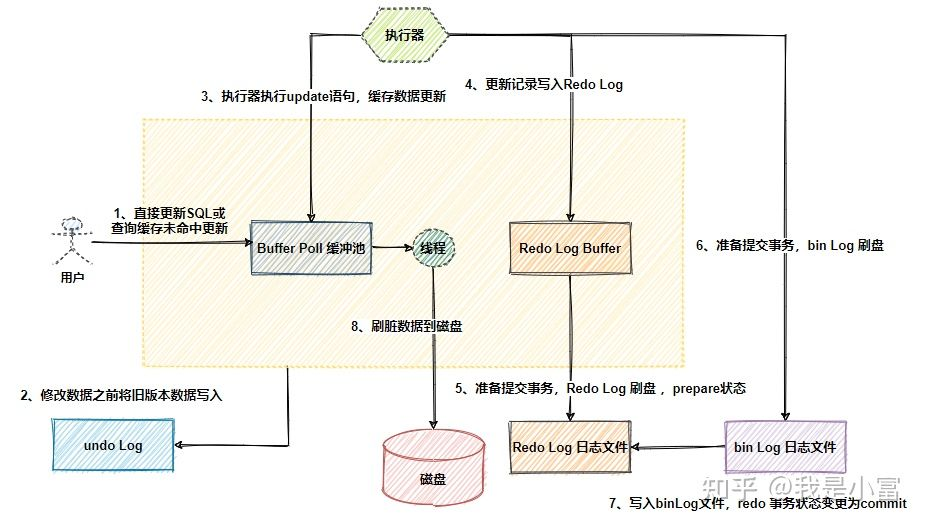

### Mysql日志记录流程



**redo log（重做日志）**

`redo log`属于MySQL存储引擎`InnoDB`的事务日志。

MySQL的数据是存放在磁盘中的，每次读写数据都需做磁盘IO操作，如果并发场景下性能就会很差。为此MySQL提供了一个优化手段，引入缓存`Buffer Pool`。这个缓存中包含了磁盘中**部分**数据页（`page`）的映射，以此来缓解数据库的磁盘压力。

当从数据库读数据时，首先从缓存中读取，如果缓存中没有，则从磁盘读取后放入缓存；当向数据库写入数据时，先向缓存写入，此时缓存中的数据页数据变更，这个数据页称为**脏页**，`Buffer Pool`中修改完数据后会按照设定的更新策略，定期刷到磁盘中，这个过程称为**刷脏页**

### **MySQL宕机**

如果刷脏页还未完成，可MySQL由于某些原因宕机重启，此时`Buffer Pool`中修改的数据还没有及时的刷到磁盘中，就会导致数据丢失，无法保证事务的持久性。

为了解决这个问题引入了`redo log`，redo Log如其名侧重于重做！它记录的是数据库中每个页的修改，而不是某一行或某几行修改成怎样，可以用来恢复提交后的物理数据页，且只能恢复到最后一次提交的位置。

`redo log`用到了`WAL`（Write-Ahead Logging）技术，这个技术的核心就在于修改记录前，一定要先写日志，并保证日志先落盘，才能算事务提交完成。

有了redo log再修改数据时，InnoDB引擎会把更新记录先写在redo log中，在修改`Buffer Pool`中的数据，当提交事务时，调用`fsync`把redo log刷入磁盘。至于缓存中更新的数据文件何时刷入。

> “ **注意**：此时redo log的事务状态是`prepare`，还未真正提交成功，要等`bin log`日志写入磁盘完成才会变更为`commit`，事务才算真正提交完成。

这样一来即使刷脏页之前MySQL意外宕机也没关系，只要在重启时解析redo log中的更改记录进行重放，重新刷盘即可。

**大小固定**

redo log采用固定大小，循环写入的格式，当redo log写满之后，重新从头开始如此循环写，形成一个环状。

在InnoDB引擎中，redo log都是以512字节为单位进行存储的，每个存储的单位我们称之为redo log block（重做日志块），若一个页中存储的日志量大于512字节，那么就需要逻辑上切割成多个block进行存储。

一个redo log block是由日志头、日志体、日志尾组成。日志头占用12字节，日志尾占用8字节，所以一个block真正能存储的数据就是512-12-8=492字节。 


多个redo log block组成了我们的redo log。 


那为什么要如此设计呢？

因为redo log记录的是数据页上的修改，如果`Buffer Pool`中数据页已经刷磁盘后，那这些记录就失效了，新日志会将这些失效的记录进行覆盖擦除。


上图中的`write pos`表示redo log当前记录的日志序列号`LSN`(log sequence number)，写入还未刷盘，循环往后递增；`check point`表示redo log中的修改记录已刷入磁盘后的LSN，循环往后递增，这个LSN之前的数据已经全落盘。

write pos`到`check point`之间的部分是redo log空余的部分（绿色），用来记录新的日志；`check point`到`write pos`之间是redo log已经记录的数据页修改数据，此时数据页还未刷回磁盘的部分。当`write pos`追上`check point`时，会先推动`check point`向前移动，空出位置（刷盘）再记录新的日志。

>“ **注意**：[redo log日志](https://www.zhihu.com/search?q=redo+log日志&search_source=Entity&hybrid_search_source=Entity&hybrid_search_extra={"sourceType"%3A"answer"%2C"sourceId"%3A1797682794})满了，在擦除之前，需要确保这些要被擦除记录对应在内存中的数据页都已经刷到磁盘中了。擦除旧记录腾出新空间这段期间，是不能再接收新的更新请求的，此刻MySQL的性能会下降。所以在并发量大的情况下，合理调整redo log的文件大小非常重要。

### 为什么一个block设计成512字节？

这个和磁盘的扇区有关，机械磁盘默认的扇区就是512字节，如果你要写入的数据大于512字节，那么要写入的扇区肯定不止一个，这时就要涉及到盘片的转动，找到下一个扇区，假设现在需要写入两个扇区A和B，如果扇区A写入成功，而扇区B写入失败，那么就会出现非原子性的写入，而如果每次只写入和扇区的大小一样的512字节，那么每次的写入都是原子性的。

### 为什么要两段式提交？

从上文我们知道，事务的提交要先写redo log(prepare)，再写binlog，最后再提交(commit)。这里为什么要有个prepare的动作？redo log直接commit状态不行吗？假设redo log直接提交，在写binlog的时候，发生了crash，这时binlog就没有对应的数据，那么所有依靠binlog来恢复数据的slave，就没有对应的数据，导致主从不一致。所以需要通过两段式（2pc）提交来保证redo log和binlog的一致性是非常有必要的。具体的步骤是：处于prepare状态的redo log，会记录2PC的XID，binlog写入后也会记录2PC的XID，同时会在redo log上打上commit标识。

### **crash-safe**

因为redo log的存在使得`Innodb`引擎具有了`crash-safe`的能力，即MySQL宕机重启，系统会自动去检查redo log，将修改还未写入磁盘的数据从redo log恢复到MySQL中。

MySQL启动时，不管上次是正常关闭还是异常关闭，总是会进行恢复操作。会先检查数据页中的`LSN`，如果这个 LSN 小于 redo log 中的LSN，即`write pos`位置，说明在`redo log`上记录着数据页上尚未完成的操作，接着就会从最近的一个`check point`出发，开始同步数据。

简单理解，比如：redo log的`LSN`是500，数据页的`LSN`是300，表明重启前有部分数据未完全刷入到磁盘中，那么系统则将redo log中`LSN`序号300到500的记录进行重放刷盘。

**bin log（归档日志）**

`bin log`是一种数据库Server层（和什么引擎无关），以二进制形式存储在磁盘中的逻辑日志。`bin log`记录了数据库所有`DDL`和`DML`操作（不包含 `SELECT` 和 `SHOW`等命令，因为这类操作对数据本身并没有修改）。

`bin log`也被叫做`归档日志`，因为它不会像`redo log`那样循环写擦除之前的记录，而是会一直记录日志。一个`bin log`日志文件默认最大容量`1G`（也可以通过`max_binlog_size`参数修改），单个日志超过最大值，则会新创建一个文件继续写。

```
mysql> show binary logs;
+-----------------+-----------+
| Log_name        | File_size |
+-----------------+-----------+
| mysq-bin.000001 |      8687 |
| mysq-bin.000002 |      1445 |
| mysq-bin.000003 |      3966 |
| mysq-bin.000004 |       177 |
| mysq-bin.000005 |      6405 |
| mysq-bin.000006 |       177 |
| mysq-bin.000007 |       154 |
| mysq-bin.000008 |       154 |
```

`bin log`日志的内容格式其实就是执行SQL命令的反向逻辑，这点和`undo log`有点类似。一般来说开启`bin log`都会给日志文件设置过期时间（`expire_logs_days`参数，默认永久保存），要不然日志的体量会非常庞大。

```
mysql> show variables like 'expire_logs_days

';
+------------------+-------+
| Variable_name    | Value |
+------------------+-------+
| expire_logs_days | 0     |
+------------------+-------+
1 row in set

mysql> SET GLOBAL expire_logs_days=30;
Query OK, 0 rows affected
```

`bin log`主要应用于MySQL主从模式（`master-slave`）中，主从节点间的数据同步；以及基于时间点的数据还原。

**主从同步**

通过下图MySQL的主从复制过程，来了解下`bin log`在主从模式下的应用。

* 用户在主库`master`执行`DDL`和`DML`操作，修改记录顺序写入`bin log`; 

* 从库`slave`的I/O线程连接上Master，并请求读取指定位置`position`的日志内容;

* `Master`收到从库`slave`请求后，将指定位置`position`之后的日志内容，和主库bin log文件的名称以及在日志中的位置推送给从库;
* slave的I/O线程接收到数据后，将接收到的日志内容依次写入到`relay log`

**基于时间点还原**

我们看到`bin log`也可以做数据的恢复，而`redo log`也可以，那它们有什么区别？

- 层次不同：redo log 是InnoDB存储引擎实现的，bin log 是MySQL的服务器层实现的，但MySQL数据库中的任何存储引擎对于数据库的更改都会产生bin log。
   
- 作用不同：redo log 用于碰撞恢复（`crash recovery`），保证MySQL宕机也不会影响持久性；bin log 用于时间点恢复（`point-in-time recovery`），保证服务器可以基于时间点恢复数据和[主从复制](https://www.zhihu.com/search?q=主从复制&search_source=Entity&hybrid_search_source=Entity&hybrid_search_extra={"sourceType"%3A"answer"%2C"sourceId"%3A1797682794})

* 内容不同：redo log 是物理日志，内容基于磁盘的页`Page`；bin log的内容是二进制，可以根据`binlog_format`参数自行设置。

* 写入方式不同：redo log 采用循环写的方式记录，新记录会覆盖旧的记录；binlog 通过追加的方式记录，当文件大小大于给定值后，后续的日志会记录到新的文件上。

* 刷盘时机不同：bin log在事务提交时写入；redo log 在事务开始时即开始写入。


