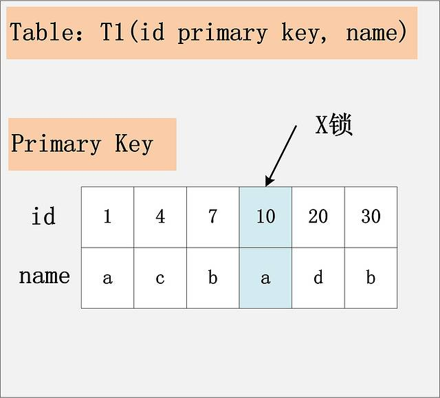
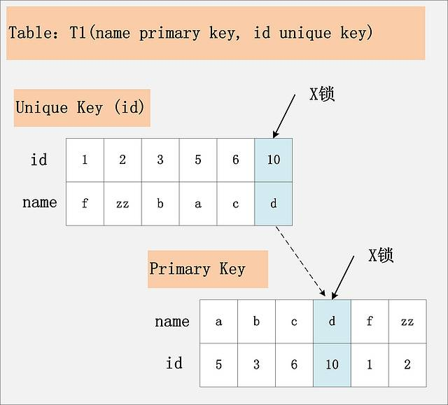
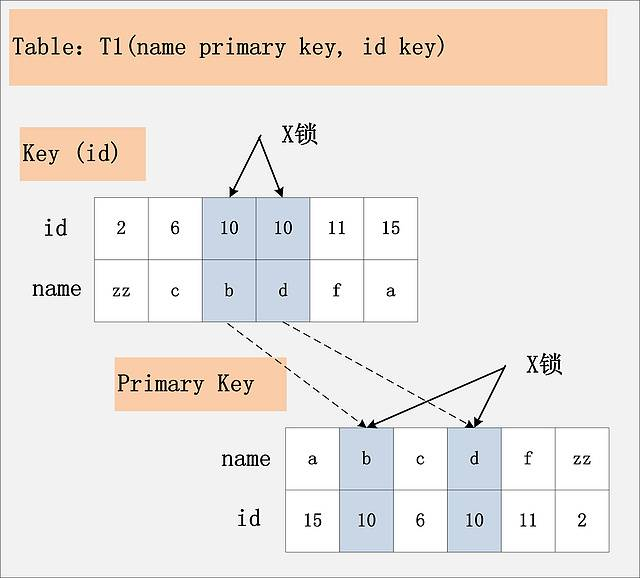
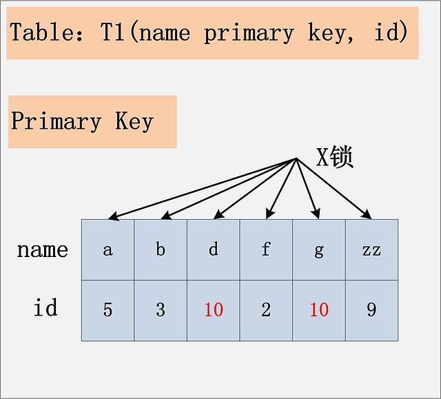
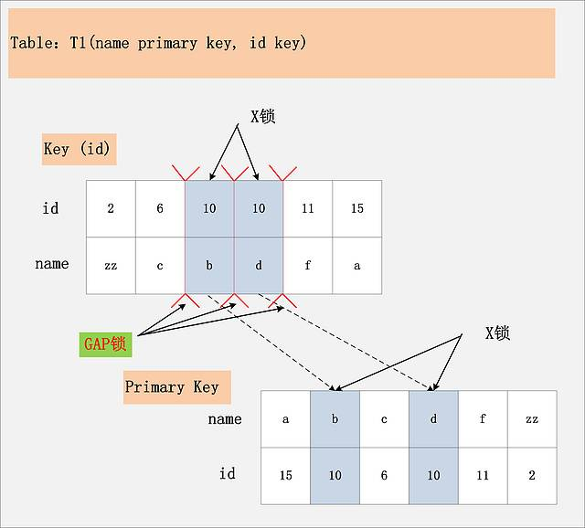
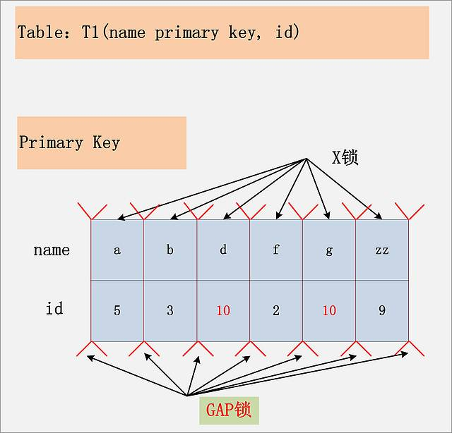
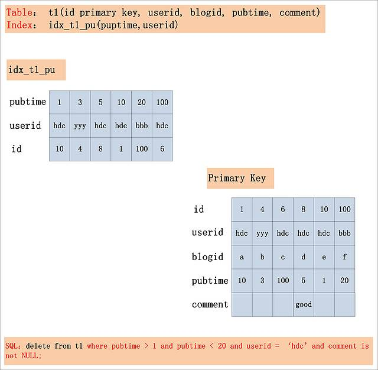
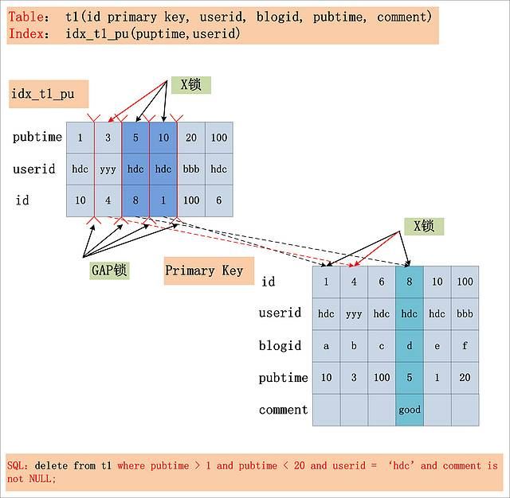
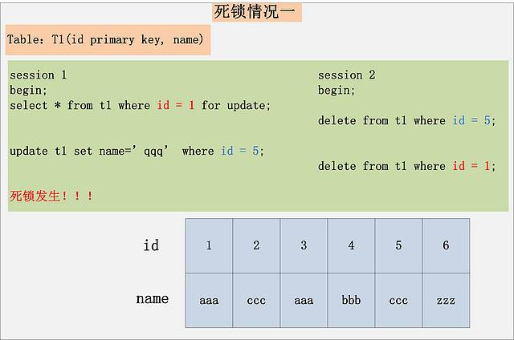
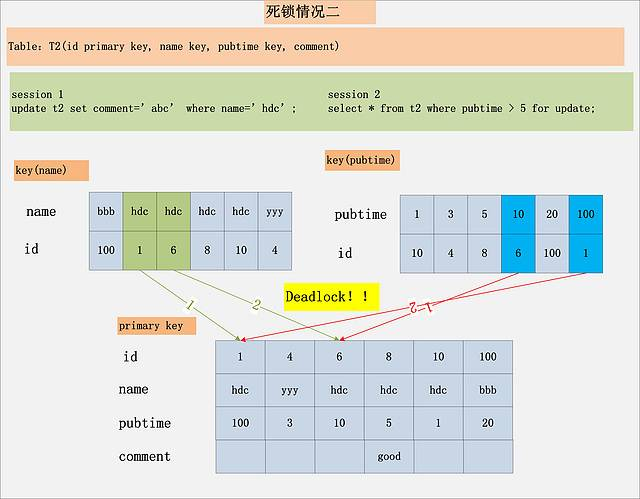

### Mysql 锁（InnoDB引擎）

#### 锁的分类

* 基于锁的属性分类：共享锁、排他锁、意向共享锁、意向排他锁、自增锁。
* 基于锁的粒度分类：表锁、行锁。

#### 锁的属性

* 共享锁(S Lock)：允许事务读一行数据。
* 排他锁(X Lock)：允许事务删除或者更新一行数据。

共享锁与互斥锁的兼容关系如下：

|      | x    | s    |
| ---- | ---- | ---- |
| x    | 冲突 | 冲突 |
| s    | 冲突 | 兼容 |

如：事务```T1```获取了行```r```的共享锁，事务```T2```也可以获取行```r```的共享锁。事务```T3```想获取行```r```的互斥锁，则需要等待```T1、T2```释放共享锁。

共享锁、排他锁可以解决行级别的数据并发修改问题，但是在某些情况下，直接使用行级别的锁来判断是否可以对数据进行修改，效率不高。如：事务```T1```对表```t1```行```r```加了独占锁，事务```T2```将要对表```t1```加**表级别的共享锁**，那么它需要进行全表扫描来确定是否存在独占锁，如果一个表数据量比较大，那么它的效率就不会很高。所以```InnoDB```引入了意向锁来解决这个问题。

```InnoDB```存储引擎支持一种额外的锁方式，我们称之为**意向锁**，设计的主要目的是为了在一个事务中揭示下一行将要被访问的锁的类型。

意向锁是表级别的锁，根据粗粒度将意向锁分为数据库、表、页意向锁，当需要对页上的行记录```r```进行上```X```锁时，需要分别对数据库、页、表加意向锁```IX```。

* 意向共享锁(IS Lock)：事务想要获得一个表中某几行的共享锁。
* 意向排他锁(IX Lock)：事务想要获得一个表中某几行的排他锁。

表级别锁的兼容性如下：```IX、IS```是表级别锁，不会和行级别的```X、S```发生冲突，只会与表级别的X、S不兼容。

|      | X    | IX   | S    | IS   |
| ---- | ---- | ---- | ---- | ---- |
| X    | 冲突 | 冲突 | 冲突 | 冲突 |
| IX   | 冲突 | 兼容 | 冲突 | 兼容 |
| S    | 冲突 | 冲突 | 兼容 | 兼容 |
| IS   | 冲突 | 兼容 | 兼容 | 兼容 |

意向锁不会阻塞除却全表请求(```lock table t write```)以外的任何请求。如```lock table write``` 是请求获取一个表级别的排它锁，会被```IS```或者```IX```阻塞：

```sql
--创建表
--CREATE TABLE person (
---id INT(11),
---username VARCHAR(255),
---birthday DATE
--);

--初始化数据
--insert into person(id,username,birthday) values (1,'yss','2020-01-13');

--set @@autocommit=0; 关闭自动提交事务
---show variables like 'autocommit'; 

--使用consule来执行手动启动事务
--session A
begin;
select * from person where id = 1 for update; --给请求的行加一个x锁

--session B
begin;
lock table person write; --session A释放锁之前，SessionB会一直阻塞
```

如上```session A``` 需要获取```a=1```行的```X```锁，并且```session A```在获取行锁前，它必须获取```t```表的```IX```锁，行锁与意向锁不冲突，可以兼容。```session B```获取```t```的全表```x```锁，但是```session B```发现```t```表已经被设置了```IX```锁，```session B```被阻塞。

* 自增锁

```AUTOINC```锁又叫自增锁，是一种表锁。当表中有自增列(```AUTOINCREMENT```)时出现。当插入表中有自增列时，数据库需要自动生成自增值，它会为该表加```AUTOINC```表锁，阻止其他事务的插入操作，这样保证生成的自增值是唯一的。

```AUTOINC```锁互不兼容，也就是同一张表同时只允许有一个自增锁。自增值一旦分配了就会+1，如果事务回滚，自增值也不会减回去，所以自增值可能会出现中断的情况。

#### 按照粒度锁分类

* 表锁

  表锁是指对一整张表加锁，一般是```DDL```处理时使用，如ALTER TABLE等操作；也可以明确对某个表进行加锁。表锁由```MySQL Server```实现。

  ```SQL
  LOCK TABLE t WRITE(READ);
  ```

* 行锁

  行锁是指上锁的时候锁住表某一行或多行。

  ```InnoDB ```是聚簇索引，也就是 B+树的叶节点既存储了主键索引也存储了数据行。而 ```InnoDB ```的二级索引的叶节点存储的则是主键值，所以通过二级索引查询数据时，还需要拿对应的主键去聚簇索引中再次进行查询。

  ```sql
  --id primary key
  update user set age = 10 where id = 49;
  ```

  如上sql通过主键索引来查询，则只需要在id=49的聚簇索引上加写锁。

  ```sql
  --name key
  update user set age = 10 where name = 'Tom';
  ```

  如上sql使用二级索引来查询，首先在name = tom的二级索引上加锁，然后根据主键去检索聚簇索引在相应的主键索引上加锁。

  

#### 锁的算法

InnoDB存储引擎中有3种行锁的算法设计，分别是：

* Record Lock ：记录锁，单行记录上的锁。

  ```sql
  --记录锁，只锁住a=3的这一条数据。
  select * from t where a = 3 for update;//a 是表t的主键
  ```

  当```sql```无法使用索引时，会进行全表扫描，这个时候```Mysql```会给整张表的所有数据加记录锁，再由```Mysql Server```层进行过滤，释放掉不符合```where```条件的记录锁。

  所以更新操作必须根据索引进行操作，没有索引会消耗大量的锁资源。

* Gap Lock：间隙锁，锁定一个范围，但不包括记录本身。

  间隙锁是一种加在两个索引之间的锁，或者加在第一个索引之前或最后一个索引之后的间隙。使用间隙锁可以防止其他事务在当前事务范围内插入或者修改数据，保证两次读取这个范围内的记录不会变，从而不会出现幻读现象。

* Next-Key Lock :Gap Lock+Record Lock，锁定一个范围，并且锁定记录本身。

  记录锁和间隙锁的组合。它指的是加在某条记录以及这条记录前面间隙的锁。

#### 常见加锁场景分析

1. id主键+RC

   ```sql
   --id是主键，Read Commit隔离级别。
   delete from t1 where id = 10
   ```

   

   结论：id是主键，只需要在id=10的这条记录上加X锁即可。

2. id唯一索引+RC

   ```sql
   --id是唯一索引，Read Commit隔离级别。
   delete from t1 where id = 10
   ```

   

   id是唯一索引，在找到id=10的记录后，首先会将unique索引上的id=10索引加上X锁，同时会根据读取到的name列，将主键索引上name=d对应的主键索引加X锁。

   在主键索引上加锁的原因是，如果这个时候有一条delete语句将要把name=d的数据删掉，由于主键索引没有加锁，delete语句可以成功获取锁并把数据删除掉，而并发的update此时感知不到数据已经被删除掉了，违背了独占锁互斥的原则。

3. id非唯一索引+RC

   ```sql
   --id key
   delete from t1 where id = 10; 
   ```

   

   id索引上，满足id=10查询条件记录都已经加锁。同时这些记录对应的主键索引上的记录也都加上了锁。

   结论：如果id列上有非唯一索引，那么对应的所有满足sql查询条件的记录都会被加锁。同时这些记录的主键索引上的记录也会被加锁。

4. id无索引+RC

   id列上没有索引，where id = 10这个过滤条件没法通过索引进行过滤，那么只能走全表扫描做过滤。

   

   结论：如果id上没有索引，sql会走聚簇索引的全表扫描进行过滤，由于过滤是由MYSQL Server层面进行的，因此每条记录，无论是否满足条件，都会被加上X锁。但是为了效率考虑，MYSQL 做了优化，对于不满足条件的记录，会在判断后释放锁，最终持有的是满足条件的记录上的锁。

5. id主键+RR

   与【id主键，Read Committed】一致。

6. id唯一索引+RR

   与【id唯一索引，Read Committed】一致。

7. id非唯一索引+RR

   ```sql
   delete from t1 where id = 10;
   ```

   

   与【id列上非唯一锁，Read Committed】的最大区别是多了一个GAP锁，而且GAP锁看起来不是加在记录上，而是加在两条记录之间。

   GAP锁就是RR级别相对于RC隔离级别不会出现幻读的关键。所谓幻读是同一个事务连续做两次**当前读**，那么这两次当前读返回的是完全相同的记录，第二次当前读不会比第一次返回更多的记录(幻读)

   考虑到B+树的有序性，满足条件的项一定是连续存放的。[6,c]之前，[11,f]之后不会插入id=10的记录；[6,c]和[10,b]之间可以插入[10,aa]；[10,b]和[10,d]之间可以插入[10,c]；[10,d]和[11,f]之间可以插入[10,e]。因此为了保证[6,c]和[10,b]，[10,b]和[10,d]，[10,d]和[11,f]之间不会插入新的记录，MYSQL选择了GAP锁，将这三个GAP给锁起来了。

   前面的5、6案例中没有GAP锁是因为主键索引和唯一索引都是等值查询，只会返回一条数据，而且是新的相同取值的记录，一定不会有新插入进来的记录，因此避免了GAP锁的使用。

   结论：Repeatable Read隔离级别下，id列上有一个非唯一索引。 首先，通过id索引定位到第一条满足查询条件的记录，加记录上的X锁，加GAP上的GAP锁，然后加主键聚簇索引上的记录X锁，然后返回；然后读取下一条，重复进行。直至进行到第一条不满足条件的记录[11,f]，此时，不需要加记录X锁，但是仍旧需要加GAP锁，最后返回结束

8. id无索引+RR

   

结论：在Repeatable Read隔离级别下，如果进行全表扫描的当前读，那么会锁上表中的所有记录，同时会锁上聚簇索引内的所有GAP，杜绝所有的并发 更新/删除/插入 操作。当然，也可以通过触发semi-consistent  read，对于不满足查询条件的记录，MySQL会提前放锁，来缓解加锁开销与并发影响，但是semi-consistent read本身也会带来其他问题，不建议使用。

9. serializable

   Serializable隔离级别，读不加锁就不再成立，所有的读操作，都是当前读。

#### 一条复杂的SQL



* Index key：pubtime > 1 and puptime < 20。此条件，用于确定SQL在idx_t1_pu索引上的查询范围。

* Index Filter：userid = ‘hdc’ 。此条件，可以在idx_t1_pu索引上进行过滤，但不属于Index Key。

* Table Filter：comment is not NULL。此条件，在idx_t1_pu索引上无法过滤，只能在聚簇索引上

在分析出SQL where条件的构成之后，再来看看这条SQL的加锁情况 (RR隔离级别)，如下图所示:



从图中可以看出，在Repeatable Read隔离级别下，由Index Key所确定的范围，被加上了GAP锁；Index  Filter锁给定的条件 (userid = ‘hdc’)何时过滤，视MySQL的版本而定，在MySQL 5.6版本之前，不支持Index  Condition Pushdown(ICP)，因此Index Filter在MySQL Server层过滤，在5.6后支持了Index  Condition Pushdown，则在index上过滤。若不支持ICP，不满足Index  Filter的记录，也需要加上记录X锁，若支持ICP，则不满足Index Filter的记录，无需加记录X锁  (图中，用红色箭头标出的X锁，是否要加，视是否支持ICP而定)；而Table Filter对应的过滤条件，则在聚簇索引中读取后，在MySQL  Server层面过滤，因此聚簇索引上也需要X锁。最后，选取出了一条满足条件的记录[8,hdc,d,5,good]，但是加锁的数量，要远远大于满足条件的记录数量。

结论：在Repeatable Read隔离级别下，针对一个复杂的SQL，首先需要提取其where条件。Index  Key确定的范围，需要加上GAP锁；Index Filter过滤条件，视MySQL版本是否支持ICP，若支持ICP，则不满足Index  Filter的记录，不加X锁，否则需要X锁；Table Filter过滤条件，无论是否满足，都需要加X锁。

#### 死锁原理与分析





上面的两个死锁用例。第一个非常好理解，也是最常见的死锁，每个事务执行两条SQL，分别持有了一把锁，然后加另一把锁，产生死锁。

第二个用例，虽然每个Session都只有一条语句，仍旧会产生死锁。要分析这个死锁，首先必须用到本文前面提到的MySQL加锁的规则。针对Session 1，从name索引出发，读到的[hdc, 1]，[hdc,  6]均满足条件，不仅会加name索引上的记录X锁，而且会加聚簇索引上的记录X锁，加锁顺序为先[1,hdc,100]，后[6,hdc,10]。而Session  2，从pubtime索引出发，[10,6],[100,1]均满足过滤条件，同样也会加聚簇索引上的记录X锁，加锁顺序为[6,hdc,10]，后[1,hdc,100]。发现没有，跟Session 1的加锁顺序正好相反，如果两个Session恰好都持有了第一把锁，请求加第二把锁，死锁就发生了。

结论：死锁的发生与否，并不在于事务中有多少条SQL语句，死锁的关键在于：两个(或以上)的Session加锁的顺序不一致。而使用本文上面提到的，分析MySQL每条SQL语句的加锁规则，分析出每条语句的加锁顺序，然后检查多个并发SQL间是否存在以相反的顺序加锁的情况，就可以分析出各种潜在的死锁情况，也可以分析出线上死锁发生的原因。

#### InnoDB记录锁信息表

> show engine innodb status。查看当前锁请求信息。

```Mysql InnoDB``` 在```INFORMATION_SCHEMA```架构下添加了```INNODB_TRX``` 、```INNODB_LOCKS```、```INNODB_WAITS```三张表简单的监控当前的事务并分析可能存在的锁问题。

1）```INNODB_TRX```表：查看当前数据库的事务运行情况。

* ```trx_id```：```InnoDB```存储引擎内部唯一的事务```ID```.
* ```trx_state```：当前事务的状态。
* ```trx_started```：事务的开始时间
* ```trx_request_lock_id```：等待事务的锁```ID```，如trx_state的状态为LOCK WAIT ，那么该值代表当前的事务等待之前事务占用锁资源的```ID```。若```trx_state```不是```LOCK WAIT```，该值```为null```。
* ```trx_wait_started```：事务等待开始的时间
* ```trx_weight```：事务的权重，反应了一个事务修改和锁住的行数。在InnoDB中，当发生死锁需要回滚时，```InnoDB```会选择最小的进行回滚。
* ```trx_mysql_thread_id``` ：```Mysql```中的线程```ID```。
* ```trx_query```：事务运行的```SQL```语句。

 例子如下：

```sql
--1. 先执行获取锁的sql，并且没有释放。注：第一天sql要在Command line控制台执行，在其他工具中执行可能会自动释放锁，导致无法复现。
begin;select * from person where id = 1 for update;
--2. 另开事务获取锁
begin;
select * from person where id <=2 for update;
```

执行结果如下：事务```id```为```2432```的```sql```处于```LOCK WAIT```状态，显然是因为第一条```sql```获取行 ```id=1```的锁后没有释放，导致第二条```sql```一直处于等待锁阶段。

```sql
mysql> select * from INFORMATION_SCHEMA.INNODB_TRX\G;
*************************** 1. row ***************************
                    trx_id: 2432
                 trx_state: LOCK WAIT
               trx_started: 2021-03-02 21:48:19
     trx_requested_lock_id: 2370228135712:35:4:2:2370191953288
          trx_wait_started: 2021-03-02 21:48:19
                trx_weight: 2
       trx_mysql_thread_id: 3488
                 trx_query: select * from person where id <=2
LIMIT 0, 1000
for update
```


2）```data_locks```(老版本-```INNODB_LOCKS```)表：锁的情况。

* ```engine_lock_id```：锁的```ID```。
* ```engine_transaction_id```：事务```ID```。
* ```lock_mode```：锁的模式。如：```X、IX```。
* ```lock_type```：锁的类型，表锁(```table```)还是行锁(```record```)。
* ```object_name```：要加锁的表。
* ```INDEX_NAME```：锁对应的索引名称 。
* ```lock_status```：锁状态。```GRANTED、WAITING```
* ```lock_data```：被锁住的行的主键值，若是表锁，该值为```NULL```。这个值并非是可信的，例如我们执行一个范围查找时，```lock_data```可能返回第一行的主见值。

如下例子：

```sql
--1. 先执行获取锁的sql，并且没有释放。
begin;select * from person where id = 1 for update;
--2. 另开事务获取锁
begin;
select * from person where id <=2 for update;
```

执行结果如下：第二条```sql```事务一直处于```LOCK WAIT```状态，在表```data_locks```中，可以看到第二条```sql```申请了两个锁，即I```XY```意向锁和处于```WAITING```的行锁```X```。

```sql
-- 查询数据库中的事务
mysql> select * from INFORMATION_SCHEMA.INNODB_TRX\G;
*************************** 1. row ***************************
                    trx_id: 2441
                 trx_state: LOCK WAIT
               trx_started: 2021-03-02 23:58:51
     trx_requested_lock_id: 2370228134048:35:4:2:2370191943336
          trx_wait_started: 2021-03-02 23:58:51
                trx_weight: 2
       trx_mysql_thread_id: 3494
                 trx_query: select * from person where id <=2
LIMIT 0, 1000 for update

-- 查询锁情况
mysql> select * from performance_schema.data_locks\G;
*************************** 1. row ***************************
               ENGINE: INNODB
       ENGINE_LOCK_ID: 2370228134048:1094:2370191946120
ENGINE_TRANSACTION_ID: 2441
            THREAD_ID: 3534
             EVENT_ID: 17
        OBJECT_SCHEMA: test_db
          OBJECT_NAME: person
       PARTITION_NAME: NULL
    SUBPARTITION_NAME: NULL
           INDEX_NAME: NULL
OBJECT_INSTANCE_BEGIN: 2370191946120
            LOCK_TYPE: TABLE
            LOCK_MODE: IX
          LOCK_STATUS: GRANTED
            LOCK_DATA: NULL
*************************** 2. row ***************************
               ENGINE: INNODB
       ENGINE_LOCK_ID: 2370228134048:35:4:2:2370191943336
ENGINE_TRANSACTION_ID: 2441
            THREAD_ID: 3534
             EVENT_ID: 17
        OBJECT_SCHEMA: test_db
          OBJECT_NAME: person
       PARTITION_NAME: NULL
    SUBPARTITION_NAME: NULL
           INDEX_NAME: GEN_CLUST_INDEX
OBJECT_INSTANCE_BEGIN: 2370191943336
            LOCK_TYPE: RECORD
            LOCK_MODE: X
          LOCK_STATUS: WAITING
            LOCK_DATA: 0x000000000206

```


3）```data_lock_waits```(老版本-```INNODB_LOCK_WAITS```)

* ```REQUESTING_ENGINE_TRANSACTION_ID```：申请资源的事务```ID```。
* ```REQUESTING_ENGINE_LOCK_ID```：申请锁```ID```。
* ```BLOCKING_ENGINE_TRANSACTION_ID```：阻塞的事务```ID``` 。
* ```BLOCKING_ENGINE_LOCK_ID```：阻塞的锁的 ```ID```。

如下例子：

```sql
--1. 先执行获取锁的sql，并且没有释放。
begin;select * from person where id = 1 for update;
--2. 另开事务获取锁
begin;
select * from person where id <=2 for update;
```

执行结果：

```sql
--查询锁等待记录   事务2450请求资源，但是被2449阻塞。
mysql> select * from performance_schema.data_lock_waits\G;
*************************** 1. row ***************************
                          ENGINE: INNODB
       REQUESTING_ENGINE_LOCK_ID: 2370228135712:35:4:2:2370191953288
REQUESTING_ENGINE_TRANSACTION_ID: 2450
            REQUESTING_THREAD_ID: 3536
             REQUESTING_EVENT_ID: 163
REQUESTING_OBJECT_INSTANCE_BEGIN: 2370191953288
         BLOCKING_ENGINE_LOCK_ID: 2370228134048:35:4:2:2370191943336
  BLOCKING_ENGINE_TRANSACTION_ID: 2449
              BLOCKING_THREAD_ID: 3538
               BLOCKING_EVENT_ID: 4
  BLOCKING_OBJECT_INSTANCE_BEGIN: 2370191943336
  


-- 查询正在运行的事务 
  mysql> select * from INFORMATION_SCHEMA.INNODB_TRX\G
*************************** 1. row ***************************
                    trx_id: 2450
                 trx_state: LOCK WAIT
               trx_started: 2021-03-03 22:20:25
     trx_requested_lock_id: 2370228135712:35:4:2:2370191953288
          trx_wait_started: 2021-03-03 22:20:25
                trx_weight: 2
       trx_mysql_thread_id: 3496
                 trx_query: select * from person where id <=2
LIMIT 0, 1000
for update
      
*************************** 2. row ***************************
                    trx_id: 2449
                 trx_state: RUNNING
               trx_started: 2021-03-03 22:20:22
     trx_requested_lock_id: NULL
          trx_wait_started: NULL
                trx_weight: 2
       trx_mysql_thread_id: 3498
                 trx_query: NULL
       trx_operation_state: NULL
       
 --- 查询数据库锁情况
 mysql> select * from performance_schema.data_locks\G;
*************************** 1. row ***************************
               ENGINE: INNODB
       ENGINE_LOCK_ID: 2370228135712:1094:2370191956072
ENGINE_TRANSACTION_ID: 2450
            THREAD_ID: 3536
             EVENT_ID: 163
        OBJECT_SCHEMA: test_db
          OBJECT_NAME: person
       PARTITION_NAME: NULL
    SUBPARTITION_NAME: NULL
           INDEX_NAME: NULL
OBJECT_INSTANCE_BEGIN: 2370191956072
            LOCK_TYPE: TABLE
            LOCK_MODE: IX
          LOCK_STATUS: GRANTED
            LOCK_DATA: NULL
*************************** 2. row ***************************
               ENGINE: INNODB
       ENGINE_LOCK_ID: 2370228135712:35:4:2:2370191953288
ENGINE_TRANSACTION_ID: 2450
            THREAD_ID: 3536
             EVENT_ID: 163
        OBJECT_SCHEMA: test_db
          OBJECT_NAME: person
       PARTITION_NAME: NULL
    SUBPARTITION_NAME: NULL
           INDEX_NAME: GEN_CLUST_INDEX
OBJECT_INSTANCE_BEGIN: 2370191953288
            LOCK_TYPE: RECORD
            LOCK_MODE: X
          LOCK_STATUS: WAITING
            LOCK_DATA: 0x000000000206
*************************** 3. row ***************************
               ENGINE: INNODB
       ENGINE_LOCK_ID: 2370228134048:1094:2370191946120
ENGINE_TRANSACTION_ID: 2449
            THREAD_ID: 3538
             EVENT_ID: 4
        OBJECT_SCHEMA: test_db
          OBJECT_NAME: person
       PARTITION_NAME: NULL
    SUBPARTITION_NAME: NULL
           INDEX_NAME: NULL
OBJECT_INSTANCE_BEGIN: 2370191946120
            LOCK_TYPE: TABLE
            LOCK_MODE: IX
          LOCK_STATUS: GRANTED
            LOCK_DATA: NULL
*************************** 4. row ***************************
               ENGINE: INNODB
       ENGINE_LOCK_ID: 2370228134048:35:4:1:2370191943336
ENGINE_TRANSACTION_ID: 2449
            THREAD_ID: 3538
             EVENT_ID: 4
        OBJECT_SCHEMA: test_db
          OBJECT_NAME: person
       PARTITION_NAME: NULL
    SUBPARTITION_NAME: NULL
           INDEX_NAME: GEN_CLUST_INDEX
OBJECT_INSTANCE_BEGIN: 2370191943336
            LOCK_TYPE: RECORD
            LOCK_MODE: X
          LOCK_STATUS: GRANTED
            LOCK_DATA: supremum pseudo-record
*************************** 5. row ***************************
               ENGINE: INNODB
       ENGINE_LOCK_ID: 2370228134048:35:4:2:2370191943336
ENGINE_TRANSACTION_ID: 2449
            THREAD_ID: 3538
             EVENT_ID: 4
        OBJECT_SCHEMA: test_db
          OBJECT_NAME: person
       PARTITION_NAME: NULL
    SUBPARTITION_NAME: NULL
           INDEX_NAME: GEN_CLUST_INDEX
OBJECT_INSTANCE_BEGIN: 2370191943336
            LOCK_TYPE: RECORD
            LOCK_MODE: X
          LOCK_STATUS: GRANTED
            LOCK_DATA: 0x000000000206
       
       
```
