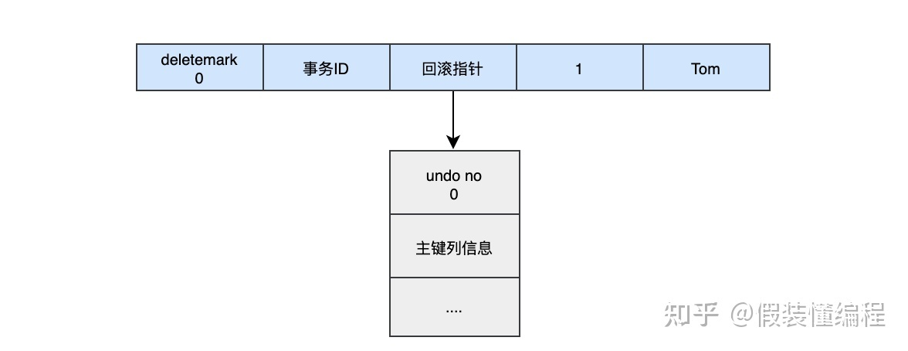
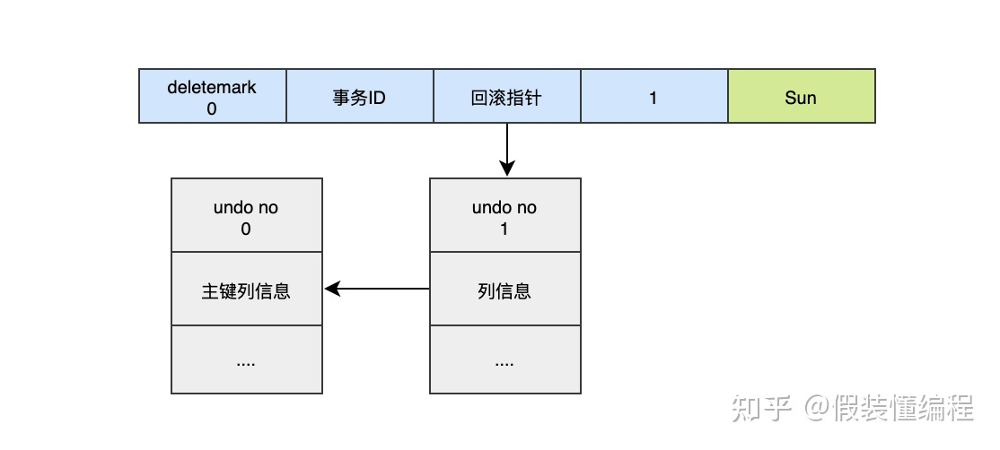
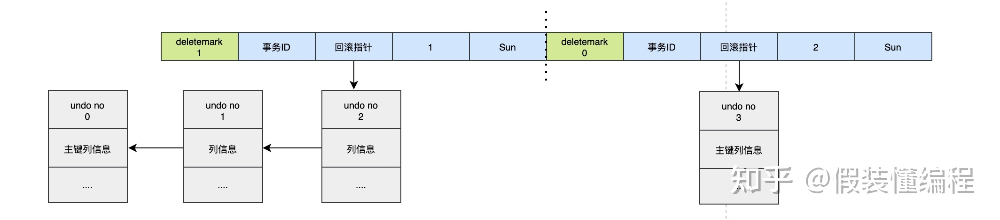
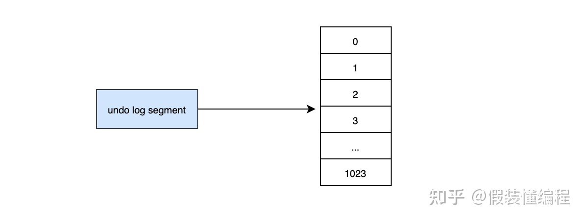

### Undo Log

Undo Log在事务开始前产生；事务在提交时，并不会立刻删除undo log，innodb会将该事务对应的undo log放入到删除列表中，后面会通过后台线程purge thread进行回收处理。
Undo Log属于逻辑日志，记录一个变化过程。例如执行一个delete，undolog会记录一个insert；执行一个update，undolog会记录一个相反的update。

#### 什么情况下会生成undo log？

undo log的作用就是mvcc（多版本控制）和回滚，我们这里主要说回滚，当我们在事务里insert、update、delete某些数据的时候，就会产生对应的undo log，当我们执行回滚时，通过undo log就可以回到事务开始的样子。需要注意的是回滚并不是修改的物理页，而是逻辑的恢复到最初的样子，比如一个数据A，在事务里被你修改成B，但是此时有另一个事务已经把它修改成了C，如果回滚直接修改数据页把数据改成A，那么C就被覆盖了。

对于InnoDB引擎来说，每个行记录除了记录本身的数据之外，还有几个隐藏的列：

- *DB_ROW_ID*：如果没有为表显式的定义主键，并且表中也没有定义唯一索引，那么InnoDB会自动为表添加一个row_id的隐藏列作为主键。
- *DB_TRX_ID*：每个事务都会分配一个事务ID，当对某条记录发生变更时，就会将这个事务的事务ID写入trx_id中。
- *DB_ROLL_PTR*：回滚指针，本质上就是指向 undo log 的指针。


当我们执行INSERT时：

```sql
begin;
INSERT INTO user (name) VALUES ("tom")
```

插入的数据都会生一条insert undo log，并且数据的回滚指针会指向它。undo log会记录undo log的序号、插入主键的列和值...，那么在进行rollback的时候，通过主键直接把对应的数据删除即可。



对于更新的操作会产生update undo log，并且会分更新主键的和不更新的主键的，假设现在执行:

```sql
UPDATE user SET name="Sun" WHERE id=1;
```



这时会把老的记录写入新的undo log，让回滚指针指向新的undo log，它的undo no是1，并且新的undo log会指向老的undo log（undo no=0）。

假设现在执行：

```
UPDATE user SET id=2 WHERE id=1;
```



对于更新主键的操作，会先把原来的数据deletemark标识打开，这时并没有真正的删除数据，因为如果这个事务没有提交，记录却删除了，则其他事务就无法根据主键找到该记录了，真正的删除会交给清理线程去判断，然后在后面插入一条新的数据，新的数据也会产生undo log，并且undo log的序号会递增。

可以发现每次对数据的变更都会产生一个undo log，当一条记录被变更多次时，那么就会产生多条undo log，undo log记录的是变更前的日志，并且每个undo log的序号是递增的，那么当要回滚的时候，按照序号依次向前推，就可以找到我们的原始数据了。

当执行删除操作时：

* 事务未提交，语句已执行，会把记录的delete_mask改为1，此时还在正常记录的链表中

* 事务提交后，把delete_mask标记为1的记录从正常记录链表中移除，加入到已删除链表的头部

* 而事务提交后，不需要用到undo日志，所以其实只要保存第一阶段的undo日志即可。

purge线程作用是：清理undo页和清除page里面带有Delete_Bit标识的数据行。在InnoDB中，事务中的Delete操作实际上并不是真正的删除掉数据行，而是一种Delete Mark操作，在记录上标识Delete_Bit，而不删除记录。是一种"假删除",只是做了个标记，真正的删除工作需要后台purge线程去完成

#### undo log是如何回滚的？

以上面的例子来说，假设执行rollback，那么对应的流程应该是这样：

1. 通过undo no=3的日志把id=2的数据删除
2. 通过undo no=2的日志把id=1的数据的deletemark还原成0
3. 通过undo no=1的日志把id=1的数据的name还原成Tom
4. 通过undo no=0的日志把id=1的数据删除

#### undo log存在什么地方？

InnoDB对undo log的管理采用段的方式，也就是回滚段，每个回滚段记录了1024个undo log segment，InnoDB引擎默认支持128个回滚段。那么能支持的最大并发事务就是128*1024。每个undo log segment就像维护一个有1024个元素的数组



当我们开启个事务需要写undo log的时候，就得先去undo log segment中去找到一个空闲的位置，当有空位的时候，就会去申请undo页，最后会在这个申请到的undo页中进行undo log的写入。我们知道mysql默认一页的大小是16k。

那么为一个事务就分配一个页，其实是非常浪费的（除非你的事物非常长），假设你的应用的TPS为1000，那么1s就需要1000个页，大概需要16M的存储，1分钟大概需要1G的存储...，如果照这样下去除非mysql清理的非常勤快，否则随着时间的推移，磁盘空间会增长的非常快，而且很多空间都是浪费的。于是undo页就被设计的可以重用了，当事务提交时，并不会立刻删除undo页，因为重用，这个undo页它可能不干净了，所以这个undo页可能混杂着其他事务的undo log。undo log在commit后，会被放到一个链表中，然后判断undo页的使用空间是否小于3/4，如果小于3/4的话，则表示当前的undo页可以被重用，那么它就不会被回收，其他事务的undo log可以记录在当前undo页的后面。由于undo log是离散的，所以清理对应的磁盘空间时，效率不是那么高。

