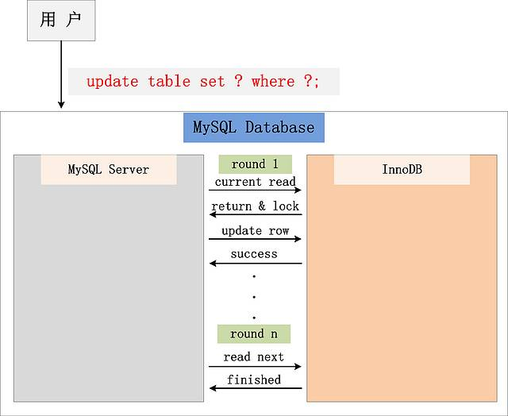
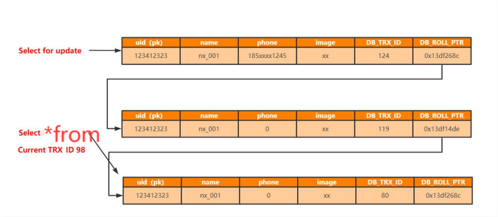
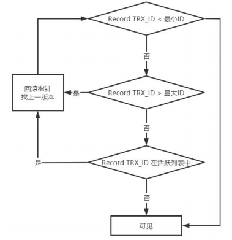
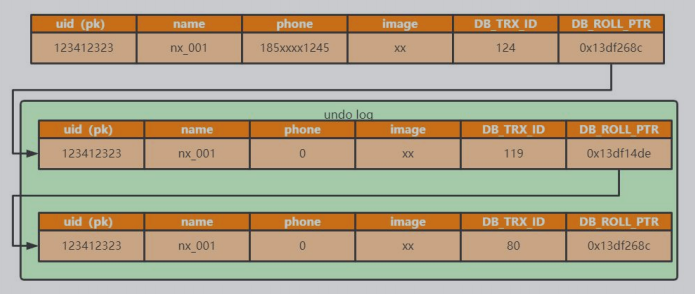
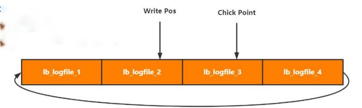
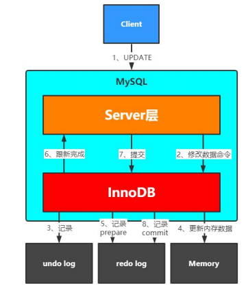
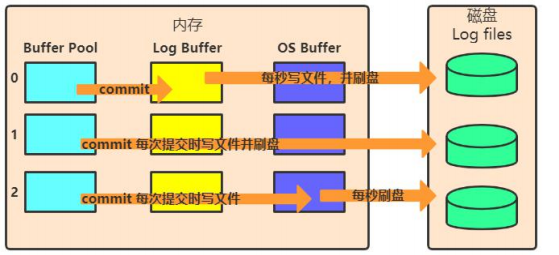
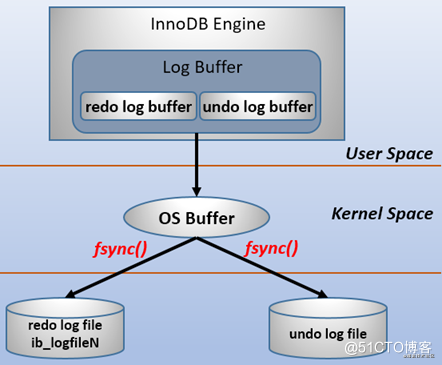

#### 事务特性

* 原子性(```Atomicity```)：全部成功或者全部失败。

  通过undo log 日志来实现。当操作发生异常时，可以通过undo log 来进行回滚，保证整个事务中的操作要么全部成功或者全部失败。

* 隔离性(```Isolation```)：并行事务之间互不干扰。通过MVCC和读写锁来实现。

* 持久性(```Durability```)：事务提交后，永久生效。通过redo log 来实现。

* 一致性(```Consistency```)：一致性是指事务将数据库从一种状态转变为下一种一致的状态。在事务开始之前和事务结束之后，数据库的完整性约束没有被破坏(通过```AID```保证)。

#### 并发问题

* 脏读(```Dirty Read```)：读取到了未提交的数据。

* 不可重复读(```Non-repeatable Read```)：主要是说多次读取一条记录, 发现该记录中某些列值被修改过。

* 幻读(```Phantom Read```)：主要是说多次读取一个范围内的记录(包括直接查询所有记录结果或者做聚合统计), 发现结果不一致(标准档案一般指记录增多, 记录的减少应该也算是幻读)。当前读在mysql中当前读通过gap锁保证不出现幻读，快照读通过mvcc保证每次读的数据不会变。


#### 隔离级别

* Read Uncommitted(读取未提交内容)：最低隔离级别，会读取到其他事务未提交的数据，脏读。
* Read Committed(读取提交内容)：事务过程中可以读取到其他事务提交的数据，不可重复读。
* Repeatable Read（可重复读）：每次读取相同结果集，不管其他事务是否提交，幻读。在mysql innodb中幻读不存在。
* Serializable(可串行化)：事务排队，隔离级别最高，性能最差。

#### MVCC多版本并发控制(Multi-Version Concurrency Control)

MVCC-多版本控制，主要是在当前读与快照读发生冲突时，快照读根据undo log 读取相关的快照。通过这种方式，不用加锁，也能正常读取数据，提高了数据库的并发能力。

* 当前读：读取记录的最新版本，读取时还要保证其他事务不能修改当前记录，会对读取的记录进行加锁。插入/更新/删除操作，属于当前读，需要加锁。

  ```sql
  select * from t for update 
  ```

  插入/更新/删除操作，属于当前读，需要加锁在数据库中的执行流程：

  

  ​	从图中，可以看到，一个Update操作的具体流程。当Update SQL被发给MySQL后，MySQL  Server会根据where条件，读取第一条满足条件的记录，然后InnoDB引擎会将第一条记录返回，并加锁 (current  read)。待MySQL  Server收到这条加锁的记录之后，会再发起一个Update请求，更新这条记录。一条记录操作完成，再读取下一条记录，直至没有满足条件的记录为止。因此，Update操作内部，就包含了一个当前读。同理，Delete操作也一样。Insert操作会稍微有些不同，简单来说，就是Insert操作可能会触发Unique Key的冲突检查，也会进行一个当前读。

  注：根据上图的交互，针对一条当前读的SQL语句，InnoDB与MySQL Server的交互，是一条一条进行的，因此，加锁也是一条一条进行的。先对一条满足条件的记录加锁，返回给MySQL Server，做一些DML操作；然后在读取下一条加锁，直至读取完毕

* 快照读：基于多版本，即快照读可能读取到的并不一定是数据的最新版本，有可能是之前的历史版本。

  ```sql
  select * from t
  ```



**Read View**

> 当事务开启时，会分配一个id，这个id是递增的，所以最新的事务，id越大。
>
> 1. m_ids：表示在生成ReadView时当前系统中活跃的读写事务的事务id列表。
> 2. min_trx_id：表示在生成ReadView时当前系统中活跃的读写事务中最小的事务id，也就是m_ids中的最小值。
> 3. max_trx_id：表示生成ReadView时系统中应该分配给下一个事务的id值。
> 4. creator_trx_id：表示生成该ReadView的事务的事务id。

当事务进行快照读(select * from)操作时，会产生的一个读视图，该视图维护当前行数据活跃事务(未提交)的Id。

可见性判断：

* 如果被访问版本的trx_id与creator_trx_id相同，说明在访问它自己修改过的记录，所以该版本可以被当前事务访问。
* 如果被访问的版本的trx_id小于min_trx_id，说明生成该版本的事务在当前事务生成ReadView前已经提交，所以该版本可以被当前事务访问。
* 如果被访问的版本的trx_id大于max_trx_id，说明生成该版本的事务在当前事务生成ReadView后开启的，当前版本不能访问。
* 如果被访问的trx_id在最大和最小id之间，那就需要判断一下，该事务id是否在活跃列表中，如果不在，则可以被访问，否则不能访问。



#### 不同隔离级别的实现

* 读未提交

  读最新的数据，不管这条数据是不是已提交。不会遍历版本链，少了查找可见版本的步骤。可能会导致脏读。

* 可重复读。MYSQL的默认隔离级别。

  事务在开始时创建一个ReadView，当读一条记录时，会遍历版本链表，通过当前事务的ReadView判断可见性。

* 读已提交。

  获取ReadView的时机，每个语句开始执行时，获得ReadView，可见性判断是基于语句级别的ReadView。读的策略与可重复读类似。

* 串行读，快照读退化成当前读，每次读取都需要加锁。


#### 事务的实现

**undo log**

* 回滚日志。

* 保证事务原子性。

* 实现数据多版本。

* insert undo log：用于回滚，提交即清理。

* update undo log：用于回滚，同时实现快照读，不能随便删除。




**redo log**

* 实现事务持久性。

* 记录修改。

* 用于异常恢复。

* 循环写文件。

  * write pos：写入位置。
  * chick point：刷盘位置。
  * chick point -> write pos ：待落盘数据。

  

* 写入流程（持久化）

  * 记录页的修改，状态为prepare。
  * 事务提交，将事务记录为commit状态。

  

* 刷盘时机

  redo log的写入并不是直接写入磁盘的，redo log也有缓冲区的，叫做redo log buffer（重做日志缓冲），InnoDB引擎会在写redo log的时候先写redo log buffer，然后也是以一定的频率刷入到真正的redo log中。

  需要注意的是redo log buffer刷到redo log的过程并不是真正的刷到磁盘中去了，只是刷入到os cache中去，这是现代操作系统为了提高文件写入的效率做的一个优化，真正的写入会交给系统自己来决定（比如os cache足够大了）。那么对于InnoDB来说就存在一个问题，如果交给系统来fsync，同样如果系统宕机，那么数据也丢失了（虽然整个系统宕机的概率还是比较小的）。针对这种情况，InnoDB给出*innodb_flush_log_at_trx_commit*策略，让用户自己决定使用哪个。

  ```
  innodb_flush_log_at_trx_commit = 0 就是每秒调用 flush + fsync ，定时器自己维护。
  innodb_flush_log_at_trx_commit = 1 就是实时调用 flush + fsync 没法批处理，性能很低。
  innodb_flush_log_at_trx_commit = 2 就是实时flush ,定时 fsync 交给OS维护定时器。
  sync_binlog 配置
  等于0：表示每次提交事务只write不fsync
  等于1：表示每次提交事务都执行fsync
  等于n：表示事务在write后，会累积N个事务后才fsync。
  ```

  ```
  mysql> show variables like '%innodb_log_buffer_size%';
  +------------------------+----------+
  | Variable_name          | Value    |
  +------------------------+----------+
  | innodb_log_buffer_size | 16777216 |
  +------------------------+----------+
  ```

  InnoDB引擎BufferPool、LogBuffer、OS Buffer、Log files 之间的关系:

  





