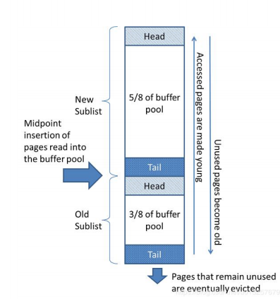

#### 数据存储原理

mysql所有的数据都存放在一个空间中，我们称之为表空间，表空间由段(segment)、区(extent)、页(page)组成。leaf node segment 叶子节点数据；non-leaf node segment 非叶子节点；rollback segment 回滚断，Undo log 就是存放在此处。

Page是Innodb存储的基本结构，也是Innodb磁盘管理额最小单位，与数据库相关的所有内容都存储在Page结构里。

**MySQL记录存储**

* Page Header，页头：记录页面的控制信息，共占56字节，包括页的左右兄弟页面指针、页面空间使用情况。
* 虚记录：通过虚记录可以快速判断查找的记录是否在页内。
  * 最大虚记录：比页内最大主键还大。
  * 最小虚记录：比页内最小主键还小。
* 记录堆：行记录存储区，分为有效记录和已删除记录。
* 自由空间链表：已删除记录组成的链表，方便使用已删除的空间，防止空间碎片化，无法利用。
* 未分配空间：未使用的存储空间。
* 页尾：页面最后部分，占8个字节，主要存储页面的校验信息。

**页内记录维护**

页内的记录以B+树的数据结构维护着，非叶子节点存储着下一个节点的地址和主键，叶子节点存储完整记录。

* 顺序保证

  页内记录根据主键排序，通过单向链表在逻辑上保证顺序。

  

  页间双向链表。

  

* 插入策略
  * 优先自由空间链表。数据库以页的形式加载到内存，如果页内存在很多已删除的空间，浪费内存空间。
  * 其次未分配的空间。

* 业内查找

  页内记录的存储结构是单向链表，遍历链表效率很低。为了提高页内的查询效率，MySQL增加了虚记录，每个虚记录指向链表的某一个节点，将整个链表打散成小的链表，然后查询记录时，先通过二分法查找虚记录，定位记录在某一个小的链表，在遍历该小链表，从而提高查询效率。

  

#### 索引

* 聚簇索引(主键索引)
  * 存储方式：行数据存储在叶子节点
  * 主键：自增主键，顺序写入，效率高；随机主键，节点分裂移动，效率低。
* 二级索引
  * 除了主键索引以外的索引。
  * 索引的Data是主键。
  * 索引的key保含主键(保证key唯一)
  * 一次查询至少走两次索引。先查询二级索引，通过二级索引的data中的主键在去查询主键索引，最终将数据查询出来。
  * 主键的大小会影响所有索引的大小。
* 联合索引
  * 一个索引只创建一颗树。
  * 按第一列排序，第一列相同按第二列排序。
  * 如果不是按照最左开始查询，无法使用索引。
  * 不能跳过中间列。
  * 某列使用范围查询，后面的列不能使用索引。

#### MySQL内存管理

​	

* Buffer Pool：预分配的内存池。

* Page：Buffer Pool的最小单位。

* Free list：空闲Page组成的链表。

* Flush list：脏页链表。脏页是数据有改动的页，待回写到硬盘。

* page hash：维护内存中的page和硬盘文件页的映射关系。

* LRU：内存淘汰算法。

  

  

LRU内存淘汰算法有一个缺点：活跃的数据都会排列在前面，不活跃的在后面，假如某一次查询出大量数据，那么会瞬间填满内存池而导致热数据都被淘汰了，从而影响缓存的命中率和Io性能。MySQL通过分代的方案来解决。

* LRU_new：热数据。
* LRU_old：冷数据。
* Midpoint：将LRU链表分成两部分。
* new/old=5/3

**Buffer Pool 的使用**

* 硬盘到内存
  * 选空闲页装载数据。
  * 链入LRU_old的头部
* old到new
  * LRU_old链表移除，链入LRU_new的头部。old区存活时间大于innodb_old_blocks_time才有机会进入new区。
* new到old
  * mid指针的移动，new里面的数据变成old区的头部数据。
  * LRU list flush 的脏页，移动到old的尾部，等待淘汰。
* LRU_new操作：
  * 不是每次访问页，该页数据都会被移动到new区的头部。
  * 移动的依据：freed_page_clock：Buffer Pool 淘汰页数。当前freed_page_clock-上次移动到head时freed_page_clock大于LRU_new长度的1/4时才会移动到head。

**页面装载优先级**

* Free list优先。
* LRU中淘汰冷数据。
* LRU Flush，将脏页回写到硬盘，空出空间。