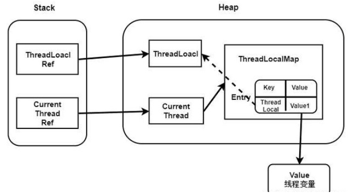

#### ThreadLocal源码分析

ThreadLocal是一个线程的局部变量，只有当前线程可以访问，因此是线程安全的。

示例：

```java
public class ThreadLocalDemo {

    private static ThreadLocal<SimpleDateFormat> threadLocal = new ThreadLocal<SimpleDateFormat>(){
        @Override
        protected SimpleDateFormat initialValue() {
            return new SimpleDateFormat("yyyy-MM-dd HH:mm:ss");
        }
    };

    public static class ParseDate implements Runnable{

        int i = 0;

        public ParseDate(int i){this.i = i;}

        @Override
        public void run() {
            try {
                Date t = threadLocal.get().parse("2018-10-28 10:23:" + i % 60);
                System.out.println(i + ":" + t);
            }catch (Exception e){
                e.printStackTrace();
            }
        }
    }


    public static void main(String[] args){

        ExecutorService executorService = Executors.newFixedThreadPool(10);
        for (int i =0; i<1000; i++){
            executorService.execute(new ParseDate(i));
        }

    }

}
```

源码分析：

* set方法。先获取当前线程Thread对象，再得到该Thread对象的ThreadLocalMap成员map，若map为空，需要先createMap()方法，若不为空，则需要调用map的set()方法。

```java
public void set(T value) {
        Thread t = Thread.currentThread();//获取当前线程
        ThreadLocalMap map = getMap(t);//获取线程内的ThreadLocalMap对象，类似map集合
        if (map != null)
            //设置值
            map.set(this, value);//this指向调用set方法的ThreadLocal对象
        else
            //如果map为空，则创建map。
            createMap(t, value);//初始化线程t的ThreadLocalMap，key也是ThreadLocalMap
}

ThreadLocalMap getMap(Thread t) {
        return t.threadLocals;
 }

//创建一个ThreadLocalMap，并设置到当前线程中去。
void createMap(Thread t, T firstValue) {
        t.threadLocals = new ThreadLocalMap(this, firstValue)//this是ThreadLocal
 }
```

* ThreadLocalMap 对象，类似于HashMap。

```java
static class ThreadLocalMap {

    static class Entry extends WeakReference<ThreadLocal<?>> {
       
        Object value;

        Entry(ThreadLocal<?> k, Object v) {
            //调用父类的构造方法，设置key，它是一个弱引用
            /**
            Reference(T referent) {
        		this(referent, null);
    		}
    		Reference(T referent, ReferenceQueue<? super T> queue) {
        		this.referent = referent;
        		this.queue = (queue == null) ? ReferenceQueue.NULL : queue;
    		}
            */
            super(k);
            value = v;
        }
    }

    /**
     * The initial capacity -- MUST be a power of two.
     */
    private static final int INITIAL_CAPACITY = 16;

    /**存储数据数组
     * The table, resized as necessary.
     * table.length MUST always be a power of two.
     */
    private Entry[] table;

    /**
     * The number of entries in the table.
     */
    private int size = 0;

    /**阀值
     * The next size value at which to resize.
     */
    private int threshold; // Default to 0

    /**阀值为当前容器的2/3
     * Set the resize threshold to maintain at worst a 2/3 load factor.
     */
    private void setThreshold(int len) {
        threshold = len * 2 / 3;
    }

    /**
     * Increment i modulo len.
     */
    //返回下一个槽位
    private static int nextIndex(int i, int len) {
        return ((i + 1 < len) ? i + 1 : 0);
    }
    private static int prevIndex(int i, int len) {
        return ((i - 1 >= 0) ? i - 1 : len - 1);
    }
}
```

* ThreadLocalMap.set()方法：通过key.threadLocalHashCode &  (len-1)计算出哈希表的下标，判断该位置的Entry是否为null，若为null，则创建Entry对象，将其放入该下标位置；若Entry已存在，则需要解决哈希冲突，重新计算下标。最后size自增，再根据!cleanSomeSlots(i, sz) && sz >= threshold进行判断是否需要进行哈希表的调整。

  在解决哈希冲突的上，常用的有开链法、线性探测法和再散列法，HashMap中使用的是开链法，而ThreadLocal使用的是线性探测法，即发生哈希冲突，往后移动到合适位置。

```java
 private void set(ThreadLocal<?> key, Object value) {
	
			//table用来存放Entry的数组，它的索引就是ThreadLocal的哈希值
            Entry[] tab = table;
            int len = tab.length;
     		//计算槽位置，类似于hashmap
            int i = key.threadLocalHashCode & (len-1);
			
            for (Entry e = tab[i];e != null;
            //通过nextIndex()方法往后查找空闲的位置     
             e = tab[i = nextIndex(i, len)]) { 
                //如果槽不为空，则获取槽中的值，并判断key是否相等或者为空
                ThreadLocal<?> k = e.get();
				//如果key相等，说明是同一个ThreadLocal，直接覆盖原来的值
                if (k == key) {
                    e.value = value;
                    return;
                }
                
				//替换掉失效的entry
                if (k == null) {
                    replaceStaleEntry(key, value, i);
                    return;
                }
            }
     
			//如果槽为空，则将值设置到槽中，key是一个弱引用。
            tab[i] = new Entry(key, value);
            int sz = ++size;//size表示tab数组中元素的数量
     		//判断当前存储的数据是否达到了阀值，如果超过则进行扩容
            if (!cleanSomeSlots(i, sz) && sz >= threshold)
                rehash();//扩容
        }
```

* replaceStaleEntry()方法，清空槽中无用的值。Entry的key为弱引用，存在被GC的情况。当设置值的时候，如果某个下标不为空但是key为null，说明该缓存值已经无效，需要清除掉。

  可以清楚看到第一个for循环前向遍历查找脏Entry，用slotToExpunge保存脏Entry下标；
  第二个for循环后向遍历，若遇到ThreadLocal相同，更新value，然后与下标为staleSlot（传入进来的脏Entry）进行交换，接着判断前向查找脏Entry是否存在，slotToExpunge ==  staleSlot说明的就是前向查找没找到，就更改slotToExpunge的值，然后进行清理操作，结束掉；若后向遍历遇到脏Entry，并且前向没找到，更改slotToExpunge的值，为清理时用，继续循环。
  若不存在和ThreadLocal引用相同的Entry，则需要将staleSlot的位置的Entry替换为一个新的Entry对象，tab[staleSlot].value = null是为了GC；
  最后根据slotToExpunge来判断前向后向遍历中是否存在脏Entry，若存在还需要进行清理。

```java
private void replaceStaleEntry(ThreadLocal<?> key, Object value,
                                       int staleSlot) {
            Entry[] tab = table;
            int len = tab.length;
            Entry e;

         	//记录无效的槽位置，staleSlot指向了一个key为null的槽
            int slotToExpunge = staleSlot;
   			//向前扫描，查找最前面的一个无效slot
            for (int i = prevIndex(staleSlot, len);
                 (e = tab[i]) != null;
                 i = prevIndex(i, len))
                //获取key,判断key是否为空，记录无效槽的位置
                if (e.get() == null)
                    slotToExpunge = i;
  						//================第一个for循环
  
   
           //向后遍历table，staleSlot指向无效的槽
            for (int i = nextIndex(staleSlot, len);
                 (e = tab[i]) != null;
                 i = nextIndex(i, len)) {
                ThreadLocal<?> k = e.get();
                //key在table中已经存在
                if (k == key) {
                    e.value = value;//替换原来的值
					//tab[i]与tab[staleSlot]交换位置
                    tab[i] = tab[staleSlot];
                    //因为ThreadLocal是线性探测，如果key计算出来的槽位中已经存储数据会继续向后探测。staleSlot存储的是与当前key哈希相同的数据，但是它的key为null，所以为了提高查找哈希值相同的entry节点的效率，将数据进行互换
                    tab[staleSlot] = e;
					
                    //如果之前向前扫描没有发现无效的entry,那么slotToExpunge == staleSlot必然为true，然后我们可以继续从i处往后循环查找无效的entry.
                    if (slotToExpunge == staleSlot)
                        slotToExpunge = i;
                    //从i处继续清理无效的entry
                    cleanSomeSlots(expungeStaleEntry(slotToExpunge), len);
                    return;
                }

                //如果检测到有无效的entry，并且之前扫描没有发现无效的entry，更新slotToExpunge
                if (k == null && slotToExpunge == staleSlot)
                    slotToExpunge = i;
            }

            //如果key在table中不存在，则直接在staleSlot处存放即可.
            tab[staleSlot].value = null;
            tab[staleSlot] = new Entry(key, value);

           //如果在检查过程中发现无效的entry，则做一次清理
            if (slotToExpunge != staleSlot)
                cleanSomeSlots(expungeStaleEntry(slotToExpunge), len);
        }
```

* cleanSomeSlots()：分段清除ThreadLocalMap中无效的元素。

```java
private boolean cleanSomeSlots(int i, int n) {
            boolean removed = false;
            Entry[] tab = table;
            int len = tab.length;
            do {
                i = nextIndex(i, len);
                Entry e = tab[i];
                //ThreadLocal为空,需要清空无效的entry
                if (e != null && e.get() == null) {
                    n = len;//
                    removed = true;
                    //清理一个连续的段，即直到下一个空的slot为止
                    i = expungeStaleEntry(i);
                }
            } while ( (n >>>= 1) != 0);//n主要是用来控制循环的次数。
            return removed;
        }
```

* expungeStaleEntry(int staleSlot)方法，清理无效的元素，并重新计算元素的哈希值。参数是key为null的槽的索引值，返回值是以staleSlot为起始位置，第一个空槽的索引值。

```java
private int expungeStaleEntry(int staleSlot) {
            Entry[] tab = table;
            int len = tab.length;

           //清理staleSlot处无效的entry
            tab[staleSlot].value = null;
            tab[staleSlot] = null;
            size--;

            // Rehash until we encounter null
            Entry e;
            int i;
    //从staleSlot往后循环,清理无效的entry
            for (i = nextIndex(staleSlot, len);
                 (e = tab[i]) != null;//直到下一个tab[i]为空，停止循环，返回i值
                 i = nextIndex(i, len)) {
                ThreadLocal<?> k = e.get();
                if (k == null) {
                    //如果key为null，则将数据设置为null，等待gc
                    e.value = null;
                    tab[i] = null;
                    size--;
                } else {
                    //计算哈希值
                    int h = k.threadLocalHashCode & (len - 1);
                    //如果哈希不相等，则用最新的哈希地址
                    if (h != i) {
                        tab[i] = null;
                        //线性探测
                        while (tab[h] != null)
                            h = nextIndex(h, len);
                        tab[h] = e;
                    }
                }
            }
    		//返回entry为空的下标
            return i;
        }
```

* rehash()方法。在set方法中，最后根据!cleanSomeSlots(i, sz) && sz >= threshold，判断是否清理掉了脏Entry，若清理了什么都不做；若没有清理，还会判断是否达到阈值，进而是否需要rehash操作；

````java
private void rehash() {
    		//做一次全量的清理
            expungeStaleEntries();
    //由于清除掉了脏Entry，还需要对size进行判断，看是否达到了阈值的3/4（提前触发resize），来判断是否真的需要resize；
    		//threadhold = len*2/3 
            if (size >= threshold - threshold / 4)//len/2
                resize();
  }

//全量清除无效的槽位
private void expungeStaleEntries() {
  Entry[] tab = table;
  int len = tab.length;
  for (int j = 0; j < len; j++) {
    Entry e = tab[j];
    if (e != null && e.get() == null)
      expungeStaleEntry(j);
  }
}

````

* resize()方法，扩大的容量为原来的2倍

```java
private void resize() {
    //记录旧的table数据
    Entry[] oldTab = table;
    int oldLen = oldTab.length;
    //扩容
    int newLen = oldLen * 2;
    
    Entry[] newTab = new Entry[newLen];
    int count = 0;

    for (int j = 0; j < oldLen; ++j) {
        Entry e = oldTab[j];
        if (e != null) {
            ThreadLocal<?> k = e.get();
            if (k == null) {
                //如果key为null，则将值设置为null
                e.value = null; // Help the GC
            } else {
                //重新计算槽位置
                int h = k.threadLocalHashCode & (newLen - 1);
                //线性探测
                while (newTab[h] != null)
                    h = nextIndex(h, newLen);
                newTab[h] = e;
                count++;
            }
        }
    }

    setThreshold(newLen);
    size = count;
    table = newTab;
}
```

哈希值的计算：```int i = key.threadLocalHashCode & (len-1);```，threadLocalHashCode是ThreadLocal中的一个成员变量:

```java
private final int threadLocalHashCode = nextHashCode();
private static int nextHashCode() {
        return nextHashCode.getAndAdd(HASH_INCREMENT);
}

private static AtomicInteger nextHashCode = new AtomicInteger();
private static final int HASH_INCREMENT = 0x61c88647;

 	
```

上面的HASH_INCREMENT与斐波那契散列有关。斐波那契散列法本质上是一个乘法散列法，它采用一个特殊的乘数，然后与之相乘，再进行右移得出一个冲突比较少的值。

对于乘数的选择：

1. 对于16位整数而言，这个乘数是40503。
2. 对于32位整数而言，这个乘数是2654435769。
3. 对于64位整数而言，这个乘数是11400714819323198485。

例：H(key) = ( (k * 2654435769)  >> 28) << Y

再回到ThreadLocalMap中，```HASH_INCREMENT = (1L <<32)- 2654435769```，当我们将ThreadLocal为key，把值保存到ThreadLocal的ThreadLocalMap中时，ThreadLocalMap会为每个key设置一个累加的ID,然后将这个ID与ThreadLocalMap的容量进行取模，就会得到一个比较均衡的结果。

* get()方法

```java
public T get() {
        Thread t = Thread.currentThread();//获取当前线程
        ThreadLocalMap map = getMap(t);//获取Thread内部的ThreadLocalMap对象
        if (map != null) {
            ThreadLocalMap.Entry e = map.getEntry(this);//根据key获取value
            if (e != null) {
                @SuppressWarnings("unchecked")
                T result = (T)e.value;
                return result;
            }
        }
        return setInitialValue();
    }
```

* getEntry()方法

```java
 private Entry getEntry(ThreadLocal<?> key) {
     		//根据key的threadLocalHashCode来获取索引，即哈希值
            int i = key.threadLocalHashCode & (table.length - 1);
     		//根据下标从数组中获取entry对象
            Entry e = table[i];
     		//如果不为空，并且key相等，则返回值
            if (e != null && e.get() == key)
                return e;
            else
                //如果没有命中，则从i处开始循环查找
                return getEntryAfterMiss(key, i, e);
  }
```

* getEntryAfterMiss()方法

```java
private Entry getEntryAfterMiss(ThreadLocal<?> key, int i, Entry e) {
            Entry[] tab = table;
            int len = tab.length;

            while (e != null) {
                ThreadLocal<?> k = e.get();
                if (k == key)
                    return e;
                if (k == null)//ThreadLocal已经被回收
                	//需要清除掉无效的entry
                    expungeStaleEntry(i);
                else
                    //否则继续循环
                    i = nextIndex(i, len);
                e = tab[i];
            }
            return null;
}
```

* expungeStaleEntry()方法

```java
 private int expungeStaleEntry(int staleSlot) {
            Entry[] tab = table;
            int len = tab.length;
				
            //因为ThreadLocal已经为空，所以它对应的entry需要清除掉
            tab[staleSlot].value = null;
            tab[staleSlot] = null;
            size--;//数量减一

            // Rehash until we encounter null
            Entry e;
            int i;
     		
            for (i = nextIndex(staleSlot, len);
                 (e = tab[i]) != null;
                 i = nextIndex(i, len)) {
                ThreadLocal<?> k = e.get();
                if (k == null) {
                    e.value = null;
                    tab[i] = null;
                    size--;
                } else {
                    //对于还有ThreadLocal没有被回收的情况，需要重新生成它的下标（哈希值）
                    int h = k.threadLocalHashCode & (len - 1);
                    if (h != i) {
                        //将原来地址下的元素设置为null,有助于于垃圾回收
                        tab[i] = null;

                        // Unlike Knuth 6.4 Algorithm R, we must scan until
                        // null because multiple entries could have been stale.
                        while (tab[h] != null)
                            //重新生成哈希值
                            h = nextIndex(h, len);
                        //根据索引设置值
                        tab[h] = e;
                    }
                }
            }
            return i;
        }
```

* remove()方法：删除一个元素

```java
 private void remove(ThreadLocal<?> key) {
            Entry[] tab = table;
            int len = tab.length;
            int i = key.threadLocalHashCode & (len-1);//计算哈希值
            for (Entry e = tab[i];
                 e != null;
                 e = tab[i = nextIndex(i, len)]) {
                if (e.get() == key) {//如果key相等
                    e.clear();//显示断开弱连接
                    //进行分段清理
                    expungeStaleEntry(i);
                    return;
                }
            }
        }
```


#### ThreadLocal与内存泄漏



> 实心箭头表示强引用，空心箭头表示弱引用

从上图中可以看出，ThreadLocalMap使用ThreadLocal的弱引用作为key，如果一个ThreadLocal不存在外部**强引用**时，Key(ThreadLocal)势必会被GC回收，这样就会导致ThreadLocalMap中key为null， 而value还存在着强引用，只有thead线程退出以后,value的强引用链条才会断掉。

由于Thread中包含变量ThreadLocalMap，因此ThreadLocalMap与Thread的生命周期是一样长，如果都没有手动删除对应key，都会导致内存泄漏。

但是使用**弱引用**可以多一层保障：弱引用ThreadLocal不会内存泄漏，对应的value在下一次ThreadLocalMap调用set(),get(),remove()的时候会被清除。

因此，ThreadLocal内存泄漏的根源是：由于ThreadLocalMap的生命周期跟Thread一样长，如果没有手动删除对应key就会导致内存泄漏，而不是因为弱引用

## ThreadLocal正确的使用方法

- 每次使用完ThreadLocal都调用它的remove()方法清除数据

  ```java
  try {
      // 其它业务逻辑
  } finally {
      threadLocal对象.remove();
  }
  ```

  

- 将ThreadLocal变量定义成private static，这样就一直存在ThreadLocal的强引用，也就能保证任何时候都能通过ThreadLocal的弱引用访问到Entry的value值，进而清除掉 。

