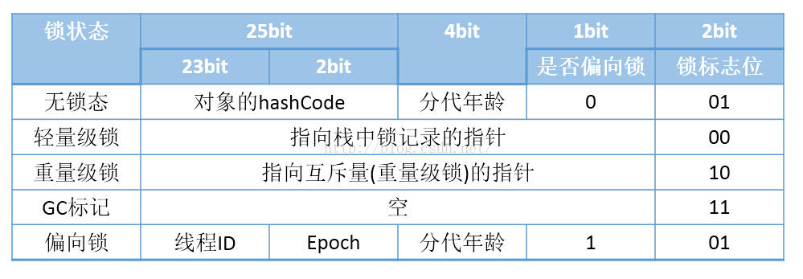
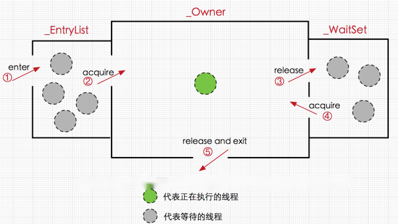
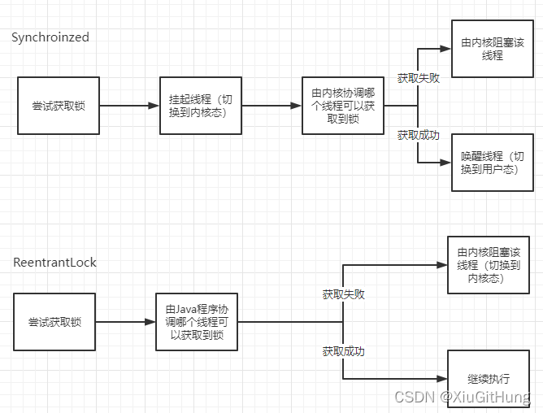
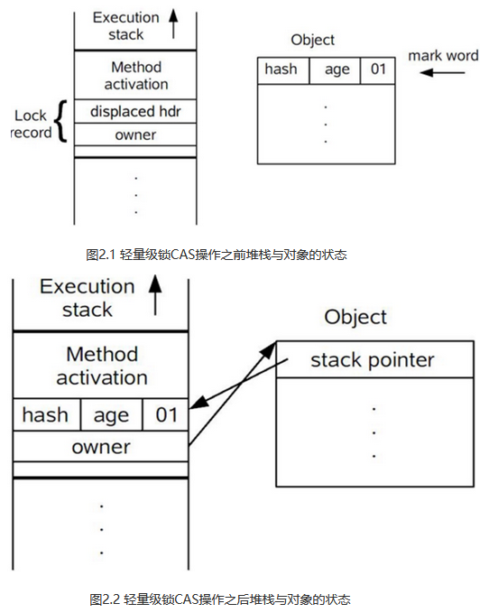

### synchronized关键字

在Java程序中我们可以利用syncronized关键字来对程序进行加锁。它既可以用来声明一个synchronized代码块，也可以直接标记静态或者实例方法。

先看一段synchronized代码块代码：

```java
public class SyncDemo {
    public static void main(String[] args){
       synchronized (Sync.class){
           test1();
       }
    }
    public static void test1(){
        System.out.println("test");
    }
}
```

使用javap -v 查看字节码内容

```java
 public static void main(java.lang.String[]);
    descriptor: ([Ljava/lang/String;)V
    flags: ACC_PUBLIC, ACC_STATIC
    Code:
      stack=2, locals=3, args_size=1
         0: ldc           #2                  // class com/sun/corba/se/impl/orbutil/concurrent/Sync
         2: dup
         3: astore_1
         4: monitorenter
         5: invokestatic  #3                  // Method test1:()V
         8: aload_1
         9: monitorexit
        10: goto          18
        13: astore_2
        14: aload_1
        15: monitorexit
        16: aload_2
        17: athrow
        18: return
      Exception table:
         from    to  target type
             5    10    13   any
            13    16    13   any
```

当声明synchronized代码块时,编译而成的字节码将包含monitorenter和monitorexit指令。这两种指令均会消耗操作数栈上的一个引用类型的元素（也就是synchronized关键字括号里的引用），作为所要加锁、解锁的对象。

关于monitorenter和monitorexit的作用，我们可以抽象的理解为每个锁对象拥有一个锁计数器和一个指向持有该锁的线程的指针。

当执行monitorenter时，如果目标锁对象的计数器为0，那么说明它没有被其它线程所持有，在这种情况下，Java虚拟机会将该锁对象的持有线程设置为当前线程，并且计数器加1。

在目标锁对象的计数器不为0的情况下，如果锁对象的持有的线程是当前线程，那么Java虚拟机可以将其计数器加1，否则需要等待，直至持有线程释放该锁。

当执行monitorexit时，Java虚拟机需要将锁对象的计数器减一，当计数器为0时，那便代表锁已经被释放掉了。

在上面的字节码中包含一个monitorenter指令和多个monitorexit指令，这是因为Java虚拟机需要确保所得的锁在正常执行路径以及异常执行路径上都能被解锁。

当我们使用synchronized标记方法时,示例代码如下：

```java
public class SyncDemo2 {

    public synchronized static void main(String[] args){
        
        System.out.println("test");

    }
}
```

```java
public static synchronized void main(java.lang.String[]);
    descriptor: ([Ljava/lang/String;)V
    flags: ACC_PUBLIC, ACC_STATIC, ACC_SYNCHRONIZED
    Code:
      stack=2, locals=1, args_size=1
         0: getstatic     #2                  // Field java/lang/System.out:Ljava/io/PrintStream;
         3: ldc           #3                  // String test
         5: invokevirtual #4                  // Method java/io/PrintStream.println:(Ljava/lang/String;)V
         8: return

```

当使用synchronized标记方法时，会看到字节码方法中的访问标记包括ACC_SYNCHRONIZED，该标记表示在进入方法时，Java虚拟机需要进行monitorenter操作。而在退出该方法时，不管正常返回还是调用者异常抛异常，Java虚拟机都需要进行monitorexit操作。

#### 理解Java对象头与Monitor

在JVM中，对象在内存中到布局分为三块区域：对象头，实例数据和对齐填充。 如下：


- 实例变量： 存放类的属性数据信息，包括父类的属性信息，如果是数组的实例部分还包括数组的长度，这部分内存按4字节对齐。
- 填充数据：由于虚拟机要求对象起始地址必须是8字节的整数倍。填充数据不是必须存在的，仅仅是为了字节对齐。

其主要结构是由Mark Word和Class Metadata Address组成，其结构说明如下：

| 虚拟机位数 | 结构                   | 说明                                                         |
| ---------- | ---------------------- | ------------------------------------------------------------ |
| 32/64bit   | Mark Word              | 存储对象的hashcode, 锁信息或分代年龄或GC标志等信息           |
| 32/64bit   | Class Metadata Address | 类型指针指向对象的类元数据， JVM通过这个指针确定该对象是哪个类的实例 |

Mark Word被设计成为一个非固定的数据结构，以便存储更多有效的数据，它会根据对象本身的状态复用自己的存储空间



如上图，轻量级锁和偏向锁是Java  6对synchronized锁进行优化后新增加的，我们稍后简要分析。这里我们主要分析一下重量级锁也就是通常说的synchronized的对象锁，锁标识位10，其中指针指向的是monitor对象(也称为管程或监视器锁)的起始地址。在Java虚拟机(HotSpot)中，monitor是由ObjetMonitor实现的，其主要数据结构如下(位于HotSpot虚拟机源码ObjectMonitor.hpp文件，C++实现的)

```c
ObjectMonitor() {
    _header       = NULL;
    _count        = 0; //记录个数
    _waiters      = 0,
    _recursions   = 0;
    _object       = NULL;
    _owner        = NULL;
    _WaitSet      = NULL; //处于wait状态的线程，会被加入到_WaitSet
    _WaitSetLock  = 0 ;
    _Responsible  = NULL ;
    _succ         = NULL ;
    _cxq          = NULL ;
    FreeNext      = NULL ;
    _EntryList    = NULL ; //处于等待锁block状态的线程，会被加入到该列表
    _SpinFreq     = 0 ;
    _SpinClock    = 0 ;
    OwnerIsThread = 0 ;
  }
```

ObjectMonitor中有两个队列， `_WaitSet`和`_EntryList`， 用来保存ObjectWaiter对象列表(每个等待锁的线程都会被封装成ObjectWaiter对象)， `_owner`指向持有ObjectMonitor对象的线程。

当多个线程同时访问一段同步代码时，首先会进入`_EntryList`集合， 当线程获取到对象的monitor后，进入`_owner`区域， 并把monitor中到onwer变量设置为当前线程， 同时monitor中的计数器count+1。

若线程调用wait()方法，将释放当前持有的monitor， owner=null， count-1,  同时该线程进入waitSet集合中等待被唤醒。若当前线程执行完毕也将释放monitor(锁)，并复位变量的值，以便其他线程进入获取monitor(锁)。 如下图所示



#### synchronized锁优化

`JDK 1.6` 之前，还没有进行 `synchronized` 的优化。那个时候 `synchronized` 只要申请锁，`java 进程` 就会从 `用户态` 切换到 `内核态`,需要操作系统配合锁定，这种切换相对来说比较占用系统资源。

```
Lock 的实现的思想是：线程基于 CAS 操作在 用户态 自旋改变内部的 state，操作成功即可获取锁，操作不成功，继续自旋获取直到成功（分配的 cpu 时间执行完之后，再获取到 cpu 资源，仍接着自旋获取锁）。这种实现方式在锁竞争比较小的情况下，效率是比较高的。比起 用户态 切换到 内核态，让线程在哪里自旋一会效率是比较高的。如果一直自旋（比如说 1 分钟）获取不到锁，那用户态 切换到 内核态 比自旋一分钟效率会高。

Lock 不一定比 synchronized 效率高，在锁竞争的几率极大的情况下，自旋消耗的资源远大于 用户态 切换到 内核态占用的资源。
```



Synchronized 底层是依赖于操作系统的 mutex lock 指令实现的，锁的状态是由内核来维护的，也就是说每次尝试获取锁的时候都需要先挂起线程切换到内核态，然后由内核去做协调，然后去阻塞or唤醒线程
ReentrantLock 锁状态的维护是基于一个字段 state 的，因此不需要每次都切换到内核态进行判断，如果获取成功的话可以省去一次用户态/内核态的切换

值得注意的是：尽管 ReentrantLock 不需要切换到内核去维护锁状态，但是在线程需要阻塞的情况下，内核态/用户态的切换还是无法避免的（线程的唤醒和挂起依旧是需要由内核进行的）

JDK6引入三种不同的Monitor实现，也就是三种不同的锁：

* 当没有竞争时，默认使用偏向锁，JVM会利用CAS操作，在对象头上的Mark Word部分设置线程ID，以表示这个对象偏向于当前线程，所以并不涉及真正的互斥锁，因为在很多应用场景中，大部分对象生命周期中最多会被一个线程锁定，使用偏向锁可以降低无竞争开销。
* 如果有另一个线程试图锁定某个被倾向过的对象，锁对象会撤销偏向锁，如果线程cas操作失败，JVM就会将锁升级到轻量级锁。
* 轻量级锁依赖CAS操作Mark Work来实现获取锁，如果重试成功，就会使用普通的轻量级锁，否则进一步升级为重量级锁。 

#### 偏向锁

**1、偏向锁获取过程：**

　1. 线程进入同步代码块时, 先判断对象头的Mark Word是否无锁状态,是否可偏向(锁标志位01, 偏向锁状态为0), 是的话CAS设置偏向锁状态为1, 表示启用偏向锁, 并将偏向锁指向当前线程然后执行步骤6, 否则的话继续进行下面的判断

2. 判断对象头的Mark Word中是否存储着指向当前线程的偏向锁, 如果是表示获取偏向锁成功, 则执行步骤6, 否则执行步骤3
3. 判断Mark Word中偏向锁标识是否设置为1(表示当前是偏向锁), 如果是的话指向步骤4 ,否则执行步骤5
4. 尝试使用CAS将对象头的偏向锁指向当前线程, 成功表示获取偏向锁成功, 则执行步骤6, 失败则表存在竞争, 偏向锁要升级为轻量级锁。
5. 表示已经不是偏向锁了, 使用CAS竞争锁
6. 执行同步代码块

**2、偏向锁的释放：**

1. 线程2访问同步代码块, 发现对象头Mark Word中偏向锁标志为1, 锁标志位为01, 表示可偏向, 因为线程1已经获取了偏向锁, 这个时候对象头的状态已经由线程1更新为偏向锁状态了

2. 检查对象头中偏向锁是否指向了线程2, 发现并不是,这时还是指向线程1

3. 尝试使用CAS将对象头的偏向锁指向当前线程, CAS替换Mark Word成功表示获取偏向锁成功, 这里由于对象头中Mark Word已经指向了线程1, 所以替换失败, 需要撤销偏向锁

    这里关于CAS替换Mark Word这一步, 个人的理解就是, 一个偏向锁只能由一个线程获得, 如果第二个线程来试图获取偏向锁时, 偏向模式就宣告结束。根据所对象目前是否处于被锁定状态, 执行撤销偏向锁恢复到无锁状态,或者将偏向锁升级为轻量级锁状态

4. 撤销偏向锁, 需要等待全局安全点(safepoint)

5. 首先暂停拥有偏向锁的线程, 检查持有偏向锁的线程是否存活 , 如果线程存活, 则锁升级为轻量级锁, 否则进行偏向锁撤销

6. 偏向锁撤销之后, 恢复线程1, 线程2再去以偏向模式获取偏向锁


#### 轻量级锁

**1、轻量级锁加锁**

1. 在代码进入同步块的时候，如果同步对象锁状态为无锁状态（锁标志位为“01”状态，是否为偏向锁为“0”），虚拟机首先将在当前线程的栈帧中建立一个名为锁记录（Lock Record）的空间，用于存储锁对象目前的Mark Word的拷贝，官方称之为 Displaced Mark  Word。这时候线程堆栈与对象头的状态如图2.1所示。
2. 拷贝对象头中的Mark Word复制到锁记录中。
3. 拷贝成功后，虚拟机将使用CAS操作尝试将对象的Mark Word更新为指向Lock Record的指针，并将Lock record里的owner指针指向object mark word。如果更新成功，则执行步骤（5），否则执行步骤（4）。
4. 如果这个更新动作成功了，那么这个线程就拥有了该对象的锁，并且对象Mark Word的锁标志位设置为“00”，即表示此对象处于轻量级锁定状态，这时候线程堆栈与对象头的状态如图2.2所示。
5. 如果这个更新操作失败了，虚拟机首先会检查对象的Mark  Word是否指向当前线程的栈帧，如果是就说明当前线程已经拥有了这个对象的锁，那就可以直接进入同步块继续执行。否则说明多个线程竞争锁，轻量级锁就要膨胀为重量级锁，锁标志的状态值变为“10”，Mark Word中存储的就是指向重量级锁（互斥量）的指针，后面等待锁的线程也要进入阻塞状态。  而当前线程便尝试使用自旋来获取锁，自旋就是为了不让线程阻塞，而采用循环去获取锁的过程



**2、轻量级锁解锁**

轻量级解锁时，会使用原子的CAS操作将Displaced Mark Word替换回到对象头，如果成功，则表示没有竞争发生。如果失败，表示当前锁存在竞争，**锁就会膨胀成重量级锁**

#### wait方法的底层原理

wait即object的wait()和notify()或者notifyall()一起搭配使用，wait方法会将当前线程放入wait set等待被唤醒。wait set 是ObjetMonitor对象中的一个集合，这个也就是wait需要在synchronized代码块中执行的原因。

1.将当前线程封装成objectwaiter对象node
2.通过objectmonitor::addwaiter方法将node添加到_WaitSet列表中
3.通过ObjectMonitor:exit方法释放当前的ObjectMonitor对象，这样其他竞争线程就可以获取该ObjectMonitor对象
4.最终底层的park方法会挂起线程


### 其他资料

#### java线程阻塞的代价

java的线程是映射到操作系统原生线程之上的，如果要阻塞或唤醒一个线程就需要操作系统介入，需要在户态与核心态之间切换，这种切换会消耗大量的系统资源，因为用户态与内核态都有各自专用的内存空间，专用的寄存器等，用户态切换至内核态需要传递给许多变量、参数给内核，内核也需要保护好用户态在切换时的一些寄存器值、变量等，以便内核态调用结束后切换回用户态继续工作。

    如果线程状态切换是一个高频操作时，这将会消耗很多CPU处理时间；
    如果对于那些需要同步的简单的代码块，获取锁挂起操作消耗的时间比用户代码执行的时间还要长，这种同步策略显然非常糟糕的

## 自旋锁与自适应自旋

Java的线程是映射到操作系统的原生线程之上的，如果要阻塞或唤醒一个线程，都需要操作系统来帮忙完成，这就需要从用户态转换到核心态中，因此状态转换需要耗费很多的处理器时间，对于代码简单的同步块（如被synchronized修饰的getter()和setter()方法），状态转换消耗的时间有可能比用户代码执行的时间还要长。 

 虚拟机的开发团队注意到在许多应用上，共享数据的锁定状态只会持续很短的一段时间，为了这段时间去挂起和恢复线程并不值得。如果物理机器有一个以上的处理器，能让两个或以上的线程同时并行执行，我们就可以让后面请求锁的那个线程“稍等一下“，但不放弃处理器的执行时间，看看持有锁的线程是否很快就会释放锁。为了让线程等待，我们只需让线程执行一个忙循环（自旋），这项技术就是所谓的自旋锁。

 自旋锁在JDK1.4.2中引入，使用-XX:+UseSpinning来开启。JDK1.6中已经变为默认开。自旋等待不能代替阻塞。自旋等待本身虽然避免了线程切换的开销，但它是要占用处理器时间的，因此，如果锁被占用的时间很短，自旋等待的效果就会非常好，反之，如果锁被占用的时间很长，那么自旋的线程只会浪费处理器资源。因此，自旋等待的时间必须要有一定的限度，如果自旋超过了限定次数（默认是10次，可以使用-XX:PreBlockSpin来更改）没有成功获得锁，就应当使用传统的方式去挂起线程了。

JDK1.6中引入自适应的自旋锁，自适应意味着自旋的时间不在固定。而是有虚拟机对程序锁的监控与预测来设置自旋的次数。

## 轻量级锁

 轻量级锁提升程序同步性能的依据是：对于绝大部分的锁，在整个同步周期内都是不存在竞争的（区别于偏向锁）。这是一个经验数据。如果没有竞争，轻量级锁使用CAS操作避免了使用互斥量的开销，但如果存在锁竞争，除了互斥量的开销外，还额外发生了CAS操作，因此在有竞争的情况下，轻量级锁比传统的重量级锁更慢


