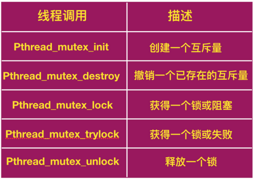
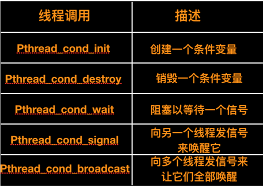

### 互斥量(mutex)

> Java synchronization的底层实现原理就是通过互斥量来实现的

互斥量是一个处于两种状态之一的共享变量：`解锁(unlocked)` 和 `加锁(locked)`。这样，只需要一个二进制位来表示它，不过一般情况下，通常会用一个 `整形(integer)` 来表示。0 表示解锁，其他所有的值表示加锁，比 1 大的值表示加锁的次数。

mutex 使用两个过程，当一个线程（或者进程）需要访问关键区域时，会调用 `mutex_lock` 进行加锁。如果互斥锁当前处于解锁状态（表示关键区域可用），则调用成功，并且调用线程可以自由进入关键区域。

另一方面，如果 mutex 互斥量已经锁定的话，调用线程会阻塞直到关键区域内的线程执行完毕并且调用了 `mutex_unlock` 。如果多个线程在 mutex 互斥量上阻塞，将随机选择一个线程并允许它获得锁。

```
mutex_lock:
            TSL REGISTER,MUTEX                        | 将互斥信号量复制到寄存器，并将互斥信号量置为1
            CMP REGISTER,#0                        | 互斥信号量是 0 吗？
            JZE ok                                    | 如果互斥信号量为0，它被解锁，所以返回
            CALL thread_yield                            | 互斥信号正在使用；调度其他线程
            JMP mutex_lock                            | 再试一次
ok:     RET                                                | 返回调用者，进入临界区

mutex_unlcok:
            MOVE MUTEX,#0                            | 将 mutex 置为 0 
            RET                                        | 返回调用者
```

#### TSL 指令

现在来看一种需要硬件帮助的方案。一些计算机，特别是那些设计为多处理器的计算机，都会有下面这条指令

```
TSL RX,LOCK 
```

称为 `测试并加锁(test and set lock)`，它将一个内存字 lock 读到寄存器 `RX` 中，然后在该内存地址上存储一个非零值。读写指令能保证是一体的，不可分割的，一同执行的。在这个指令结束之前其他处理器均不允许访问内存。执行 TSL 指令的 CPU 将会锁住内存总线，用来禁止其他 CPU 在这个指令结束之前访问内存

为了使用 TSL 指令，要使用一个共享变量 lock 来协调对共享内存的访问。当 lock 为 0 时，任何进程都可以使用 TSL 指令将其设置为 1，并读写共享内存。当操作结束时，进程使用 `move` 指令将 lock 的值重新设置为 0 。

```
enter_region:
        TSL REGISTER,LOCK                      | 复制锁到寄存器并将锁设为1
          CMP REGISTER,#0              | 锁是 0 吗？
          JNE enter_region                  | 若不是零，说明锁已被设置，所以循环
          RET                              | 返回调用者，进入临界区
    
    
leave_region:
            MOVE LOCK,#0              | 在锁中存入 0 
          RET                              | 返回调用者
```

还有一个可以替换 TSL 的指令是 `XCHG`，它原子性的交换了两个位置的内容，例如，一个寄存器与一个内存字，代码如下

```
enter_region:
        MOVE REGISTER,#1                            | 把 1 放在内存器中
        XCHG REGISTER,LOCK                        | 交换寄存器和锁变量的内容
        CMP REGISTER,#0                            | 锁是 0 吗？
        JNE enter_region                                    | 若不是 0 ，锁已被设置，进行循环
        RET                                            | 返回调用者，进入临界区
    
leave_region:                                        
        MOVE LOCK,#0                                | 在锁中存入 0 
        RET 
```

XCHG 的本质上与 TSL 的解决办法一样。所有的 Intel x86 CPU 在底层同步中使用 XCHG 指令

#### Pthreads 中的互斥量

Pthreads  提供了一些功能用来同步线程。最基本的机制是使用互斥量变量，可以锁定和解锁，用来保护每个关键区域。希望进入关键区域的线程首先要尝试获取  mutex。如果 mutex 没有加锁，线程能够马上进入并且互斥量能够自动锁定，从而阻止其他线程进入。如果 mutex  已经加锁，调用线程会阻塞，直到 mutex  解锁。如果多个线程在相同的互斥量上等待，当互斥量解锁时，只有一个线程能够进入并且重新加锁。这些锁并不是必须的，程序员需要正确使用它们。



向我们想象中的一样，mutex 能够被创建和销毁，扮演这两个角色的分别是 `Phread_mutex_init` 和 `Pthread_mutex_destroy`。mutex 也可以通过 `Pthread_mutex_lock` 来进行加锁，如果互斥量已经加锁，则会阻塞调用者。还有一个调用`Pthread_mutex_trylock` 用来尝试对线程加锁，当 mutex 已经被加锁时，会返回一个错误代码而不是阻塞调用者。这个调用允许线程有效的进行忙等。最后，`Pthread_mutex_unlock` 会对 mutex 解锁并且释放一个正在等待的线程。

除了互斥量以外，`Pthreads` 还提供了第二种同步机制： `条件变量(condition variables)` 。mutex 可以很好的允许或阻止对关键区域的访问。条件变量允许线程由于未满足某些条件而阻塞。绝大多数情况下这两种方法是一起使用的。下面我们进一步来研究线程、互斥量、条件变量之间的关联。

下面再来重新认识一下生产者和消费者问题：一个线程将东西放在一个缓冲区内，由另一个线程将它们取出。如果生产者发现缓冲区没有空槽可以使用了，生产者线程会阻塞起来直到有一个线程可以使用。生产者使用 mutex  来进行原子性检查从而不受其他线程干扰。但是当发现缓冲区已经满了以后，生产者需要一种方法来阻塞自己并在以后被唤醒。这便是条件变量做的工作。

下面是一些与条件变量有关的最重要的 pthread 调用



上表中给出了一些调用用来创建和销毁条件变量。条件变量上的主要属性是 `Pthread_cond_wait` 和 `Pthread_cond_signal`。前者阻塞调用线程，直到其他线程发出信号为止（使用后者调用）。阻塞的线程通常需要等待唤醒的信号以此来释放资源或者执行某些其他活动。只有这样阻塞的线程才能继续工作。条件变量允许等待与阻塞原子性的进程。`Pthread_cond_broadcast` 用来唤醒多个阻塞的、需要等待信号唤醒的线程