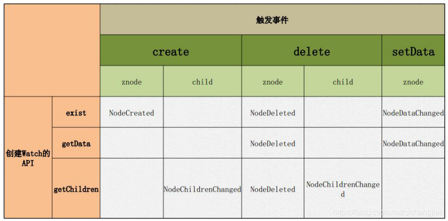
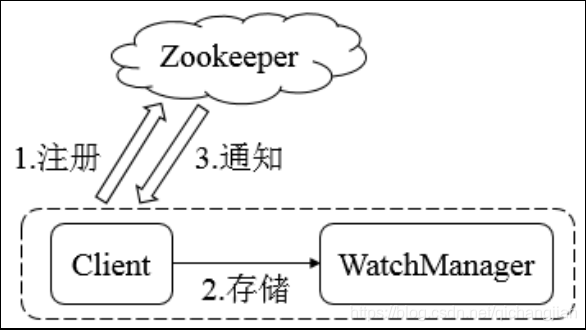

### ZK文件系统

ZooKeeper 的命名空间就是 ZooKeeper 应用的文件系统，它和 linux 的文件系统很像，也是树状，这样就可以确定每个路径都是唯一的，对于命名空间的操作必须都是绝对路径操作。与Linux文件系统不同的是，Linux文件系统 有目录和文件的区别，而**ZooKeeper统一叫znode,**一个znode节点可以包含子znode,同时也可以包含数据。

znode 即是文件夹又是文件的概念，所以在 ZooKeeper 这里面就不叫文件文 件也不叫文件夹，叫znode，每个znode有唯一的路径标识， 既能存储数据，也能创建子znode。但是znode只适合存储非常小的数据，不能超过1M，最好都小于1K。

#### zookeeper的文件系统的特点：

- zk的文件系统和Linux的文件系统目录结构一样，**从”“/开始**
- zk的**访问路径只有绝对路径**，没有相对路径。
- zk中没有文件和目录的概念，**只有znode节点**，Znode既有文件的功能，又有目录的功能

#### znode种类

| persistent            | 持久化znode节点，一旦创建这个znode点存储的数据不会主动消失，除非客户端主动delete |
| --------------------- | ------------------------------------------------------------ |
| Persistent_sequential | 自动增加顺序编号的znode节点，比如ClientA 去 zk service 上建 立一个 znode 名字叫做/zk/conf，指定了这种类型的节点后 zk 会 创 建 /zk/conf0000000000 ， ClientB 再 去 创 建 就 是 创 建 /zk/conf0000000001，ClientC 是创建/zk/conf0000000002，以后任 意 Client 来创建这个 znode 都会得到一个比当前 zk 命名空间最 大 znode 编号+1 的 znode，也就说任意一个 Client 去创建 znode 都是保证得到的 znode 是递增的，而且是唯一的。（原子性原则） |
| Ephemral              | 临时znode节点，client连接到zkservice的时候会建立一个session，之后用这个zk连接实例创建该类型的znode，一旦client关闭了zk的连接，服务器就会清除 session，然后这个 session 建立的 znode 节点都会从命名空间消失。 |
| Ephemral_ sequential  | 临时自动编号设置，znode节点编号会自动增加，但是会随着session消失而消失。 |

**zookeeper的znode的相关特点**：

* 创建znode时设置顺序标识，znode名称后会附加一个值，顺序号是一个单调递增的计数器，由父节点维护。（无论创建的是否是有编号节点，都为顺序递增）
* EPHEMERAL 临时类型的节点不能有子节点
* 对于zk来说，它的znode中储存的数据不能超过1M，最好不要超过1KB，如果数据量比较大，很难保证数据的一致性
* 对于zk来说，有几个节点数据就会存储几份

#### zookeeper的监听机制

1）监听机制介绍：

客户端注册监听它关心的目录节点，当目录节点发生变化（数据改变、节点删除、子目录节 点增加删除）时，zookeeper会通知客户端。

监听机制保证zookeeper保存的任何的数据的任何改变都能快速的相应到监听了该节点的应用程序。监听器的工作机制，其实是在客户端会专门创建一个监听线程，在本机的一个端口上等待zk集群发送过来的事件。



 **触发的四种方式：**

```
Znode的创建----nodeCreated
Znode 被删除---nodeDelete
Znode的数据变化---nodedatachanged
Znode的子节点的变化----nodeChildrenchange
```

**注意：监听只生效一次。（可以使用循环监听取，去实现一直监听）。**

2）监听机制的工作原理



解释：

    -ZooKeeper 的 Watcher 机制主要包括：客户端线程、客户端 WatcherManager、Zookeeper 服务 器三部分。
    -客户端在向zookeeper服务器 注册的同时，会将Watcher对象存储在客户端的WatcherManager当中。
    -当zookeeper服务器触发watcher事件后，会向客户端发送通知，
    -客户端线程从 WatcherManager 中取出对应的 Watcher 对象来执行回调逻辑。
**Watcher 特性总结：**

1）一次性

无论是服务端还是客户端，一旦一个 Watcher 被 触 发 ，Zookeeper 都会将其从相应的存储中移除。这样的设计有效的减轻了服务端的压力，不然对于更新非常频繁的节点，服务端会不断的向客户端发送事件通知，无论对于网络还是服务端的压力都非常大。

（2）客户端串行执行

客户端 Watcher 回调的过程是一个串行同步的过程。

3）轻量

3.1、Watcher 通知非常简单，只会告诉客户端发生了事件，而不会说明事件的具体内容。

3.2、客户端向服务端注册 Watcher 的时候，并不会把客户端真实的 Watcher 对象实体传递到服务端，仅仅是在客户端请求中使用 boolean 类型属性进行了标记。

4）watcher event 异步发送 watcher 的通知事件从 server 发送到 client 是异步的，这就存在一个问题，不同的客户端和服务器之间通过 socket 进行通信，由于网络延迟或其他因素导致客户端在不通的时刻监听到事件，由于 Zookeeper 本身提供了 ordering guarantee，即客户端监听事件后，才会感知它所监视 znode发生了变化。所以我们使用 Zookeeper 不能期望能够监控到节点每次的变化。Zookeeper 只能保证最终的一致性，而无法保证强一致性。
5）当一个客户端连接到一个新的服务器上时，watch 将会被以任意会话事件触发。当与一个服务器失去连接的时候，是无法接收到 watch 的。而当 client 重新连接时，如果需要的话，所有先前注册过的 watch，都会被重新注册。通常这是完全透明的。只有在一个特殊情况下，watch 可能会丢失：对于一个未创建的 znode的 exist watch，如果在客户端断开连接期间被创建了，并且随后在客户端连接上之前又删除了，这种情况下，这个 watch 事件可能会被丢失。

**ACL（Access Control List）访问控制列表**

包括三个方面：

权限模式（Scheme）

（1）IP：从 IP 地址粒度进行权限控制

（2）Digest：最常用，用类似于 username:password 的权限标识来进行权限配置，便于区分不同应用来进行权限控制

（3）World：最开放的权限控制方式，是一种特殊的 digest 模式，只有一个权限标识“world:anyone”

（4）Super：超级用户

授权对象

授权对象指的是权限赋予的用户或一个指定实体，例如 IP 地址或是机器灯。

权限 Permission

（1）CREATE：数据节点创建权限，允许授权对象在该 Znode 下创建子节点

（2）DELETE：子节点删除权限，允许授权对象删除该数据节点的子节点

（3）READ：数据节点的读取权限，允许授权对象访问该数据节点并读取其数据内容或子节点列表等

（4）WRITE：数据节点更新权限，允许授权对象对该数据节点进行更新操作

（5）ADMIN：数据节点管理权限，允许授权对象对该数据节点进行 ACL 相关设置操作


## zookeeper应用场景

### 统一命名服务

统一命名服务只需要zookeeper的文件系统即可实现。命名服务是指通过指定的名字来获取资源或者服务的地址，利用zookeeper我们可以创建出唯一标识路径，这个路径就可以作为一个名字，指向集群中的集群，提供的服务的地址，或者一个远程的对象等等。这个路径就好比是一个仓库，这个仓库的地址是唯一的，这些仓库里面存了一些东西，当我们来到这个仓库，我们就能取到仓库里的东西。(注册中心)

###  统一配置管理

在分布式的环境下，配置文件同步是非常常见的，一般要求一个集群中，所有节点的配置信息是一致的，比如kafka集群。对配置文件修改后，希望能够快速同步到各个节点上。这种情况下，就可以用zookeeper来做统一配置管理。
我们将程序的配置信息放在zk的znode下，当有配置发生改变时，也就是znode发生变化时，可以通过改变zk中某个目录节点的内容，利用watcher通知给各个客户端，从而更改配置。

### 集群管理

在分布式环境中，掌握集群中每个节点的状态是有必要的，我们用zookeeper做集群管理可以实现检测是否有机器加入或者退出，还可以用来选举集群的master。
要实现检测是否有机器退出，我们要在集群中的所有机器约定在父目录下创建临时目录节点，然后监听父目录节点的子节点变化情况。如果有机器挂掉，该机器与  zookeeper的连接断开，其所创建的临时目录节点被删除，所有其他的机器都将收到通知：这台机器离开了集群。检测是否有机器加入也是类似的过程。选举master的实现，我们稍微改变一下，所有机器创建临时顺序编号目录节点，每次选取编号最小的机器作为master就可以了。

### 分布式锁

zookeeper实现分布式锁一般有两种方式。一种是保持独占，一种是控制时序。
保持独占的方式是这样实现的：我们将zookeeper上的一个znode看作是一把锁，通过createznode的方式来实现。所有客户端都去创建 /distribute_lock 节点，最终成功创建的那个客户端也即拥有了这把锁。用完删除掉自己创建的distribute_lock  节点就释放出锁。这种方式不适用于客户端数量很大的情况，因为当一个客户端拥有第一把锁之后，所有的客户端都要去监听节点，节点的释放也会通知所有的客户端，这样会出现羊群效应。
控制时序的方式是这样实现的：在这种方式下，/distribute_lock  已经预先存在，所有客户端在它下面创建临时顺序编号目录节点，编号最小的获得锁，没有获得锁的客户端监听编号比自己小的前一个节点，因为节点是顺序的，很容易找到自己的前一个节点，当监听到前一个节点删除节点释放锁，该客户端就会获得锁。这种方式避免了所有客户端需要监听一个节点和节点删除需要通知所有客户端的情况。

