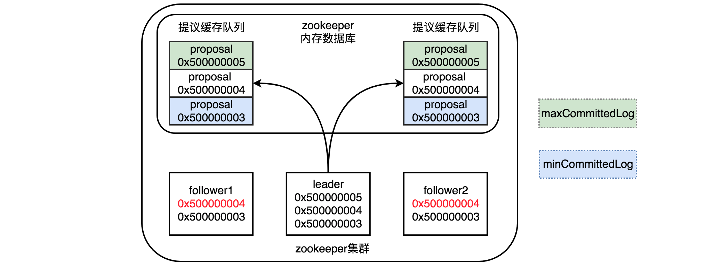
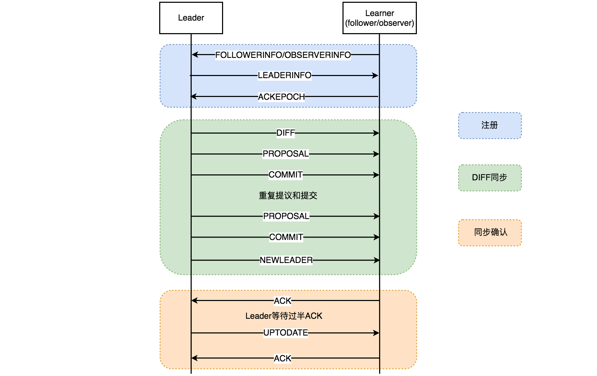
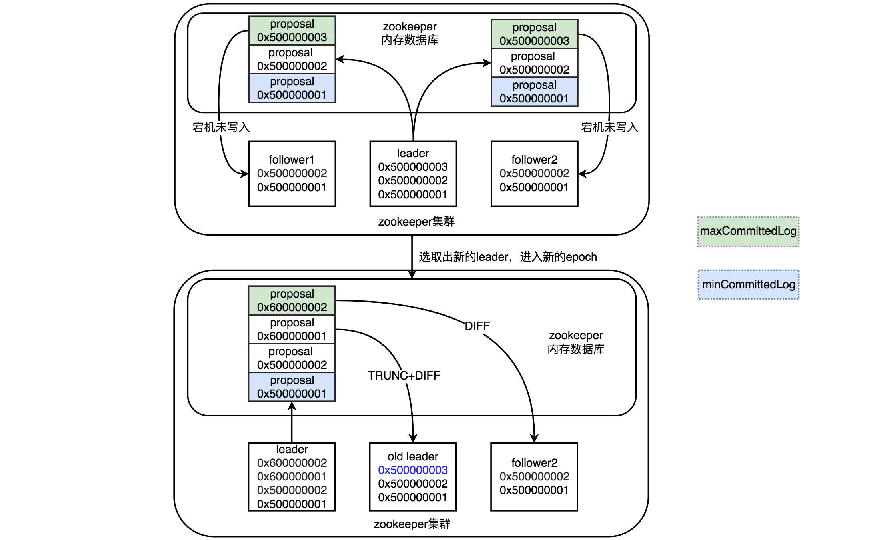
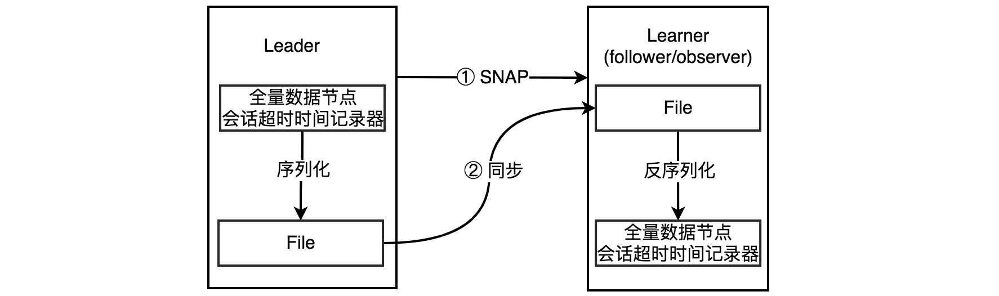

## Zookeeper 数据同步

**引言**

Zookeeper集群完成Leader选举后，会进行Leader和Follower的数据同步（或叫状态同步），完成同步是保证服务器数据一致，可以提供服务的前提，接下来记录下Zookeeper数据同步相关的内容，主要参考文末书籍和博文。

### 数据同步分类

Zookeeper中数据同步一共有四类，如下。

- DIFF：直接差异化同步
- TRUNC+DIFF：先回滚再差异化同步
- TRUNC：仅回滚同步
- SNAP：全量同步

不同的场景，会有不同的数据同步方式，具体选择哪种方式，还需要参考以下三个参数，根据这三个参数的大小对比结果，选择对应的数据同步方式。

- peerLastZxid：Learner服务器（Follower或observer）最后处理的zxid。
- minCommittedLog：Leader服务器proposal缓存队列committedLog中的最小的zxid。
- maxCommittedLog：Leader服务器proposal缓存队列committedLog中的最大的zxid。

首先从Zookeeper内存数据库中获取到请求对应的提议缓存队列，每个proposal都是有对应zxid的，Leader发出的proposal不是直接写入到Follower，而是先会存于缓存队列中，等待Follower一个个的写入。缓存队列中的proposal事务和Leader本地提交的事务保持一致，Follower根据自己的实际情况，对这个proposal队列进行处理。

按照上面的理解，下图中Follower最后处理的zxid即为0x500000004，Leader服务器提交在队列中的最小zxid为0x500000003，最大zxid为0x500000005，因此minCommittedLog为0x500000003，maxCommittedLog为0x500000005。接下来通过比较这几个参数，来决定进行以上哪类数据同步。

### DIFF

场景：上图中的情况，就会走DIFF直接差异化同步，其中peerLastZxid在minCommittedLog和maxCommittedLog之间，这种情况也可以理解为Follower没有同步完Leader存于提议缓存队列的请求。

- Learner在注册的最后阶段，会给Leader发送ACKEPOCH数据包，将当前Learner的纪元currentEpoch和最新事务序号lastZxid发送过去，告诉Leader自己的状态。
- 在确认了需要使用DIFF直接差异化同步后，Leader会发送DIFF指令给Learner，告诉它即将开始同步差异化的proposal（即Leader提交的但是Learner还未提交的proposal）。
- 对于上上图的情况，只有一个proposal需要同步，以此为例，Leader服务器会为一个proposal发送两个数据包给Learner来完成同步，分别是PROPOSAL内容数据包和COMMIT指令数据包，这两个一组拥有相同的zxid。如果有多个需要同步的proposal，就重复发送proposal对应的这两个包给Learner来实行同步直到最后完成所有的同步。
- 请求缓存队列中的proposal同步完成后，Leader会发送一个NEWLEADER指令到Learner。
- Learner收到NEWLeader指令后，会反馈一个ACK消息到Leader，表示自己确认完成请求缓存队列中proposal的同步。
- 以上是针对一个Learner的同步，会单独在一个LearnerHandler线程进行处理，其他的Learner也会有对应的LearnerHandler线程来处理，Leader主线程会等待Learner的同步结果。
- 当满足“过半策略”后，Leader服务器会向所有完成同步的Learner发送UPTODATE指令，告诉它们数据已经是最新的了，并且集群因为过半达到数据一致可以对外提供服务。
- 最后Learner在接受到UPTODATE指令后，会停止与Leader的数据同步，并再次反馈一个ACK消息。

### TRUNC+DIFF

场景：这种场景是比较特殊的情况，简单来说就是，当Leader将事务提交到本地事务日志中后，正准备将proposal发送给其他的Follower进行投票时突然宕机，这个时候Zookeeper集群会选取出新的Leader对外服务，并且可能提交了几个事务，此后当老Leader再次上线，新Leader发现它身上有自己没有的事务，就需要回滚抹去老Leader上自己没有的事务，再让老Leader同步完自己新提交的事务，这就是TRUNC+DIFF的场景。

* 如上图所示，当Leader准备将zxid为0x500000003的proposal发送Learner投票就宕机了，导致Leader上会多出一条未在集群同步的数据。

* 此时选取了新的Leader，并且epoch在上次的基础上加1，Zookeeper集群进入了新的时代，并且新Leader提交了两个事务，zxid分别为0x600000001和0x600000002。

* 当老Leader重新上线后，新Leader发现它身上有一个0x500000003事务记录是自己没有的，这个时候对于老Leader来说，peerLastZxid为0x500000003，而minCommittedLog为0x500000001，maxCommittedLog为0x600000002，peerLastZxid在minCommittedLog和maxCommittedLog之间。这个时候新Leader会发送TRUNC指令给这个老Leader(是Learner，老Leader只是叫起来好理解)，让它截取一部分事务记录，这样老Leader会截取到最靠近peerLastZxid同时又存在于提议缓存队列的事务，即截取掉0x500000003的事务记录。

* 截取完成后，后面就是DIFF差异化同步了，流程跟上面一样

### TRUNC

场景：这种情况，就是Learner上的peerLastZxid的值，比maxCommittedLog还要大，这样只需要截取多余的部分事务记录就可以了，无需DIFF差异化同步。

具体过程略，TRUNC回滚同步可以参考以上两种同步方式的过程来理解。

### SNAP

SNAP全量同步在两种情况下会发生。

场景1：Learner上的peerLastZxid的值，比minCommittedLog还要小。

场景2：Leader服务器没有提议缓存队列，peerLastZxid不等于lastProcessedZxid，lastProcessedZxid是Leader服务器数据恢复后最大的zxid（不太明白，暂时放这里）。

这两种情况下Learner和提议缓存队列之间，要么事务有不重叠的地方，要么无法使用提议缓存队列，因此只能使用SNAP全量同步。

全量同步就是将Leader上的全量内存数据都同步到Learner，Leader会先给Learner发送一个SNAP指令，然后Leader会准备数据，从内存数据库中获取全量的数据节点和会话超时时间记录器后，将其序列化后发送给Learner，Learner接收到后对其进行反序列化后存储内存数据库中，完成全量同步，这种方式看上去比较简单粗暴。

