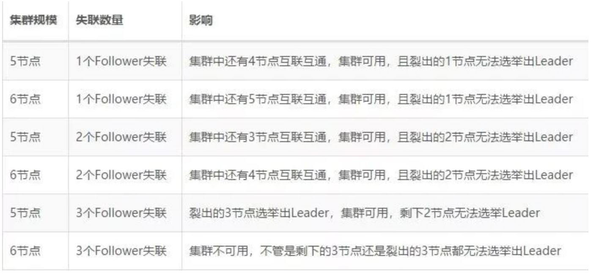
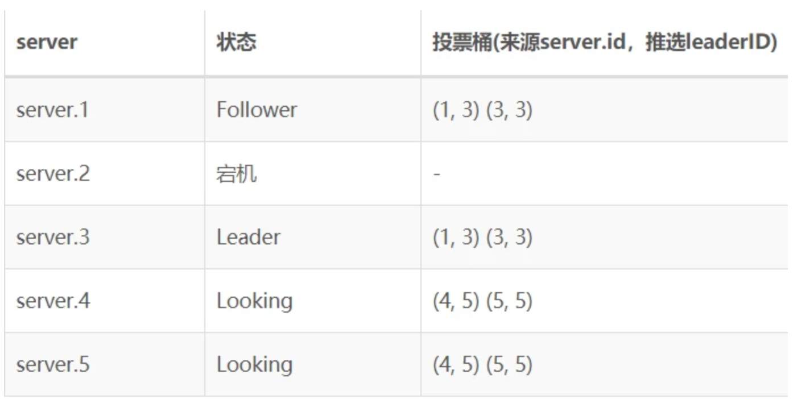

### Zookeeper 集群与Leader选举

ZooKeeper是一个开源分布式协调服务、分布式数据一致性解决方案。可基于ZooKeeper实现命名服务、集群管理、Master选举、分布式锁等功能。

## 一、高可用

为了保证ZooKeeper的可用性，在生产环境中我们使用ZooKeeper集群模式对外提供服务，并且集群规模至少由3个ZooKeeper节点组成。

**1.集群至少由3个节点组成**  

ZooKeeper其实2个节点也可以组成集群并对外提供服务，但我们使用集群主要目的是为了高可用。如果2个节点组成集群，其中1个节点挂了，另外ZooKeeper节点不能正常对外提供服务。因此也失去了集群的意义。

如果3个节点组成集群，其中1个节点挂掉后，根据ZooKeeper的Leader选举机制是可以从另外2个节点选出一个作为Leader的，集群可以继续对外提供服务。

**2.并非节点越多越好**

- 节点越多，使用的资源越多
- 节点越多，ZooKeeper节点间花费的通讯成本越高，节点间互连的Socket也越多。影响ZooKeeper集群事务处理
- 节点越多，造成脑裂的可能性越大

**3.集群规模为奇数**

集群规模除了考虑自身成本和资源外还要结合ZooKeeper特性考虑：

- 节省资源

3节点集群和4节点集群，我们选择使用3节点集群；5节点集群和6节点集群，我们选择使用5节点集群。以此类推。因为生产环境为了保证高可用，3节点集群最多只允许挂1台，4节点集群最多也只允许挂1台(过半原则中解释了原因)。同理5节点集群最多允许挂2台，6节点集群最多也只允许挂2台。
出于对资源节省的考虑，我们应该使用奇数节点来满足相同的高可用性。

- 集群可用性

当集群中节点间网络通讯出现问题时奇数和偶数对集群的影响



**4.集群配置**  

ZooKeeper集群配置至少需要2处变更：

**01 增加集群配置**

在{ZK_HOME}/conf/zoo.cfg中增加集群的配置，结构以server.id=ip:port1:port2为标准。

比如下面配置文件中表示由3个ZooKeeper组成的集群：

```
server.1=localhost:2881:3881
server.2=localhost:2882:3882
server.3=localhost:2883:3883
```


**02 配置节点id**

zoo.cfg中配置集群时需要指定server.id，这个id需要在dataDir（zoo.cfg中配置）指定的目录中创建myid文件，文件内容就是当前ZooKeeper节点的id。

## 二、集群角色

ZooKeeper没有使用Master/Slave的概念，而是将集群中的节点分为了3类角色：

- Leader

在一个ZooKeeper集群中，只能存在一个Leader，这个Leader是集群中事务请求唯一的调度者和处理者，所谓事务请求是指会改变集群状态的请求；Leader根据事务ID可以保证事务处理的顺序性。
如果一个集群中存在多个Leader，这种现象称为「脑裂」。试想一下，一个集群中存在多个Leader会产生什么影响？
相当于原本一个大集群，裂出多个小集群，他们之间的数据是不会相互同步的。「脑裂」后集群中的数据会变得非常混乱。

- Follower

Follower角色的ZooKeeper服务只能处理非事务请求；如果接收到客户端事务请求会将请求转发给Leader服务器；参与Leader选举；参与Leader事务处理投票处理。
Follower发现集群中Leader不可用时会变更自身状态，并发起Leader选举投票，最终集群中的某个Follower会被选为Leader。

- Observer

Observer与Follower很像，可以处理非事务请求；将事务请求转发给Leader服务器。
与Follower不同的是，Observer不会参与Leader选举；不会参与Leader事务处理投票。
Observer用于不影响集群事务处理能力的前提下提升集群的非事务处理能力。

## 三、Leader选举

Leader在集群中是非常重要的一个角色，负责了整个事务的处理和调度，保证分布式数据一致性的关键所在。既然Leader在ZooKeeper集群中这么重要所以一定要保证集群在任何时候都有且仅有一个Leader存在。

如果集群中Leader不可用了，需要有一个机制来保证能从集群中找出一个最优的服务晋升为Leader继续处理事务和调度等一系列职责。这个过程称为Leader选举。

**1.选举机制**  

ZooKeeper选举Leader依赖下列原则并遵循优先顺序：

**01 选举投票必须在同一轮次中进行**

如果Follower服务选举轮次不同，不会采纳投票。

**02 数据最新的节点优先成为Leader**

数据的新旧使用事务ID判定，事务ID越大认为节点数据约接近Leader的数据，自然应该成为Leader。

**03 比较server.id，id值大的优先成为Leader**

如果每个参与竞选节点事务ID一样，再使用server.id做比较。server.id是节点在集群中唯一的id，myid文件中配置。

不管是在集群启动时选举Leader还是集群运行中重新选举Leader。集群中每个Follower角色服务都是以上面的条件作为基础推选出合适的Leader，一旦出现某个节点被过半推选，那么该节点晋升为Leader。

**2.过半原则**    

ZooKeeper集群会有很多类型投票。Leader选举投票；事务提议投票；这些投票依赖过半原则。就是说ZooKeeper认为投票结果超过了集群总数的一半，便可以安全的处理后续事务。

- 事务提议投票

假设有3个节点组成ZooKeeper集群，客户端请求添加一个节点。Leader接到该事务请求后给所有Follower发起「创建节点」的提议投票。如果Leader收到了超过集群一半数量的反馈，继续给所有Follower发起commit。此时Leader认为集群过半了，就算自己挂了集群也是安全可靠的。

- Leader选举投票

假设有3个节点组成ZooKeeper集群，这时Leader挂了，需要投票选举Leader。当相同投票结果过半后Leader选出。

- 集群可用节点

ZooKeeper集群中每个节点有自己的角色，对于集群可用性来说必须满足过半原则。这个过半是指Leader角色 + Follower角色可用数大于集群中Leader角色 + Follower角色总数。
假设有5个节点组成ZooKeeper集群，一个Leader、两个Follower、两个Observer。当挂掉两个Follower或挂掉一个Leader和一个Follower时集群将不可用。因为Observer角色不参与任何形式的投票。
所谓过半原则算法是说票数 > 集群总节点数/2。其中集群总节点数/2的计算结果会向下取整。
在ZooKeeper源代码QuorumMaj.java中实现了这个算法。下面代码片段有所缩减。

```java
public boolean containsQuorum(HashSet<Long> set) {
  /** n是指集群总数 */
  int half = n / 2;
  return (set.size() > half);
}
```

回过头我们看一下奇数和偶数集群在Leader选举的结果


所以3节点和4节点组成的集群在ZooKeeper过半原则下都最多只能挂1节点，但是4比3要多浪费一个节点资源。

## 四、场景实战

我们以两个场景来了解集群不可用时Leader重新选举的过程。

**1. 3节点集群重选Leader**

假设有3节点组成的集群，分别是server.1（Follower）、server.2（Leader）、server.3（Follower）。此时server.2不可用了。集群会产生以下变化：

**01 集群不可用**

因为Leader挂了，集群不可用于事务请求了。

**02 状态变更**

所有Follower节点变更自身状态为LOOKING，并且变更自身投票。投票内容就是自己节点的事务ID和server.id。我们以(事务ID, server.id)表示。

假设server.1的事务id是10，变更的自身投票就是（10, 1）；server.3的事务id是8，变更的自身投票就是（8, 3）。

**03 首轮投票**

将变更的投票发给集群中所有的Follower节点。server.1将（10, 1）发给集群中所有Follower，包括它自己。server.3也一样，将（8, 3）发给所有Follower。

所以server.1将收到（10, 1）和（8, 3）两个投票，server.3将收到（8, 3）和（10, 1）两个投票。

**04 投票PK**

每个Follower节点除了发起投票外，还接其他Follower发来的投票，并与自己的投票PK(比较两个提议的事务ID以及server.id)，PK结果决定是否要变更自身状态并再次投票。

对于server.1来说收到（10, 1）和（8, 3）两个投票，与自己变更的投票比较后没有一个比自身投票（10, 1）要大的，所以server.1维持自身投票不变。

对于server.3来说收到（10, 1）和（8, 3）两个投票，与自身变更的投票比较后认为server.1发来的投票要比自身的投票大，所以server.3会变更自身投票并将变更后的投票发给集群中所有Follower。

**05 第二轮投票**

server.3将自身投票变更为（10, 1）后再次将投票发给集群中所有Follower。

对于server.1来说在第二轮收到了（10, 1）投票，server.1经过PK后继续维持不变。

对于server.3来说在第二轮收到了（10, 1）投票，因为server.3自身已变更为（10, 1）投票，所以本次也维持不变。

此时server.1和server.3在投票上达成一致

**06 投票接收桶**

节点接收的投票存储在一个接收桶里，每个Follower的投票结果在桶内只记录一次。ZooKeeper源码中接收桶用Map实现。

下面代码片段是ZooKeeper定义的接收桶，以及向桶内写入数据。Map.Key是Long类型，用来存储投票来源节点的server.id，Vote则是对应节点的投票信息。节点收到投票后会更新这个接收桶，也就是说桶里存储了所有Follower节点的投票并且仅存最后一次的投票结果。

```java
HashMap<Long, Vote> recvset = new HashMap<Long, Vote>();
recvset.put(n.sid, new Vote(n.leader, n.zxid, n.electionEpoch, n.peerEpoch));
```

**07 统计投票**

接收到投票后每次都会尝试统计投票，投票统计过半后选举成功。

投票统计的数据来源于投票接收桶里的投票数据，我们从头描述这个场景，来看一下接收桶里的数据变化情况。

server.2挂了后，server.1和server.3发起第一轮投票。

server.1接收到来自server.1的（10, 1）投票和来自server.3的（8, 3）投票。

server.3同样接收到来自server.1的（10, 1）投票和来自server.3的（8, 3）投票。此时server.1和server.3接收桶里的数据是这样的：


server.3经过PK后认为server.1的选票比自己要大，所以变更了自己的投票并重新发起投票。

server.1收到了来自server.3的（10, 1）投票;server.3收到了来自sever.3的（10, 1）投票。此时server.1和server.3接收桶里的数据变成了这样：


基于ZooKeeper过半原则：桶内投票选举server.1作为Leader出现2次，满足了过半 2 > 3/2 即 2>1。

最后sever.1节点晋升为Leader，server.3变更为Follower。

**2.集群扩容Leader启动时机** 

ZooKeeper集群扩容需要在zoo.cfg配置文件中加入新节点。扩容流程在ZooKeeper扩容中介绍。这里我们以3节点扩容到5节点时，Leader启动时机做一个讨论。

假设目前有3个节点组成集群，分别是server.1（Follower）、server.2（Leader）、server.3（Follower），假设集群中节点事务ID相同。配置文件如下。

```
server.1=localhost:2881:3881
server.2=localhost:2882:3882
server.3=localhost:2883:3883
```

**01 新节点加入集群**

集群中新增server.4和server.5两个节点，首先修改server.4和server.5的zoo.cfg配置并启动。节点4和5在启动后会变更自身投票状态，发起一轮Leader选举投票。server.1、server.2、server.3收到投票后由于集群中已有选定Leader，所以会直接反馈server.4和server.5投票结果：server.2是Leader。server.4和server.5收到投票后基于过半原则认定server.2是Leader，自身便切换为Follower。

```
节点server.1、server.2、server.3配置
server.1=localhost:2881:3881
server.2=localhost:2882:3882
server.3=localhost:2883:3883

#节点server.4、server.5配置
server.1=localhost:2881:3881
server.2=localhost:2882:3882
server.3=localhost:2883:3883
server.4=localhost:2884:3884
server.5=localhost:2885:3885

```

**02 停止Leader**

server.4和server.5的加入需要修改集群server.1、server.2、server.3的zoo.cfg配置并重启。但是Leader节点何时重启是有讲究的，因为Leader重启会导致集群中Follower发起Leader重新选举。在server.4和server.5两个新节点正常加入后，集群不会因为新节点加入变更Leader，所以目前server.2依然是Leader。

我们以一个错误的顺序启动，看一下集群会发生什么样的变化。修改server.2zoo.cfg配置文件，增加server.4和server.5的配置并停止server.2服务。停止server.2后，Leader不存在了，集群中所有Follower会发起投票。当server.1和server.3发起投票时并不会将投票发给server.4和server.5，因为在server.1和server.3的集群配置中不包含server.4和server.5节点。相反，server.4和server.5会把选票发给集群中所有节点。也就是说对于server.1和server.3他们认为集群中只有3个节点。对于server.4和server.5他们认为集群中有5个节点。

根据过半原则，server.1和server.3很快会选出一个新Leader，我们这里假设server.3晋级成为了新Leader。但是我们没有启动server.2的情况下，因为投票不满足过半原则，server.4和server.5会一直做投票选举Leader的动作。截止到现在集群中节点状态是这样的：



**03 启动Leader**

现在，我们启动server.2。因为server.2zoo.cfg已经是server.1到serverv.5的全量配置，在server.2启动后会发起选举投票，同时serverv.4和serverv.5也在不断的发起选举投票。当server.2的选举轮次和serverv.4与serverv.5选举轮次对齐后，最终server.2会变更自己的状态，认定server.5是Leaader。

意想不到的事情发生了，出现两个Leader：


ZooKeeper集群扩容时，如果Leader节点最后启动就可以避免这类问题发生，因为在Leader节点重启前，所有的Follower节点zoo.cfg配置已经是相同的，他们基于同一个集群配置两两互联，做投票选举