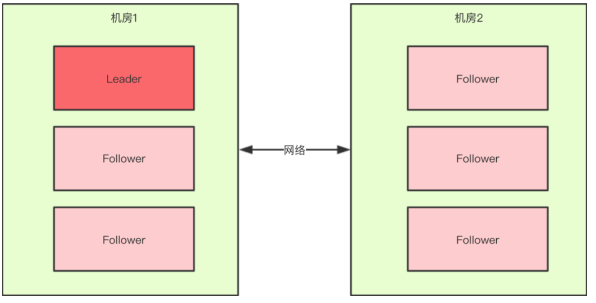

### Zookeeper 集群脑裂问题

**一、 Zookeeper 集群节点为什么要部署成奇数**
zookeeper容错指的是：当宕掉几个zookeeper节点服务器之后，剩下的个数必须大于宕掉的个数，也就是剩下的节点服务数必须大于n/2，这样zookeeper集群才可以继续使用，无论奇偶数都可以选举leader。例如5台zookeeper节点机器最多宕掉2台，还可以继续使用，因为剩下3台大于5/2。至于为什么最好为奇数个节点？这样是为了以最大容错服务器个数的条件下，能节省资源。比如，最大容错为2的情况下，对应的zookeeper服务数，奇数为5，而偶数为6，也就是6个zookeeper服务的情况下最多能宕掉2个服务，所以从节约资源的角度看，没必要部署6（偶数）个zookeeper服务节点。

zookeeper集群有这样一个特性：集群中只要有过半的机器是正常工作的，那么整个集群对外就是可用的。也就是说如果有2个zookeeper节点，那么只要有1个zookeeper节点死了，那么zookeeper服务就不能用了，因为1没有过半，所以2个zookeeper的死亡容忍度为0；同理，要是有3个zookeeper，一个死了，还剩下2个正常的，过半了，所以3个zookeeper的容忍度为1；同理也可以多列举几个：2->0; 3->1; 4->1; 5->2; 6->2  就会发现一个规律，2n和2n-1的容忍度是一样的，都是n-1，所以为了更加高效，何必增加那一个不必要的zookeeper呢。所以说，根据以上可以得出结论：从资源节省的角度来考虑，zookeeper集群的节点最好要部署成奇数个！

**二、 Zookeeper 集群中的"脑裂"场景说明**
对于一个集群，想要提高这个集群的可用性，通常会采用多机房部署，比如现在有一个由6台zkServer所组成的一个集群，部署在了两个机房：

正常情况下，此集群只会有一个Leader，那么如果机房之间的网络断了之后，两个机房内的zkServer还是可以相互通信的，如果不考虑过半机制，那么就会出现每个机房内部都将选出一个Leader。

这就相当于原本一个集群，被分成了两个集群，出现了两个"大脑"，这就是所谓的"脑裂"现象。对于这种情况，其实也可以看出来，原本应该是统一的一个集群对外提供服务的，现在变成了两个集群同时对外提供服务，如果过了一会，断了的网络突然联通了，那么此时就会出现问题了，两个集群刚刚都对外提供服务了，数据该怎么合并，数据冲突怎么解决等等问题。刚刚在说明脑裂场景时有一个前提条件就是没有考虑过半机制，所以实际上Zookeeper集群中是不会轻易出现脑裂问题的，原因在于过半机制。

zookeeper的过半机制：在领导者选举的过程中，如果某台zkServer获得了超过半数的选票，则此zkServer就可以成为Leader了。举个简单的例子：如果现在集群中有5台zkServer，那么half=5/2=2，那么也就是说，领导者选举的过程中至少要有三台zkServer投了同一个zkServer，才会符合过半机制，才能选出来一个Leader。

那么zookeeper选举的过程中为什么一定要有一个过半机制验证？
因为这样不需要等待所有zkServer都投了同一个zkServer就可以选举出来一个Leader了，这样比较快，所以叫快速领导者选举算法。

zookeeper过半机制中为什么是大于，而不是大于等于？这就是更脑裂问题有关系了，比如回到上文出现脑裂问题的场景 [如上图1]：当机房中间的网络断掉之后，机房1内的三台服务器会进行领导者选举，但是此时过半机制的条件是 "节点数 >  3"，也就是说至少要4台zkServer才能选出来一个Leader，所以对于机房1来说它不能选出一个Leader，同样机房2也不能选出一个Leader，这种情况下整个集群当机房间的网络断掉后，整个集群将没有Leader。而如果过半机制的条件是 "节点数 >= 3"，那么机房1和机房2都会选出一个Leader，这样就出现了脑裂。这就可以解释为什么过半机制中是大于而不是大于等于，目的就是为了防止脑裂。

如果我们现在只有5台机器，也部署在两个机房：

此时过半机制的条件是 "节点数 >  2"，也就是至少要3台服务器才能选出一个Leader，此时机房件的网络断开了，对于机房1来说是没有影响的，Leader依然还是Leader，对于机房2来说是选不出来Leader的，此时整个集群中只有一个Leader。因此总结得出，有了过半机制，对于一个Zookeeper集群来说，要么没有Leader，要么只有1个Leader，这样zookeeper也就能避免了脑裂问题。

假设某个leader假死，其余的followers选举出了一个新的leader。这时，旧的leader复活并且仍然认为自己是leader，这个时候它向其他followers发出写请求也是会被拒绝的。因为每当新leader产生时，会生成一个epoch标号(标识当前属于那个leader的统治时期)，这个epoch是递增的，followers如果确认了新的leader存在，知道其epoch，就会拒绝epoch小于现任leader  epoch的所有请求。那有没有follower不知道新的leader存在呢，有可能，但肯定不是大多数，否则新leader无法产生。因此，得不到大多数支持的写是无效的，旧leader即使各种认为自己是leader，依然没有什么作用。