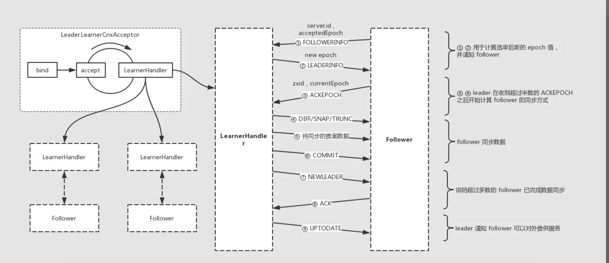

## Zookeeper数据同步源码分析

## LEADING

当节点在选举后角色确认为 **leader** 后将会进入 **LEADING** 状态，源码如下：

```java
public void run() {
    try {
        /*
         * Main loop
         */
        while (running) {
            switch (getPeerState()) {
            case LEADING:
                LOG.info("LEADING");
                try {
                    setLeader(makeLeader(logFactory));
                    leader.lead();
                    setLeader(null);
                } catch (Exception e) {
                    LOG.warn("Unexpected exception",e);
                } finally {
                    if (leader != null) {
                        leader.shutdown("Forcing shutdown");
                        setLeader(null);
                    }
                    setPeerState(ServerState.LOOKING);
                }
                break;
            }
        }
    } finally {
        
    }
}
```

**QuorumPeer** 在节点状态变更为 **LEADING** 之后会创建 **leader** 实例，并触发 **lead** 过程。

```java
void lead() throws IOException, InterruptedException {
    try {
        // 省略

        /**
         * 开启线程用于接收 follower 的连接请求
         */
        cnxAcceptor = new LearnerCnxAcceptor();
        cnxAcceptor.start();
        
        readyToStart = true;

        /**
         * 阻塞等待计算新的 epoch 值，并设置 zxid
         */
        long epoch = getEpochToPropose(self.getId(), self.getAcceptedEpoch());          
        zk.setZxid(ZxidUtils.makeZxid(epoch, 0));
        
        
        /**
         * 阻塞等待接收过半的 follower 节点发送的 ACKEPOCH 信息； 此时说明已经确定了本轮选举后 epoch 值
         */
        waitForEpochAck(self.getId(), leaderStateSummary);
        self.setCurrentEpoch(epoch);

        try {
            /**
             * 阻塞等待 超过半数的节点 follower 发送了 NEWLEADER ACK 信息；此时说明过半的 follower 节点已经完成数据同步
             */
            waitForNewLeaderAck(self.getId(), zk.getZxid(), LearnerType.PARTICIPANT);
        } catch (InterruptedException e) {
            // 省略
        }

        /**
         * 启动 zk server，此时集群可以对外正式提供服务
         */
        startZkServer();

        // 省略
}
```

从 **lead** 方法的实现可得知，**leader** 与 **follower** 在数据同步过程中会执行如下过程：

- 接收 follower 连接
- 计算新的 epoch 值
- 通知统一 epoch 值
- 数据同步
- 启动 zk server 对外提供服务

## FOLLOWING

下面在看下 **follower** 节点进入 **FOLLOWING** 状态后的操作：

```java
public void run() {
    try {
        /*
         * Main loop
         */
        while (running) {
            switch (getPeerState()) {
            case LOOKING:
                // 省略
            case OBSERVING:
                // 省略
            case FOLLOWING:
                try {
                    LOG.info("FOLLOWING");
                    setFollower(makeFollower(logFactory));
                    follower.followLeader();
                } catch (Exception e) {
                    LOG.warn("Unexpected exception",e);
                } finally {
                    follower.shutdown();
                    setFollower(null);
                    setPeerState(ServerState.LOOKING);
                }
                break;
            }
        }
    } finally {
        
    }
}
```

**QuorumPeer** 在节点状态变更为 **FOLLOWING** 之后会创建 **follower** 实例，并触发 **followLeader** 过程。

```java
void followLeader() throws InterruptedException {
    // 省略
    try {
        QuorumServer leaderServer = findLeader();            
        try {
            /**
             * follower 与 leader 建立连接
             */
            connectToLeader(leaderServer.addr, leaderServer.hostname);

            /**
             * follower 向 leader 提交节点信息用于计算新的 epoch 值
             */
            long newEpochZxid = registerWithLeader(Leader.FOLLOWERINFO);

            
            /**
             * follower 与 leader 数据同步
             */
            syncWithLeader(newEpochZxid);                
            
             // 省略

        } catch (Exception e) {
             // 省略
        }
    } finally {
        // 省略
    }
}
```

从 **followLeader** 方法的实现可得知，**follower** 与 **leader** 在数据同步过程中会执行如下过程：

- 请求连接 leader
- 提交节点信息计算新的 epoch 值
- 数据同步

### Leader Follower 建立通信

##### follower 请求连接

```java
protected QuorumServer findLeader() {
    QuorumServer leaderServer = null;
    // Find the leader by id
    Vote current = self.getCurrentVote();
    for (QuorumServer s : self.getView().values()) {
        if (s.id == current.getId()) {
            // Ensure we have the leader's correct IP address before
            // attempting to connect.
            s.recreateSocketAddresses();
            leaderServer = s;
            break;
        }
    }
    if (leaderServer == null) {
        LOG.warn("Couldn't find the leader with id = "
                + current.getId());
    }
    return leaderServer;
}           
```

```java
protected void connectToLeader(InetSocketAddress addr, String hostname)
            throws IOException, ConnectException, InterruptedException {
    sock = new Socket();        
    sock.setSoTimeout(self.tickTime * self.initLimit);
    for (int tries = 0; tries < 5; tries++) {
        try {
            sock.connect(addr, self.tickTime * self.syncLimit);
            sock.setTcpNoDelay(nodelay);
            break;
        } catch (IOException e) {
            if (tries == 4) {
                LOG.error("Unexpected exception",e);
                throw e;
            } else {
                LOG.warn("Unexpected exception, tries="+tries+
                        ", connecting to " + addr,e);
                sock = new Socket();
                sock.setSoTimeout(self.tickTime * self.initLimit);
            }
        }
        Thread.sleep(1000);
    }

    self.authLearner.authenticate(sock, hostname);

    leaderIs = BinaryInputArchive.getArchive(new BufferedInputStream(
            sock.getInputStream()));
    bufferedOutput = new BufferedOutputStream(sock.getOutputStream());
    leaderOs = BinaryOutputArchive.getArchive(bufferedOutput);
}
```

**follower** 会通过选举后的投票信息确认 **leader** 节点地址，并发起连接（总共有 5 次尝试连接的机会，若连接不通则重新进入选举过程）

##### leader 接收连接

```java
class LearnerCnxAcceptor extends ZooKeeperThread{
    private volatile boolean stop = false;

    public LearnerCnxAcceptor() {
        super("LearnerCnxAcceptor-" + ss.getLocalSocketAddress());
    }

    @Override
    public void run() {
        try {
            while (!stop) {
                try{
                    /**
                     * 接收 follower 的连接，并开启 LearnerHandler 线程用于处理二者之间的通信
                     */
                    Socket s = ss.accept();
                    s.setSoTimeout(self.tickTime * self.initLimit);
                    s.setTcpNoDelay(nodelay);

                    BufferedInputStream is = new BufferedInputStream(
                            s.getInputStream());
                    LearnerHandler fh = new LearnerHandler(s, is, Leader.this);
                    fh.start();
                } catch (SocketException e) {
                    // 省略
                } catch (SaslException e){
                    LOG.error("Exception while connecting to quorum learner", e);
                }
            }
        } catch (Exception e) {
            LOG.warn("Exception while accepting follower", e);
        }
    }
}
```

从 **LearnerCnxAcceptor** 实现可以看出 **leader** 节点在为每个 **follower** 节点连接建立之后都会为之分配一个 **LearnerHandler** 线程用于处理二者之间的通信。

### 计算新的 epoch 值

> **follower** 在与 **leader** 建立连接之后，会发出 **FOLLOWERINFO** 信息

```java
long newEpochZxid = registerWithLeader(Leader.FOLLOWERINFO);
```

```java
protected long registerWithLeader(int pktType) throws IOException{
    /**
     * 发送 follower info 信息，包括 last zxid 和 sid
     */
    long lastLoggedZxid = self.getLastLoggedZxid();
    QuorumPacket qp = new QuorumPacket();                
    qp.setType(pktType);
    qp.setZxid(ZxidUtils.makeZxid(self.getAcceptedEpoch(), 0));
    
    /*
     * Add sid to payload
     */
    LearnerInfo li = new LearnerInfo(self.getId(), 0x10000);
    ByteArrayOutputStream bsid = new ByteArrayOutputStream();
    BinaryOutputArchive boa = BinaryOutputArchive.getArchive(bsid);
    boa.writeRecord(li, "LearnerInfo");
    qp.setData(bsid.toByteArray());
    
    /**
     * follower 向 leader 发送 FOLLOWERINFO 信息，包括 zxid，sid，protocol version
     */
    writePacket(qp, true);
    
    // 省略
} 
```

接下来我们看下 **leader** 在接收到 **FOLLOWERINFO** 信息之后做什么(参考 **LearnerHandler**)

```java
public void run() {
    try {
        // 省略
        /**
         * leader 接收 follower 发送的 FOLLOWERINFO 信息，包括 follower 节点的 zxid，sid，protocol version
         * @see Learner.registerWithleader()
         */
        QuorumPacket qp = new QuorumPacket();
        ia.readRecord(qp, "packet");

        byte learnerInfoData[] = qp.getData();
        if (learnerInfoData != null) {
            if (learnerInfoData.length == 8) {
                // 省略
            } else {
                /**
                 * 高版本的 learnerInfoData 包括 long 类型的 sid, int 类型的 protocol version 占用 12 字节
                 */
                LearnerInfo li = new LearnerInfo();
                ByteBufferInputStream.byteBuffer2Record(ByteBuffer.wrap(learnerInfoData), li);
                this.sid = li.getServerid();
                this.version = li.getProtocolVersion();
            }
        }

        /**
         * 通过 follower 发送的 zxid，解析出 foloower 节点的 epoch 值
         */
        long lastAcceptedEpoch = ZxidUtils.getEpochFromZxid(qp.getZxid());
        
        long peerLastZxid;
        StateSummary ss = null;
        long zxid = qp.getZxid();

        /**
         * 阻塞等待计算新的 epoch 值
         */
        long newEpoch = leader.getEpochToPropose(this.getSid(), lastAcceptedEpoch);
      
        // 省略
    }
```

从上述代码可知，**leader** 在接收到 **follower** 发送的 **FOLLOWERINFO** 信息之后，会解析出 **follower** 节点的 **acceptedEpoch** 值并参与到新的 **epoch** 值计算中。 （具体计算逻辑参考方法 **getEpochToPropose**）

```java
public long getEpochToPropose(long sid, long lastAcceptedEpoch) throws InterruptedException, IOException {
    synchronized(connectingFollowers) {
        if (!waitingForNewEpoch) {
            return epoch;
        }
        // epoch 用来记录计算后的选举周期值
        // follower 或 leader 的 acceptedEpoch 值与 epoch 比较；若前者大则将其加一
        if (lastAcceptedEpoch >= epoch) {
            epoch = lastAcceptedEpoch+1;
        }
        // connectingFollowers 用来记录与 leader 已连接的 follower
        connectingFollowers.add(sid);
        QuorumVerifier verifier = self.getQuorumVerifier();
        // 判断是否已计算出新的 epoch 值的条件是 leader 已经参与了 epoch 值计算，以及超过一半的节点参与了计算
        if (connectingFollowers.contains(self.getId()) && 
                                        verifier.containsQuorum(connectingFollowers)) {
            // 将 waitingForNewEpoch 设置为 false 说明不需要等待计算新的 epoch 值了
            waitingForNewEpoch = false;
            // 设置 leader 的 acceptedEpoch 值
            self.setAcceptedEpoch(epoch);
            // 唤醒 connectingFollowers wait 的线程
            connectingFollowers.notifyAll();
        } else {
            long start = Time.currentElapsedTime();
            long cur = start;
            long end = start + self.getInitLimit()*self.getTickTime();
            while(waitingForNewEpoch && cur < end) {
                // 若未完成新的 epoch 值计算则阻塞等待
                connectingFollowers.wait(end - cur);
                cur = Time.currentElapsedTime();
            }
            if (waitingForNewEpoch) {
                throw new InterruptedException("Timeout while waiting for epoch from quorum");        
            }
        }
        return epoch;
    }
}
```

从方法 **getEpochToPropose** 可知 **leader** 会收集集群中过半的 **follower** **acceptedEpoch** 信息后，选出一个最大值然后加 1 就是 **newEpoch** 值； 在此过程中 **leader** 会进入阻塞状态直到过半的 **follower** 参与到计算才会进入下一阶段。

### 通知新的 epoch 值

**leader** 在计算出新的 **newEpoch** 值后，会进入下一阶段发送 **LEADERINFO** 信息 （同样参考 **LearnerHandler**）

```java
public void run() {
    try {
        // 省略

        /**
         * 阻塞等待计算新的 epoch 值
         */
        long newEpoch = leader.getEpochToPropose(this.getSid(), lastAcceptedEpoch);
            
        if (this.getVersion() < 0x10000) {
            // we are going to have to extrapolate the epoch information
            long epoch = ZxidUtils.getEpochFromZxid(zxid);
            ss = new StateSummary(epoch, zxid);
            // fake the message
            leader.waitForEpochAck(this.getSid(), ss);
        } else {
            byte ver[] = new byte[4];
            ByteBuffer.wrap(ver).putInt(0x10000);
            /**
             * 计算出新的 epoch 值后，leader 向 follower 发送 LEADERINFO 信息；包括新的 newEpoch
             */
            QuorumPacket newEpochPacket = new QuorumPacket(Leader.LEADERINFO, ZxidUtils.makeZxid(newEpoch, 0), ver, null);
            oa.writeRecord(newEpochPacket, "packet");
            bufferedOutput.flush();

               // 省略
        }
    }
    // 省略
}
```

```java
protected long registerWithLeader(int pktType) throws IOException{
    // 省略

    /**
     * follower 向 leader 发送 FOLLOWERINFO 信息，包括 zxid，sid，protocol version
     */
    writePacket(qp, true);

    /**
     * follower 接收 leader 发送的 LEADERINFO 信息
     */
    readPacket(qp);

    /**
     * 解析 leader 发送的 new epoch 值
     */        
    final long newEpoch = ZxidUtils.getEpochFromZxid(qp.getZxid());
    if (qp.getType() == Leader.LEADERINFO) {
        // we are connected to a 1.0 server so accept the new epoch and read the next packet
        leaderProtocolVersion = ByteBuffer.wrap(qp.getData()).getInt();
        byte epochBytes[] = new byte[4];
        final ByteBuffer wrappedEpochBytes = ByteBuffer.wrap(epochBytes);

        /**
         * new epoch > current accepted epoch 则更新 acceptedEpoch 值
         */
        if (newEpoch > self.getAcceptedEpoch()) {
            wrappedEpochBytes.putInt((int)self.getCurrentEpoch());
            self.setAcceptedEpoch(newEpoch);
        } else if (newEpoch == self.getAcceptedEpoch()) {           
            wrappedEpochBytes.putInt(-1);
        } else {
            throw new IOException("Leaders epoch, " + newEpoch + " is less than accepted epoch, " + self.getAcceptedEpoch());
        }

        /**
         * follower 向 leader 发送 ACKEPOCH 信息，包括 last zxid
         */
        QuorumPacket ackNewEpoch = new QuorumPacket(Leader.ACKEPOCH, lastLoggedZxid, epochBytes, null);
        writePacket(ackNewEpoch, true);
        return ZxidUtils.makeZxid(newEpoch, 0);
    } 
} 
```

从上述代码可以看出在完成 **newEpoch** 值计算后的 **leader** 与 **follower** 的交互过程：

- **leader** 向 **follower** 发送 **LEADERINFO** 信息，告知 **follower** 新的 **epoch** 值
- **follower** 接收解析 **LEADERINFO** 信息，若 **new epoch** 值大于 **current accepted epoch** 值则更新 **acceptedEpoch**
- **follower** 向 **leader** 发送 **ACKEPOCH** 信息，反馈 **leader** 已收到新的 **epoch** 值，并附带 **follower** 节点的 **last zxid**

### 数据同步

> LearnerHandler 中 leader 在收到过半的 ACKEPOCH 信息之后将进入数据同步阶段

```java
public void run() {
        try {
            // 省略
            // peerLastZxid 为 follower 的 last zxid
            peerLastZxid = ss.getLastZxid();
            
            /* the default to send to the follower */
            int packetToSend = Leader.SNAP;
            long zxidToSend = 0;
            long leaderLastZxid = 0;
            /** the packets that the follower needs to get updates from **/
            long updates = peerLastZxid;
           
            ReentrantReadWriteLock lock = leader.zk.getZKDatabase().getLogLock();
            ReadLock rl = lock.readLock();
            try {
                rl.lock();        
                final long maxCommittedLog = leader.zk.getZKDatabase().getmaxCommittedLog();
                final long minCommittedLog = leader.zk.getZKDatabase().getminCommittedLog();

                LinkedList<Proposal> proposals = leader.zk.getZKDatabase().getCommittedLog();

                if (peerLastZxid == leader.zk.getZKDatabase().getDataTreeLastProcessedZxid()) {
                    /**
                     * follower 与 leader 的 zxid 相同说明 二者数据一致；同步方式为差量同步 DIFF，同步的zxid 为 peerLastZxid， 也就是不需要同步
                     */
                    packetToSend = Leader.DIFF;
                    zxidToSend = peerLastZxid;
                } else if (proposals.size() != 0) {
                    // peerLastZxid 介于 minCommittedLog ，maxCommittedLog 中间
                    if ((maxCommittedLog >= peerLastZxid)
                            && (minCommittedLog <= peerLastZxid)) {
                        /**
                         * 在遍历 proposals 时，用来记录上一个 proposal 的 zxid
                         */
                        long prevProposalZxid = minCommittedLog;

                        boolean firstPacket=true;
                        packetToSend = Leader.DIFF;
                        zxidToSend = maxCommittedLog;

                        for (Proposal propose: proposals) {
                            // 跳过 follower 已经存在的提案
                            if (propose.packet.getZxid() <= peerLastZxid) {
                                prevProposalZxid = propose.packet.getZxid();
                                continue;
                            } else {
                                if (firstPacket) {
                                    firstPacket = false;
                                    if (prevProposalZxid < peerLastZxid) {
                                        /**
                                         * 此时说明有部分 proposals 提案在 leader 节点上不存在，则需告诉 follower 丢弃这部分 proposals
                                         * 也就是告诉 follower 先执行回滚 TRUNC ，需要回滚到 prevProposalZxid 处，也就是 follower 需要丢弃 prevProposalZxid ~ peerLastZxid 范围内的数据
                                         * 剩余的 proposals 则通过 DIFF 进行同步
                                         */
                                        packetToSend = Leader.TRUNC;                                        
                                        zxidToSend = prevProposalZxid;
                                        updates = zxidToSend;
                                    }
                                }

                                /**
                                 * 将剩余待 DIFF 同步的提案放入到队列中，等待发送
                                 */
                                queuePacket(propose.packet);
                                /**
                                 * 每个提案后对应一个 COMMIT 报文
                                 */
                                QuorumPacket qcommit = new QuorumPacket(Leader.COMMIT, propose.packet.getZxid(),
                                        null, null);
                                queuePacket(qcommit);
                            }
                        }
                    } else if (peerLastZxid > maxCommittedLog) {                    
                        /**
                         * follower 的 zxid 比 leader 大 ，则告诉 follower 执行 TRUNC 回滚
                         */
                        packetToSend = Leader.TRUNC;
                        zxidToSend = maxCommittedLog;
                        updates = zxidToSend;
                    } else {
                    }
                } 

            } finally {
                rl.unlock();
            }

             QuorumPacket newLeaderQP = new QuorumPacket(Leader.NEWLEADER,
                    ZxidUtils.makeZxid(newEpoch, 0), null, null);
             if (getVersion() < 0x10000) {
                oa.writeRecord(newLeaderQP, "packet");
            } else {
                 // 数据同步完成之后会发送 NEWLEADER 信息
                queuedPackets.add(newLeaderQP);
            }
            bufferedOutput.flush();
            //Need to set the zxidToSend to the latest zxid
            if (packetToSend == Leader.SNAP) {
                zxidToSend = leader.zk.getZKDatabase().getDataTreeLastProcessedZxid();
            }
            /**
             * 发送数据同步方式信息，告诉 follower 按什么方式进行数据同步
             */
            oa.writeRecord(new QuorumPacket(packetToSend, zxidToSend, null, null), "packet");
            bufferedOutput.flush();
            
            /* if we are not truncating or sending a diff just send a snapshot */
            if (packetToSend == Leader.SNAP) {
                /**
                 * 如果是全量同步的话，则将 leader 本地数据序列化写入 follower 的输出流
                 */
                leader.zk.getZKDatabase().serializeSnapshot(oa);
                oa.writeString("BenWasHere", "signature");
            }
            bufferedOutput.flush();
            
            /**
             * 开启个线程执行 packet 发送
             */
            sendPackets();
            
            /**
             * 接收 follower ack 响应
             */
            qp = new QuorumPacket();
            ia.readRecord(qp, "packet");

            /**
             * 阻塞等待过半的 follower ack
             */
            leader.waitForNewLeaderAck(getSid(), qp.getZxid(), getLearnerType());

            /**
             * leader 向 follower 发送 UPTODATE，告知其可对外提供服务
             */
            queuedPackets.add(new QuorumPacket(Leader.UPTODATE, -1, null, null));

            // 省略
        } 
    }
```

从上述代码可以看出 **leader** 和 **follower** 在进行数据同步时会通过 **peerLastZxid** 与 **maxCommittedLog**， **minCommittedLog** 两个值比较最终决定数据同步方式。

#### DIFF(差异化同步)

* **ollower** 的 **peerLastZxid** 等于 **leader** 的 **peerLastZxid**

> 此时说明 **follower** 与 **leader** 数据一致，采用 **DIFF** 方式同步，也即是无需同步

* **follower** 的 **peerLastZxid** 介于 **maxCommittedLog**， **minCommittedLog** 两者之间

此时说明 **follower** 与 **leader** 数据存在差异，需对差异的部分进行同步；首先 **leader** 会向 **follower** 发送 **DIFF** 报文告知其同步方式，随后会发送差异的提案及提案提交报文

交互流程如下：

    Leader                 Follower
    
      |          DIFF         |  
      | --------------------> |
      |        PROPOSAL       |  
      | --------------------> |  
      |         COMMIT        |  
      | --------------------> |
      |        PROPOSAL       |  
      | --------------------> |  
      |         COMMIT        |  
      | --------------------> |

示例： 假设 **leader** 节点的提案缓存队列对应的 **zxid** 依次是：

```
 0x500000001, 0x500000002, 0x500000003, 0x500000004, 0x500000005
```

而 **follower** 节点的 **peerLastZxid** 为 **0x500000003**，则需要将 **0x500000004**， **0x500000005** 两个提案进行同步；那么数据包发送过程如下表：

| 报文类型 | ZXID        |
| -------- | ----------- |
| DIFF     | 0x500000005 |
| PROPOSAL | 0x500000004 |
| COMMIT   | 0x500000004 |
| PROPOSAL | 0x500000005 |
| COMMIT   | 0x500000005 |

#### TRUNC+DIFF(先回滚再差异化同步)

> 在上文 **DIFF** 差异化同步时会存在一个特殊场景就是 虽然 **follower** 的 **peerLastZxid** 介于 **maxCommittedLog**， **minCommittedLog** 两者之间，但是 **follower** 的 **peerLastZxid** 在 **leader** 节点中不存在； 此时 **leader** 需告知 **follower** 先回滚到 **peerLastZxid** 的前一个 **zxid**, 回滚后再进行差异化同步。

    Leader                 Follower
    
      |         TRUNC         |  
      | --------------------> |
      |        PROPOSAL       |  
      | --------------------> |  
      |         COMMIT        |  
      | --------------------> |
      |        PROPOSAL       |  
      | --------------------> |  
      |         COMMIT        |  
      | --------------------> |

示例： 假设集群中三台节点 A, B, C 某一时刻 A 为 Leader 选举周期为 5, zxid 包括： (0x500000004,  0x500000005, 0x500000006); 假设某一时刻 leader A 节点在处理完事务为 0x500000007  的请求进行广播时 leader A 节点服务器宕机导致 0x500000007 该事物没有被同步出去；在集群进行下一轮选举之后 B 节点成为新的 leader，选举周期为 6 对外提供服务处理了新的事务请求包括 0x600000001， 0x600000002；

| 集群节点 | ZXID 列表                                                    |
| -------- | ------------------------------------------------------------ |
| A        | 0x500000004, 0x500000005, 0x500000006, 0x500000007           |
| B        | 0x500000004, 0x500000005, 0x500000006, 0x600000001， 0x600000002 |
| C        | 0x500000004, 0x500000005, 0x500000006, 0x600000001， 0x600000002 |

此时节点 A 在重启加入集群后，在与 leader B 节点进行数据同步时会发现事务 0x500000007 在 leader  节点中并不存在，此时 leader 告知 A 需先回滚事务到 0x500000006，在差异同步事务  0x600000001，0x600000002；那么数据包发送过程如下表：

| 报文类型 | ZXID        |
| -------- | ----------- |
| TRUNC    | 0x500000006 |
| PROPOSAL | 0x600000001 |
| COMMIT   | 0x600000001 |
| PROPOSAL | 0x600000002 |
| COMMIT   | 0x600000002 |

#### TRUNC(回滚同步)

若 **follower** 的 **peerLastZxid** 大于 **leader** 的 **maxCommittedLog**，则告知 **follower** 回滚至 **maxCommittedLog**； 该场景可以认为是 **TRUNC+DIFF** 的简化模式

    Leader                 Follower
    
      |         TRUNC         |  
      | --------------------> |

#### SNAP(全量同步)

> 若 **follower** 的 **peerLastZxid** 小于 **leader** 的 **minCommittedLog** 或者 **leader** 节点上不存在提案缓存队列时，将采用 **SNAP** 全量同步方式。 该模式下 **leader** 首先会向 **follower** 发送 **SNAP** 报文，随后从内存数据库中获取全量数据序列化传输给 **follower**， **follower** 在接收全量数据后会进行反序列化加载到内存数据库中。

    Leader                 Follower
    
      |         SNAP          |  
      | --------------------> |
      |         DATA          |  
      | --------------------> |

**leader** 在完成数据同步之后，会向 **follower** 发送 **NEWLEADER** 报文，在收到过半的 **follower** 响应的 **ACK** 之后此时说明过半的节点完成了数据同步，接下来 **leader** 会向 **follower** 发送 **UPTODATE** 报文告知 **follower** 节点可以对外提供服务了，此时 **leader** 会启动 zk server 开始对外提供服务。

#### FOLLOWER 数据同步

> 下面我们在看下数据同步阶段 **FOLLOWER** 是如何处理的，参考 **Learner.syncWithLeader**

```java
protected void syncWithLeader(long newLeaderZxid) throws IOException, InterruptedException{
        QuorumPacket ack = new QuorumPacket(Leader.ACK, 0, null, null);
        QuorumPacket qp = new QuorumPacket();
        long newEpoch = ZxidUtils.getEpochFromZxid(newLeaderZxid);

        /**
         * 接收 leader 发送的数据同步方式报文
         */
        readPacket(qp);
        
        synchronized (zk) {
            if (qp.getType() == Leader.DIFF) {
                
            }
            else if (qp.getType() == Leader.SNAP) {
                // 执行加载全量数据
            } else if (qp.getType() == Leader.TRUNC) {
                // 执行回滚
            }
            else {
            
            }
            
            outerLoop:
            while (self.isRunning()) {
                readPacket(qp);
                switch(qp.getType()) {
                case Leader.PROPOSAL:
                    // 处理提案
                    break;
                case Leader.COMMIT:
                    // commit proposal
                    break;
                case Leader.INFORM:
                    // 忽略
                    break;
                case Leader.UPTODATE:
                    // 设置 zk server
                    self.cnxnFactory.setZooKeeperServer(zk);
                    // 退出循环                
                    break outerLoop;
                case Leader.NEWLEADER: // Getting NEWLEADER here instead of in discovery 
                    /**
                     * follower 响应 NEWLEADER ACK
                     */
                    writePacket(new QuorumPacket(Leader.ACK, newLeaderZxid, null, null), true);
                    break;
                }
            }
        }
        ack.setZxid(ZxidUtils.makeZxid(newEpoch, 0));
        writePacket(ack, true);
        // 启动 zk server
        zk.startup();
        
    }
```

从上述代码中可以看出 **follower** 在数据同步阶段的处理流程如下：

- **follower** 接收 **leader** 发送的数据同步方式（DIFF/TRUNC/SANP）报文并进行相应处理
- 当 **follower** 收到 **leader** 发送的 **NEWLEADER** 报文后，会向 **leader** 响应 **ACK** (**leader** 在收到过半的 **ACK** 消息之后会发送 **UPTODATE**)
- 当 **follower** 收到 **leader** 发送的 **UPTODATE** 报文后，说明此时可以对外提供服务，此时将启动 zk server

## 小结

