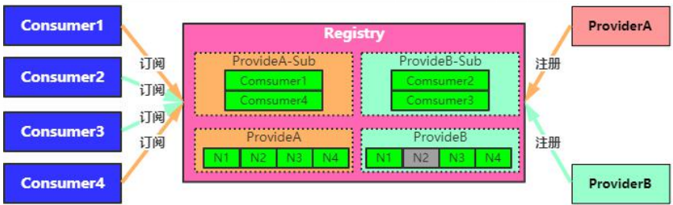
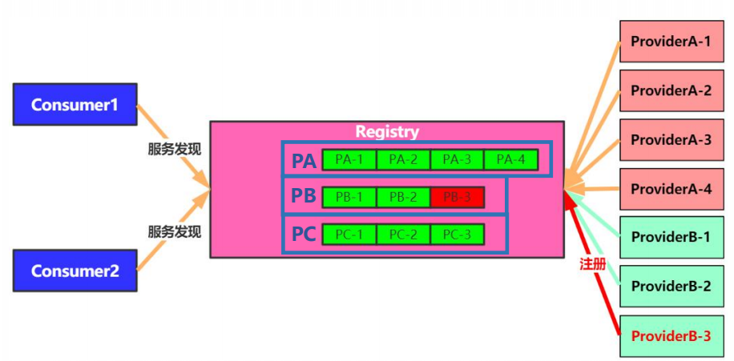
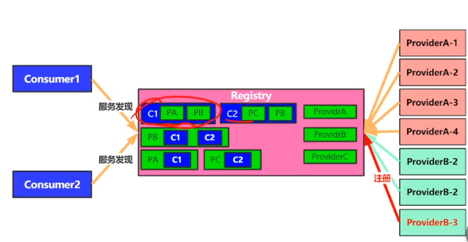
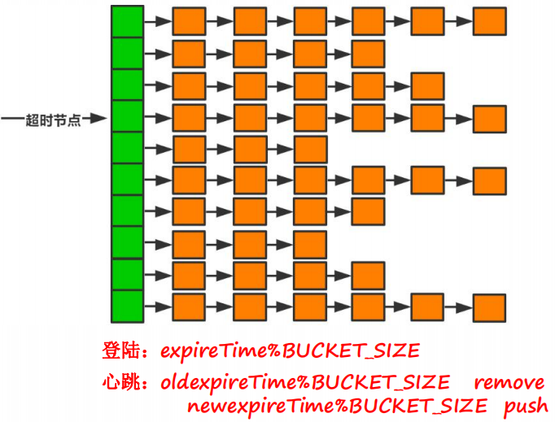
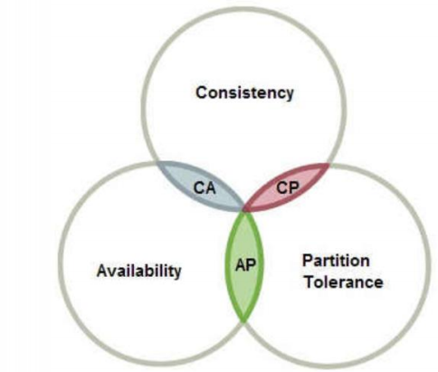
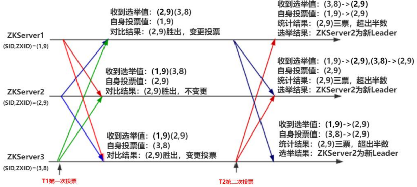
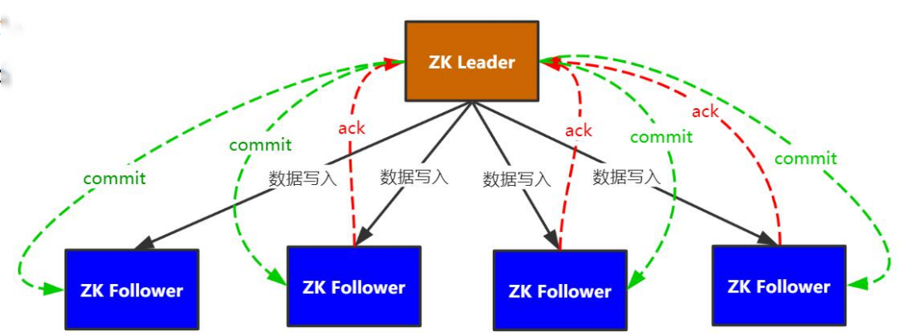
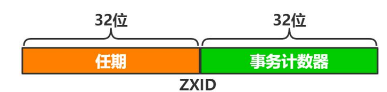

### 注册中心

> 用来实现微服务实例的自动注册与发现，是分布式系统中的核心基础服务。

#### 注册中心主要功能

1、服务注册

服务提供方将自身路由信息发布到注册中心，供消费方获取与提供方建立连接并发起调用。

* 路由信息：注册服务节点ip、监听端口等路由信息。

* 服务信息：序列化协议、路由规则、节点权重。

2、服务发现

服务消费方通过访问注册中心获取服务提供方节点路由信息。

* 启动拉取：服务消费方启动后，从注册中心来取提供方节点列表，建立连接，进行rpc调用。
* 通知回调：接收注册中心变更通知，重新获取数据，更新节点列表。
* 轮询拉取：服务消费方运行过程中定时拉取服务提供方节点列表，用来更新本地数据。

3、变更通知

当服务提供方节点发生变更时，服务注册中心能够第一时间把变更事件或变更后的数据推送到服务订阅方。

注册中心内为每个服务提供方建立订阅列表，当服务方节点变更时通知所有订阅该服务的消费方节点。



4、健康检查

确保已注册节点健康度，能够及时准确剔除失效节点，保证服务发现正确性。

失效原因

* 部署重启。
* 服务假死。如RPC工作线程全部阻塞掉了，无法处理用户请求，造成假死现象。
* 异常终止。

解决方案

* 上报心跳。
* 服务探测。

#### 注册中心设计

1、数据存储

服务提供方注册数据以集群的形式存储，存储结构为链表。



订阅数据组织分为两部分：

* 以消费方的维度：维护着每个消费方订阅的服务方，当集群数量变大后，可以根据该数据快速查询已订阅的数据。

* 以服务方的维度：维护着服务方的订阅者，当服务方变动，可以快速查询已订阅的消费方。



2、超时处理

设计一列Bucket，当服务方心跳第一次到来时，预先计算出它的超时时间，然后根据超时时间计算出它位于桶的哪个位置，将数据存储到此处。

当心跳第二次到来时，它会带上上一次的超时时间，然后根据上一次的超时时间清除掉历史数据，再重新计算新的位置。



3、存储系统主要关注点

* 数据可靠性：数据冗余存储，确保不会因为单节点故障导致数据丢失。
* 数据一致性：各节点间数据同步，保证数据一致性。
* 服务可用性：多节点对等的对外提供服务。

CAP定理：

分布式系统中C(数据一致性)、A(服务可用性)、P(分区容错性)。只能满足其二。



选择什么样的存储(cp/ap)作为注册中心。

一致性要求所有节点的数据都同步完成，如果是在大型分布式系统会导致整个服务不可用，而牺牲一致性，只是牺牲部分节点不可用，好过全部不可用。所以注册中心一般选择ap，这也就是为什么zookpper不建议作为注册中心来用，它是cp。

#### ZK实现

> server 节点组成的一个集群，在集群中存在一个唯一的leader节点负责响应写入请求，其他节点负责接收转发client请求。

* Leader：响应写入请求，发起提案，超过半数Follower同意写入，写入超过。
* Follower：响应查询，将写入请求转发给Leader，参与选举和写入投票。
* Observer：响应查询，将写入请求转发给Leader，不参与投票，只接收写入结果

PeerType=PARTICIPANT的节点才能参与选主，PeerType=Observer的节点不能参与。

**选主逻辑**

* 投票：获取法定数量票数，一般是超过一半的票数才算选主成功。

* 判断依据：

  * Epoch：leader的任期。一般epoch越大，说明它参与的lead选举轮数越多，优先被选为主节点。
  * ZXID：Zookeeper事务id，越大表示它本地缓存数据越新。
  * SID：集群中每个节点的唯一编号。

  比较策略：任期大的胜出，任期相同比较ZXID大的胜出，ZXID相同比较SID大的胜出。

  

  各个节点在进行第一次投票前，都将票投给了自己，然后将被投票的节点信息广播出去，其他节点收到广播后，会进行选举。如ZKServer1第一次投票收到ZKServer2、ZKServer3的广播信息，然后与自身的投票值进行比较，选出了(2,9)，然后将重新选举出来的节点信息广播出去进行第二次选举。在第二次选举中，ZKServer1统计结果，发现(2,9)三票，超出半票，选ZKServer2为主。

**代码分析**

```java
public Vote lookForLeader() throws InterruptedException {
    		//已经接收到的节点信息
     		HashMap<Long, Vote> recvset = new HashMap<Long, Vote>();

            HashMap<Long, Vote> outofelection = new HashMap<Long, Vote>();

            int notTimeout = finalizeWait;
            synchronized(this){
                //自增选举轮数
                logicalclock++;
                //开始选举时，默认将自身节点设置为leader，然后广播出去
                updateProposal(getInitId(), getInitLastLoggedZxid(), getPeerEpoch());
            }

            LOG.info("New election. My id =  " + self.getId() +
                    ", proposed zxid=0x" + Long.toHexString(proposedZxid));
    		//将节点信息广播出去
            sendNotifications();
}
```

updateProposal方法：设置选主节点信息，将节点id、任期、事务id设置到全局变量上。

```java
synchronized void updateProposal(long leader, long zxid, long epoch){
        proposedLeader = leader;//id
        proposedZxid = zxid;//事务id
        proposedEpoch = epoch;//任期
    }
```

sendNotifications方法：广播，将节点信息发送到待发送队列中，等待线程发送。

```java
private void sendNotifications() {
    for (QuorumServer server : self.getVotingView().values()) {
        long sid = server.id;

        ToSend notmsg = new ToSend(ToSend.mType.notification,
                proposedLeader,//提议leader
                proposedZxid,//提议leader事务id
                logicalclock,//选举轮数
                QuorumPeer.ServerState.LOOKING,
                sid,//sid，设置的唯一id
                proposedEpoch);//提议leader任期
       //存储到队列
        sendqueue.offer(notmsg);
    }
}
```

继续分析lookForLeader方法：

```java
//判断当前节点状态是否是选主并且节点不是停止状态
while ((self.getPeerState() == ServerState.LOOKING) &&
        (!stop)){
 	//从队列中拉取广播
    Notification n = recvqueue.poll(notTimeout,
            TimeUnit.MILLISECONDS);
    //如果为空，可能是没有广播信息了，或者断连了需要重新连
    if(n == null){
        if(manager.haveDelivered()){
            //如果所有的消息都收取完了，那么将选主信息广播出去
            sendNotifications();
        } else {
            //否则可能是断连了，重连
            manager.connectAll();
        }
		
        int tmpTimeOut = notTimeout*2;
        notTimeout = (tmpTimeOut < maxNotificationInterval?
                tmpTimeOut : maxNotificationInterval);
        LOG.info("Notification time out: " + notTimeout);
    }
    else if(self.getVotingView().containsKey(n.sid)) {
       
        switch (n.state) {
        case LOOKING:
           //选主状态
        case OBSERVING:
            //observer模式的节点不参与选主
            LOG.debug("Notification from observer: " + n.sid);
            break;
        case FOLLOWING:
        case LEADING:
      		//领导者状态和跟随状态说明选主已经结束了。	
            break;
        }
```

case LOOKING：选主状态，表示节点正在进行选主。

```java
//如果传过来的选举轮数比当前节点大，说明当前节点选举的leader可能落后于广播传递过来的节点
if (n.electionEpoch > logicalclock) {
    //重新设置节点的选举轮数
    logicalclock = n.electionEpoch;
    //清空接收的节点数据
    recvset.clear();
    //比较节点的任期、Zxid、sid
    if(totalOrderPredicate(n.leader, n.zxid, n.peerEpoch,
            getInitId(), getInitLastLoggedZxid(), getPeerEpoch())) {
        //如果传过来的节点大于当前leader，则更新leader信息
        updateProposal(n.leader, n.zxid, n.peerEpoch);
    } else {
        //如果传过来的节点没有当前节点数据全，则将当前节点设置为leader。
        updateProposal(getInitId(),
                getInitLastLoggedZxid(),
                getPeerEpoch());
    }
    //广播
    sendNotifications();
} else if (n.electionEpoch < logicalclock) {
   //如果小于，则不作任何操作
    break;
} else if (totalOrderPredicate(n.leader, n.zxid, n.peerEpoch,
        proposedLeader, proposedZxid, proposedEpoch)) {
    //选举轮数相等，则比较Zxid、sid大小
    updateProposal(n.leader, n.zxid, n.peerEpoch);
    sendNotifications();
}
}
//将广播过来的节点存储到recvset集合
recvset.put(n.sid, new Vote(n.leader, n.zxid, n.electionEpoch, n.peerEpoch));
//统计票数
if (termPredicate(recvset,
        new Vote(proposedLeader, proposedZxid,
                logicalclock, proposedEpoch))) {
	//如果leader的票数大于一半
  	//最后再尝试从队列拉数据，防止数据接收到的数据不全。
    while((n = recvqueue.poll(finalizeWait,
            TimeUnit.MILLISECONDS)) != null){
        //如果还有其他节点广播数据过来，再比较任期、Zxid、sid大小
        if(totalOrderPredicate(n.leader, n.zxid, n.peerEpoch,
                proposedLeader, proposedZxid, proposedEpoch)){
            recvqueue.put(n);
             //如果大于，则重新计算
            break;
        }
    }
    //如果已经没有发送数据，说明整个选举流程已经接近结束
    if (n == null) {
        //如果当前节点是leader则将它的状态设置为leading，否则根据当前节点是否是PARTICIPANT，如果是则将节点状态设置为FOLLOWING，否则设置为OBSERVING
        self.setPeerState((proposedLeader == self.getId()) ?
                ServerState.LEADING: learningState());

        Vote endVote = new Vote(proposedLeader,
                                proposedZxid,
                                logicalclock,
        
                                proposedEpoch);
        //recvqueue.clear(); 清空缓存
        leaveInstance(endVote);
        return endVote;
    }
}
```

totalOrderPredicate：比较任期、事务Zxid、sid大小，选出leader。优先选取任期大的节点为leader，如果任期相同则选取事务id大的节点为leader，最后如果事务id也相同，则选择服务节点id大的为leader。

```java
protected boolean totalOrderPredicate(long newId, long newZxid, long newEpoch, long curId, long curZxid, long curEpoch) {
    LOG.debug("id: " + newId + ", proposed id: " + curId + ", zxid: 0x" +
            Long.toHexString(newZxid) + ", proposed zxid: 0x" + Long.toHexString(curZxid));
    if(self.getQuorumVerifier().getWeight(newId) == 0){
        return false;
    }
    
    /*
     * We return true if one of the following three cases hold:
     * 1- New epoch is higher
     * 2- New epoch is the same as current epoch, but new zxid is higher
     * 3- New epoch is the same as current epoch, new zxid is the same
     *  as current zxid, but server id is higher.
     */
    
    return ((newEpoch > curEpoch) || 
            ((newEpoch == curEpoch) &&
            ((newZxid > curZxid) || ((newZxid == curZxid) && (newId > curId)))));
}
```

termPredicate：统计票数，

```java
protected boolean termPredicate(
        HashMap<Long, Vote> votes,
        Vote vote) {

    HashSet<Long> set = new HashSet<Long>();

    /*
     * First make the views consistent. Sometimes peers will have
     * different zxids for a server depending on timing.
     */
    for (Map.Entry<Long,Vote> entry : votes.entrySet()) {
        if (vote.equals(entry.getValue())){
            set.add(entry.getKey());
        }
    }
	//比较投的票数是否超过了一半
    return self.getQuorumVerifier().containsQuorum(set);
}

public boolean containsQuorum(HashSet<Long> set){
        return (set.size() > half);
    }
```


case FOLLOWING、case LEADING：已经选举完成，但是当前节点不知道

```java
if(n.electionEpoch == logicalclock){
    //选举轮数一样
    recvset.put(n.sid, new Vote(n.leader,
                                  n.zxid,
                                  n.electionEpoch,
                                  n.peerEpoch));
   	//重新计算票数
    if(ooePredicate(recvset, outofelection, n)) {
        //设置节点状态
        self.setPeerState((n.leader == self.getId()) ?
                ServerState.LEADING: learningState());
		
        Vote endVote = new Vote(n.leader, 
                n.zxid, 
                n.electionEpoch, 
                n.peerEpoch);
        //清空缓存
        leaveInstance(endVote);
        return endVote;
    }
}

//存储广播的leader信息
outofelection.put(n.sid, new Vote(n.version,
                                    n.leader,
                                    n.zxid,
                                    n.electionEpoch,
                                    n.peerEpoch,
                                    n.state));
//如果上面校验没有通过，则默认与大多数一致，将广播来的投票将该节点设置为leader。
if(ooePredicate(outofelection, outofelection, n)) {
    synchronized(this){
        logicalclock = n.electionEpoch;
        self.setPeerState((n.leader == self.getId()) ?
                ServerState.LEADING: learningState());
    }
    Vote endVote = new Vote(n.leader,
                            n.zxid,
                            n.electionEpoch,
                            n.peerEpoch);
    //清除缓存
    leaveInstance(endVote);
    return endVote;
}
```

ooePredicate：重新计算节点的投票数量和校验节点的状态

```java
protected boolean ooePredicate(HashMap<Long,Vote> recv, 
                                HashMap<Long,Vote> ooe, 
                                Notification n) {
    //重新计数&校验节点的状态是否是leader
    return (termPredicate(recv, new Vote(n.version, 
                                         n.leader,
                                         n.zxid, 
                                         n.electionEpoch, 
                                         n.peerEpoch, 
                                         n.state))
           
            && checkLeader(ooe, n.leader, n.electionEpoch));
    
}
```

checkLeader：校验被选举出来的节点的状态是否是LEADING。

```java
protected boolean checkLeader(
        HashMap<Long, Vote> votes,
        long leader,
        long electionEpoch){

    boolean predicate = true;

  	//如果当前节点就是leader 则返回true，如果当前节点不是leader，并且没有收到leader节点的信息，则返回false

    if(leader != self.getId()){
        if(votes.get(leader) == null) predicate = false;
        else if(votes.get(leader).getState() != ServerState.LEADING) predicate = false;
    } else if(logicalclock != electionEpoch) {
        predicate = false;
    } 

    return predicate;
}
```

#### ZK数据一致性

**Zab协议**

>  所有的事务请求必须由一个全局唯一的服务器来协调处理，这样的服务器被叫做Leader服务器，其他剩余的服务器则是Follower服务器。

Leader 负责处理写入请求，再通过广播将提议发送给follower服务器。整个过程是两阶段提交。

Zab协议是顺序一致性。

1. leader从客户端收到一个写请求。
2. leader生成一个新的事务并为这个事务生成一个唯一的ZXID。
3. leader将事务提议(propose)发送给所有的follows节点。
4. follower节点将收到的事务请求加入到本地历史队列(history queue)中，并发送ack给leader，表示确认提议。
5. 当leader收到大多数follower(半数以上节点)的ack确认消息，leader会本地提交，并发送commit请求。
6. 当follower收到commit请求时，从历史队列中将事务请求commit。



**源码分析**

ZXID结构：



```java
public class ZxidUtils {
    //获取任期，右移动32位
   static public long getEpochFromZxid(long zxid) {
      return zxid >> 32L;
   }
    //获取事务计数器。前32位为0后32位为1
   static public long getCounterFromZxid(long zxid) {
      return zxid & 0xffffffffL;
   }
   static public long makeZxid(long epoch, long counter) {
      return (epoch << 32L) | (counter & 0xffffffffL);
   }
   static public String zxidToString(long zxid) {
      return Long.toHexString(zxid);
   }
}
```

创建提案

```java
//Leader 创建提案
public Proposal propose(Request request) throws XidRolloverException {
   
    //检查事务计数是否已经用完，如果用完将leader停止掉，进行重新选主
    if ((request.zxid & 0xffffffffL) == 0xffffffffL) {
        
        shutdown(msg);
        throw new XidRolloverException(msg);
    }

    ByteArrayOutputStream baos = new ByteArrayOutputStream();
    BinaryOutputArchive boa = BinaryOutputArchive.getArchive(baos);
    try {
        request.hdr.serialize(boa, "hdr");
        if (request.txn != null) {
            request.txn.serialize(boa, "txn");
        }
        baos.close();
    } catch (IOException e) {
        LOG.warn("This really should be impossible", e);
    }
    QuorumPacket pp = new QuorumPacket(Leader.PROPOSAL, request.zxid, 
            baos.toByteArray(), null);
    //构建提案
    Proposal p = new Proposal();
    p.packet = pp;
    p.request = request;
    synchronized (this) {
        if (LOG.isDebugEnabled()) {
            LOG.debug("Proposing:: " + request);
        }

        lastProposed = p.packet.getZxid();
        //将提案存储到outstandingProposals，这个是后面接收follower的ack时，判断是否还有历史提案没有提交。保证数据的顺序一致性。
        outstandingProposals.put(lastProposed, p);
        //广播提案
        sendPacket(pp);
    }
    return p;
}
```

sendPacket：发送数据包到follower。

```java
void sendPacket(QuorumPacket qp) {
    synchronized (forwardingFollowers) {
        //循环发送
        for (LearnerHandler f : forwardingFollowers) {                
            f.queuePacket(qp);
        }
    }
}
```

leader处理follower的ack消息

```java
synchronized public void processAck(long sid, long zxid, SocketAddress followerAddr) {
    if ((zxid & 0xffffffffL) == 0) {
        //
        /*
         * We no longer process NEWLEADER ack by this method. However,
         * the learner sends ack back to the leader after it gets UPTODATE
         * so we just ignore the message.
         */
        return;
    }
    //为空，说明提案已经超过半数提交了
    if (outstandingProposals.size() == 0) {
        if (LOG.isDebugEnabled()) {
            LOG.debug("outstanding is 0");
        }
        return;
    }
    //如果最近的commit大于follower提交的事务Id，说明leader已经已经提交了该zxid，不做处理
    if (lastCommitted >= zxid) {
        if (LOG.isDebugEnabled()) {
            LOG.debug("proposal has already been committed, pzxid: 0x{} zxid: 0x{}",
                    Long.toHexString(lastCommitted), Long.toHexString(zxid));
        }
        // The proposal has already been committed
        return;
    }
    
    Proposal p = outstandingProposals.get(zxid);
    //一般不会存在p为空的情况。为空可能这个提案已经提交了
    if (p == null) {
        LOG.warn("Trying to commit future proposal: zxid 0x{} from {}",
                Long.toHexString(zxid), followerAddr);
        return;
    }
    //记录follower的ack
    p.ackSet.add(sid);
    if (LOG.isDebugEnabled()) {
        LOG.debug("Count for zxid: 0x{} is {}",
                Long.toHexString(zxid), p.ackSet.size());
    }
    //如果计票数超过半数
    if (self.getQuorumVerifier().containsQuorum(p.ackSet)){   
        //一般情况下，zxid = lastCommitted+1
        if (zxid != lastCommitted+1) {
            LOG.warn("Commiting zxid 0x{} from {} not first!",
                    Long.toHexString(zxid), followerAddr);
            LOG.warn("First is 0x{}", Long.toHexString(lastCommitted + 1));
        }
        //清除缓存
        outstandingProposals.remove(zxid);
        if (p.request != null) {
            //将准备提交的提案放到异步队列
            toBeApplied.add(p);
        }

        if (p.request == null) {
            LOG.warn("Going to commmit null request for proposal: {}", p);
        }
        //提交提案,向follower发送commit
        commit(zxid);
        //将提案发送给Observer，Observer只管接收数据
        inform(p);
        //本地写入
        zk.commitProcessor.commit(p.request);
        if(pendingSyncs.containsKey(zxid)){
            for(LearnerSyncRequest r: pendingSyncs.remove(zxid)) {
                sendSync(r);
            }
        }
    }
}

// toBeApplied.add执行流程：
//ConcurrentLinkedQueue<Proposal> toBeApplied = new ConcurrentLinkedQueue<Proposal>();
public boolean add(E e) {
    return offer(e);
}

public void commit(long zxid) {
    synchronized(this){
        //将zxid赋值给lastCommitted
        lastCommitted = zxid;
    }
    //将commit 发送给follower
    QuorumPacket qp = new QuorumPacket(Leader.COMMIT, zxid, null, null);
    sendPacket(qp);
}


public void inform(Proposal proposal) {   
    QuorumPacket qp = new QuorumPacket(Leader.INFORM, proposal.request.zxid, 
                                        proposal.packet.getData(), null);
    sendObserverPacket(qp);
}

//本地提交
synchronized public void commit(Request request) {
    if (!finished) {
        if (request == null) {
            LOG.warn("Committed a null!",
                     new Exception("committing a null! "));
            return;
        }
        if (LOG.isDebugEnabled()) {
            LOG.debug("Committing request:: " + request);
        }
        // LinkedList<Request> committedRequests = new LinkedList<Request>();
        committedRequests.add(request);
        //唤醒工作线程，写入本地
        notifyAll();
    }
}
```


